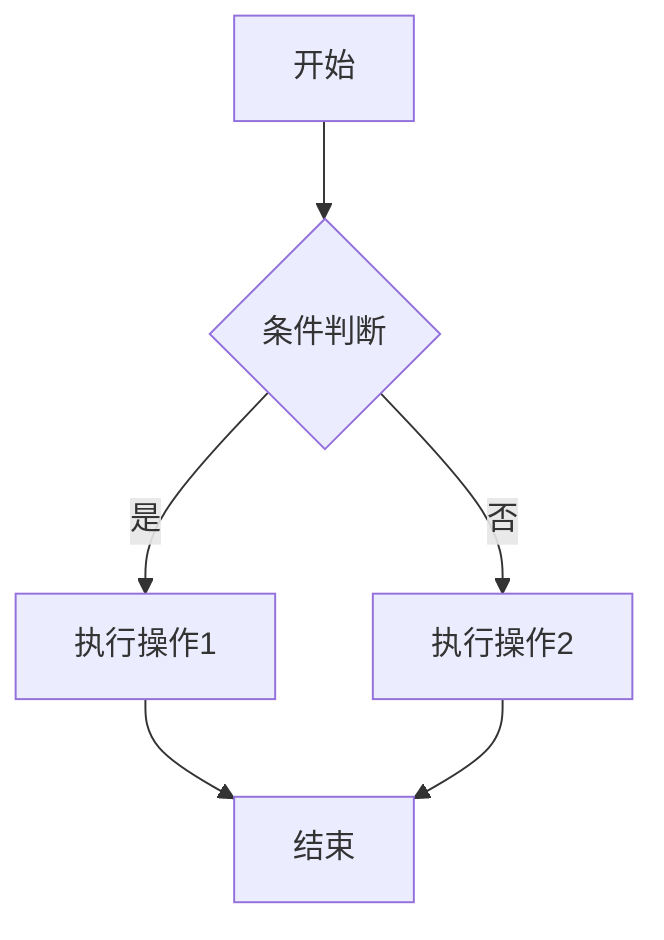

# Markdown 增强功能说明

本项目已完整支持以下 Markdown 增强功能，所有功能均已测试通过。

## ✅ 已支持的功能

### 1. 表格渲染
- ✅ 基础表格
- ✅ 对齐方式（左对齐、居中、右对齐）
- ✅ 响应式表格（自动添加滚动容器）
- ✅ 斑马纹效果
- ✅ 悬停高亮

**示例：**
```markdown
| 特性 | SonarQube | Checkmarx | Fortify |
|------|-----------|-----------|---------|
| 类型 | 开源/商业 | 商业 | 商业 |
| 准确性 | 中高 | 高 | 高 |
```

### 2. 数学公式（KaTeX）
- ✅ 行内公式：`$E = mc^2$`
- ✅ 块级公式：`$$...$$`
- ✅ 复杂公式（矩阵、积分、求和等）
- ✅ 多行对齐公式

**示例：**
```markdown
行内公式：$a^2 + b^2 = c^2$

块级公式：
$$
\int_{-\infty}^{\infty} e^{-x^2} dx = \sqrt{\pi}
$$
```

### 3. Mermaid 图表
- ✅ 流程图（flowchart）
- ✅ 时序图（sequenceDiagram）
- ✅ 类图（classDiagram）
- ✅ 状态图（stateDiagram）
- ✅ 甘特图（gantt）
- ✅ ER图（erDiagram）
- ✅ 饼图（pie）
- ✅ 用户旅程图（journey）

**示例：**


### 4. 任务列表
- ✅ 复选框样式
- ✅ 完成/未完成状态

**示例：**
```markdown
- [x] 已完成任务
- [ ] 未完成任务
  - [ ] 子任务
```

### 5. 定义列表
- ✅ 术语和定义格式

**示例：**
```markdown
Hugo
: 一个快速、灵活的静态网站生成器

Goldmark
: Hugo默认的Markdown解析器
```

### 6. 脚注
- ✅ 脚注引用
- ✅ 脚注内容显示

**示例：**
```markdown
这是一个带有脚注的文本[^1]。

[^1]: 这是脚注内容。
```

### 7. 其他 GFM 扩展
- ✅ 删除线：`~~删除的文本~~`
- ✅ 自动链接识别
- ✅ 代码块语法高亮

## 🔧 技术实现

### 配置文件
- **config.toml**: 配置 Goldmark 渲染器，启用 GFM 扩展
- **layouts/partials/extend-footer.html**: 加载 Mermaid.js 和 KaTeX 库
- **layouts/_default/_markup/render-codeblock-mermaid.html**: Mermaid 代码块自定义渲染

### 样式文件
- **assets/css/extended/custom.css**: 自定义样式，包括表格、Mermaid、KaTeX 等

### CDN 资源
- Mermaid.js v10.6.1
- KaTeX v0.16.9

## 📝 使用建议

### Mermaid 图表最佳实践

1. **代码块标识符**：必须使用 `mermaid` 作为语言标识符
2. **缩进**：保持适当的缩进以提高可读性
3. **复杂度**：避免过于复杂的图表，影响加载性能
4. **测试**：在本地预览确认图表正确渲染

### 数学公式最佳实践

1. **分隔符**：
   - 行内公式：`$...$` 或 `\(...\)`
   - 块级公式：`$$...$$` 或 `\[...\]`
2. **转义字符**：特殊字符需要正确转义
3. **环境支持**：支持 align、matrix、cases 等常用环境

### 表格最佳实践

1. **列数控制**：建议不超过 6-8 列，小屏幕体验更好
2. **内容长度**：单元格内容不宜过长
3. **表头清晰**：使用简洁明确的表头文字

## 🐛 常见问题

### Q: Mermaid 图表不显示？
A: 确保：
1. 代码块使用 ```mermaid 标识符
2. 浏览器 JavaScript 已启用
3. 检查浏览器控制台是否有错误信息

### Q: 数学公式渲染异常？
A: 确保：
1. 使用正确的分隔符（$ 或 $$）
2. LaTeX 语法正确
3. 特殊字符已正确转义

### Q: 表格在小屏幕上显示不全？
A: 表格已自动添加水平滚动容器，可以左右滑动查看完整内容。

## 📊 测试文章

项目包含完整的测试文章：`content/posts/markdown-enhanced-test.md`

可以通过访问 `/posts/markdown-enhanced-test/` 查看所有功能的实际效果。

## 🚀 性能优化

1. **CDN 加载**：使用 jsDelivr CDN 加速资源加载
2. **异步加载**：KaTeX 使用 defer 属性，不阻塞页面渲染
3. **按需渲染**：Mermaid 仅在检测到 `.mermaid` 元素时初始化
4. **错误处理**：完善的错误处理机制，避免单个图表失败影响整体

## 📖 参考资料

- [Hugo Goldmark 配置](https://gohugo.io/getting-started/configuration-markup/)
- [Mermaid 官方文档](https://mermaid.js.org/)
- [KaTeX 官方文档](https://katex.org/)
- [GitHub Flavored Markdown](https://github.github.com/gfm/)
