## 引言:那次跨机房数据不一致事故

某平台在凌晨遭遇诡异Bug:

用户在北京机房修改了支付密码,立即在上海机房登录时,旧密码竟然还能用!30秒后再次尝试,才提示密码错误。

问题根源?Redis Cluster跨机房复制延迟+本地缓存未失效:

```
北京机房:
- Redis Master更新密码
- 本地应用缓存未清理

上海机房:
- Redis Slave尚未同步(延迟30秒)
- 本地应用缓存仍为旧密码

结果: 用户用旧密码登录成功!
```
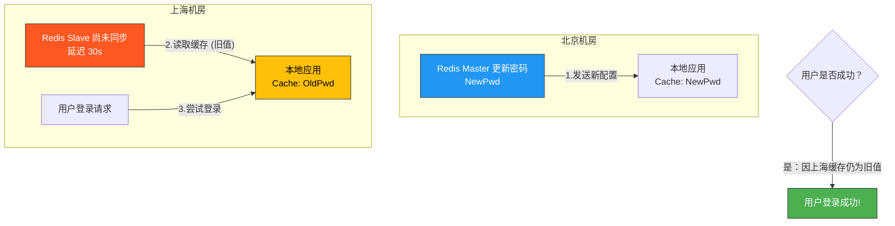
```mermaid
flowchart TB
    subgraph Beijing [北京机房]
        A[Redis Master 更新密码<br/>NewPwd] -->|1.发送新配置 | B[本地应用<br/>Cache: NewPwd]
    end

    subgraph Shanghai [上海机房]
        C[Redis Slave 尚未同步<br/>延迟 30s] -->|"2.读取缓存 (旧值)" | D[本地应用<br/>Cache: OldPwd]
        
        E[用户登录请求] -->|3.尝试登录 | D
    end

    %% 关键漏洞路径
    F{用户是否成功？} -->|是：因上海缓存仍为旧值 | G[用户登录成功!]
    
    style A fill:#2196F3,stroke:#333,color:white
    style C fill:#FF5722,stroke:#333,color:white
    style D fill:#FFC107,stroke:#333,color:black
    style G fill:#4CAF50,stroke:#333,color:white

```

事后复盘发现,这不仅是技术问题,更是架构设计缺陷:
- 未考虑跨地域复制延迟
- 本地缓存与分布式缓存缺乏同步机制
- 关键数据(密码)未采用强一致性方案

在分布式系统中,缓存一致性变得更加复杂:
- 多个缓存节点如何保持一致?
- 网络分区时怎么办?
- 本地缓存与远程缓存如何协同?

本文将深入探讨分布式缓存的一致性挑战,从Redis Cluster internals到多级缓存架构,提供经过实战验证的解决方案。

## 分布式缓存的挑战

### 为什么需要分布式缓存?

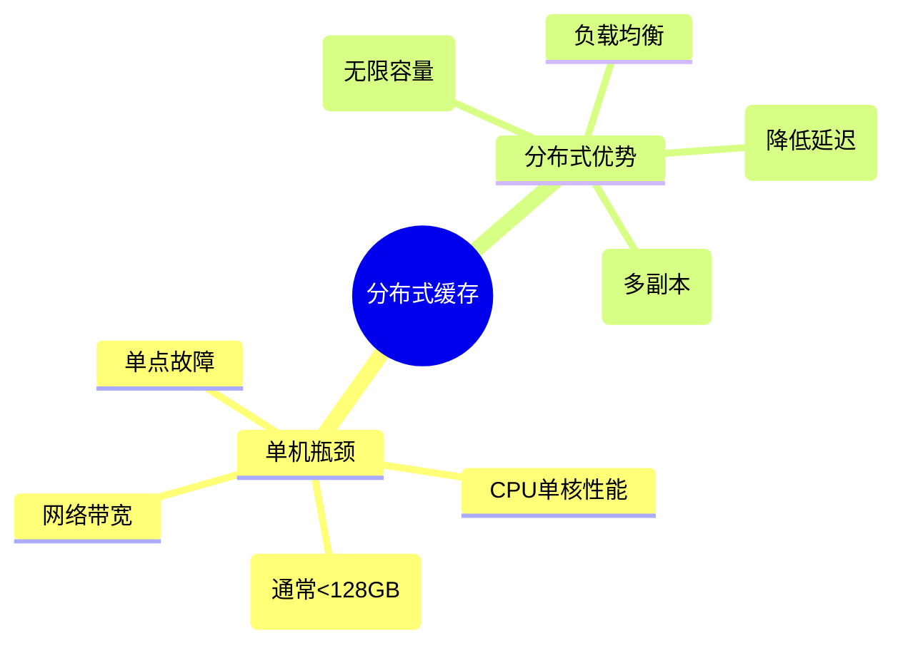
```mermaid
mindmap
  root((分布式缓存))
    单机瓶颈
      内存限制(通常<128GB)
      CPU单核性能
      网络带宽
      单点故障
    分布式优势
      水平扩展(无限容量)
      高可用(多副本)
      就近访问(降低延迟)
      负载均衡
```

**量化对比:**

| 维度 | 单机Redis | Redis Cluster |
|------|----------|---------------|
| **最大内存** | ~128GB | 理论上无限 |
| **QPS上限** | ~10万 | ~百万(线性扩展) |
| **可用性** | 单点故障 | 自动Failover |
| **运维复杂度** | 简单 | 复杂 |
| **一致性保证** | 强一致 | 最终一致 |

### 核心挑战

**挑战1: 数据分片(Data Sharding)**


- 如何将数据均匀分布到多个节点?
- 如何避免热点Key集中到单个节点?
- 扩容时如何迁移数据?


**挑战2: 主从复制(Master-Slave Replication)**


- 异步复制导致短暂不一致
- 网络分区时可能脑裂
- 复制延迟影响读一致性


**挑战3: 故障转移(Failover)**


- Master宕机后Slave提升为新Master
- 选举期间服务不可用
- 可能丢失未复制的数据


**挑战4: 本地缓存同步**


- 应用层本地缓存(L1) + 分布式缓存(L2)
- L1如何感知L2的变化?
- 如何避免L1/L2不一致?


## Redis Cluster架构详解

### 数据分片原理

**哈希槽(Hash Slot)机制:**

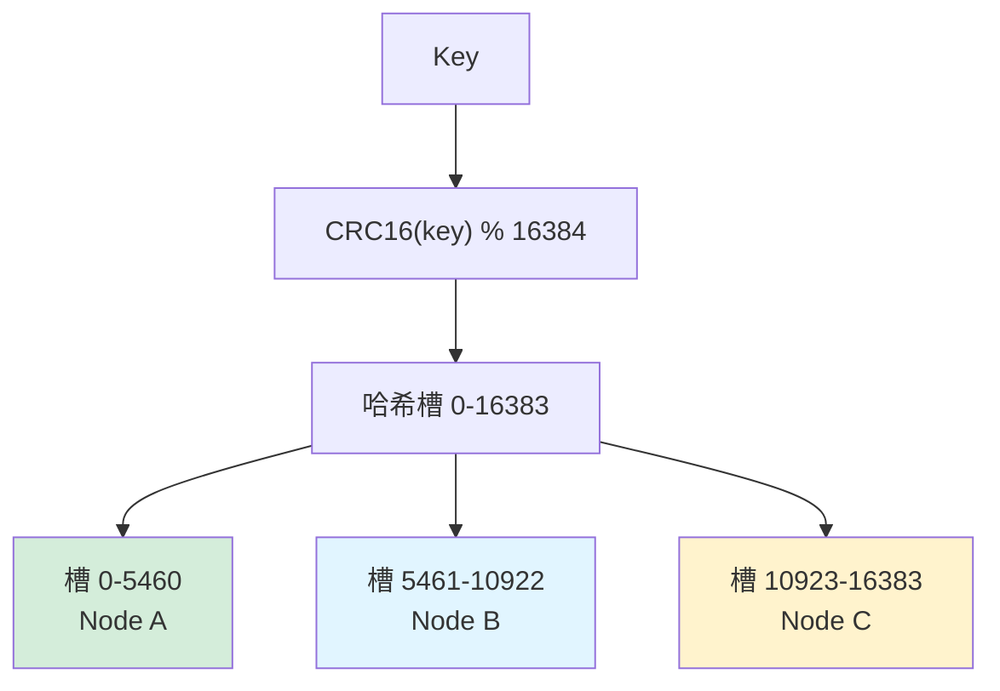
```mermaid
graph TB
    A[Key] --> B["CRC16(key) % 16384"]
    B --> C["哈希槽 0-16383"]
    
    C --> D["槽 0-5460\nNode A"]
    C --> E["槽 5461-10922\nNode B"]
    C --> F["槽 10923-16383\nNode C"]
    
    style D fill:#d4edda
    style E fill:#e1f5ff
    style F fill:#fff3cd
```

**特点:**
- 固定16384个哈希槽
- 每个节点负责一部分槽
- Key通过`CRC16(key) % 16384`确定所属槽
- 槽映射到具体节点

**示例:**

```python
import crcmod

def get_slot(key):
    """计算Key所属的哈希槽"""
    crc16 = crcmod.predefined.mkCrcFun('crc-ccitt-false')
    return crc16(key.encode()) % 16384

# 示例
print(get_slot("user:123"))  # 例如: 8765
print(get_slot("product:456"))  # 例如: 12340
```

**Hash Tag优化:**

```
问题: 相关Key可能分散到不同节点,无法使用事务

解决: 使用Hash Tag强制相关Key到同一节点

示例:
"user:123:profile" → 槽位由"user:123"决定
"user:123:orders"  → 槽位由"user:123"决定
两个Key在同一节点!

语法: {user:123}:profile
      {user:123}:orders
```


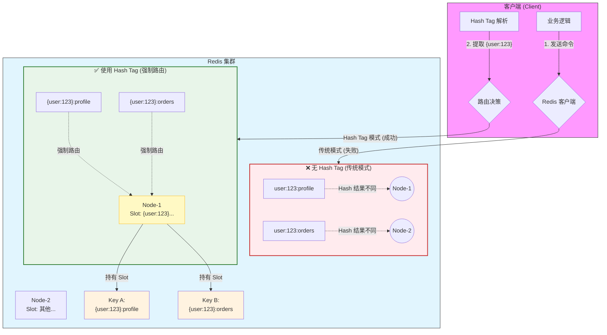
```mermaid
flowchart TD
    subgraph Client ["客户端 (Client)"]
        A[业务逻辑] -->|1. 发送命令 | B{Redis 客户端}
        C[Hash Tag 解析] -->|"2. 提取 {user:123}"| D{路由决策}
    end

    subgraph Cluster ["Redis 集群"]
        direction TB
        Node1["Node-1<br/>Slot: {user:123}..."]
        Node2[Node-2<br/>Slot: 其他...]
        
        Key1["Key A:<br/>{user:123}:profile"]
        Key2["Key B:<br/>{user:123}:orders"]
        
        Node1 -- "持有 Slot" --> Key1
        Node1 -- "持有 Slot" --> Key2
        
        subgraph WithoutHashTag ["❌ 无 Hash Tag (传统模式)"]
            K1["user:123:profile"]
            K2["user:123:orders"]
            N1((Node-1))
            N2((Node-2))
            
            K1 -.->|Hash 结果不同 | N1
            K2 -.->|Hash 结果不同 | N2
        end

        subgraph WithHashTag ["✅ 使用 Hash Tag (强制路由)"]
            K1_H["{user:123}:profile"]
            K2_H["{user:123}:orders"]
            
            K1_H -.->|强制路由 | Node1
            K2_H -.->|强制路由 | Node1
        end
    end

    %% 连接关系：展示对比
    B -- "传统模式 (失败)" --> WithoutHashTag
    D -- "Hash Tag 模式 (成功)" --> WithHashTag

    style Client fill:#f9f,stroke:#333
    style Cluster fill:#e1f5fe,stroke:#333
    style WithoutHashTag fill:#ffebee,stroke:#c62828,stroke-width:2px
    style WithHashTag fill:#e8f5e9,stroke:#2e7d32,stroke-width:2px
    style Node1 fill:#fff9c4,stroke:#fbc02d
    style Key1 fill:#fff3e0
    style Key2 fill:#fff3e0
```

### 客户端路由

**Smart Client实现:**

```python
class RedisClusterClient:
    def __init__(self, startup_nodes):
        """
        Args:
            startup_nodes: 初始节点列表[(host, port), ...]
        """
        self.nodes = {}
        self.slot_map = {}  # slot -> node
        self._initialize_cluster(startup_nodes)
    
    def _initialize_cluster(self, startup_nodes):
        """初始化集群信息"""
        for host, port in startup_nodes:
            try:
                client = redis.Redis(host=host, port=port)
                cluster_info = client.cluster_slots()
                
                # 构建槽位映射
                for slot_range, node_info in cluster_info.items():
                    start_slot, end_slot = slot_range
                    master_node = node_info['primary']
                    
                    for slot in range(start_slot, end_slot + 1):
                        self.slot_map[slot] = master_node
                
                break  # 获取一次即可
            except Exception as e:
                log.warning(f"Failed to connect to {host}:{port}: {e}")
    
    def get_client_for_key(self, key):
        """根据Key获取对应的Redis客户端"""
        slot = self._get_slot(key)
        node = self.slot_map.get(slot)
        
        if not node:
            raise KeyError(f"No node found for slot {slot}")
        
        # 缓存客户端连接
        node_key = f"{node['host']}:{node['port']}"
        if node_key not in self.nodes:
            self.nodes[node_key] = redis.Redis(
                host=node['host'],
                port=node['port']
            )
        
        return self.nodes[node_key]
    
    def set(self, key, value, ex=None):
        """设置Key(自动路由)"""
        client = self.get_client_for_key(key)
        return client.set(key, value, ex=ex)
    
    def get(self, key):
        """获取Key(自动路由)"""
        client = self.get_client_for_key(key)
        return client.get(key)
    
    def _get_slot(self, key):
        """计算Key的槽位"""
        # 检查Hash Tag
        tag_start = key.find('{')
        tag_end = key.find('}')
        
        if tag_start != -1 and tag_end != -1 and tag_end > tag_start:
            key_for_hash = key[tag_start + 1:tag_end]
        else:
            key_for_hash = key
        
        crc16 = crcmod.predefined.mkCrcFun('crc-ccitt-false')
        return crc16(key_for_hash.encode()) % 16384
```

**MOVED重定向:**

```
场景: 客户端路由表过期,请求发送到错误节点

流程:
1. 客户端发送 SET user:123 "Alice" 到 Node A
2. Node A发现该Key不属于自己,返回 MOVED 8765 192.168.1.2:6380
3. 客户端更新路由表,重新发送到 Node B
4. Node B执行成功
```
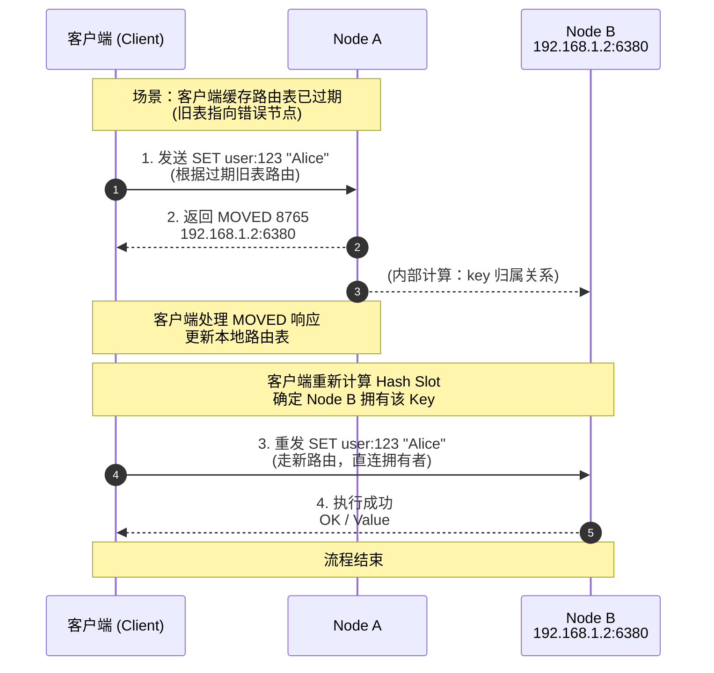
```mermaid
sequenceDiagram
    autonumber
    
    participant Client as 客户端 (Client)
    participant NodeA as Node A 
    participant NodeB as Node B <br/>192.168.1.2:6380
    
    Note over Client, NodeA: 场景：客户端缓存路由表已过期<br/>(旧表指向错误节点)
    
    Client->>NodeA: 1. 发送 SET user:123 "Alice"<br/>(根据过期旧表路由)
    
    NodeA-->>Client: 2. 返回 MOVED 8765<br/>192.168.1.2:6380
    NodeA-->>NodeB: (内部计算：key 归属关系)
    
    Note over Client, NodeA: 客户端处理 MOVED 响应<br/>更新本地路由表
    Note over Client, NodeB: 客户端重新计算 Hash Slot<br/>确定 Node B 拥有该 Key
    
    Client->>NodeB: 3. 重发 SET user:123 "Alice"<br/>(走新路由，直连拥有者)
    
    NodeB-->>Client: 4. 执行成功<br/>OK / Value
    
    Note over Client, NodeB: 流程结束
```

```python
def set_with_redirect(self, key, value):
    """处理MOVED重定向"""
    max_retries = 3
    
    for attempt in range(max_retries):
        try:
            client = self.get_client_for_key(key)
            return client.set(key, value)
        
        except redis.exceptions.ResponseError as e:
            if str(e).startswith('MOVED'):
                # 解析新节点地址
                parts = str(e).split()
                new_host, new_port = parts[2].split(':')
                
                # 更新路由表
                slot = self._get_slot(key)
                self.slot_map[slot] = {
                    'host': new_host,
                    'port': int(new_port)
                }
                
                # 清除旧客户端
                node_key = f"{new_host}:{new_port}"
                if node_key in self.nodes:
                    del self.nodes[node_key]
            
            else:
                raise
```

### 主从复制与故障转移

**复制架构:**

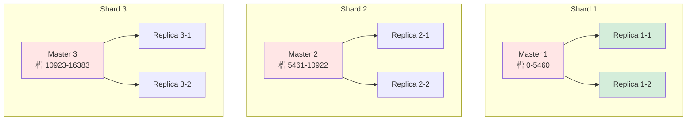
```mermaid
graph TB
    subgraph Shard 1
        M1[Master 1\n槽 0-5460] --> R1[Replica 1-1]
        M1 --> R2[Replica 1-2]
    end
    
    subgraph Shard 2
        M2[Master 2\n槽 5461-10922] --> R3[Replica 2-1]
        M2 --> R4[Replica 2-2]
    end
    
    subgraph Shard 3
        M3[Master 3\n槽 10923-16383] --> R5[Replica 3-1]
        M3 --> R6[Replica 3-2]
    end
    
    style M1 fill:#ffe6e6
    style M2 fill:#ffe6e6
    style M3 fill:#ffe6e6
    style R1 fill:#d4edda
    style R2 fill:#d4edda
```

**故障转移流程:**

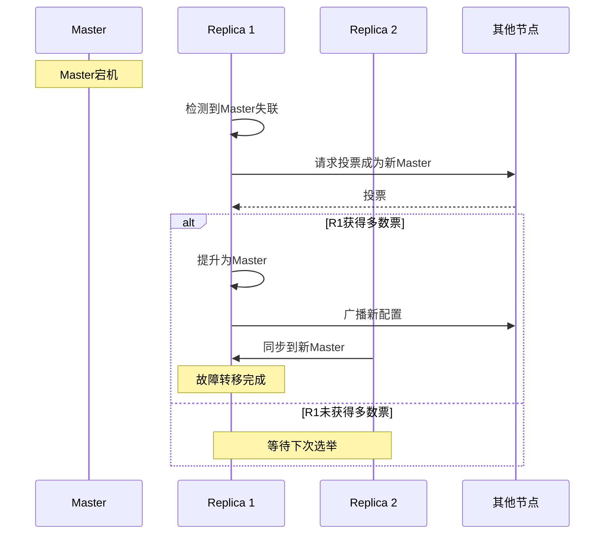
```mermaid
sequenceDiagram
    participant M as Master
    participant R1 as Replica 1
    participant R2 as Replica 2
    participant Others as 其他节点
    
    Note over M: Master宕机
    
    R1->>R1: 检测到Master失联
    R1->>Others: 请求投票成为新Master
    Others-->>R1: 投票
    
    alt R1获得多数票
        R1->>R1: 提升为Master
        R1->>Others: 广播新配置
        R2->>R1: 同步到新Master
        Note over R1: 故障转移完成
    else R1未获得多数票
        Note over R1,R2: 等待下次选举
    end
```

**配置:**

```conf
# redis.conf (Master)
cluster-enabled yes
cluster-config-file nodes.conf
cluster-node-timeout 5000  # 5秒超时判定宕机

# redis.conf (Replica)
cluster-enabled yes
replicaof <master-ip> <master-port>
replica-read-only yes  # 只读,防止误写
```

### 一致性问题

**问题1: 异步复制延迟**

```
场景:
T1: 客户端写入 Master
T2: Master返回成功
T3: Slave尚未同步
T4: 客户端从Slave读取 → 读到旧数据!

延迟: 通常<1ms(同机房),但跨地域可达秒级
```
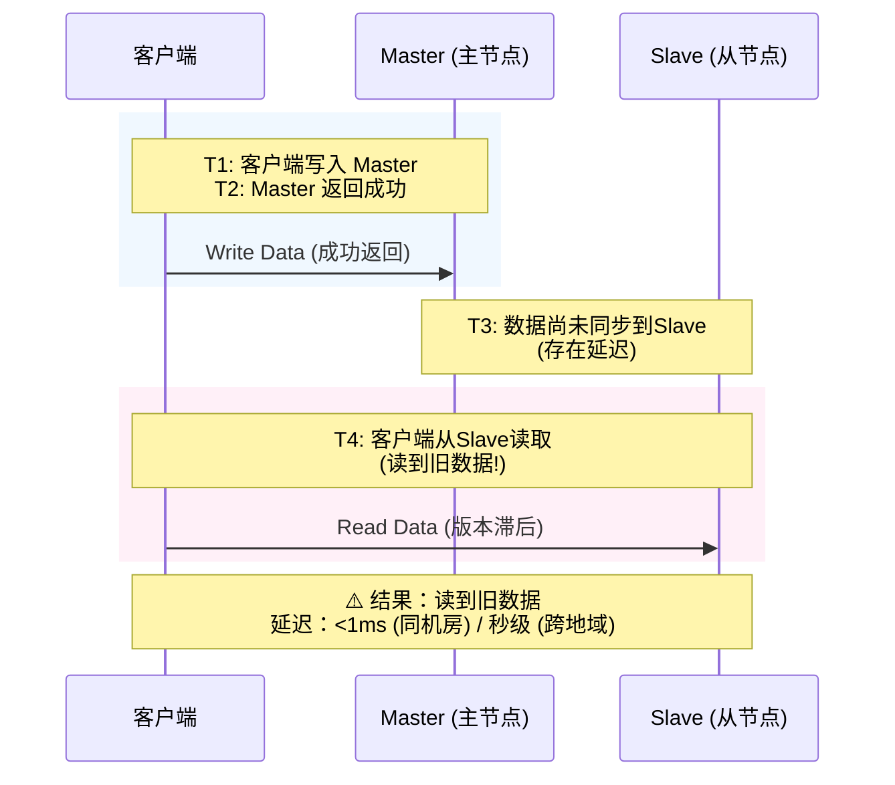
```mermaid
sequenceDiagram
    participant Client as 客户端
    participant Master as Master (主节点)
    participant Slave as Slave (从节点)

    rect rgb(240, 248, 255)
        Note over Client, Master: T1: 客户端写入 Master<br/>T2: Master 返回成功
        Client->>Master: Write Data (成功返回)
    end

    Note over Slave, Master: T3: 数据尚未同步到Slave<br/>(存在延迟)

    rect rgb(255, 240, 248)
        Note over Client, Slave: T4: 客户端从Slave读取<br/>(读到旧数据!)
        Client->>Slave: Read Data (版本滞后)
    end

    Note over Client, Slave: ⚠️ 结果：读到旧数据<br/>延迟：<1ms (同机房) / 秒级 (跨地域)

```

**解决方案: WAIT命令**

```python
def strong_consistency_set(client, key, value, acks=2):
    """
    强一致性写入
    
    Args:
        client: Redis客户端
        key: 键
        value: 值
        acks: 需要的确认数(包括Master)
    """
    # 1. 写入Master
    client.set(key, value)
    
    # 2. 等待至少acks个节点确认
    result = client.execute_command('WAIT', acks, 5000)  # 最多等5秒
    acknowledged = result[0]
    
    if acknowledged < acks:
        log.warning(f"Only {acknowledged} nodes acknowledged")
        # 根据业务需求决定是否重试或降级
    
    return acknowledged >= acks

# 使用
success = strong_consistency_set(redis_client, 'user:123', 'Alice', acks=2)
if success:
    print("数据已复制到至少2个节点")
```

**权衡:**
- ✅ 提高数据可靠性
- ❌ 增加写延迟(需等待Slave确认)
- ❌ Slave故障时写入失败

**问题2: 脑裂(Split-Brain)**

```
场景: 网络分区,客户端仍能写入旧Master

时序:
T1: 网络分区,Master与大多数节点断开
T2: 客户端仍能写入旧Master(未意识到已孤立)
T3: 新Master选举完成
T4: 网络恢复,旧Master降为Slave
T5: 旧Master的数据被覆盖 → 数据丢失!
```

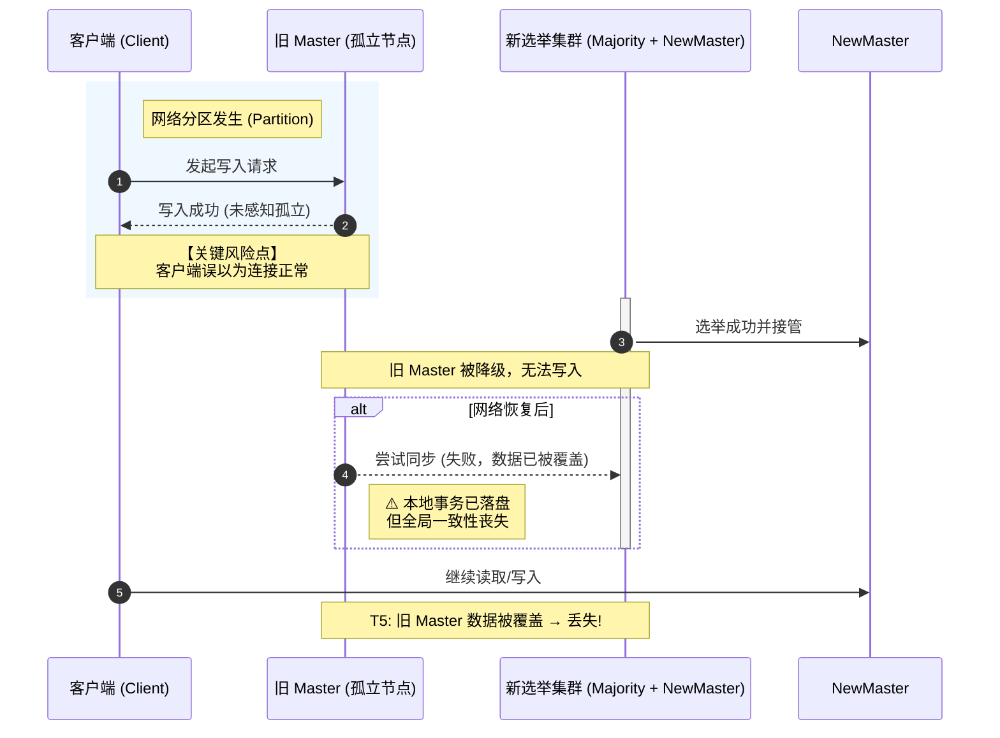
```mermaid
sequenceDiagram
    autonumber
    participant Client as 客户端 (Client)
    participant OldMaster as 旧 Master (孤立节点)
    participant NewCluster as 新选举集群 (Majority + NewMaster)

    rect rgb(240, 248, 255)
        note right of Client: 网络分区发生 (Partition)
        
        %% T1: Master与大多数节点断开
        Client->>OldMaster: 发起写入请求
        OldMaster-->>Client: 写入成功 (未感知孤立)
        
        %% T2: 客户端仍能写入旧 Master
        Note over Client, OldMaster: 【关键风险点】<br/>客户端误以为连接正常
    end

    %% T3: 新 Master 选举完成 (基于 Majority)
    activate NewCluster
    NewCluster->>NewMaster: 选举成功并接管
    Note over NewCluster, OldMaster: 旧 Master 被降级，无法写入
    
    %% T4: 网络恢复
    alt 网络恢复后
        OldMaster-->>NewCluster: 尝试同步 (失败，数据已被覆盖)
        note right of OldMaster: ⚠️ 本地事务已落盘<br/>但全局一致性丧失
    end
    deactivate NewCluster

    %% T5: 数据丢失
    Client->>NewMaster: 继续读取/写入
    Note over NewCluster, OldMaster: T5: 旧 Master 数据被覆盖 → 丢失!


```

**解决方案: min-replicas-to-write**

```conf
# redis.conf
min-replicas-to-write 1     # 至少1个Slave连接才可写
min-replicas-max-lag 10     # Slave延迟不超过10秒
```
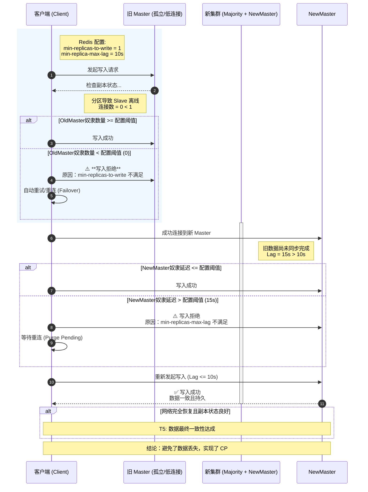
```mermaid
sequenceDiagram
    autonumber
    participant Client as 客户端 (Client)
    participant OldMaster as 旧 Master (孤立/低连接)
    participant NewCluster as 新集群 (Majority + NewMaster)

    %% 场景设定
    rect rgb(240, 248, 255)
        note right of Client: Redis 配置:<br/>min-replicas-to-write = 1<br/>min-replica-max-lag = 10s
    
        %% T1: 网络分区开始
        Client->>OldMaster: 发起写入请求
        OldMaster-->>Client: 检查副本状态...
        
        %% T2: 副本数不足 (0 个 Slave)
        note left of OldMaster: 分区导致 Slave 离线<br/>连接数 = 0 < 1
        
        alt OldMaster奴隶数量 >= 配置阈值
            Client->>OldMaster: 写入成功
        else OldMaster奴隶数量 < 配置阈值 (0)
            Client->>OldMaster: ⚠️ **写入拒绝**<br/>原因：min-replicas-to-write 不满足
            Client->>Client: 自动重试/重连 (Failover)
        end
        
    end

    %% T3: 新 Master 选举完成 (客户端已重连)
    activate NewCluster
    Client->>NewMaster: 成功连接到新 Master
    
    %% T4: 网络恢复，但数据有延迟 (Lag > 10s)
    note left of NewMaster: 旧数据尚未同步完成<br/>Lag = 15s > 10s
        
    alt NewMaster奴隶延迟 <= 配置阈值
        Client->>NewMaster: 写入成功
    else NewMaster奴隶延迟 > 配置阈值 (15s)
        Client->>NewMaster: ⚠️ 写入拒绝<br/>原因：min-replicas-max-lag 不满足
        Client->>Client: 等待重连 (Purge Pending)
    end

    %% T5: 数据同步完成，彻底恢复
    Client->>NewMaster: 重新发起写入 (Lag <= 10s)
    NewMaster-->>Client: ✅ 写入成功<br/>数据一致且持久
    deactivate NewCluster
    
    alt 网络完全恢复且副本状态良好
        Note over Client, NewMaster: T5: 数据最终一致性达成
    end
    
    Note over Client, NewMaster: 结论：避免了数据丢失，实现了 CP


```

**效果:**
- Master检测到无可用Slave时,拒绝写入
- 防止孤立Master接受写入
- 牺牲可用性换取数据安全性

**问题3: 读写不一致**

```
场景: 写入Master后立即从Slave读取

解决: 
方案1. 强制读Master(强一致,但性能差)
方案2. 等待复制完成(延迟不确定)
方案3. 应用层缓存刚写入的值(短期一致)
```

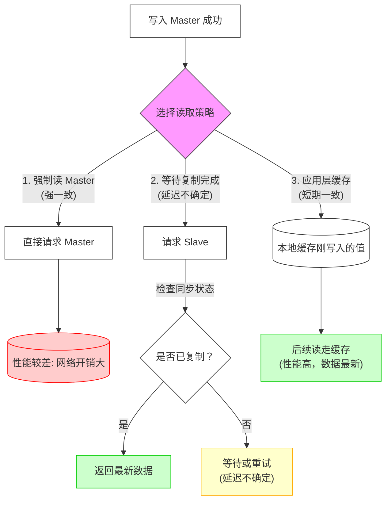
```mermaid
flowchart TD
    A[写入 Master 成功] --> B{选择读取策略}

    %% 方案一
    B -- "1. 强制读 Master<br/>(强一致)" --> C[直接请求 Master] --> D[(性能较差: 网络开销大)]

    %% 方案二
    B -- "2. 等待复制完成<br/>(延迟不确定)" --> E[请求 Slave]
    E -- "检查同步状态" --> F{是否已复制？}
    F -- 是 --> G[返回最新数据]
    F -- 否 --> H["等待或重试<br/>(延迟不确定)"]

    %% 方案三
    B -- "3. 应用层缓存<br/>(短期一致)" --> I[(本地缓存刚写入的值)] --> J["后续读走缓存<br/>(性能高，数据最新)"]

    style B fill:#f9f,stroke:#333
    style D fill:#ffcccc,stroke:#f00
    style G fill:#ccffcc,stroke:#0c0
    style H fill:#ffffcc,stroke:#fa0
    style J fill:#ccffcc,stroke:#0c0

    classDef process fill:#fff,stroke:#333;
    class A,B,C,E,F,G,H,I,J process;

```

```python
class ConsistentReadCache:
    """保证读己之写的缓存"""
    
    def __init__(self, cluster_client):
        self.cluster = cluster_client
        self.recent_writes = {}  # key -> (value, timestamp)
        self.consistency_window = 5  # 5秒内读己之写
    
    def set(self, key, value):
        """写入并记录"""
        self.cluster.set(key, value)
        self.recent_writes[key] = (value, time.time())
    
    def get(self, key):
        """读取时先检查最近写入"""
        if key in self.recent_writes:
            value, ts = self.recent_writes[key]
            if time.time() - ts < self.consistency_window:
                return value  # 返回刚写入的值
            else:
                del self.recent_writes[key]
        
        # 从集群读取
        return self.cluster.get(key)
```

## 多级缓存架构

### 为什么需要多级缓存?

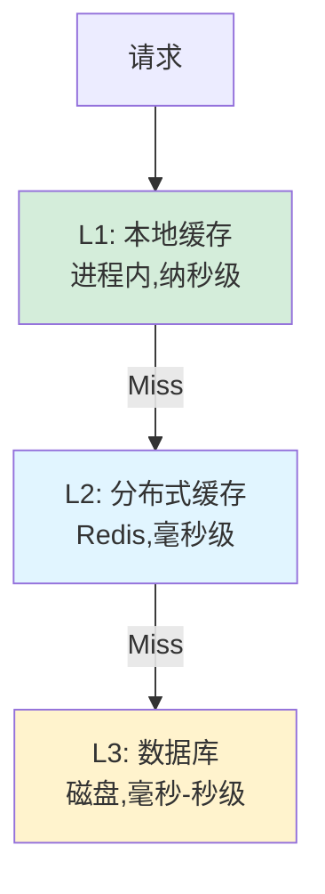
```mermaid
graph TB
    A[请求] --> B["L1: 本地缓存\n进程内,纳秒级"]
    B -->|Miss| C["L2: 分布式缓存\nRedis,毫秒级"]
    C -->|Miss| D["L3: 数据库\n磁盘,毫秒-秒级"]
    
    style B fill:#d4edda
    style C fill:#e1f5ff
    style D fill:#fff3cd
```

**性能对比:**

| 层级 | 类型 | 延迟 | QPS | 容量 | 一致性 |
|------|------|------|-----|------|--------|
| **L1** | 本地缓存 | <1μs | 百万级 | GB级 | 弱 |
| **L2** | Redis | 1-5ms | 十万级 | TB级 | 中 |
| **L3** | MySQL | 10-100ms | 万级 | PB级 | 强 |

**优势:**
- L1吸收大部分流量,保护L2
- L2作为权威缓存,保证基本一致性
- L3作为最终数据源

### 架构设计

**典型架构:**

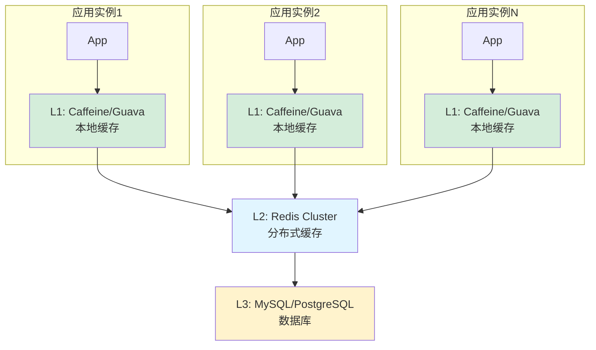
```mermaid
graph TB
    subgraph 应用实例1
        A1[App] --> L1_1["L1: Caffeine/Guava\n本地缓存"]
    end
    
    subgraph 应用实例2
        A2[App] --> L1_2["L1: Caffeine/Guava\n本地缓存"]
    end
    
    subgraph 应用实例N
        AN[App] --> L1_N["L1: Caffeine/Guava\n本地缓存"]
    end
    
    L1_1 --> L2["L2: Redis Cluster\n分布式缓存"]
    L1_2 --> L2
    L1_N --> L2
    
    L2 --> L3["L3: MySQL/PostgreSQL\n数据库"]
    
    style L1_1 fill:#d4edda
    style L1_2 fill:#d4edda
    style L1_N fill:#d4edda
    style L2 fill:#e1f5ff
    style L3 fill:#fff3cd
```

### 代码实现

**Java实现(Caffeine + Redis):**

```java
@Component
public class MultiLevelCacheService {
    
    @Autowired
    private StringRedisTemplate redisTemplate;
    
    // L1: 本地缓存(最大10000条,5分钟过期)
    private final Cache<String, Object> localCache = Caffeine.newBuilder()
        .maximumSize(10000)
        .expireAfterWrite(5, TimeUnit.MINUTES)
        .recordStats()
        .build();
    
    private static final long L2_TTL = 3600; // L2: 1小时
    
    /**
     * 读取缓存(多级查询)
     */
    public <T> T get(String key, Class<T> clazz, Supplier<T> loader) {
        // L1: 本地缓存
        Object cached = localCache.getIfPresent(key);
        if (cached != null) {
            return clazz.cast(cached);
        }
        
        // L2: Redis缓存
        String redisKey = "cache:" + key;
        String redisValue = redisTemplate.opsForValue().get(redisKey);
        if (redisValue != null) {
            T value = JSON.parseObject(redisValue, clazz);
            
            // 回填L1
            localCache.put(key, value);
            
            return value;
        }
        
        // L3: 数据库(通过loader加载)
        T value = loader.get();
        if (value != null) {
            // 写入L2
            redisTemplate.opsForValue().set(
                redisKey,
                JSON.toJSONString(value),
                L2_TTL,
                TimeUnit.SECONDS
            );
            
            // 写入L1
            localCache.put(key, value);
        }
        
        return value;
    }
    
    /**
     * 更新缓存(多级失效)
     */
    public void invalidate(String key) {
        // 失效L2
        String redisKey = "cache:" + key;
        redisTemplate.delete(redisKey);
        
        // 失效L1
        localCache.invalidate(key);
        
        // 发布失效事件(通知其他实例)
        publishInvalidationEvent(key);
    }
    
    /**
     * 发布缓存失效事件
     */
    private void publishInvalidationEvent(String key) {
        Map<String, String> event = new HashMap<>();
        event.put("key", key);
        event.put("timestamp", String.valueOf(System.currentTimeMillis()));
        
        redisTemplate.convertAndSend("cache:invalidation", JSON.toJSONString(event));
    }
}
```

**订阅失效事件:**

```java
@Component
public class CacheInvalidationListener {
    
    @Autowired
    private MultiLevelCacheService cacheService;
    
    @PostConstruct
    public void subscribe() {
        redisTemplate.getConnectionFactory().getConnection().subscribe(
            new MessageListener() {
                @Override
                public void onMessage(Message message, byte[] pattern) {
                    String json = message.toString();
                    Map<String, String> event = JSON.parseObject(json, Map.class);
                    
                    String key = event.get("key");
                    log.info("Received cache invalidation event: {}", key);
                    
                    // 失效本地缓存
                    cacheService.invalidateLocalOnly(key);
                }
            },
            "cache:invalidation".getBytes()
        );
    }
}
```

**Python实现(localcache + redis):**

```python
from cachetools import TTLCache
import redis
import json
import threading

class MultiLevelCache:
    def __init__(self, redis_client, l1_maxsize=10000, l1_ttl=300):
        """
        Args:
            redis_client: Redis客户端
            l1_maxsize: L1最大条目数
            l1_ttl: L1 TTL(秒)
        """
        self.redis = redis_client
        self.l1_cache = TTLCache(maxsize=l1_maxsize, ttl=l1_ttl)
        self.l2_ttl = 3600
        self.pubsub = None
        self._start_invalidation_listener()
    
    def get(self, key, loader=None):
        """多级读取"""
        # L1: 本地缓存
        if key in self.l1_cache:
            return self.l1_cache[key]
        
        # L2: Redis
        redis_key = f"cache:{key}"
        cached = self.redis.get(redis_key)
        if cached:
            value = json.loads(cached)
            
            # 回填L1
            self.l1_cache[key] = value
            
            return value
        
        # L3: 数据库(loader)
        if loader:
            value = loader(key)
            if value is not None:
                # 写入L2
                self.redis.setex(
                    redis_key,
                    self.l2_ttl,
                    json.dumps(value)
                )
                
                # 写入L1
                self.l1_cache[key] = value
            
            return value
        
        return None
    
    def set(self, key, value):
        """多级写入"""
        redis_key = f"cache:{key}"
        
        # 写入L2
        self.redis.setex(redis_key, self.l2_ttl, json.dumps(value))
        
        # 写入L1
        self.l1_cache[key] = value
        
        # 发布失效事件
        self._publish_invalidation(key)
    
    def invalidate(self, key):
        """多级失效"""
        redis_key = f"cache:{key}"
        
        # 失效L2
        self.redis.delete(redis_key)
        
        # 失效L1
        if key in self.l1_cache:
            del self.l1_cache[key]
        
        # 发布失效事件
        self._publish_invalidation(key)
    
    def _publish_invalidation(self, key):
        """发布失效事件"""
        event = {
            'key': key,
            'timestamp': time.time()
        }
        self.redis.publish('cache:invalidation', json.dumps(event))
    
    def _start_invalidation_listener(self):
        """启动失效事件监听"""
        def listener():
            pubsub = self.redis.pubsub()
            pubsub.subscribe('cache:invalidation')
            
            for message in pubsub.listen():
                if message['type'] == 'message':
                    event = json.loads(message['data'])
                    key = event['key']
                    
                    # 失效本地缓存
                    if key in self.l1_cache:
                        del self.l1_cache[key]
        
        thread = threading.Thread(target=listener, daemon=True)
        thread.start()
```

### 一致性问题与解决

**问题1: L1缓存不一致**

```
场景:
实例A更新数据,失效自己的L1和L2
实例B的L1仍是旧数据(未收到失效事件)

解决:
方案1. Pub/Sub广播失效事件(如上实现)
方案2. 短TTL(5分钟自动过期)
方案3. 版本号机制
```

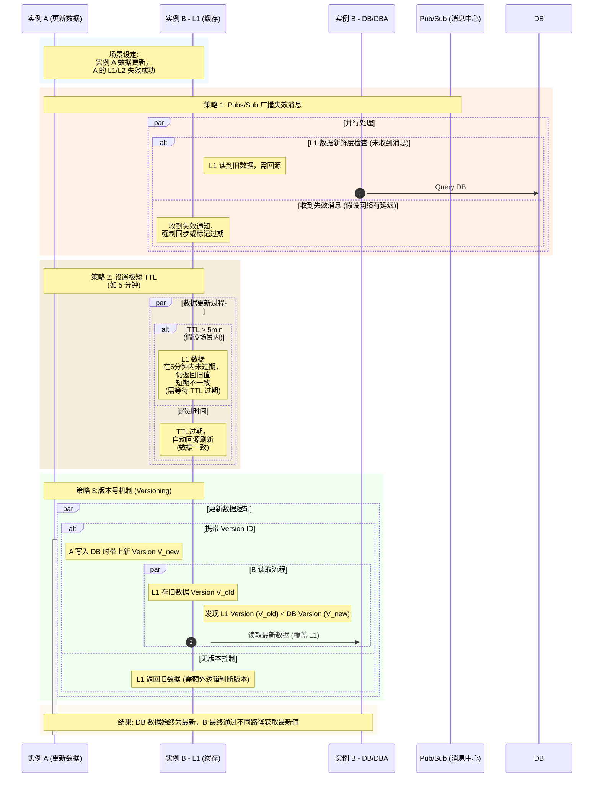
```mermaid
sequenceDiagram
    autonumber
    
    participant IA as 实例 A (更新数据)
    participant IB_L1 as 实例 B - L1 (缓存)
    participant IB_DB as 实例 B - DB/DBA
    participant PubSub as Pub/Sub (消息中心)
    
    rect rgb(240, 248, 255)
        note over IA, IB_L1 : 场景设定:<br>实例 A 数据更新，<br>A 的 L1/L2 失效成功
    end
    
    %% --- 方案一：Pub/Sub广播 ---
    rect rgb(255, 240, 230)
        note over IA, PubSub : 策略 1: Pubs/Sub 广播失效消息
        activate IB_L1
        
        par 并行处理
            alt L1 数据新鲜度检查 (未收到消息)
                activate IB_DB
                note right of IB_L1: L1 读到旧数据，需回源
                IB_DB->>DB: Query DB
            else 收到失效消息 (假设网络有延迟)
                activate IB_L1
                note over IB_L1: 收到失效通知，<br>强制同步或标记过期
            end
        end
        
    end
    
    %% --- 方案二：短 TTL ---
    rect rgb(245, 238, 220)
        note over IA, IB_L1 : 策略 2: 设置极短 TTL<br>(如 5 分钟)
        activate IB_L1
        
        par 数据更新过程
            alt TTL > 5min <br>(假设场景内)
                activate IB_L1
                note over IB_L1: L1 数据<br>在5分钟内未过期，<br>仍返回旧值<br>短期不一致<br>(需等待 TTL 过期)
            else 超过时间
                activate IB_L1
                note over IB_L1: TTL过期，<br>自动回源刷新<br> (数据一致)
            end
        end
        
    end
    
    %% --- 方案三：版本号机制 ---
    rect rgb(240, 255, 240)
        note over IA, IB_L1 : 策略 3:版本号机制 (Versioning)
        activate IB_L1
        
        par 更新数据逻辑
            alt 携带 Version ID
                activate IA
                note right of IA: A 写入 DB 时带上新 Version V_new
                
                par B 读取流程
                    activate IB_L1
                    note over IB_L1: L1 存旧数据 Version V_old
                    
                  activate IB_DB
                    note right of IB_L1: 发现 L1 Version (V_old) < DB Version (V_new)
                    IB_L1->>IB_DB: 读取最新数据 (覆盖 L1)
                end
                
            else 无版本控制
                 activate IB_L1
                 note over IB_L1: L1 返回旧数据 (需额外逻辑判断版本)
            end
        end
        
    end
    
    rect rgb(255, 250, 240)
        note over IA, IB_DB : 结果: DB 数据始终为最新，B 最终通过不同路径获取最新值
    end
    
    deactivate IA
```

**版本号机制:**

```python
class VersionedMultiLevelCache:
    def __init__(self, redis_client):
        self.redis = redis_client
        self.l1_cache = {}  # key -> (value, version)
    
    def get(self, key, loader=None):
        """带版本检查的读取"""
        # 获取最新版本号
        latest_version = self.redis.get(f"version:{key}")
        if latest_version:
            latest_version = int(latest_version)
        
        # 检查L1
        if key in self.l1_cache:
            value, version = self.l1_cache[key]
            
            if latest_version and version >= latest_version:
                return value  # L1是最新的
            else:
                del self.l1_cache[key]  # L1过期
        
        # 从L2/L3加载
        value = super().get(key, loader)
        
        if value and latest_version:
            self.l1_cache[key] = (value, latest_version)
        
        return value
    
    def set(self, key, value):
        """写入时递增版本号"""
        # 递增版本号
        version = self.redis.incr(f"version:{key}")
        
        # 写入L2
        redis_key = f"cache:{key}"
        data = {
            'value': value,
            'version': version
        }
        self.redis.setex(redis_key, 3600, json.dumps(data))
        
        # 写入L1
        self.l1_cache[key] = (value, version)
```

**问题2: 缓存穿透到L3**

```
场景: L1/L2都未命中,大量请求打到数据库

解决:
1. 布隆过滤器前置检查
2. 互斥锁重建缓存
3. 限流降级
```
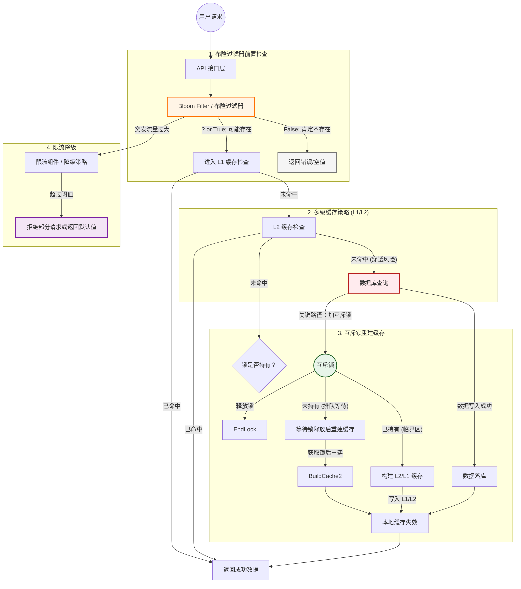
```mermaid
flowchart TD
    User((用户请求)) --> API[API 接口层]
    
    subgraph PreCheck [1. 布隆过滤器前置检查]
        API --> BF[Bloom Filter / 布隆过滤器]
        BF -- "False: 肯定不存在" --> Reject[返回错误/空值]
        BF -- "? or True: 可能存在" --> L1[进入 L1 缓存检查]
    end

    subgraph CacheLayer ["2. 多级缓存策略 (L1/L2)"]
        L1 -- "未命中" --> L2[L2 缓存检查]
        L2 -- "未命中 (穿透风险)" --> DB[数据库查询]
    end

    subgraph LockMechanism [3. 互斥锁重建缓存]
        DB -- "数据写入成功" --> WriteSuccess[数据落库]
        
        %% 核心逻辑：加锁防止并发重复查库，一次性构建缓存
        DB -- "关键路径：加互斥锁" --> Mutex((互斥锁))
        
        mutexCheck{锁是否持有？}
        L2 -- "未命中" --> mutexCheck
        
        Mutex -- "已持有 (临界区)" --> BuildCache[构建 L2/L1 缓存]
        Mutex -- "未持有 (排队等待)" --> Wait[等待锁释放后重建缓存]
        
        BuildCache -- "写入 L1/L2" --> Invalidate[本地缓存失效]
        Wait -- "获取锁后重建" --> BuildCache2
        
        Mutex -- "释放锁" --> EndLock
    end
    
    subgraph RateLimit [4. 限流降级]
        BF -- "突发流量过大" --> RL[限流组件 / 降级策略]
        RL -- "超过阈值" --> Reduce[拒绝部分请求或返回默认值]
    end

    WriteSuccess --> Invalidate
    BuildCache2 --> Invalidate
    
    L1 -- "已命中" --> Response[返回成功数据]
    L2 -- "已命中" --> Response
    Invalidate --> Response
    
    style BF fill:#e1f5fe,stroke:#01579b,stroke-width:2px
    style BF fill:#fff5e6,stroke:#ff6f00,stroke-width:2px
    style Mutex fill:#e8f5e9,stroke:#1b5e20,stroke-width:2px
    style DB fill:#ffebee,stroke:#b71c1c,stroke-width:2px
    style Reject fill:#f5f5f5,stroke:#757575,stroke-width:2px
    style Reduce fill:#f3e5f5,stroke:#7b1fa2,stroke-width:2px

```

```python
def get_with_protection(key, loader):
    """带保护的读取"""
    # 1. 布隆过滤器检查
    if not bloom_filter.might_exist(key):
        return None
    
    # 2. 多级缓存读取
    value = multi_level_cache.get(key)
    if value:
        return value
    
    # 3. 互斥锁重建
    lock_key = f"lock:{key}"
    lock_acquired = redis.set(lock_key, "1", nx=True, ex=10)
    
    if lock_acquired:
        try:
            # 双重检查
            value = multi_level_cache.get(key)
            if value:
                return value
            
            # 加载并缓存
            value = loader(key)
            if value:
                multi_level_cache.set(key, value)
            else:
                # 缓存空值
                multi_level_cache.set_empty(key, ttl=60)
            
            return value
        finally:
            redis.delete(lock_key)
    else:
        # 等待后重试
        time.sleep(0.05)
        return get_with_protection(key, loader)
```

**问题3: 缓存雪崩**

```
场景: 大量L2 Key同时过期,L3压力骤增

解决:
1. L1随机TTL分散过期时间
2. L2也添加随机TTL
3. 热点数据预加载
```
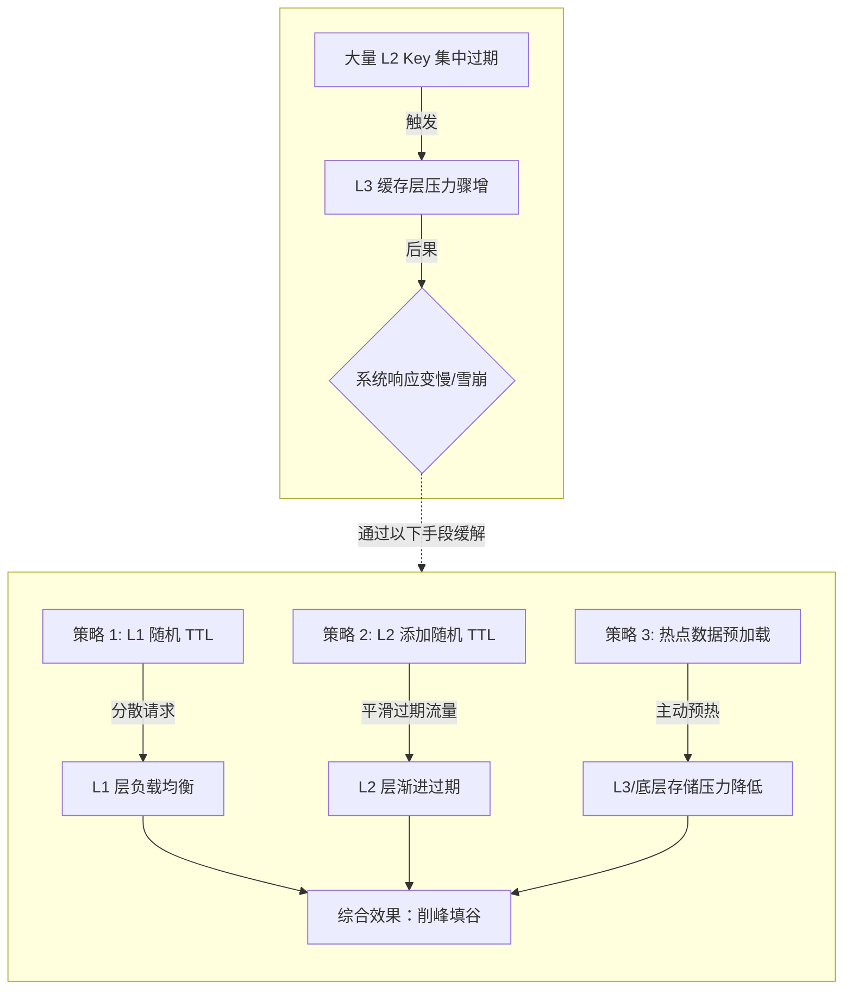
```mermaid
flowchart TD
    subgraph Problem [ ]
        A[大量 L2 Key 集中过期] -->|触发 | B[L3 缓存层压力骤增]
        B -->|后果 | C{系统响应变慢/雪崩}
    end

    subgraph Solution [ ]
        direction TB
        
        S1[策略 1: L1 随机 TTL] -->|分散请求 | D[L1 层负载均衡]
        S2[策略 2: L2 添加随机 TTL] -->|平滑过期流量 | E[L2 层渐进过期]
        S3[策略 3: 热点数据预加载] -->|主动预热 | F[L3/底层存储压力降低]
        
        D --> G[综合效果：削峰填谷]
        E --> G
        F --> G
    end

    C -.->|通过以下手段缓解 | Solution
```


```python
def set_with_jitter(key, value, base_ttl):
    """设置缓存时添加随机偏移"""
    jitter = random.randint(-int(base_ttl * 0.1), int(base_ttl * 0.1))
    ttl = max(60, base_ttl + jitter)
    
    redis.setex(f"cache:{key}", ttl, json.dumps(value))
```

## 跨数据中心缓存同步

### 挑战

**挑战1: 网络延迟**

```
同城: 1-5ms
跨国: 100-300ms

影响: 跨DC同步延迟高,难以保证实时一致
```

**挑战2: 网络分区**

```
海底光缆故障 → DC间完全隔离

影响: 各DC独立运行,数据分歧
```

**挑战3: 合规要求**

```
GDPR: 欧盟用户数据不得出境
中国网络安全法: 关键数据境内存储

影响: 数据需本地化,跨DC同步受限
```

### 同步策略

**策略1: 主动-被动(Active-Passive)**

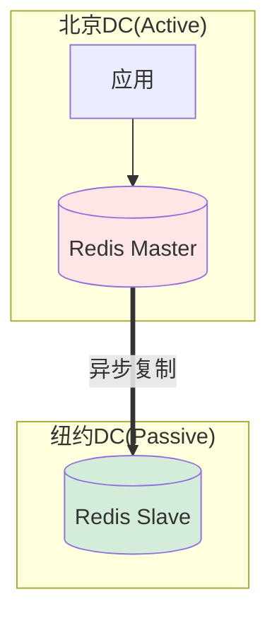
```mermaid
graph TB
    subgraph "北京DC(Active)"
        App1[应用] --> Redis1[(Redis Master)]
    end
    
    subgraph "纽约DC(Passive)"
        Redis2[(Redis Slave)]
    end
    
    Redis1 ==>|"异步复制"| Redis2
    
    style Redis1 fill:#ffe6e6
    style Redis2 fill:#d4edda
```

**特点:**
- ✅ 简单,无冲突
- ✅ 灾难恢复清晰
- ❌ 备用DC只能读
- ❌ 切换时间长

**策略2: 按地域分片(Geo-Sharding)**

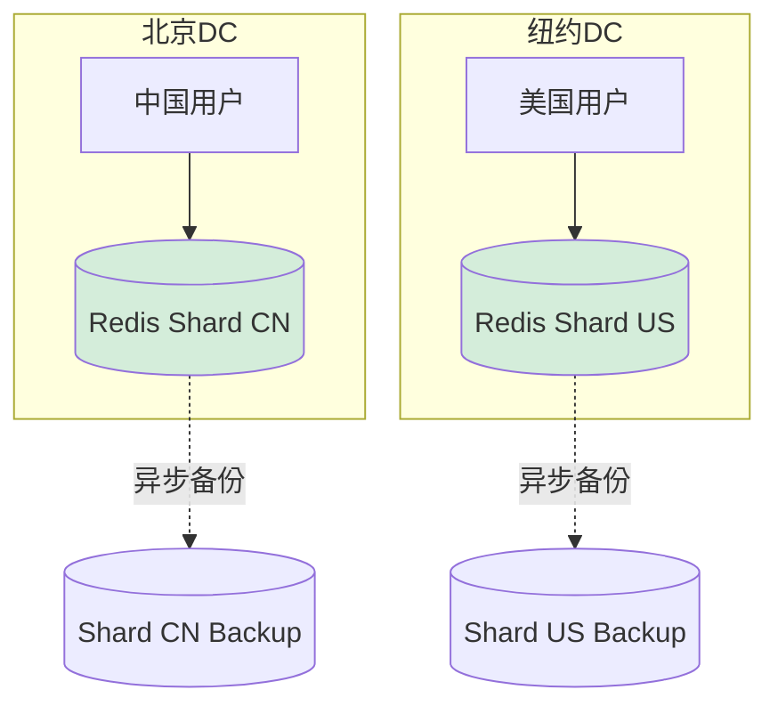
```mermaid
graph TB
    subgraph 北京DC
        Redis1[(Redis Shard CN)]
        App1[中国用户] --> Redis1
    end
    
    subgraph 纽约DC
        Redis2[(Redis Shard US)]
        App2[美国用户] --> Redis2
    end
    
    Redis1 -.->|"异步备份"| Redis2_Backup[(Shard CN Backup)]
    Redis2 -.->|"异步备份"| Redis1_Backup[(Shard US Backup)]
    
    style Redis1 fill:#d4edda
    style Redis2 fill:#d4edda
```

**特点:**
- ✅ 无冲突(各自写入)
- ✅ 低延迟(就近访问)
- ❌ 跨地域查询复杂
- ❌ 需路由层

**策略3: CRDT合并**
1.  **本地更新**：调用 `update_counter`，在本地 Redis 和 CRDT Store 中执行原子操作（如 LWW-Counter 或 PN-Counter）。
2.  **异步同步**：触发 `async_replicate_to_other_dcs`，将当前状态（包含版本号/向量时钟）发送给其他数据中心。
3.  **合并策略**：其他 DC 收到后，利用 CRDT 的数学规则（如取最大值）合并状态，无需协调锁。
4.  **读取**：调用 `get_counter` 时，本地或全局视图自动合并所有 DC 的状态，返回最终一致的值。
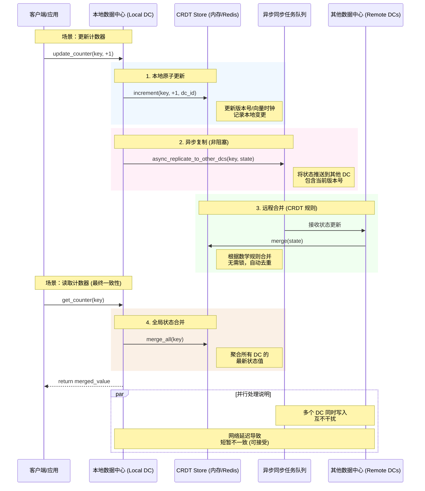
```mermaid
sequenceDiagram
    participant Client as 客户端/应用
    participant LocalDC as 本地数据中心 (Local DC)
    participant CRDTStore as CRDT Store (内存/Redis)
    participant AsyncTask as 异步同步任务队列
    participant OtherDCs as 其他数据中心 (Remote DCs)

    Note over Client, LocalDC: 场景：更新计数器
    Client->>LocalDC: update_counter(key, +1)
    
    rect rgb(240, 248, 255)
        Note over LocalDC, CRDTStore: 1. 本地原子更新
        LocalDC->>CRDTStore: increment(key, +1, dc_id)
        Note right of CRDTStore: 更新版本号/向量时钟<br/>记录本地变更
    end

    rect rgb(255, 240, 248)
        Note over LocalDC, AsyncTask: 2. 异步复制 (非阻塞)
        LocalDC->>AsyncTask: async_replicate_to_other_dcs(key, state)
        Note right of AsyncTask: 将状态推送到其他 DC<br/>包含当前版本号
    end

    rect rgb(240, 255, 240)
        Note over OtherDCs, CRDTStore: 3. 远程合并 (CRDT 规则)
        AsyncTask->>OtherDCs: 接收状态更新
        OtherDCs->>CRDTStore: merge(state)
        Note right of CRDTStore: 根据数学规则合并<br/>无需锁，自动去重
    end

    Note over Client, LocalDC: 场景：读取计数器 (最终一致性)
    Client->>LocalDC: get_counter(key)
    
    rect rgb(250, 240, 230)
        Note over LocalDC, CRDTStore: 4. 全局状态合并
        LocalDC->>CRDTStore: merge_all(key)
        Note right of CRDTStore: 聚合所有 DC 的<br/>最新状态值
    end
    
    LocalDC-->>Client: return merged_value

    par 并行处理说明
        Note over AsyncTask, OtherDCs: 多个 DC 同时写入<br/>互不干扰
        Note over LocalDC, OtherDCs: 网络延迟导致<br/>短暂不一致 (可接受)
    end
```
*   **无锁并发 (Lock-Free)**：图中步骤 3 展示了 `OtherDCs` 合并状态的过程。由于 CRDT（如 LWW-Counter）基于数学规则（例如：`max(version_A, version_B)`），多个 DC 可以同时写入，不会发生写冲突。
*   **最终一致性 (Eventual Consistency)**：步骤 2 是异步的，意味着在数据完全同步到所有 DC 之前，`get_counter` 可能返回的是旧值。这是 CRDT 的固有特性，适用于对实时性要求不高但强一致性的场景（如点赞数、访问统计）。
*   **状态传播**：`async_replicate_to_other_dcs` 传递的不仅仅是数值，而是包含 `dc_id` 和 `version`（或向量时钟）的完整状态快照，这是 CRDT 能够正确合并的基础。
```python
class GeoDistributedCache:
    """基于CRDT的跨DC缓存"""
    
    def __init__(self, local_redis, dc_id):
        self.local_redis = local_redis
        self.dc_id = dc_id
        self.crdt_store = CRDTStore()
    
    def update_counter(self, key, increment=1):
        """更新计数器(CRDT保证最终一致)"""
        # 本地更新
        self.crdt_store.increment(key, increment, self.dc_id)
        
        # 异步同步到其他DC
        async_replicate_to_other_dcs(key, self.crdt_store.get_state(key))
    
    def get_counter(self, key):
        """读取计数器(合并所有DC的状态)"""
        # 合并所有DC的向量
        merged_state = self.crdt_store.merge_all(key)
        return merged_state.value
```

**适用场景:**
- 计数器(点赞数、浏览量)
- 集合(标签、关注列表)
- 寄存器(用户偏好)

## 监控与告警

### 关键指标

**指标1: 各级缓存命中率**

```python
class MultiLevelCacheMetrics:
    def __init__(self):
        self.l1_hits = Counter('l1_cache_hits_total')
        self.l1_misses = Counter('l1_cache_misses_total')
        self.l2_hits = Counter('l2_cache_hits_total')
        self.l2_misses = Counter('l2_cache_misses_total')
    
    def l1_hit_rate(self):
        total = self.l1_hits._value.get() + self.l1_misses._value.get()
        return self.l1_hits._value.get() / total if total > 0 else 0
    
    def l2_hit_rate(self):
        total = self.l2_hits._value.get() + self.l2_misses._value.get()
        return self.l2_hits._value.get() / total if total > 0 else 0

# Prometheus告警
groups:
  - name: cache_alerts
    rules:
      - alert: LowL1HitRate
        expr: rate(l1_cache_hits_total[5m]) / (rate(l1_cache_hits_total[5m]) + rate(l1_cache_misses_total[5m])) < 0.7
        for: 10m
        labels:
          severity: warning
      
      - alert: LowL2HitRate
        expr: rate(l2_cache_hits_total[5m]) / (rate(l2_cache_hits_total[5m]) + rate(l2_cache_misses_total[5m])) < 0.8
        for: 10m
        labels:
          severity: warning
```

**指标2: 复制延迟**

```bash
# Redis Cluster复制延迟
redis-cli -h <slave-host> -p <slave-port> INFO replication

# 关键字段:
# master_last_io_seconds_ago: 1  (正常应<1秒)
# master_sync_in_progress: 0     (不应在同步中)
```

**指标3: 跨DC同步延迟**

```python
def measure_cross_dc_lag():
    """测量跨DC同步延迟"""
    test_key = 'cross_dc_test'
    test_value = str(time.time())
    
    # 写入DC1
    dc1_redis.set(test_key, test_value)
    write_time = time.time()
    
    # 轮询DC2
    for _ in range(100):
        value = dc2_redis.get(test_key)
        if value == test_value:
            lag = time.time() - write_time
            cross_dc_lag_histogram.observe(lag)
            return lag
        time.sleep(0.1)
    
    return None  # 超时
```

## 结语:分布式缓存一致性是持续优化的过程

分布式缓存一致性不是能一劳永逸解决的问题,而是需要持续监控、调优、演进的工程实践。

**核心原则:**

1. **分层防御**: L1/L2/L3各司其职,不依赖单一层级
2. **最终一致**: 接受短暂不一致,保证最终收敛
3. **监控先行**: 命中率、延迟、复制滞后必须实时监控
4. **预案充分**: 缓存穿透/击穿/雪崩必须有自动化应对

**实践建议:**

- 从简单的Cache-Aside开始,逐步引入多级缓存
- 热点数据考虑CDN+L1+L2三层架构
- 关键数据(如密码、余额)强制读Master
- 定期演练缓存故障场景
- 建立缓存治理规范(TTL标准、命名规范)


---

- Redis Cluster通过哈希槽实现数据分片,支持水平扩展
- 异步复制导致短暂不一致,可用WAIT命令增强一致性
- 多级缓存(L1本地+L2分布式)可大幅提升性能,但需解决L1同步问题
- 跨DC缓存需权衡延迟、一致性和合规要求,常用Geo-Sharding策略
