## 引言:那次跨服务转账事故

凌晨三点,支付团队收到紧急告警:用户A向用户B转账1000元,A账户扣款成功,但B账户未收到款项。更糟糕的是,重试机制导致A账户被重复扣款3次。

问题根源?一个看似简单的跨服务转账操作:

```python
# ❌ 错误的跨服务调用
def transfer(from_account, to_account, amount):
    # 步骤1: 扣除A账户余额
    account_service.deduct(from_account, amount)
    
    # 步骤2: 增加B账户余额(网络超时!)
    try:
        account_service.add(to_account, amount)
    except TimeoutError:
        # 异常处理缺失,导致数据不一致
        log.error("Transfer failed")
        return False
```

在单体应用中,这个问题通过数据库事务轻松解决。但在微服务架构下,每个服务拥有独立的数据库,传统ACID事务失效,分布式事务成为必须跨越的技术鸿沟。

本文将系统梳理分布式事务的演进历程,从经典的2PC/3PC到现代的TCC/Saga,深入剖析每种方案的原理、优缺点和适用场景,帮助你在CAP三角中找到最佳平衡点。

## 分布式事务的核心挑战

### ACID vs BASE

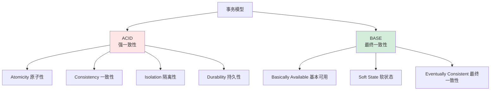

**对比分析:**

| 维度 | ACID | BASE |
|------|------|------|
| **一致性级别** | 强一致性 | 最终一致性 |
| **可用性** | 低(阻塞等待) | 高(异步处理) |
| **性能** | 较差(锁竞争) | 较好(无锁) |
| **实现复杂度** | 简单(数据库内置) | 复杂(应用层实现) |
| **适用场景** | 单体应用、金融核心 | 微服务、互联网应用 |

**CAP定理的约束:**

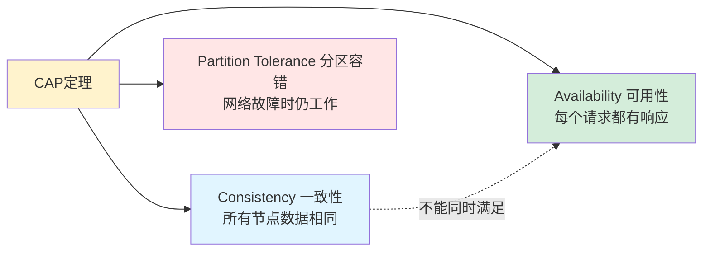

**分布式系统的现实选择:**
- **CP系统**: 保证一致性和分区容错,牺牲可用性(ZooKeeper、HBase)
- **AP系统**: 保证可用性和分区容错,牺牲一致性(Dynamo、Cassandra)
- **CA系统**: 理论上存在,但实际不存在(因为网络分区不可避免)

### 分布式事务的典型场景

**场景1: 跨服务转账**

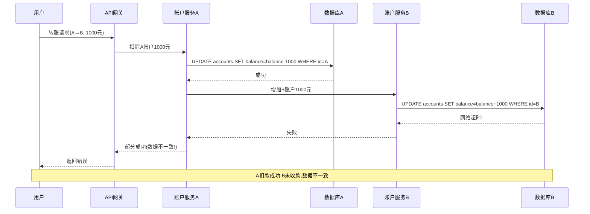

**场景2: 电商下单**

```
订单服务 → 创建订单
库存服务 → 扣减库存
积分服务 → 增加积分
物流服务 → 创建物流单

任何一个环节失败,都需要回滚或补偿
```

**场景3: 数据同步**

```
MySQL主库 → Binlog → Canal → Kafka → Elasticsearch

需要保证数据不丢失、不重复、顺序一致
```

## 两阶段提交(2PC):经典方案

### 工作原理

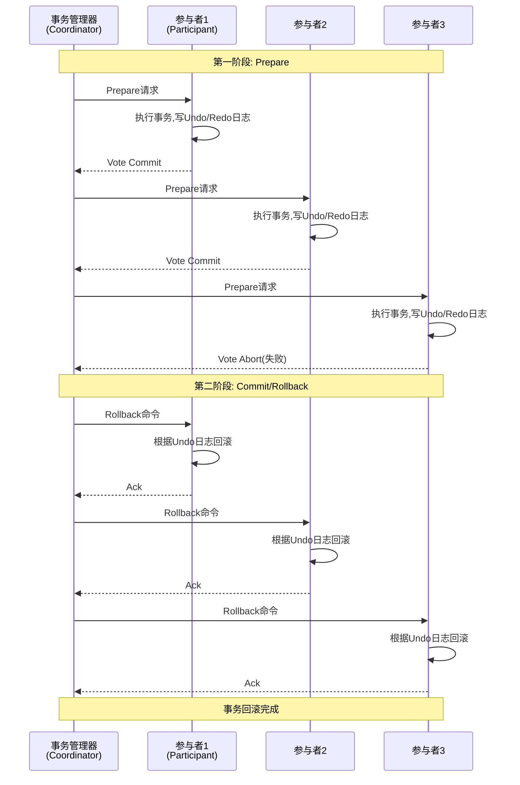

**流程说明:**

**Phase 1: Prepare(准备阶段)**
1. 协调者向所有参与者发送Prepare请求
2. 参与者执行事务操作,写入Undo和Redo日志
3. 参与者返回Vote Commit(成功)或Vote Abort(失败)

**Phase 2: Commit/Rollback(提交/回滚阶段)**
1. 如果所有参与者都Vote Commit,协调者发送Commit命令
2. 如果任一参与者Vote Abort,协调者发送Rollback命令
3. 参与者执行提交或回滚,释放资源,返回Ack

### MySQL XA事务实现

```sql
-- 协调者(应用层)控制XA事务

-- 1. 开始全局事务
XA START 'trx_001';

-- 2. 执行本地事务
UPDATE accounts SET balance = balance - 1000 WHERE id = 1;

-- 3. 准备阶段
XA END 'trx_001';
XA PREPARE 'trx_001';

-- 4. 提交阶段(如果所有参与者都PREPARE成功)
XA COMMIT 'trx_001';

-- 或回滚阶段(如果任一参与者失败)
XA ROLLBACK 'trx_001';
```

**Java Spring + Atomikos实现:**

```java
@Configuration
public class XAConfig {
    
    @Bean
    public UserTransactionManager userTransactionManager() {
        UserTransactionManager utm = new UserTransactionManager();
        utm.setForceShutdown(true);
        return utm;
    }
    
    @Bean
    public UserTransaction userTransaction() {
        UserTransactionImp ut = new UserTransactionImp();
        ut.setTransactionTimeout(300); // 5分钟超时
        return ut;
    }
}

@Service
public class TransferService {
    
    @Autowired
    private AccountRepository accountRepo;
    
    @Transactional
    public void transfer(String fromId, String toId, BigDecimal amount) {
        // 自动纳入XA事务管理
        accountRepo.deduct(fromId, amount);
        accountRepo.add(toId, amount);
        // 如果任何异常,自动回滚
    }
}
```

### 2PC的问题与局限

**问题1: 同步阻塞**

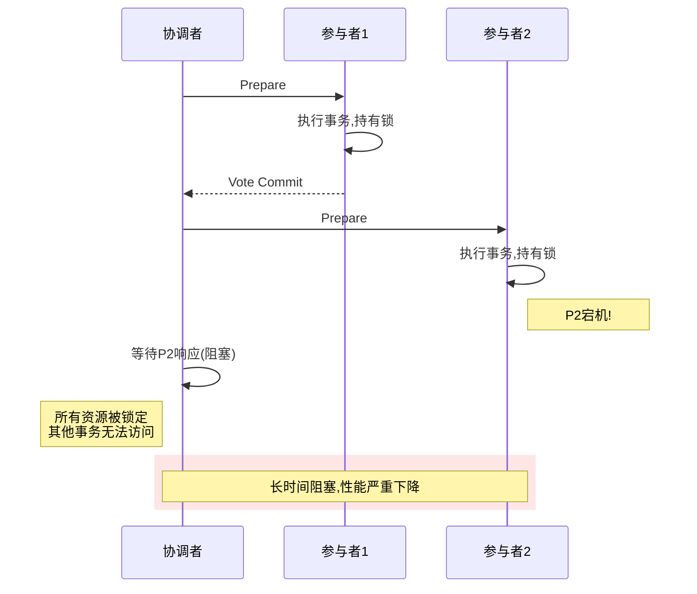

**问题2: 单点故障**

- 协调者宕机: 参与者无法得知应该Commit还是Rollback
- 参与者在Prepare后宕机: 重启后需要根据日志恢复状态

**问题3: 数据不一致风险**

```
场景: 协调者在发送Commit命令时部分参与者收到,部分未收到

结果: 部分参与者提交,部分参与者回滚 → 数据不一致
```

**问题4: 性能开销大**

- 两次网络往返(RTT)
- 持有锁时间长,并发度低
- Undo/Redo日志占用存储空间

**适用场景:**
- ✅ 短事务(秒级)
- ✅ 参与节点少(<5个)
- ✅ 对一致性要求极高(金融核心)
- ❌ 不适合长事务、高并发场景

## 三阶段提交(3PC):改进尝试

### 为什么需要3PC?

2PC的主要问题是**同步阻塞**和**单点故障**。3PC通过引入超时机制和CanCommit阶段来缓解这些问题。

### 工作流程

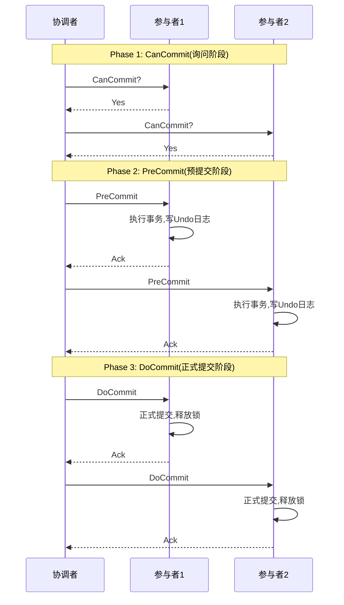

**关键改进:**

1. **引入超时机制**: 参与者在超时后可以自主决定Commit或Abort
2. **增加CanCommit阶段**: 提前检测参与者状态,减少无效等待
3. **PreCommit缓冲**: 在正式提交前增加一个缓冲阶段

### 3PC的问题

**问题仍未完全解决:**

| 问题 | 2PC | 3PC | 说明 |
|------|-----|-----|------|
| **同步阻塞** | ❌ 严重 | ⚠️ 改善 | 仍有阻塞风险 |
| **单点故障** | ❌ 严重 | ⚠️ 改善 | 协调者宕机仍可能不一致 |
| **网络分区** | ❌ 不一致 | ❌ 不一致 | 网络故障时仍可能脑裂 |
| **性能开销** | ❌ 大 | ❌ 更大 | 三次网络往返 |

**网络分区导致的脑裂:**

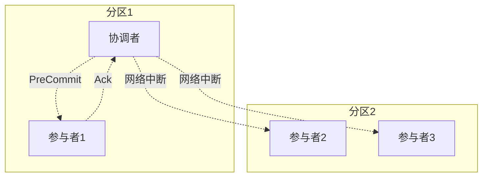

**现实应用:**
- 3PC在实际生产中很少使用
- 复杂度增加,但问题未根本解决
- 现代分布式系统更多采用最终一致性方案

## TCC:业务层面的补偿

### 核心理念

TCC(Try-Confirm-Cancel)将事务控制从数据库层提升到**业务应用层**,通过手动实现补偿逻辑来解决分布式事务问题。

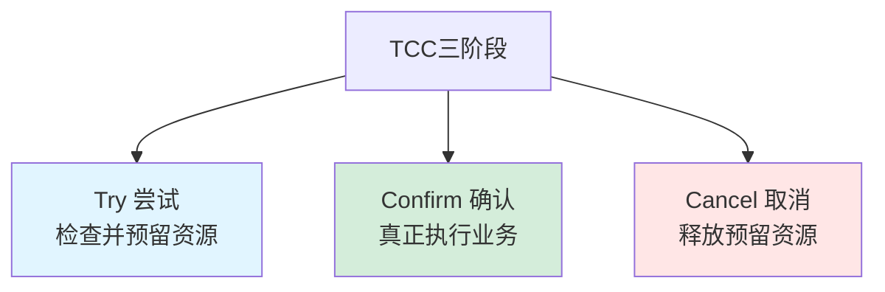

**与2PC的本质区别:**

| 维度 | 2PC | TCC |
|------|-----|-----|
| **控制层级** | 数据库层 | 业务应用层 |
| **资源锁定** | 数据库行锁 | 业务预留(如冻结金额) |
| **隔离性** | 强隔离(数据库保证) | 弱隔离(需业务处理) |
| **灵活性** | 低(通用方案) | 高(定制补偿逻辑) |
| **性能** | 差(长事务阻塞) | 较好(短事务) |

### 转账场景的TCC实现

```python
class TransferTCCService:
    """TCC转账服务"""
    
    def try_transfer(self, from_account, to_account, amount):
        """
        Try阶段: 检查并预留资源
        - 检查A账户余额是否充足
        - 冻结A账户的转账金额
        - 记录事务日志
        """
        # 1. 检查余额
        balance = self.account_repo.get_balance(from_account)
        if balance < amount:
            raise InsufficientBalanceError("余额不足")
        
        # 2. 冻结金额(而非直接扣款)
        self.account_repo.freeze_amount(from_account, amount)
        
        # 3. 记录TCC事务日志
        self.tcc_log_repo.create({
            'transaction_id': generate_uuid(),
            'from_account': from_account,
            'to_account': to_account,
            'amount': amount,
            'status': 'TRY_SUCCESS'
        })
        
        return True
    
    def confirm_transfer(self, transaction_id):
        """
        Confirm阶段: 真正执行业务
        - 扣除A账户冻结金额
        - 增加B账户余额
        - 更新事务状态
        """
        log = self.tcc_log_repo.get(transaction_id)
        
        # 1. 扣除A账户冻结金额
        self.account_repo.deduct_frozen(log['from_account'], log['amount'])
        
        # 2. 增加B账户余额
        self.account_repo.add_balance(log['to_account'], log['amount'])
        
        # 3. 更新事务状态
        self.tcc_log_repo.update_status(transaction_id, 'CONFIRMED')
    
    def cancel_transfer(self, transaction_id):
        """
        Cancel阶段: 释放预留资源
        - 解冻A账户冻结金额
        - 更新事务状态
        """
        log = self.tcc_log_repo.get(transaction_id)
        
        # 1. 解冻A账户金额
        self.account_repo.unfreeze_amount(log['from_account'], log['amount'])
        
        # 2. 更新事务状态
        self.tcc_log_repo.update_status(transaction_id, 'CANCELLED')
```

**完整流程:**

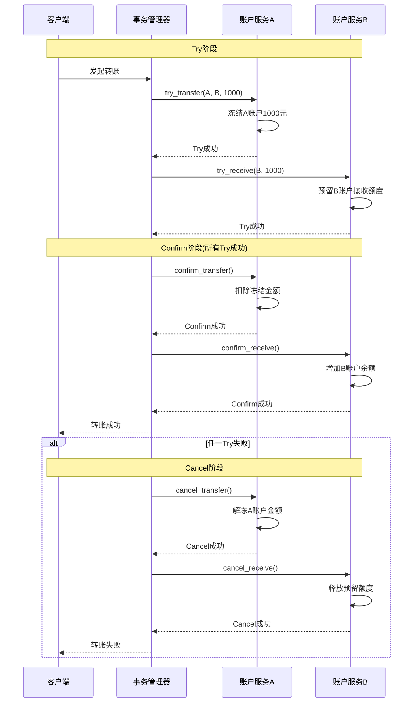

### TCC的关键挑战

**挑战1: 幂等性**

```python
def confirm_transfer(self, transaction_id):
    """Confirm阶段必须幂等"""
    # 检查事务状态,避免重复执行
    log = self.tcc_log_repo.get(transaction_id)
    if log['status'] == 'CONFIRMED':
        return  # 已确认,直接返回
    
    # 执行确认逻辑
    # ...
```

**原因:** 网络超时可能导致协调者重试,Confirm/Cancel可能被多次调用

**挑战2: 空回滚**

```
场景: Try请求因网络延迟未到达参与者,但协调者超时触发Cancel

解决: Cancel时需检查Try是否执行,未执行则直接返回成功
```

```python
def cancel_transfer(self, transaction_id):
    """处理空回滚"""
    log = self.tcc_log_repo.get(transaction_id)
    
    # 如果Try未执行,直接返回成功(空回滚)
    if log is None or log['status'] == 'TRY_PENDING':
        self.tcc_log_repo.create_or_update(transaction_id, 'CANCELLED')
        return
    
    # 正常Cancel逻辑
    # ...
```

**挑战3: 悬挂**

```
场景: Cancel先于Try到达(网络乱序),Try稍后到达时会错误执行

解决: Try时检查是否已Cancel,已Cancel则拒绝执行
```

```python
def try_transfer(self, transaction_id, ...):
    """防止悬挂"""
    # 检查是否已Cancel
    log = self.tcc_log_repo.get(transaction_id)
    if log and log['status'] == 'CANCELLED':
        raise TCCError("事务已取消,拒绝执行Try")
    
    # 正常Try逻辑
    # ...
```

**挑战4: 业务侵入性强**

- 每个业务方法需实现Try/Confirm/Cancel三个接口
- 需手动管理事务状态和补偿逻辑
- 开发和维护成本高

### TCC框架推荐

**Seata(阿里开源):**

```java
@GlobalTransactional
public void transfer(String fromId, String toId, BigDecimal amount) {
    // Seata自动管理TCC事务
    accountService.tryDeduct(fromId, amount);
    accountService.tryAdd(toId, amount);
}

// TCC接口定义
public interface AccountService {
    @TwoPhaseBusinessAction(name = "tryDeduct", commitMethod = "confirmDeduct", rollbackMethod = "cancelDeduct")
    boolean tryDeduct(@BusinessActionContextParameter(paramName = "accountId") String accountId,
                      @BusinessActionContextParameter(paramName = "amount") BigDecimal amount);
    
    boolean confirmDeduct(BusinessActionContext context);
    boolean cancelDeduct(BusinessActionContext context);
}
```

**适用场景:**
- ✅ 对一致性要求较高的核心业务
- ✅ 业务逻辑清晰,易于实现补偿
- ✅ 团队有足够的开发能力
- ❌ 不适合复杂业务流程(补偿逻辑复杂)

## 本地消息表:可靠消息最终一致性

### 核心思想

通过将**本地事务**与**消息发送**绑定,确保消息至少发送一次,再通过消费端的幂等性保证最终一致性。

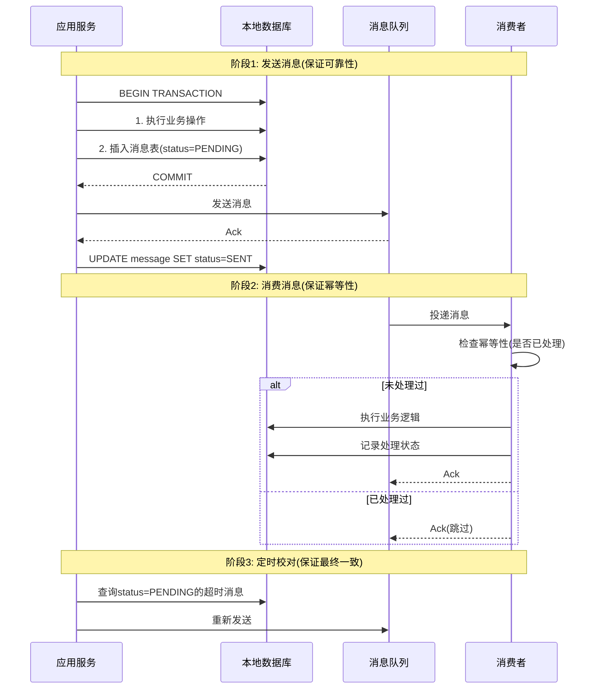

### 转账场景实现

**数据库表设计:**

```sql
-- 业务表
CREATE TABLE accounts (
    id BIGINT PRIMARY KEY,
    balance DECIMAL(10,2),
    frozen_balance DECIMAL(10,2) DEFAULT 0
);

-- 本地消息表
CREATE TABLE local_messages (
    id BIGINT PRIMARY KEY AUTO_INCREMENT,
    message_id VARCHAR(64) UNIQUE NOT NULL,  -- 消息唯一ID
    topic VARCHAR(100) NOT NULL,              -- 消息主题
    payload TEXT NOT NULL,                    -- 消息内容(JSON)
    status ENUM('PENDING', 'SENT', 'CONFIRMED') DEFAULT 'PENDING',
    retry_count INT DEFAULT 0,                -- 重试次数
    created_at TIMESTAMP DEFAULT CURRENT_TIMESTAMP,
    updated_at TIMESTAMP DEFAULT CURRENT_TIMESTAMP ON UPDATE CURRENT_TIMESTAMP,
    INDEX idx_status_created (status, created_at)
);

-- 消费端幂等表
CREATE TABLE consumed_messages (
    message_id VARCHAR(64) PRIMARY KEY,
    consumed_at TIMESTAMP DEFAULT CURRENT_TIMESTAMP,
    UNIQUE KEY uk_message (message_id)
);
```

**生产者实现:**

```python
class TransferService:
    def __init__(self, db, mq_producer, message_repo):
        self.db = db
        self.mq_producer = mq_producer
        self.message_repo = message_repo
    
    def transfer(self, from_account, to_account, amount):
        """转账服务"""
        message_id = generate_uuid()
        
        # 阶段1: 本地事务(业务操作 + 消息落库)
        with self.db.transaction():
            # 1.1 扣除A账户余额
            self.db.execute(
                "UPDATE accounts SET balance = balance - %s WHERE id = %s AND balance >= %s",
                (amount, from_account, amount)
            )
            
            # 1.2 插入本地消息表
            self.message_repo.insert({
                'message_id': message_id,
                'topic': 'account.transfer',
                'payload': json.dumps({
                    'from': from_account,
                    'to': to_account,
                    'amount': str(amount)
                }),
                'status': 'PENDING'
            })
        
        # 阶段2: 发送消息到MQ
        try:
            self.mq_producer.send('account.transfer', {
                'message_id': message_id,
                'data': {
                    'from': from_account,
                    'to': to_account,
                    'amount': amount
                }
            })
            
            # 阶段3: 更新消息状态为SENT
            self.message_repo.update_status(message_id, 'SENT')
            
        except Exception as e:
            log.error(f"Send message failed: {e}")
            # 消息仍为PENDING状态,定时任务会重试
    
    def retry_pending_messages(self):
        """定时任务: 重试PENDING状态的消息"""
        pending_messages = self.message_repo.find_pending(timeout_minutes=5)
        
        for msg in pending_messages:
            if msg['retry_count'] >= 3:
                log.error(f"Message {msg['message_id']} retry exceeded")
                continue
            
            try:
                self.mq_producer.send(msg['topic'], json.loads(msg['payload']))
                self.message_repo.update_status(msg['message_id'], 'SENT')
                self.message_repo.increment_retry(msg['message_id'])
            except Exception as e:
                log.error(f"Retry failed: {e}")
```

**消费者实现:**

```python
class TransferConsumer:
    def __init__(self, db, consumed_repo):
        self.db = db
        self.consumed_repo = consumed_repo
    
    def on_message(self, message):
        """消费转账消息"""
        message_id = message['message_id']
        data = message['data']
        
        # 幂等性检查
        if self.consumed_repo.exists(message_id):
            log.info(f"Message {message_id} already consumed, skip")
            return
        
        try:
            # 执行业务逻辑
            with self.db.transaction():
                # 增加B账户余额
                self.db.execute(
                    "UPDATE accounts SET balance = balance + %s WHERE id = %s",
                    (data['amount'], data['to'])
                )
                
                # 记录消费状态(幂等)
                self.consumed_repo.insert(message_id)
            
            log.info(f"Message {message_id} consumed successfully")
            
        except Exception as e:
            log.error(f"Consume message {message_id} failed: {e}")
            raise  # 抛出异常,MQ会重试
```

### 优势与劣势

**优势:**
- ✅ 实现相对简单,技术门槛低
- ✅ 基于成熟的消息队列(RocketMQ、Kafka)
- ✅ 最终一致性,可用性高
- ✅ 解耦生产者和消费者

**劣势:**
- ❌ 只能保证最终一致性,有短暂不一致窗口
- ❌ 需处理消息重复(幂等性)
- ❌ 需定时校对任务,增加复杂度
- ❌ 不支持实时回滚,补偿困难

**适用场景:**
- ✅ 对实时一致性要求不高(秒级/分钟级可接受)
- ✅ 业务流程单向推进(无需回滚)
- ✅ 事件驱动架构(如订单创建→发送通知)
- ❌ 不适合需要即时回滚的场景

## Saga:长事务的解决方案

### 什么是Saga?

Saga模式将长事务拆分为多个**短事务**,每个短事务都有对应的**补偿操作**。如果某步失败,则逆向执行补偿操作,逐步回滚。

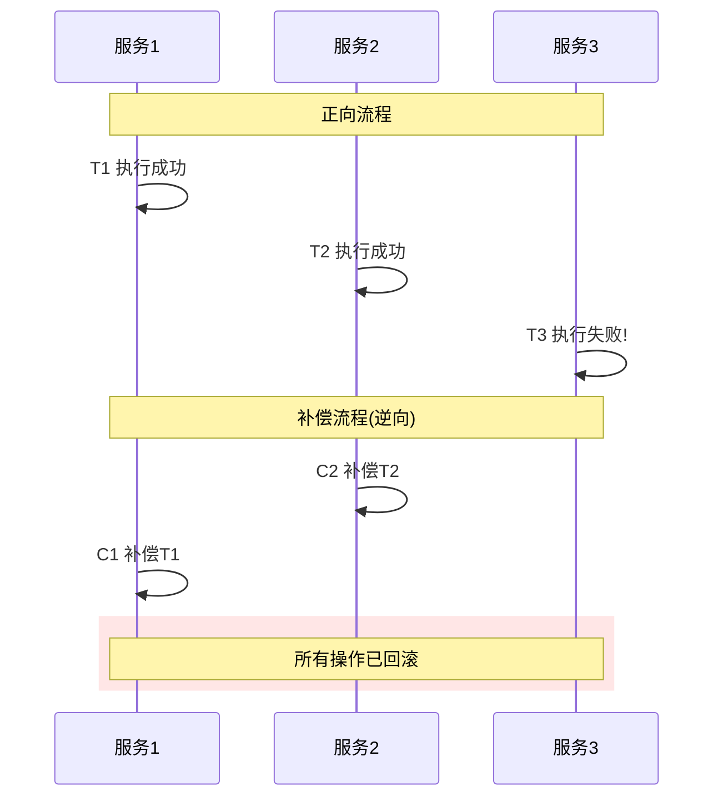

**与TCC的区别:**

| 维度 | TCC | Saga |
|------|-----|------|
| **执行时机** | Try阶段预留,Confirm才执行 | 每步立即执行 |
| **隔离性** | 较好(资源预留) | 较差(中间状态可见) |
| **回滚方式** | Cancel释放预留 | 补偿操作逆向执行 |
| **适用场景** | 短事务,资源可控 | 长事务,业务流程复杂 |

### 电商下单Saga实现

**业务流程:**

```
1. 创建订单(Order Service)
2. 扣减库存(Inventory Service)
3. 扣减优惠券(Coupon Service)
4. 增加积分(Point Service)
```

**补偿流程:**

```
C4. 扣减积分
C3. 返还优惠券
C2. 恢复库存
C1. 取消订单
```

**代码实现:**

```python
class OrderSagaManager:
    """Saga事务管理器"""
    
    def execute_order_saga(self, order_data):
        """执行下单Saga"""
        saga_log = self.saga_log_repo.create({
            'saga_id': generate_uuid(),
            'status': 'RUNNING',
            'steps': []
        })
        
        try:
            # Step 1: 创建订单
            order_id = self.order_service.create_order(order_data)
            self.saga_log_repo.add_step(saga_log['saga_id'], 'CREATE_ORDER', order_id)
            
            # Step 2: 扣减库存
            self.inventory_service.deduct_stock(order_data['items'])
            self.saga_log_repo.add_step(saga_log['saga_id'], 'DEDUCT_STOCK', None)
            
            # Step 3: 扣减优惠券
            if order_data.get('coupon_id'):
                self.coupon_service.use_coupon(order_data['coupon_id'])
                self.saga_log_repo.add_step(saga_log['saga_id'], 'USE_COUPON', None)
            
            # Step 4: 增加积分
            self.point_service.add_points(order_data['user_id'], order_data['points'])
            self.saga_log_repo.add_step(saga_log['saga_id'], 'ADD_POINTS', None)
            
            # 所有步骤成功
            self.saga_log_repo.update_status(saga_log['saga_id'], 'COMPLETED')
            return order_id
            
        except Exception as e:
            log.error(f"Saga execution failed: {e}")
            
            # 执行补偿
            self.compensate(saga_log['saga_id'])
            raise
    
    def compensate(self, saga_id):
        """补偿回滚"""
        saga_log = self.saga_log_repo.get(saga_id)
        steps = reversed(saga_log['steps'])  # 逆向执行
        
        for step in steps:
            try:
                if step['action'] == 'ADD_POINTS':
                    self.point_service.deduct_points(...)
                
                elif step['action'] == 'USE_COUPON':
                    self.coupon_service.restore_coupon(...)
                
                elif step['action'] == 'DEDUCT_STOCK':
                    self.inventory_service.restore_stock(...)
                
                elif step['action'] == 'CREATE_ORDER':
                    self.order_service.cancel_order(step['business_id'])
                
                self.saga_log_repo.update_step_status(saga_id, step['id'], 'COMPENSATED')
                
            except Exception as e:
                log.error(f"Compensation failed for step {step['id']}: {e}")
                # 补偿失败需人工介入
                self.saga_log_repo.update_step_status(saga_id, step['id'], 'COMPENSATION_FAILED')
                send_alert(f"Saga compensation failed: {saga_id}")
```

### Saga的两种编排模式

**模式1: 协同式Saga(Choreography)**

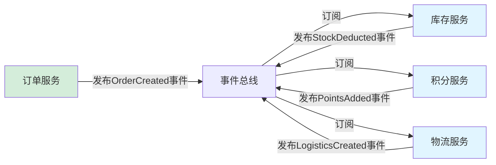

**特点:**
- 去中心化,无协调者
- 服务间通过事件通信
- 优点: 松耦合,易扩展
- 缺点: 流程不清晰,调试困难

**模式2: 编排式Saga(Orchestration)**

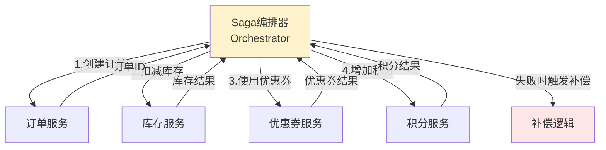

**特点:**
- 中心化控制,有明确的编排器
- 编排器调用各服务,管理状态
- 优点: 流程清晰,易于监控和重试
- 缺点: 编排器成为单点,耦合度较高

**选择建议:**

| 场景 | 推荐模式 | 原因 |
|------|---------|------|
| **简单流程(<5步)** | 协同式 | 实现简单,无需额外组件 |
| **复杂流程(>5步)** | 编排式 | 流程可视,易于管理 |
| **跨团队协作** | 编排式 | 接口契约明确 |
| **快速迭代** | 协同式 | 新增服务只需订阅事件 |

### Saga的关键挑战

**挑战1: 补偿操作的幂等性**

```python
def restore_stock(self, order_id, items):
    """恢复库存必须幂等"""
    # 检查是否已补偿
    if self.compensation_log.exists(order_id, 'RESTORE_STOCK'):
        return  # 已补偿,直接返回
    
    # 执行补偿逻辑
    for item in items:
        self.db.execute(
            "UPDATE inventory SET stock = stock + %s WHERE product_id = %s",
            (item['quantity'], item['product_id'])
        )
    
    # 记录补偿日志
    self.compensation_log.record(order_id, 'RESTORE_STOCK')
```

**挑战2: 悬挂问题**

```
场景: 补偿操作先于正向操作到达

解决: 正向操作执行前检查是否已补偿
```

```python
def deduct_stock(self, order_id, items):
    """扣减库存时检查悬挂"""
    # 检查是否已执行补偿
    if self.compensation_log.exists(order_id, 'RESTORE_STOCK'):
        raise SagaError("库存已补偿,拒绝重复扣减")
    
    # 正常扣减逻辑
    # ...
```

**挑战3: 空补偿**

```
场景: 正向操作未执行,但触发了补偿

解决: 补偿时检查正向操作是否执行,未执行则跳过
```

```python
def restore_stock(self, order_id, items):
    """处理空补偿"""
    # 检查正向操作是否执行
    if not self.forward_log.exists(order_id, 'DEDUCT_STOCK'):
        log.info(f"正向操作未执行,跳过补偿")
        return  # 空补偿,直接返回
    
    # 正常补偿逻辑
    # ...
```

**挑战4: 补偿失败**

```
补偿操作本身可能失败,需要:
1. 重试机制(指数退避)
2. 告警通知(人工介入)
3. 补偿日志(审计追踪)
```

### Saga框架推荐

**Axon Framework(Java):**

```java
@Saga
public class OrderSaga {
    
    @StartSaga
    @EventHandler
    public void handle(OrderCreatedEvent event) {
        this.orderId = event.getOrderId();
        commandGateway.send(new DeductStockCommand(event.getItems()));
    }
    
    @EventHandler
    public void handle(StockDeductedEvent event) {
        commandGateway.send(new UseCouponCommand(this.orderId));
    }
    
    @EventHandler
    public void handle(StockDeductionFailedEvent event) {
        // 触发补偿
        commandGateway.send(new CancelOrderCommand(this.orderId));
        SagaLifecycle.end();
    }
    
    @EndSaga
    @EventHandler
    public void handle(OrderCancelledEvent event) {
        // Saga结束
    }
}
```

**AWS Step Functions:**

```json
{
  "Comment": "Order Processing Saga",
  "StartAt": "CreateOrder",
  "States": {
    "CreateOrder": {
      "Type": "Task",
      "Resource": "arn:aws:lambda:...",
      "Next": "DeductStock",
      "Catch": [{
        "ErrorEquals": ["States.ALL"],
        "Next": "CompensateOrder"
      }]
    },
    "DeductStock": {
      "Type": "Task",
      "Resource": "arn:aws:lambda:...",
      "Next": "UseCoupon",
      "Catch": [{
        "ErrorEquals": ["States.ALL"],
        "Next": "CompensateStock"
      }]
    },
    "CompensateStock": {
      "Type": "Task",
      "Resource": "arn:aws:lambda:...",
      "Next": "CompensateOrder"
    },
    "CompensateOrder": {
      "Type": "Task",
      "Resource": "arn:aws:lambda:...",
      "End": true
    }
  }
}
```

**适用场景:**
- ✅ 长事务(分钟级甚至小时级)
- ✅ 业务流程复杂,多服务协作
- ✅ 允许中间状态短暂不一致
- ❌ 不适合强一致性要求的场景

## 方案对比与选型指南

### 全面对比

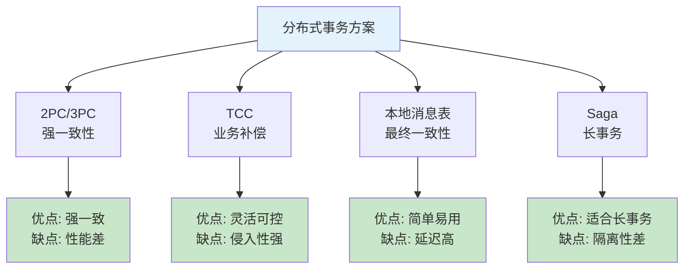

**详细对比表:**

| 维度 | 2PC/3PC | TCC | 本地消息表 | Saga |
|------|---------|-----|-----------|------|
| **一致性级别** | 强一致性 | 最终一致性 | 最终一致性 | 最终一致性 |
| **隔离性** | 强隔离 | 中等 | 弱隔离 | 弱隔离 |
| **性能** | 差 | 中等 | 好 | 好 |
| **实现复杂度** | 低 | 高 | 中 | 中高 |
| **业务侵入性** | 无 | 强 | 中 | 中 |
| **适用事务长度** | 短(秒级) | 短(秒级) | 中长(分钟级) | 长(分钟~小时) |
| **回滚能力** | 自动 | 手动补偿 | 不支持 | 手动补偿 |
| **技术成熟度** | 高 | 中 | 高 | 中 |
| **典型应用** | 金融核心 | 支付系统 | 通知、日志 | 电商下单 |

### 选型决策树

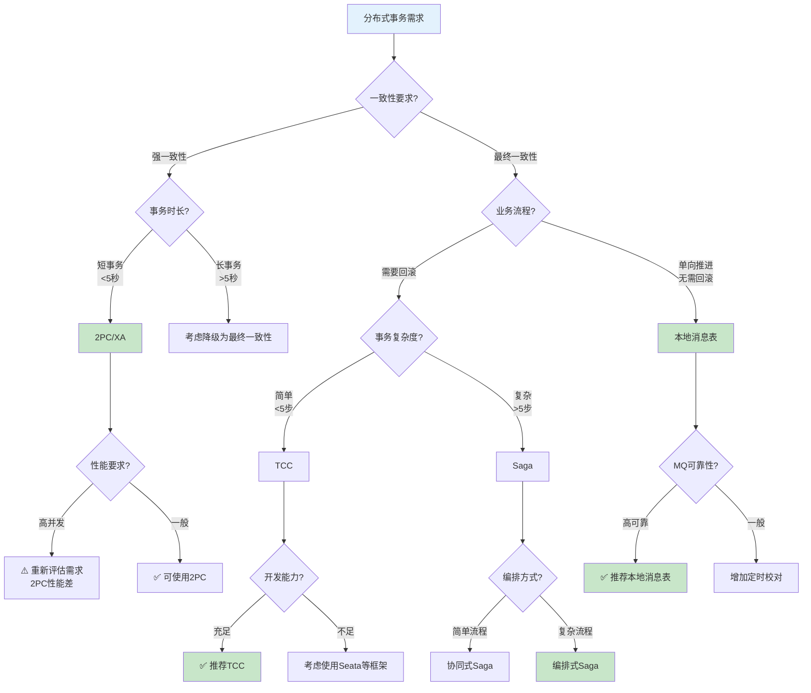

### 混合方案实践

在实际生产中,往往需要**组合多种方案**:

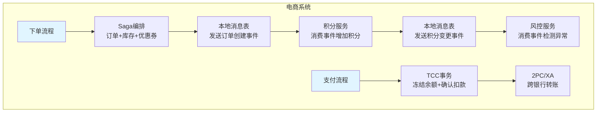

**典型案例: 电商完整链路**

| 环节 | 方案 | 原因 |
|------|------|------|
| **下单** | Saga | 长事务,多服务协作,允许短暂不一致 |
| **支付** | TCC | 资金操作,需预留资源,一致性要求高 |
| **跨行转账** | 2PC/XA | 银行系统支持XA,强一致性必需 |
| **发送通知** | 本地消息表 | 单向推进,无需回滚,最终一致性即可 |
| **数据同步** | CDC+MQ | MySQL Binlog → Kafka → ES,异步解耦 |

## 最佳实践与避坑指南

### 实践1: 优先选择最终一致性

```
除非业务明确要求强一致性,否则优先选择最终一致性方案

理由:
✓ 可用性高,不会因网络故障阻塞
✓ 性能好,无长时间锁竞争
✓ 扩展性强,易于水平扩展

现实案例:
- 支付宝转账: 最终一致性(秒级到账)
- 微信红包: 最终一致性(异步入账)
- 淘宝下单: 最终一致性(Saga补偿)
```

### 实践2: 幂等性是基石

**所有分布式操作必须幂等:**

```python
def process_with_idempotency(operation_id, data):
    """通用幂等处理模板"""
    # 1. 检查是否已处理
    if idempotency_store.exists(operation_id):
        log.info(f"Operation {operation_id} already processed")
        return idempotency_store.get_result(operation_id)
    
    try:
        # 2. 执行业务逻辑
        result = execute_business_logic(data)
        
        # 3. 记录处理结果(原子操作)
        idempotency_store.save(operation_id, result)
        
        return result
        
    except Exception as e:
        # 4. 异常时清理幂等记录(可选)
        idempotency_store.remove(operation_id)
        raise
```

**幂等键设计原则:**

| 场景 | 幂等键 | 说明 |
|------|-------|------|
| **API请求** | request_id + user_id | 防止客户端重试 |
| **消息消费** | message_id | 防止MQ重复投递 |
| **定时任务** | task_date + task_type | 防止任务重复执行 |
| **分布式事务** | transaction_id | 防止事务重复提交 |

### 实践3: 超时与重试策略

**指数退避重试:**

```python
import time
import random

def retry_with_backoff(func, max_retries=3, base_delay=1, max_delay=60):
    """带指数退避的重试"""
    for attempt in range(max_retries):
        try:
            return func()
        except Exception as e:
            if attempt == max_retries - 1:
                raise  # 最后一次重试失败,抛出异常
            
            # 计算延迟时间(指数退避 + 随机抖动)
            delay = min(base_delay * (2 ** attempt), max_delay)
            jitter = random.uniform(0, delay * 0.1)  # 10%抖动
            sleep_time = delay + jitter
            
            log.warning(f"Attempt {attempt + 1} failed: {e}. Retry in {sleep_time:.2f}s")
            time.sleep(sleep_time)
```

**超时设置建议:**

| 操作类型 | 超时时间 | 说明 |
|---------|---------|------|
| **数据库查询** | 1-3秒 | 避免慢查询拖垮系统 |
| **RPC调用** | 3-5秒 | 考虑网络延迟和服务处理时间 |
| **MQ发送** | 5-10秒 | 包含网络+Broker处理 |
| **分布式事务** | 30-60秒 | 长事务需更长超时 |

### 实践4: 监控与告警

**关键指标:**

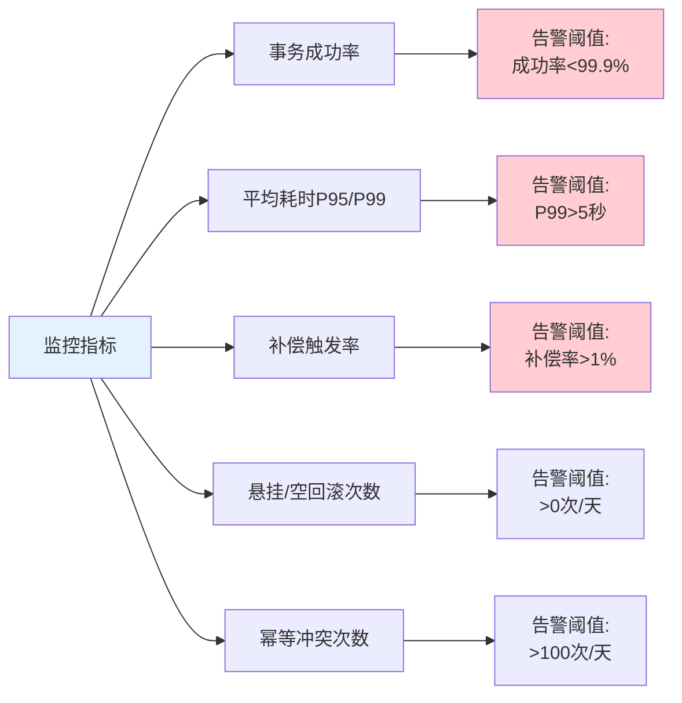

**分布式链路追踪:**

```
使用OpenTelemetry/Jaeger追踪完整事务链路:

Request ID: abc-123
├─ Order Service: create_order (50ms)
├─ Inventory Service: deduct_stock (30ms)
├─ Coupon Service: use_coupon (20ms)
└─ Point Service: add_points (15ms)

如果失败,快速定位问题节点
```

### 实践5: 降级与熔断

**事务降级策略:**

```python
def transfer_with_fallback(from_account, to_account, amount):
    """带降级的转账"""
    try:
        # 尝试TCC事务
        return tcc_transfer(from_account, to_account, amount)
    
    except TCCUnavailableError:
        log.warning("TCC unavailable, fallback to async transfer")
        
        # 降级为异步转账(本地消息表)
        async_transfer(from_account, to_account, amount)
        
        # 返回受理成功,实际到账延迟
        return {
            'status': 'ACCEPTED',
            'message': 'Transfer accepted, will be processed asynchronously',
            'estimated_arrival': 'within 5 minutes'
        }
```

**熔断器实现:**

```python
from circuitbreaker import circuit

@circuit(failure_threshold=5, recovery_timeout=60)
def call_remote_service(data):
    """远程服务调用,带熔断保护"""
    return http_post('http://service/api', data)

# 使用
try:
    result = call_remote_service(data)
except CircuitBreakerOpenError:
    log.error("Circuit breaker open, service unavailable")
    # 执行降级逻辑
    return fallback_logic(data)
```

### 常见陷阱与规避

**陷阱1: 忽略网络分区**

```
❌ 错误假设: 网络永远可靠
✅ 正确做法: 所有远程调用都要处理超时、重试、降级
```

**陷阱2: 补偿操作不幂等**

```
❌ 错误: 补偿时直接执行,不检查状态
✅ 正确: 补偿前检查是否已补偿,避免重复补偿
```

**陷阱3: 事务超时设置不合理**

```
❌ 错误: 超时时间过短(1秒)或过长(10分钟)
✅ 正确: 根据P99耗时设置,通常为P99的2-3倍
```

**陷阱4: 缺少事务日志**

```
❌ 错误: 不记录事务状态变化
✅ 正确: 完整记录Try/Confirm/Cancel或Saga各步骤状态,便于排查问题
```

**陷阱5: 测试不充分**

```
❌ 错误: 只测试正常流程
✅ 正确: 模拟各种异常场景:
- 网络超时
- 服务宕机
- 消息重复
- 补偿失败
- 时钟回拨
```

## 未来趋势:新一代分布式事务

### Service Mesh集成

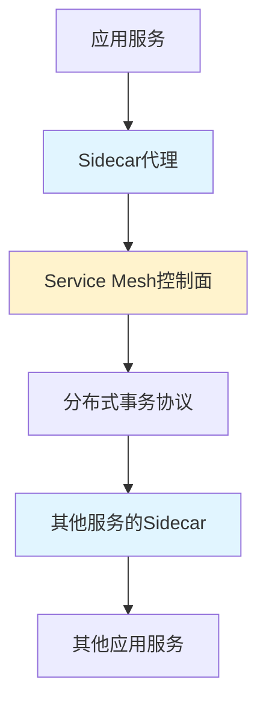

**优势:**
- 事务逻辑下沉到基础设施层
- 应用代码无侵入
- 统一的事务管理策略

**代表项目:**
- Istio + Seata Mesh
- Linkerd分布式事务插件

### Serverless事务

**AWS Step Functions + Lambda:**

```
完全托管的Saga编排:
✓ 无需维护编排器
✓ 自动重试和补偿
✓ 按执行付费
✓ 无限扩展
```

### AI辅助事务优化

```
机器学习应用于:
- 智能超时预测(基于历史数据)
- 异常检测(识别事务失败模式)
- 自动参数调优(重试次数、退避策略)
- 根因分析(快速定位失败原因)
```

## 结语:没有银弹,只有权衡

分布式事务没有完美的解决方案,每种方案都是**一致性、可用性、性能、复杂度**之间的权衡。

**核心原则:**

✅ **理解业务需求**: 不是所有场景都需要强一致性  
✅ **选择合适的方案**: 根据事务长度、一致性要求、团队能力综合选择  
✅ **幂等是基础**: 所有分布式操作必须幂等  
✅ **监控不可少**: 建立完善的监控和告警体系  
✅ **持续优化**: 根据线上数据不断调整参数和策略  

**决策清单:**

```
□ 是否真的需要分布式事务?(能否通过设计避免?)
□ 一致性要求是什么?(强一致 vs 最终一致)
□ 事务持续时间多长?(秒级 vs 分钟级 vs 小时级)
□ 是否需要回滚?(单向推进 vs 双向补偿)
□ 团队技术能力如何?(能否实现复杂的TCC/Saga?)
□ 性能要求多高?(QPS、RT指标)
□ 监控和运维能力是否匹配?
```

**记住:**

> 分布式事务的本质不是技术问题,而是**业务设计问题**。
> 
> 最好的分布式事务方案,是通过合理的业务设计,**减少甚至避免**分布式事务的需求。

---

1. 分布式事务是在微服务架构下保证跨服务数据一致性的关键技术,需在CAP定理中权衡
2. 2PC提供强一致性但性能差,TCC/Saga通过补偿机制实现最终一致性且更灵活
3. 本地消息表结合消息队列是实现最终一致性的简单有效方案,适用于单向业务流程
4. 幂等性、超时重试、监控告警是分布式事务实现的三大基石,缺一不可