**本文部分内容使用AI技术生成，仅供个人学习参考，内容准确性请读者自行甄别。**

## 引言：速度与智慧的极致博弈

2010年5月6日，美国股市发生"闪崩"（Flash Crash）：

- **14:42**：道指开始快速下跌
- **14:47**：5分钟内暴跌998点（-9.2%）
- **14:52**：又快速反弹回升
- **最终**：收盘仍跌3.2%，创史上最大单日盘中振幅

**罪魁祸首？** 高频交易算法的连锁反应。

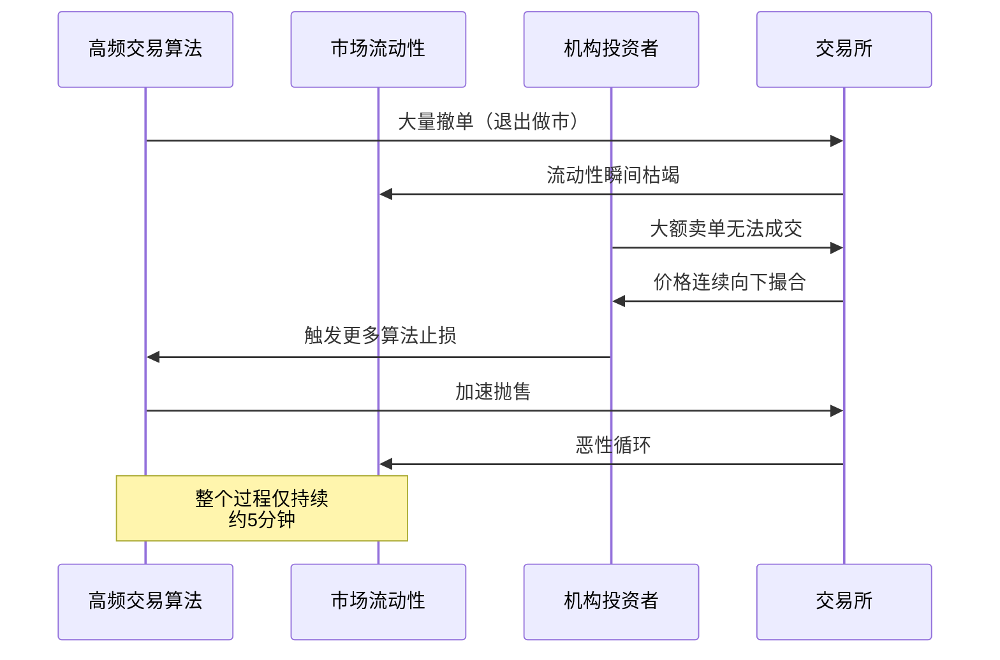
```mermaid
sequenceDiagram
    participant HFT as 高频交易算法
    participant M as 市场流动性
    participant I as 机构投资者
    participant E as 交易所
    
    HFT->>E: 大量撤单（退出做市）
    E->>M: 流动性瞬间枯竭
    I->>E: 大额卖单无法成交
    E->>I: 价格连续向下撮合
    I->>HFT: 触发更多算法止损
    HFT->>E: 加速抛售
    E->>M: 恶性循环
    
    Note over HFT,M: 整个过程仅持续<br/>约5分钟
```

这场事件让高频交易（High-Frequency Trading, HFT）进入公众视野，也引发了巨大争议：

- **批评者**："这是合法的市场操纵""用技术优势收割普通投资者"
- **支持者**："提供流动性""缩小买卖价差""提升市场效率"

**真相是什么？**

高频交易既不是恶魔，也不是圣杯。它是一种**利用速度和技术优势获取微薄利润**的交易方式，需要：

- ⚡ **极致的基础设施**：微秒级延迟、专用硬件
- 🧠 **复杂的算法**：预测短期价格变动、优化执行
- 💰 **巨大的投入**：每年数千万美元的技术成本
- 📊 **深厚的理论**：市场微观结构、排队论、随机控制

**本文将带你深入了解高频交易的世界：**

1. **市场微观结构**：理解订单如何匹配、价格如何形成
2. **HFT策略分类**：做市、套利、方向性交易的原理
3. **技术架构**：从网络拓扑到FPGA的超低延迟系统
4. **盈利模式**：如何在毫秒间积累利润
5. **风险与监管**：闪崩教训与全球监管框架
6. **未来趋势**：AI赋能、去中心化、量子计算

无论你是对量化交易感兴趣的学生，还是想深入了解市场运作的从业者，都能从中获得启发。

---

## 一、市场微观结构基础

### 1.1 什么是市场微观结构？

**定义：**

市场微观结构是研究资产在特定交易规则下如何交易、价格如何形成的学科。它关注的是市场运行的"机械细节"——订单如何提交、如何匹配、信息如何传播，以及这些过程如何影响最终的交易价格和成本。

与传统金融学关注"价格应该是什么"不同，市场微观结构研究的是"价格实际如何形成"。这一领域诞生于20世纪70年代，随着电子交易系统的普及而迅速发展，成为理解现代金融市场运作的核心理论框架。

**核心问题：**

市场微观结构主要回答以下四个维度的问题：

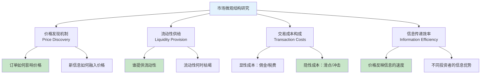
```mermaid
flowchart TD
    A[市场微观结构研究] --> B1[价格发现机制<br/>Price Discovery]
    A --> B2[流动性供给<br/>Liquidity Provision]
    A --> B3[交易成本构成<br/>Transaction Costs]
    A --> B4[信息传递效率<br/>Information Efficiency]
    
    B1 --> C1[订单如何影响价格]
    B1 --> C2[新信息如何融入价格]
    
    B2 --> C3[谁提供流动性]
    B2 --> C4[流动性何时枯竭]
    
    B3 --> C5[显性成本：佣金/税费]
    B3 --> C6[隐性成本：滑点/冲击]
    
    B4 --> C7[价格反映信息的速度]
    B4 --> C8[不同投资者的信息优势]
    
    style A fill:#e3f2fd
    style C1 fill:#c8e6c9
    style C3 fill:#c8e6c9
    style C6 fill:#c8e6c9
    style C7 fill:#c8e6c9
```

**价格发现机制**研究新信息如何通过交易行为融入价格。例如，当一家公司发布利好财报时，价格需要多长时间才能完全反映这一信息？是通过少数知情交易者的大额订单快速调整，还是通过大量小额交易逐步消化？

**流动性供给**关注谁在市场中扮演"做市商"角色，愿意随时买入或卖出。流动性的质量直接影响投资者的交易体验——在流动性充足时，大额订单可以轻松成交且冲击成本低；而在流动性枯竭时，即使是小额交易也可能导致价格大幅波动。

**交易成本构成**不仅包括可见的佣金和税费，更重要的是隐性成本：买卖价差、价格冲击、时机选择损失等。对于机构投资者而言，隐性成本往往远超显性成本，成为影响投资收益的关键因素。

**信息传递效率**衡量市场价格反映信息的速度和准确度。高效的市场能够迅速将新信息融入价格，使得基于公开信息的套利机会转瞬即逝；而低效的市场则存在信息滞后，为知情交易者提供获利空间。

**为什么HFT需要理解微观结构？**

因为HFT的利润来源正是**微观层面的低效**：

- 买卖价差的短暂扩大：当市场出现临时不平衡时，价差可能从正常的1-2个基点扩大到5-10个基点，HFT通过快速提供流动性赚取这部分额外价差
- 不同交易所的价格差异：同一股票在纽约证券交易所和纳斯达克可能存在几美分的价差，HFT通过跨市场套利捕获这些机会
- 大额订单造成的临时冲击：当养老基金需要卖出100万股时，订单本身会压低价格，HFT可以提前探测并跟随建仓
- 信息传递的微小延迟：从新闻发布到被所有市场参与者接收之间存在毫秒级的时间差，HFT利用这一窗口期抢先交易

这些机会单笔利润微薄（通常只有几分钱甚至更少），但通过极高的交易频率（每日数百万次）累积起来，形成可观的收益。理解微观结构的运作机制，是设计有效HFT策略的前提。

### 1.2 订单簿机制（Order Book）

**核心概念：**

限价订单簿是现代电子交易系统的核心数据结构，它记录了市场上所有未成交的买入和卖出订单。理解订单簿的运作机制，是分析市场微观结构的基础。

订单簿本质上是一个双向队列：买盘（Bids）按价格从高到低排列，卖盘（Asks）按价格从低到高排列。当新订单进入时，系统首先尝试与对面方向的订单匹配成交；如果无法完全成交，剩余部分则加入订单簿等待后续匹配。

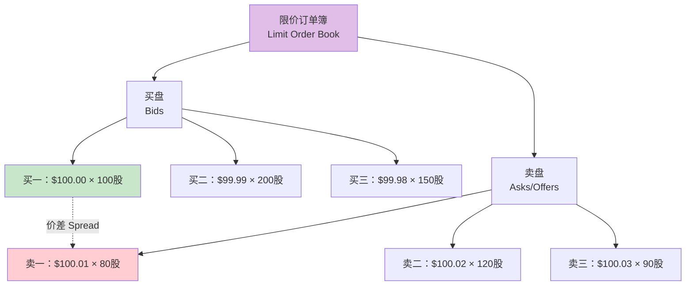
```mermaid
graph TB
    A[限价订单簿<br/>Limit Order Book] --> B1[买盘<br/>Bids]
    A --> B2[卖盘<br/>Asks/Offers]
    
    B1 --> C1[买一：$100.00 × 100股]
    B1 --> C2[买二：$99.99 × 200股]
    B1 --> C3[买三：$99.98 × 150股]
    
    B2 --> D1[卖一：$100.01 × 80股]
    B2 --> D2[卖二：$100.02 × 120股]
    B2 --> D3[卖三：$100.03 × 90股]
    
    C1 -.->|价差 Spread| D1
    
    style A fill:#e1bee7
    style C1 fill:#c8e6c9
    style D1 fill:#ffcdd2
```

在这个示例中，最优买价（买一）为100.00美元，最优卖价（卖一）为100.01美元，两者之间的差额0.01美元即为买卖价差。对于想要立即买入的投资者，需要支付100.01美元；而想要立即卖出的投资者，只能获得100.00美元。这0.01美元的价差就是即时交易的成本，也是流动性提供者（如HFT做市商）的收入来源。

**关键指标：**

订单簿的状态可以通过多个维度来衡量，每个指标都反映了市场的不同特征：

| 指标 | 计算 | 意义 |
|------|------|------|
| **买卖价差** | Ask₁ - Bid₁ | 交易成本、流动性好坏 |
| **中间价** | (Ask₁ + Bid₁) / 2 | 理论公允价值 |
| **订单簿深度** | 各价位累计数量 | 大单冲击成本 |
| **不平衡度** | (Bid Vol - Ask Vol) / Total | 短期价格压力方向 |

**买卖价差**是最直观的流动性指标。在活跃交易的蓝筹股中，价差通常只有1-2美分（约占价格的0.01%-0.02%）；而在流动性较差的小盘股或危机时刻，价差可能扩大到几美元甚至更多。HFT的竞争使得主流股票的价差持续收窄，降低了普通投资者的交易成本。

**中间价**被视为资产的"理论公允价值"，因为它消除了买卖方向的偏差。许多量化策略以中间价为基准计算收益，而非实际成交价格。

**订单簿深度**衡量的是在不同价位上累积的订单数量。深度越厚，意味着大额订单可以在不显著影响价格的情况下成交。例如，如果卖一到卖五累计有10万股，那么买入5万股的冲击成本就相对较低；反之，如果累计只有5000股，那么大额买单会迅速推高价格。

**不平衡度**反映买卖力量的对比。当买盘总量远大于卖盘时，表明市场存在向上的价格压力；反之则存在向下压力。HFT算法会实时监控这一指标，预测短期价格走向。

**订单类型：**

不同的订单类型赋予交易者不同的权利和义务，也影响其在订单簿中的行为模式：

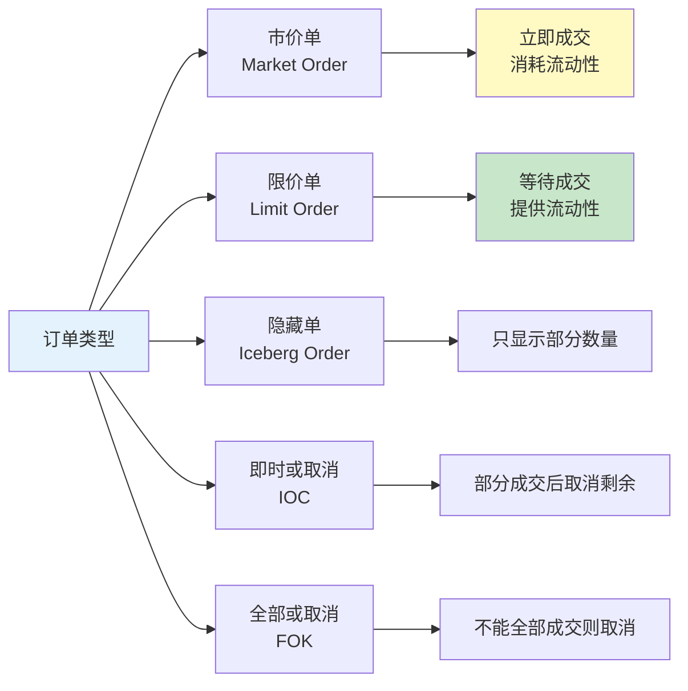
```mermaid
flowchart LR
    A[订单类型] --> B1[市价单<br/>Market Order]
    A --> B2[限价单<br/>Limit Order]
    A --> B3[隐藏单<br/>Iceberg Order]
    A --> B4[即时或取消<br/>IOC]
    A --> B5[全部或取消<br/>FOK]
    
    B1 --> C1[立即成交<br/>消耗流动性]
    B2 --> C2[等待成交<br/>提供流动性]
    B3 --> C3[只显示部分数量]
    B4 --> C4[部分成交后取消剩余]
    B5 --> C5[不能全部成交则取消]
    
    style A fill:#e3f2fd
    style C1 fill:#fff9c4
    style C2 fill:#c8e6c9
```

**市价单**要求立即以当前最优价格成交，它会"消耗"订单簿中的流动性。市价单的提交者愿意支付价差作为快速成交的代价，适合对执行速度敏感的交易场景。

**限价单**指定了最高买入价或最低卖出价，只有当市场价格达到该水平时才会成交。限价单"提供"流动性，因为它们在订单簿中等待其他交易者来匹配。HFT主要使用限价单，通过赚取价差和交易所返佣获利。

**隐藏单**（冰山订单）允许大额订单只披露部分数量，避免暴露真实意图引发市场冲击。例如，一个想买入10万股的机构可能将订单设置为每次只显示1000股，随着已显示部分被成交，系统自动补充新的1000股。这种订单类型的存在增加了市场的不透明性，也为HFT的"冰山探测"策略提供了机会。

**即时或取消**（Immediate-or-Cancel, IOC）订单要求立即成交尽可能多的数量，未成交部分自动撤销。这种订单适合希望部分执行但不愿在订单簿中留下痕迹的交易者。

**全部或取消**（Fill-or-Kill, FOK）订单要么全部成交，要么完全撤销，不允许部分执行。这种订单常用于套利策略，确保交易的完整性。

**HFT的角色：**

高频交易者在订单簿生态系统中扮演多重角色：

- **主要使用限价单**：通过在买卖两侧同时挂单，HFT赚取价差和交易所返佣。例如，在买一和卖一分别挂单，当两边都成交时，即可获得完整的价差利润
- **快速撤单**：HFT的报价寿命通常只有几毫秒到几百毫秒。一旦市场条件变化（如新信息到达、订单流不平衡），算法会立即撤销旧订单并重新报价，避免与知情交易者成交造成损失
- **分层挂单**：HFT不仅在最优价位挂单，还在第二档、第三档等多个价位提供流动性。这种策略既增加了成交概率，又通过观察各档位的成交情况获取市场信息

订单簿的动态变化本身就是一种重要的信息来源。通过分析订单提交、成交、撤销的模式，HFT可以推断出市场参与者的意图和潜在的价格压力方向。

### 1.3 价格形成机制

现代证券市场主要采用两种竞价机制：连续竞价和集合竞价。理解这两种机制的差异，对于把握交易时机和优化执行策略至关重要。

**连续竞价 vs 集合竞价：**


```mermaid
gantt
    title 两种竞价机制对比
    dateFormat HH:mm:ss
    section 连续竞价
    09:30:00 开盘      :milestone, 09:30:00, 0d
    持续撮合          :09:30:01, 3h59m58s
    13:30:00 收盘     :milestone, 13:29:59, 0d
    
    section 集合竞价
    09:15:00 开始申报  :, 09:15:00, 15m
    09:25:00 集中撮合  :crit, 09:25:00, 1m
    09:30:00 连续交易开始 :milestone, 09:30:00, 0d
```

**连续竞价**是美股、A股等主要市场在正常交易时段采用的机制。其特点是订单可以随时提交并立即尝试成交，价格随着供需关系的变化而连续波动。这种机制的优点是流动性充足、价格发现迅速，适合大多数投资者的日常交易需求。

**集合竞价**则是在特定时间点（如开盘前、收盘前）集中处理所有订单。在集合竞价阶段，系统收集所有买卖订单，但不立即成交；到达指定时间后，系统计算出一个能够最大化成交量的单一价格，所有符合条件的订单都按此价格成交。集合竞价的优点是避免了开盘时的价格剧烈波动，为市场参与者提供了更公平的初始定价机会。

从HFT的角度看，连续竞价提供了更多的交易机会和套利空间，因为价格在毫秒级别内不断变化；而集合竞价由于是一次性撮合，速度优势的作用相对较小。

**价格优先、时间优先原则：**

全球主要交易所的订单撮合都遵循两个基本原则：价格优先和时间优先。

**价格优先**意味着买单中出价高的优先成交，卖单中要价低的优先成交。这是显而易见的——买方愿意支付更高价格，自然应该优先获得商品；卖方愿意以更低价格出售，也应该优先成交。

**时间优先**则是在价格相同的情况下，先提交的订单优先成交。这一规则看似简单，却是HFT竞争的核心战场。当多个交易者都在同一价位挂单时，谁的订单排在队列前面，谁就能先成交。在极端情况下，速度快1微秒（百万分之一秒）就可能决定能否成交。

以下是一个简化的订单撮合引擎实现示例：

```python
class OrderMatchingEngine:
    def match_orders(self, new_order):
        """订单撮合引擎"""
        if new_order.side == 'BUY':
            # 买单：从最低卖价开始匹配
            while self.ask_book and new_order.quantity > 0:
                best_ask = self.ask_book[0]  # 卖一
                
                if new_order.price >= best_ask.price:
                    # 价格满足，可以成交
                    trade_qty = min(new_order.quantity, best_ask.quantity)
                    self.execute_trade(new_order, best_ask, trade_qty)
                    
                    # 更新订单簿
                    best_ask.quantity -= trade_qty
                    new_order.quantity -= trade_qty
                    
                    if best_ask.quantity == 0:
                        self.ask_book.pop(0)  # 移除已成交的卖单
                else:
                    break  # 价格不满足，加入订单簿
        
        # 将未成交部分加入订单簿
        if new_order.quantity > 0:
            self.add_to_book(new_order)
```

这段代码展示了撮合引擎的基本逻辑：当新订单进入时，系统遍历对面方向的订单簿，从最优价格开始逐一匹配，直到新订单完全成交或价格不再满足条件。实际的生产系统要复杂得多，需要处理并发、容错、监管合规等诸多问题，但核心原理与此类似。

**HFT的优势：**

在"时间优先"规则下，**速度快1微秒就可能排在前面**，优先成交。这意味着：

- 当市场价格快速变动时，HFT能够比其他投资者更早撤单，避免以不利价格成交
- 当出现套利机会时，HFT能够抢先提交订单，捕获利润
- 在做市时，HFT能够确保自己的报价处于队列前列，提高成交概率

这种速度优势的累积效应非常显著。假设某只股票每天有1000次短暂的套利机会，每次利润0.01美元，如果HFT因为速度快而能捕获其中60%的机会，而慢速竞争者只能捕获40%，那么仅这一项差异就能带来巨大的收益差距。

### 1.4 流动性与冲击成本

流动性是金融市场的生命线，它决定了资产能否以合理的价格快速转换为现金。对于机构投资者而言，流动性管理是投资组合运营中的核心挑战之一。

**流动性维度：**

流动性不是单一维度的概念，而是可以从多个角度来衡量：

| 维度 | 衡量指标 | HFT的影响 |
|------|---------|----------|
| **宽度** | 买卖价差 | HFT竞争缩小价差 |
| **深度** | 订单簿各档数量 | HFT提供浅层流动性 |
| **弹性** | 冲击后恢复速度 | HFT加速恢复 |
| **即时性** | 成交速度 | HFT显著提升 |

**宽度**指买卖价差的大小，是最直观的流动性指标。价差越窄，说明买卖双方分歧越小，交易成本越低。HFT通过激烈的做市竞争，使得主流股票的价差从过去的几个美分缩小到现在的1美分甚至更小。

**深度**衡量的是在不同价位上可交易的数量。深度越厚，大额订单可以在不显著影响价格的情况下成交。HFT通常在最优的几个价位提供流动性，但在更深层次的价位上可能缺乏供给，因此被称为"浅层流动性提供者"。

**弹性**反映的是市场受到冲击后恢复到均衡状态的速度。例如，当一个大额卖单导致价格下跌后，市场需要多长时间才能重新回到合理水平？HFT通过快速调整报价，通常能够加速这一恢复过程。

**即时性**指订单从提交到成交所需的时间。在电子化交易时代，这一指标已经从过去的几分钟缩短到现在的几毫秒甚至微秒级别，HFT是这一进步的主要推动者。

**冲击成本模型：**

当大额订单进入市场时，它不仅需要支付显性的买卖价差，还会因为自身交易行为导致价格朝不利方向移动，这部分额外成本称为"冲击成本"或"市场冲击"。

学术界和业界提出了多种冲击成本模型，其中最常用的是Almgren-Chriss模型的一个简化版本：

```
冲击成本 = k × (订单大小 / 平均成交量)^α × 波动率

其中：
- k ≈ 0.1-0.5（市场相关系数）
- α ≈ 0.5-0.7（非线性关系）
```

这个公式揭示了几点重要洞察：

1. **冲击成本与订单规模呈非线性关系**：指数α小于1，意味着订单规模翻倍时，冲击成本的增加幅度小于翻倍。这是因为大订单虽然会推动价格，但也会吸引更多流动性提供者入场。

2. **波动率放大冲击成本**：在高波动环境下，市场参与者更加谨慎，流动性供给减少，导致同样的订单产生更大的冲击。

3. **市场特征影响系数k**：不同市场的流动性状况不同。蓝筹股的k值较低（约0.1），小盘股的k值较高（可达0.5或更高）。

**示例计算：**

假设某机构需要买入10万股苹果股票，我们可以通过上述模型估算冲击成本：

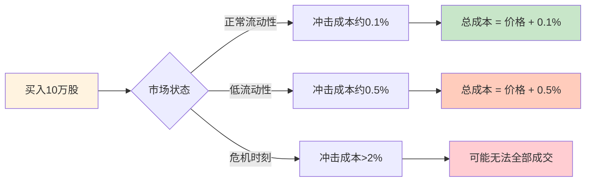
```mermaid
flowchart LR
    A[买入10万股] --> B{市场状态}
    B -->|正常流动性| C1[冲击成本约0.1%]
    B -->|低流动性| C2[冲击成本约0.5%]
    B -->|危机时刻| C3[冲击成本>2%]
    
    C1 --> D[总成本 = 价格 + 0.1%]
    C2 --> E[总成本 = 价格 + 0.5%]
    C3 --> F[可能无法全部成交]
    
    style A fill:#fff3e0
    style D fill:#c8e6c9
    style E fill:#ffccbc
    style F fill:#ffcdd2
```

在正常市场条件下，10万股苹果股票的冲击成本约为0.1%，即如果当前价格为150美元，实际平均成交价可能在150.15美元左右。而在流动性紧张或市场危机时刻，冲击成本可能飙升至2%以上，甚至出现无法全部成交的情况。

**HFT的作用：**

高频交易者对流动性的影响存在两面性：

- ✅ **正常情况下**：HFT通过持续的做市活动提供流动性，缩小买卖价差，降低普通投资者的交易成本。研究表明，HFT参与度高的股票，其价差比HFT参与度低的股票平均窄20%-30%

- ❌ **极端情况下**：当市场出现剧烈波动或不确定性时，HFT算法可能同时触发风控机制而大规模撤单，导致流动性瞬间枯竭。2010年闪崩事件就是典型案例，HFT从流动性提供者变成了流动性消耗者

这种"晴天送伞、雨天收伞"的特性，引发了监管者对HFT顺周期行为的担忧。如何在享受HFT带来的效率提升的同时，防范其在危机时刻的负面作用，成为市场监管的重要课题。

---

## 二、HFT策略分类

高频交易并非单一策略，而是一个包含多种不同逻辑和方法的策略家族。根据盈利来源和风险特征，可以将HFT策略分为以下几大类：

### 2.1 做市策略（Market Making）

做市是HFT最经典也是最重要的策略类型。做市商的核心任务是在市场上同时提供买入和卖出报价，为其他交易者创造交易机会，并从中赚取价差和交易所返佣。

**核心逻辑：**

做市策略的基本操作非常简单：在买一和卖一（或多个价位）同时挂出限价单，等待其他交易者来成交。理想情况下，做市商会先与一个卖方成交（建立多头仓位），然后很快与一个买方成交（平仓），完成一次完整的"低买高卖"循环。

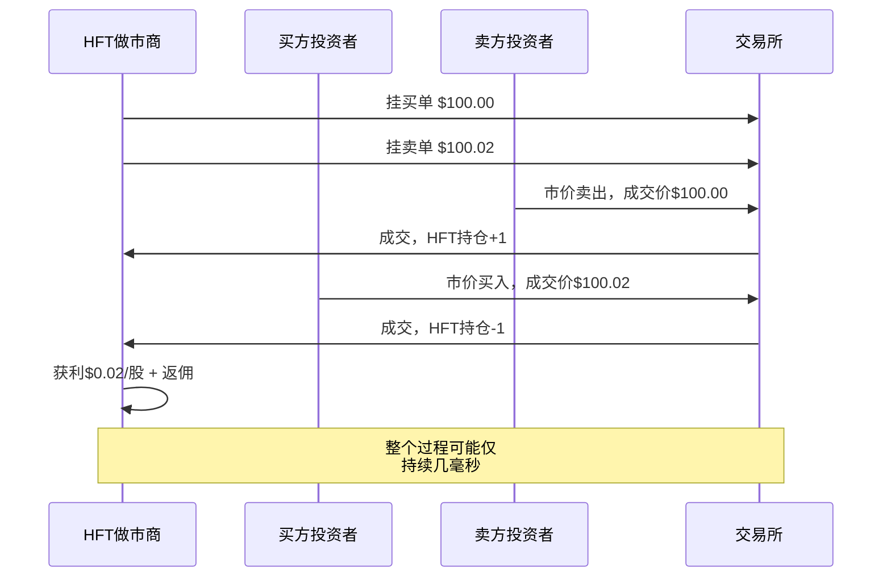
```mermaid
sequenceDiagram
    participant HFT as HFT做市商
    participant B as 买方投资者
    participant S as 卖方投资者
    participant E as 交易所
    
    HFT->>E: 挂买单 $100.00
    HFT->>E: 挂卖单 $100.02
    S->>E: 市价卖出，成交价$100.00
    E->>HFT: 成交，HFT持仓+1
    B->>E: 市价买入，成交价$100.02
    E->>HFT: 成交，HFT持仓-1
    HFT->>HFT: 获利$0.02/股 + 返佣
    
    Note over HFT,E: 整个过程可能仅<br/>持续几毫秒
```

在这个例子中，HFT做市商通过在100.00美元挂买单、100.02美元挂卖单，成功捕获了0.02美元的价差。如果每股还能获得交易所0.003美元的返佣，那么总利润就是0.023美元。虽然单笔利润微薄，但如果每天能完成数万次这样的交易，累积收益就非常可观。

**盈利来源：**

做市策略的收入来自多个渠道，不同市场环境和竞争格局下各部分的占比会有所变化：

| 来源 | 说明 | 占比 |
|------|------|------|
| **买卖价差** | Bid-Ask Spread | 40-60% |
| **交易所返佣** | Maker Rebate | 20-40% |
| **库存管理** | 低价吸筹、高价派发 | 10-20% |
| **信息优势** | 预测短期价格变动 | 5-10% |

**买卖价差**是做市商最传统的收入来源。通过同时在买卖两侧报价，做市商本质上是在向市场出售"即时性"——愿意立即交易的投资者需要支付价差作为代价。

**交易所返佣**是美国等成熟市场特有的激励机制。为了吸引流动性，交易所会对提供流动性的订单（Maker）给予返佣，对消耗流动性的订单（Taker）收取费用。这种"Maker-Taker"定价模式使得做市商即使在不赚取价差的情况下，仅靠返佣也能盈利。

**库存管理**指的是做市商通过主动调整持仓来获取额外收益。例如，当做市商持有过多股票时，可能会略微降低卖价以促进出货；当持仓不足时，可能会提高买价以吸引卖家。优秀的库存管理能力可以将原本被动的做市行为转化为主动的方向性交易。

**信息优势**来源于做市商对市场微观结构的深入观察。通过分析订单流模式、成交节奏、撤单行为等，做市商可以预测短期价格走向，从而调整报价策略。这部分收益占比不高，但体现了做市策略的技术含量。

**关键挑战：逆向选择（Adverse Selection）**

做市策略面临的最大风险是"逆向选择"，即被迫与信息优势交易者（知情交易者）成交，随后价格朝不利方向移动导致亏损。

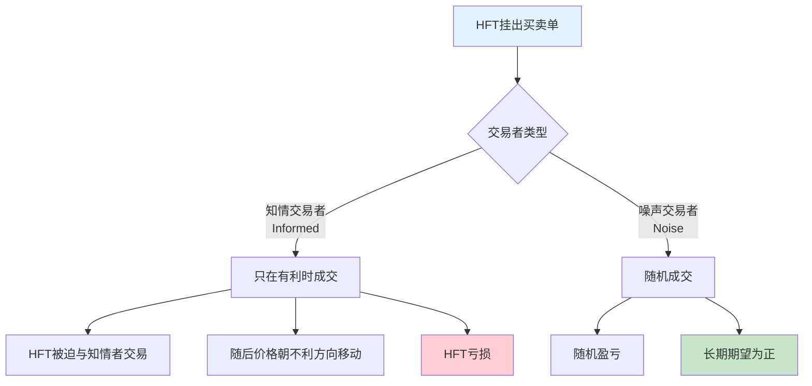
```mermaid
flowchart TD
    A[HFT挂出买卖单] --> B{交易者类型}
    
    B -->|知情交易者<br/>Informed| C1[只在有利时成交]
    B -->|噪声交易者<br/>Noise| C2[随机成交]
    
    C1 --> D1[HFT被迫与知情者交易]
    C1 --> D2[随后价格朝不利方向移动]
    C1 --> D3[HFT亏损]
    
    C2 --> E1[随机盈亏]
    C2 --> E2[长期期望为正]
    
    style A fill:#e3f2fd
    style D3 fill:#ffcdd2
    style E2 fill:#c8e6c9
```

知情交易者是指掌握未公开信息或具有更强分析能力的市场参与者。他们只会在价格对自己有利时才与做市商成交：当知道股价即将上涨时，他们会从做市商那里买入；当知道股价即将下跌时，他们会向做市商卖出。做市商在这种情况下成为了"接盘侠"，承担了损失。

相比之下，噪声交易者（普通散户、被动基金等）的交易行为相对随机，没有明显的信息优势。与噪声交易者成交，做市商的长期期望收益为正，因为他们赚取了价差和返佣，而没有承担额外的信息风险。

逆向选择问题的本质是**信息不对称**。做市商无法准确区分每一笔 incoming order 是来自知情交易者还是噪声交易者，只能通过统计规律和实时信号来推测概率，并据此调整策略。

**应对策略：**

为了降低逆向选择风险，成熟的做市商采用了多种技术和方法：

**1. 动态价差调整**

最基本的防御手段是根据市场状况动态调整报价的宽度和位置。当检测到高风险信号时，扩大价差以补偿潜在的逆向选择损失；当市场环境良好时，收窄价差以提高竞争力。

```python
def calculate_spread(volatility, inventory, order_flow_imbalance):
    """动态计算最优价差"""
    base_spread = 0.02  # 基础价差2分钱
    
    # 波动率越高，价差越大
    vol_adjustment = volatility * 0.5
    
    # 库存偏离越大，价差越大
    inventory_adjustment = abs(inventory) * 0.01
    
    # 订单流不平衡时，调整不对称价差
    if order_flow_imbalance > 0:  # 买压大
        ask_spread = base_spread + vol_adjustment + inventory_adjustment
        bid_spread = base_spread + vol_adjustment - inventory_adjustment * 0.5
    else:  # 卖压大
        ask_spread = base_spread + vol_adjustment - inventory_adjustment * 0.5
        bid_spread = base_spread + vol_adjustment + inventory_adjustment
    
    return bid_spread, ask_spread
```

这段代码展示了一个简化的价差计算逻辑。除了基础的价差外，还考虑了三个调整因子：

- **波动率调整**：市场波动越剧烈，未来价格的不确定性越高，做市商需要更宽的价差来保护自己
- **库存调整**：当做市商持有过多或多或少的仓位时，需要通过调整报价来引导市场帮助其平衡库存
- **订单流不平衡调整**：当买盘明显强于卖盘时，价格上涨的概率较大，此时做市商会提高卖价（减少卖出意愿）、降低买价（抑制买入），形成不对称的报价结构

这种动态调整机制使得做市商能够在风险和收益之间找到平衡点。

**2. 库存风险管理**

做市商在持续交易过程中会不可避免地积累持仓（库存）。如果持仓偏离目标水平过多，将面临价格波动的风险。因此，需要通过调整报价来引导市场帮助其平衡库存。

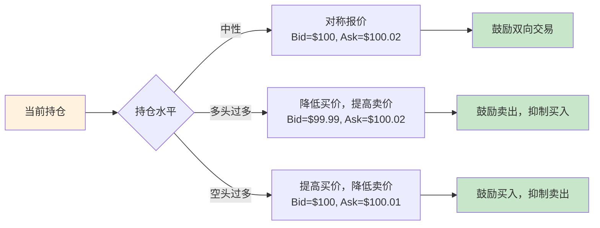
```mermaid
graph LR
    A[当前持仓] --> B{持仓水平}
    B -->|中性| C1[对称报价<br/>Bid=$100, Ask=$100.02]
    B -->|多头过多| C2[降低买价，提高卖价<br/>Bid=$99.99, Ask=$100.02]
    B -->|空头过多| C3[提高买价，降低卖价<br/>Bid=$100, Ask=$100.01]
    
    C1 --> D[鼓励双向交易]
    C2 --> E[鼓励卖出，抑制买入]
    C3 --> F[鼓励买入，抑制卖出]
    
    style A fill:#fff3e0
    style D fill:#c8e6c9
    style E fill:#c8e6c9
    style F fill:#c8e6c9
```

当持仓处于中性状态时，做市商会提供对称的报价，买卖两侧的吸引力相当。但当持有多头仓位过多时（例如已经买入了大量股票），做市商会降低买价（使得其他人不太愿意卖给它）、提高卖价（使得其他人更愿意从它那里买入），从而鼓励市场帮助其减少持仓。反之亦然。

这种库存管理机制确保了做市商不会因单边行情而积累过大风险敞口，是做市策略能够长期稳定盈利的关键。

**3. 毒性订单流检测**

除了被动调整报价外，先进的做市商还会主动识别"毒性订单流"——那些很可能来自知情交易者的订单。常见的毒性信号包括：

- **订单规模异常大**：远超该股票平均单笔成交量的订单，可能来自掌握重大信息的机构
- **成交后价格快速单边移动**：如果某笔成交后价格在几秒内持续朝一个方向移动，说明这笔订单可能具有信息优势
- **来自特定券商或地区的订单**：某些对冲基金或专业交易公司以其强大的研究能力著称，与它们成交的风险更高
- **订单提交模式异常**：例如在短时间内连续提交又撤销订单，可能是试探市场深度的行为

一旦检测到毒性订单流，做市商会立即扩大价差、减少报价数量，甚至暂时退出市场，等待风险过去。

**经典模型：Avellaneda-Stoikov模型**

在做市策略的理论研究中，Avellaneda和Stoikov于2008年提出的模型是最具影响力的成果之一。该模型通过随机控制理论，推导出了在给定市场参数和风险偏好下的最优报价策略。

模型考虑了以下关键因素：

- **库存风险**：持仓越多，面临的价格波动风险越大，需要更宽的价差补偿
- **价格波动率**：波动率越高，未来价格的不确定性越大，同样需要更宽的价差
- **订单到达率**：订单越频繁，做市商可以承受更窄的价差，因为可以通过高频交易累积利润
- **风险厌恶系数**：不同做市商对风险的态度不同，风险厌恶程度高的会要求更高的风险溢价

该模型的数学推导较为复杂，涉及随机微分方程和哈密顿-雅可比-贝尔曼方程的求解。但其核心洞察非常直观：**最优价差应该是库存风险、波动风险和流动性溢价的综合反映**。

在实际应用中，HFT公司会基于这一理论框架，结合实时市场数据和机器学习技术，构建更加精细和自适应的做市算法。

### 2.2 统计套利（Statistical Arbitrage）

统计套利是HFT的另一大类重要策略，其核心思想是利用资产之间的统计关系（如相关性、协整性）来识别短期的价格偏离，并在价格回归正常关系时获利。

**核心思想：**

统计套利基于一个基本假设：某些资产之间存在稳定的长期关系，但短期内可能由于市场噪音、流动性冲击或投资者情绪等因素而出现偏离。这种偏离提供了套利机会——做空相对高估的资产、做多相对低估的资产，等待价格关系恢复正常时平仓获利。

与传统的价值投资不同，统计套利不关心资产的"内在价值"，只关注资产之间的相对定价关系。这使得它能够应用于各种市场环境，无论整体市场是上涨还是下跌。

**常见类型：**

统计套利包含多种具体策略，以下是几种最常见的类型：

**1. 配对交易（Pairs Trading）**

配对交易是统计套利最经典的策略形式。其基本思路是找到两只历史价格走势高度相关的股票，当它们的价差（或价格比率）偏离历史正常范围时，进行反向交易。

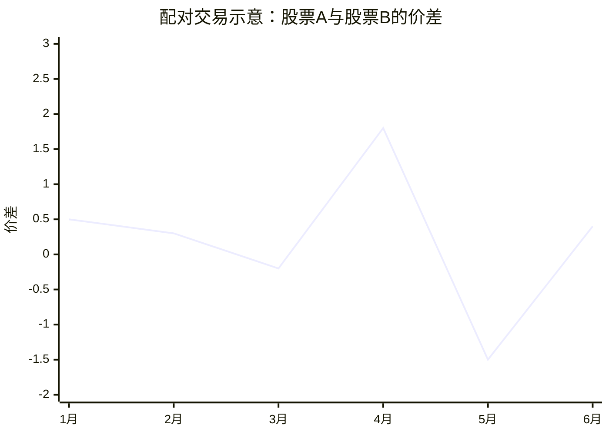
```mermaid
xychart-beta
    title "配对交易示意：股票A与股票B的价差"
    x-axis ["1月", "2月", "3月", "4月", "5月", "6月"]
    y-axis "价差" -2 --> 3
    line [0.5, 0.3, -0.2, 1.8, -1.5, 0.4]
```

在这个示例中，横轴表示时间，纵轴表示两只股票价差的Z-Score（标准化后的偏离程度）。可以看到，价差大部分时间在-1到+1之间波动，但在4月份达到了+1.8，5月份达到了-1.5，这些都是明显的异常偏离。

**交易规则：**

- 当价差超过+2个标准差时：做空股票A、做多股票B（预期价差会缩小）
- 当价差低于-2个标准差时：做多股票A、做空股票B（预期价差会扩大）
- 当价差回到±0.5以内时：平仓离场，锁定利润

*当价差超过2σ时做空高价股、做多低价股，价差回归时平仓*

这种策略的盈利逻辑基于"均值回归"原理——极端偏离通常会向平均水平回归。当然，这一假设并非永远成立，如果两只股票的基本面发生结构性变化（如一家公司被收购、另一家遭遇重大诉讼），价差可能永远不会回归，导致策略失效。

**操作流程：**

以下是配对交易策略的简化实现：

```python
class PairsTradingStrategy:
    def __init__(self, stock_a, stock_b, lookback=60, threshold=2.0):
        self.stock_a = stock_a
        self.stock_b = stock_b
        self.lookback = lookback  # 回看窗口（天数）
        self.threshold = threshold  # 开仓阈值（标准差倍数）
        
    def generate_signal(self, prices_a, prices_b):
        """生成交易信号"""
        # 1. 计算价差（使用对数价格以避免量纲影响）
        spread = np.log(prices_a) - np.log(prices_b)
        
        # 2. 计算Z-Score（标准化价差）
        mean = spread[-self.lookback:].mean()
        std = spread[-self.lookback:].std()
        z_score = (spread.iloc[-1] - mean) / std
        
        # 3. 生成信号
        if z_score > self.threshold:
            return {'action': 'SELL_A_BUY_B', 'z_score': z_score}
        elif z_score < -self.threshold:
            return {'action': 'BUY_A_SELL_B', 'z_score': z_score}
        elif abs(z_score) < 0.5:
            return {'action': 'CLOSE', 'z_score': z_score}
        else:
            return {'action': 'HOLD', 'z_score': z_score}
```

这段代码展示了配对交易的核心逻辑：

1. **计算价差**：使用对数价格之差而非绝对价格差，这样可以消除两只股票价格量纲不同的影响。例如，一只股票价格是100美元，另一只是10美元，直接相减没有意义，但对数差反映了相对变化

2. **计算Z-Score**：将当前价差与过去N天（如60天）的平均价差和标准差进行比较，得到标准化的偏离程度。Z-Score为2意味着当前价差比历史平均水平高出2个标准差

3. **生成信号**：根据Z-Score的大小决定交易行为。超过阈值时开仓，回到正常范围时平仓

实际的生产系统要复杂得多，需要考虑交易成本、滑点、仓位管理、止损机制等诸多因素。

**2. ETF套利**

ETF（交易所交易基金）是一种跟踪一篮子股票指数的金融工具。理论上，ETF的价格应该等于其成分股的净值（NAV），但由于市场摩擦和供需失衡，两者之间可能出现短暂的偏离，这就产生了套利机会。

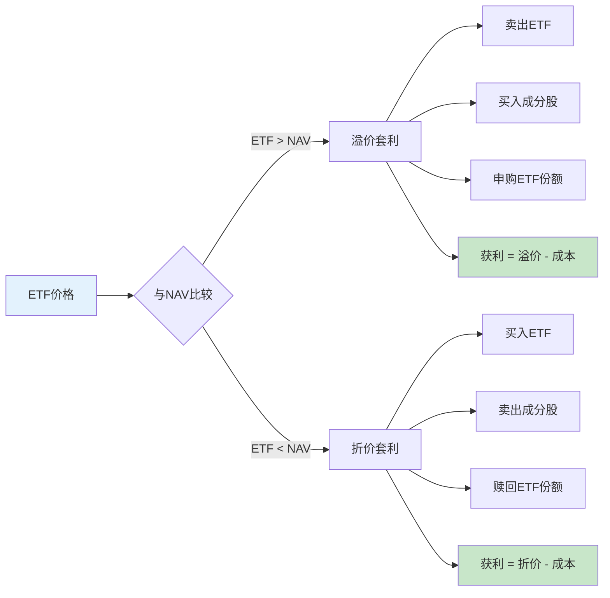
```mermaid
flowchart LR
    A[ETF价格] --> B{与NAV比较}
    B -->|ETF > NAV| C1[溢价套利]
    B -->|ETF < NAV| C2[折价套利]
    
    C1 --> D1[卖出ETF]
    C1 --> D2[买入成分股]
    C1 --> D3[申购ETF份额]
    C1 --> D4[获利 = 溢价 - 成本]
    
    C2 --> E1[买入ETF]
    C2 --> E2[卖出成分股]
    C2 --> E3[赎回ETF份额]
    C2 --> E4[获利 = 折价 - 成本]
    
    style A fill:#e3f2fd
    style D4 fill:#c8e6c9
    style E4 fill:#c8e6c9
```

**溢价套利**（ETF价格高于净值）：

当ETF的交易价格高于其成分股的总价值时，套利者可以执行以下操作：
1. 卖空ETF（在高价卖出）
2. 同时买入所有成分股（按权重配置）
3. 用这些成分股向基金公司申购新的ETF份额
4. 用新申购的ETF份额归还之前的卖空头寸
5. 获利 = ETF溢价 - 交易成本

**折价套利**（ETF价格低于净值）：

当ETF的交易价格低于其成分股的总价值时，套利者可以执行相反的操作：
1. 买入ETF（在低价买入）
2. 同时卖空所有成分股
3. 将ETF份额赎回为成分股
4. 用赎回的成分股归还卖空头寸
5. 获利 = ETF折价 - 交易成本

这种套利机制确保了ETF价格与其净值保持紧密跟踪，是ETF市场高效运作的重要保障。

**技术要求：**

ETF套利对技术和资源的要求极高：

- **极低延迟**：必须在毫秒级别内完成所有腿的交易，否则价格可能发生变化
- **同时交易能力**：需要能够同时下单交易ETF和一篮子股票（可能多达数百只）
- **精确的成本计算**：需要考虑交易费、冲击成本、借贷成本等，确保套利空间足以覆盖所有费用
- **资金充足**：需要足够的资金和信用额度来建立大规模的对冲头寸

因此，ETF套利几乎是HFT的专属领域，普通投资者很难参与。

**3. 跨期套利（Calendar Spread）**

跨期套利是利用同一商品不同到期月份的期货合约之间的价格关系进行的套利策略。

在期货市场中，同一标的资产会有多个不同到期日的合约同时交易。例如，原油期货可能有2024年6月、9月、12月到期的合约。理论上，这些合约之间应该存在合理的价差关系，主要由以下因素决定：

- **持仓成本**：包括仓储费、保险费、资金占用成本等
- **便利收益**：持有实物商品而非期货合约所带来的隐性收益
- **供需预期**：市场对未来不同时期供需状况的预期

当实际价差偏离理论合理范围时，就产生了套利机会。例如，如果近期合约相对远期合约过于便宜（可能是由于临时供应过剩），套利者可以买入近期合约、卖出远期合约，等待价差回归正常。

跨期套利的风险相对较低，因为两腿头寸相互对冲，主要暴露的是价差风险而非绝对价格风险。但需要注意的是，价差可能由于基本面变化而持续扩大或缩小，并不一定会回归历史均值，因此需要严格的风险管理。

**4. 跨市场套利（Cross-Exchange Arbitrage）**

在现代金融市场中，同一种资产可能在多个交易所同时交易。例如，苹果股票既可以在纽约证券交易所（NYSE）交易，也可以在纳斯达克（NASDAQ）交易；黄金期货既可以在芝加哥商业交易所（CME）交易，也可以在伦敦金属交易所（LME）交易。

由于信息传播需要时间，不同交易所的价格可能出现短暂的差异，这就为跨市场套利提供了机会。

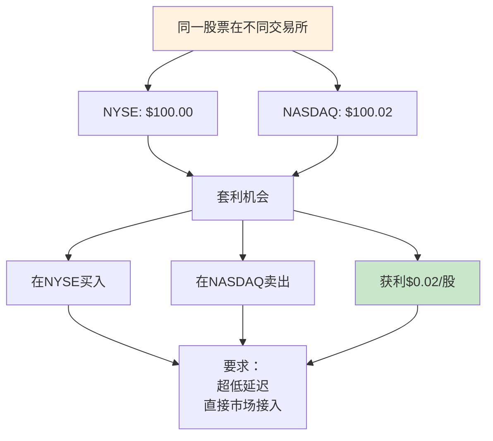
```mermaid
graph TB
    A[同一股票在不同交易所] --> B1[NYSE: $100.00]
    A --> B2[NASDAQ: $100.02]
    
    B1 --> C[套利机会]
    B2 --> C
    
    C --> D1[在NYSE买入]
    C --> D2[在NASDAQ卖出]
    C --> D3[获利$0.02/股]
    
    D1 --> E[要求：<br/>超低延迟<br/>直接市场接入]
    D2 --> E
    D3 --> E
    
    style A fill:#fff3e0
    style D3 fill:#c8e6c9
```

在这个例子中，苹果股票在NYSE的价格是100.00美元，在NASDAQ的价格是100.02美元。套利者可以在NYSE买入、在NASDAQ卖出，每股获利0.02美元。

**技术要求：**

跨市场套利对技术基础设施的要求极高：

- **超低延迟**：必须在价格差异消失之前完成两笔交易，通常需要微秒级的响应速度
- **直接市场接入**：需要与多个交易所建立直接的连接，避免通过经纪商带来的额外延迟
- **同步时钟**：需要精确的时间同步（通常使用GPS或原子钟），确保能够准确判断不同交易所的价格时序关系
- **风险管理**：需要实时监控各交易所的仓位和风险敞口，防止单边风险

由于这些高门槛，跨市场套利几乎是顶级HFT公司的专属领域。随着技术进步和竞争加剧，这类套利机会的利润空间正在不断压缩，从过去的几美分缩小到现在的几分之一美分。

### 2.5 执行算法（Execution Algorithms）

执行算法是HFT中服务于机构投资者的策略类型，其目标不是直接获利，而是帮助大型基金、养老基金等机构投资者以最低的成本执行大额订单。

**目标：**

当机构投资者需要买入或卖出大量股票时（例如100万股），如果一次性提交市价单，会立即消耗订单簿中的流动性，导致价格朝不利方向大幅移动，产生巨大的冲击成本。执行算法的核心目标就是**最小化大额订单的市场冲击成本**，同时平衡执行速度和完成度。

这是一个典型的优化问题：执行得太快，冲击成本高；执行得太慢，面临价格波动的风险（时机风险）。执行算法需要在两者之间找到最优平衡点。

**常见算法：**

根据优化目标和执行逻辑的不同，发展出了多种执行算法：

**1. TWAP（时间加权平均价格算法）**

TWAP是最简单的执行算法之一，其核心思想是将大订单均匀地拆分到整个执行时间段内，每隔固定时间提交一小笔订单。


```mermaid
gantt
    title "TWAP算法：均匀拆单"
    dateFormat HH:mm
    section 10万股拆分
    第1笔 1万股 :09:30, 30m
    第2笔 1万股 :10:00, 30m
    第3笔 1万股 :10:30, 30m
    第4笔 1万股 :11:00, 30m
    ...后续6笔 :11:30, 2h
```

在这个例子中，需要执行的10万股被均匀拆分为10笔，每笔1万股，每隔30分钟执行一笔。这样做的优点是简单透明，易于理解和监控；缺点是忽略了市场成交量的时间分布特征——在成交量低的时段（如中午）执行相同数量的订单，冲击成本会更高。

**适用场景：**

- 对执行时间有明确要求（如必须在交易日内完成）
- 希望避免被市场探测到大额订单的存在
- 对市场成交量分布没有特殊偏好

**2. VWAP（成交量加权平均价格算法）**

VWAP是更智能的执行算法，它根据历史成交量分布来安排订单执行节奏——在成交量高的时段多执行，在成交量低的时段少执行。

```python
def vwap_execution(total_quantity, historical_volume_profile):
    """基于历史成交量分布执行VWAP算法"""
    # 1. 获取历史成交量分布（按时间段）
    volume_profile = historical_volume_profile  # 如：9:30-10:00占15%
    
    # 2. 按成交量比例分配订单
    orders = []
    for time_slot, vol_pct in volume_profile.items():
        qty = total_quantity * vol_pct
        orders.append({
            'time': time_slot,
            'quantity': qty,
            'strategy': 'passive' if vol_pct < 0.1 else 'aggressive'
        })
    
    return orders
```

这段代码展示了VWAP算法的基本逻辑：

1. **获取历史成交量分布**：分析过去若干天（如20天）每个时间段的成交量占比。例如，开盘后半小时（9:30-10:00）通常成交量较大，可能占全天的15%；中午时段（12:00-13:00）成交量较小，可能只占5%

2. **按比例分配订单**：根据成交量占比来分配每个时间段应该执行的订单数量。成交量大的时段分配更多订单，成交量小的时段分配较少订单

3. **选择执行策略**：在成交量低的时段采用被动策略（挂限价单等待成交），在成交量高的时段可以采用主动策略（提交市价单确保成交）

VWAP的优势是能够更好地融入市场自然流动性，降低冲击成本。其目标是使实际成交均价接近市场的VWAP基准价格，因此得名。

**适用场景：**

- 希望跟踪市场基准价格
- 订单规模较大，需要精细控制冲击成本
- 对执行时间的灵活性较高

**3. Implementation Shortfall（实现落差算法）**

Implementation Shortfall（简称IS）是一种更加理论化的执行算法，由学术界提出并被业界广泛采用。它的目标是最小化"实现落差"——即决策时的价格与实际成交均价之间的差异。

```
目标 = 最小化(决策价格 - 实际成交均价) + λ × 执行时间
```

这个公式包含两个部分：

- **执行成本**：决策价格与实际成交均价的差异，包括价差、冲击成本、时机成本等
- **时间惩罚**：执行时间越长，面临的价格波动风险越大，因此需要加入时间惩罚项

参数λ控制了两者之间的权衡：λ越大，算法越倾向于快速执行（减少时间风险但增加冲击成本）；λ越小，算法越倾向于缓慢执行（减少冲击成本但增加时间风险）。

IS算法通常使用动态规划或随机控制理论来求解最优执行路径，会根据实时市场状况（如波动率、流动性）动态调整执行速度。

**适用场景：**

- 对成本控制要求极高的大型机构
- 愿意投入资源进行复杂算法开发和监控
- 需要在风险和成本之间精细平衡

**4. Sniper Algorithm（狙击手算法）**

狙击手算法是一种更具进攻性的执行策略，其核心思想是探测并跟随隐藏的大额订单（冰山订单），利用大单推动的价格优势获利。

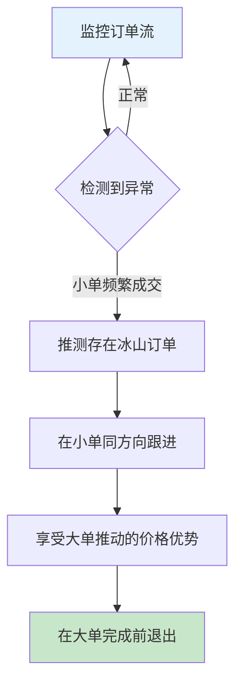
```mermaid
flowchart TD
    A[监控订单流] --> B{检测到异常}
    B -->|小单频繁成交| C[推测存在冰山订单]
    B -->|正常| A
    
    C --> D[在小单同方向跟进]
    D --> E[享受大单推动的价格优势]
    E --> F[在大单完成前退出]
    
    style A fill:#e3f2fd
    style F fill:#c8e6c9
```

工作流程如下：

1. **监控订单流**：实时监控市场上的每一笔成交，寻找异常模式
2. **检测冰山订单**：如果发现在某个价位持续有小单成交，但订单簿显示的数量并未减少，推测存在冰山订单
3. **跟随建仓**：在冰山订单的同方向建立仓位（如果冰山订单在买入，则也买入）
4. **享受价格推动**：冰山订单会持续推动价格朝有利方向移动，狙击手算法从中获利
5. **及时退出**：在冰山订单完成之前退出，避免成为最后的接盘者

这种策略的风险在于判断错误——如果所谓的"冰山订单"并不存在，或者提前撤销，狙击手算法可能遭受损失。因此需要严格的风险控制和止损机制。

**适用场景：**

- HFT公司自营交易
- 具有强大的订单流分析能力
- 能够承受一定的判断错误风险

---

## 三、HFT技术架构

如果说策略是HFT的"大脑"，那么技术架构就是HFT的"神经系统"和"肌肉组织"。在毫秒级的博弈中，技术基础设施的优劣直接决定了策略能否有效执行。

### 3.1 超低延迟系统设计

HFT系统的核心设计目标是**最小化端到端延迟**——从接收到行情数据到发出订单的总时间。这个时间越短，HFT就越能在竞争中占据优势。

**延迟预算分解：**

为了实现微秒级的延迟目标，需要对整个处理流程进行精细的拆解和优化：

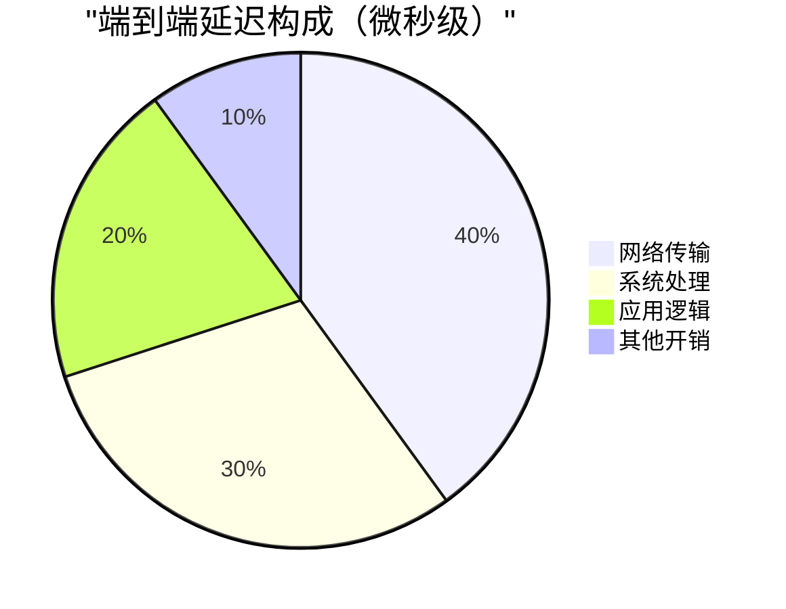
```mermaid
pie title "端到端延迟构成（微秒级）"
    "网络传输" : 40
    "系统处理" : 30
    "应用逻辑" : 20
    "其他开销" : 10
```

在一个典型的HFT系统中，端到端延迟的构成大致如下：

- **网络传输（40%）**：数据从交易所传输到HFT服务器，以及订单从HFT服务器传输回交易所的时间。这部分延迟主要取决于物理距离和网络介质（光纤、微波等）

- **系统处理（30%）**：操作系统和网络协议栈处理数据包的时间。传统的TCP/IP协议栈需要经过多层软件处理，引入显著延迟

- **应用逻辑（20%）**：HFT策略算法进行数据分析、决策生成的时间。这部分取决于算法复杂度和硬件性能

- **其他开销（10%）**：包括序列化/反序列化、内存分配、日志记录等辅助操作的开销

**优化目标：**

顶级HFT公司的端到端延迟目标是**小于10微秒**（百万分之十秒）。这意味着：

- 在10微秒内，光只能传播3公里
- 人类神经系统的反应时间约为100-300毫秒，是HFT延迟的1万到3万倍
- 即使是最高级的F1赛车手的反应时间（约200毫秒），也远远无法与HFT相比

要达到这样的极致性能，需要从硬件、软件、网络等多个层面进行系统性优化，任何一个环节的短板都会成为瓶颈。

### 3.2 硬件基础设施

硬件是HFT技术架构的物理基础，直接决定了系统的性能上限。以下是HFT公司投资最多的几个硬件领域：

**1. 托管服务（Colocation）**

托管服务是指HFT公司将自己的服务器直接放置在交易所的数据中心内，与交易所的撮合引擎物理距离极近。

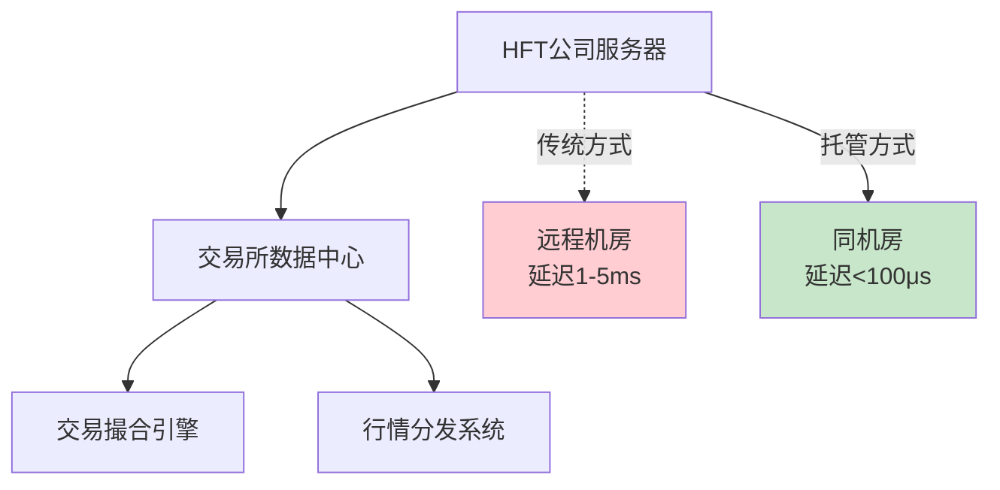
```mermaid
graph TB
    A[HFT公司服务器] --> B[交易所数据中心]
    B --> C1[交易撮合引擎]
    B --> C2[行情分发系统]
    
    A -.->|传统方式| D[远程机房<br/>延迟1-5ms]
    A -->|托管方式| E[同机房<br/>延迟<100μs]
    
    style D fill:#ffcdd2
    style E fill:#c8e6c9
```

**工作原理：**

在传统模式下，HFT公司的服务器位于几公里甚至几十公里外的远程机房，数据需要通过公共网络或专线传输到交易所。这段距离引入了1-5毫秒的网络延迟，对于HFT来说是不可接受的。

通过托管服务，HFT的服务器与交易所的撮合引擎处于同一栋建筑内，物理距离通常在几十米以内。数据通过交叉连接（Cross Connect）直接传输，延迟可以降低到100微秒以内，提升了10-50倍。

**成本：**

托管服务并非免费午餐。HFT公司需要支付高昂的费用：

- **机柜租金**：每月数千至数万美元，取决于位置和空间大小
- **电力费用**：高性能服务器耗电量大，电费不菲
- **交叉连接费**：与交易所系统直连的费用，每条连接每月数百至数千美元
- **维护费用**：需要派驻技术人员现场维护

总体来看，一家中等规模的HFT公司每年的托管成本可能在50万至200万美元之间。但对于能够从中获得速度优势的公司来说，这笔投资是值得的。

**竞争格局：**

由于交易所数据中心的空间有限，托管位置成为一种稀缺资源。顶级HFT公司通常会优先选择最靠近撮合引擎的位置，甚至为此展开激烈竞争。一些交易所还推出了"就近原则"的分配机制，先到先得。

**2. FPGA（现场可编程门阵列）**

FPGA是一种可定制的芯片技术，允许用户通过编程定义硬件电路的功能。与通用CPU不同，FPGA可以将特定的计算逻辑直接固化在硬件电路中，实现极高的处理速度和确定性的延迟。

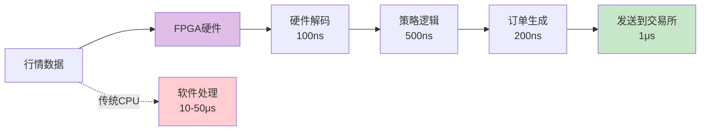
```mermaid
flowchart LR
    A[行情数据] --> B[FPGA硬件]
    B --> C1[硬件解码<br/>100ns]
    C1 --> C2[策略逻辑<br/>500ns]
    C2 --> C3[订单生成<br/>200ns]
    C3 --> D[发送到交易所<br/>1μs]
    
    A -.->|传统CPU| E[软件处理<br/>10-50μs]
    
    style B fill:#e1bee7
    style D fill:#c8e6c9
    style E fill:#ffcdd2
```

**技术优势：**

与传统CPU-based系统相比，FPGA具有以下优势：

- **速度极快**：数据处理时间从微秒级降至纳秒级（千倍提升）。在上图中，FPGA处理整个流程仅需约1微秒，而CPU需要10-50微秒

- **确定性延迟**：FPGA的硬件电路执行时间是固定的，不会像CPU那样受到操作系统调度、缓存失效等因素的影响而产生抖动（Jitter）

- **并行处理**：FPGA可以同时执行多个独立的计算任务，而CPU通常是顺序执行（尽管有多核，但单个核仍然是顺序的）

- **功耗低**：完成相同任务，FPGA的功耗通常只有CPU的十分之一

**应用场景：**

FPGA在HFT中的典型应用包括：

- **行情数据解码**：将交易所发送的二进制行情数据快速解析为可用格式
- **风险控制**：实时检查订单是否符合风控规则（如仓位限制、单笔最大金额等）
- **订单生成**：根据策略信号快速构造订单消息
- **协议编码**：将订单转换为交易所要求的二进制格式

**代表厂商：**

- **Xilinx**（现已被AMD收购）：市场领导者，产品系列丰富
- **Intel (Altera)**：另一大巨头，与Intel CPU生态整合良好
- **Lattice Semiconductor**：专注于低功耗、小规模应用

**开发挑战：**

FPGA的开发难度远高于传统软件开发：

- **编程语言**：需要使用Verilog、VHDL等硬件描述语言，或者高层次综合工具（HLS）
- **调试困难**：硬件电路的调试比软件复杂得多，需要专用工具
- **人才稀缺**：既懂金融又懂FPGA开发的工程师非常稀少，薪资高昂
- **迭代周期长**：修改硬件逻辑需要重新编译、烧录，周期以小时计，而软件修改可以即时生效

尽管如此，对于追求极致速度的HFT公司来说，FPGA仍然是不可或缺的技术。

**3. 微波/激光通信**

在网络传输层面，HFT公司不断探索更快的通信技术，以缩短数据在两地之间传播的时间。

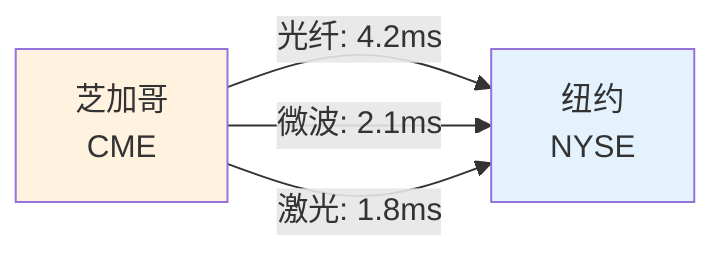
```mermaid
graph LR
    A[芝加哥<br/>CME] -->|光纤: 4.2ms| B[纽约<br/>NYSE]
    A -->|微波: 2.1ms| B
    A -->|激光: 1.8ms| B
    
    style A fill:#fff3e0
    style B fill:#e3f2fd
```

**技术对比：**

上图展示了从芝加哥（CME交易所所在地）到纽约（NYSE交易所所在地）的三种通信方式的延迟对比：

- **光纤**：目前主流的商业通信方式，信号在玻璃纤维中传播。由于光纤需要沿着既定路径铺设（避开障碍物、遵循地理条件），实际路径往往不是最短的直线。芝加哥到纽约的光纤路径约为1500公里，信号传播速度约为光速的2/3，延迟约为4.2毫秒

- **微波**：通过无线电波在空气中传播，可以沿直线传输。芝加哥到纽约的直线距离约为1200公里，信号传播速度接近光速，延迟约为2.1毫秒，比光纤快一倍

- **激光**：最新的技术，通过激光束在空气中传播。理论上可以达到更接近光速的传播速度，且可以通过精确对准实现真正的直线传输。目前实验性网络的延迟可达1.8毫秒，但受天气影响较大

**特点：**

微波和激光通信各有优缺点：

**优点：**
- 速度显著快于光纤
- 不受海底电缆路由限制
- 可以建立点对点的最短路径

**缺点：**
- 受天气影响（雨、雾、雪会导致信号衰减）
- 带宽相对较小（不如光纤）
- 建设和维护成本高
- 需要视距传输（两点之间不能有障碍物）

**提供商：**

专业的微波通信网络提供商包括：

- **McKay Brothers**：全球领先的微波网络服务商，覆盖北美、欧洲、亚洲的主要金融中心
- **Anova Technologies**：提供超低延迟网络和托管服务
- **Jump Trading**：自建微波网络，不对外提供服务

这些公司投入巨资建设微波塔网络，确保信号能够在主要金融中心之间快速传输。一座微波塔的建设成本可能高达数百万美元，但对于能够从中获得速度优势的HFT公司来说，这是必要的投资。

### 3.3 软件架构

硬件提供了性能的基础，但软件架构决定了系统能否充分发挥硬件潜力。HFT的软件系统需要在极低的延迟下完成复杂的业务逻辑，这对软件设计提出了极高的要求。

**核心组件：**

一个典型的HFT系统包含以下核心组件：

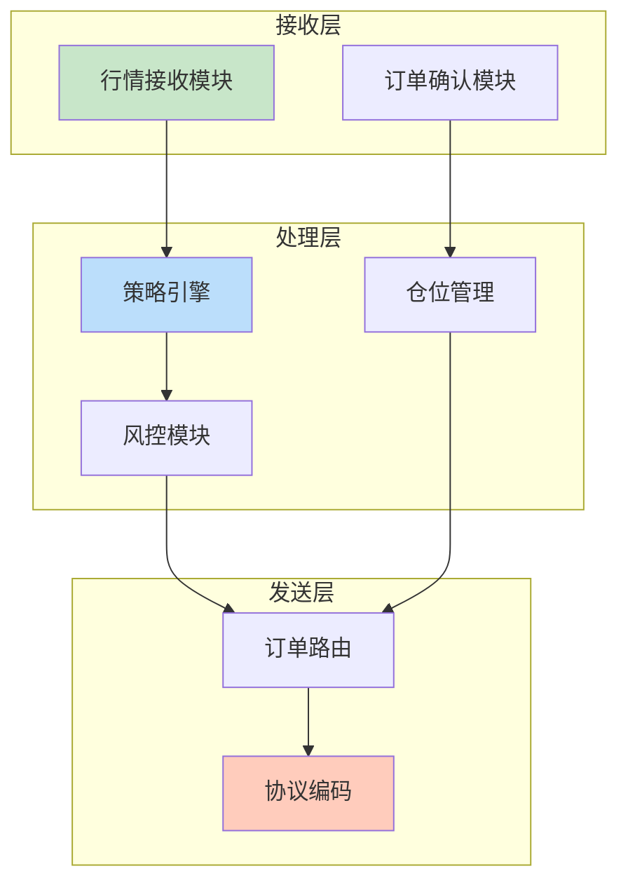
```mermaid
graph TB
    subgraph 接收层
        A1[行情接收模块]
        A2[订单确认模块]
    end
    
    subgraph 处理层
        B1[策略引擎]
        B2[风控模块]
        B3[仓位管理]
    end
    
    subgraph 发送层
        C1[订单路由]
        C2[协议编码]
    end
    
    A1 --> B1
    A2 --> B3
    B1 --> B2
    B2 --> C1
    B3 --> C1
    C1 --> C2
    
    style A1 fill:#c8e6c9
    style B1 fill:#bbdefb
    style C2 fill:#ffccbc
```

**接收层**负责与交易所通信，接收行情数据和订单确认消息。这一层的关键要求是高吞吐量和低延迟，需要能够快速解析交易所的二进制协议（如FIX协议、OUCH协议等）。

**处理层**是系统的"大脑"，包含策略引擎、风控模块和仓位管理。策略引擎根据市场行情生成交易信号；风控模块检查每笔交易是否符合风险限制；仓位管理跟踪当前的持仓状况，为策略决策提供依据。

**发送层**负责将交易指令发送给交易所。订单路由模块决定将订单发送到哪个交易所（对于跨市场交易的策略）；协议编码模块将订单转换为交易所要求的二进制格式。

**关键技术：**

为了实现微秒级的延迟，HFT软件系统采用了多种先进技术：

| 技术 | 作用 | 效果 |
|------|------|------|
| **内核旁路（Kernel Bypass）** | 绕过操作系统网络栈 | 延迟从10μs降至1μs |
| **零拷贝（Zero-Copy）** | 避免内存复制 | 减少CPU开销 |
| **内存池（Memory Pool）** | 预分配内存 | 避免动态分配的抖动 |
| **无锁数据结构** | 避免线程同步开销 | 提升并发性能 |
| **CPU亲和性** | 绑定特定CPU核心 | 减少缓存失效 |

**内核旁路（Kernel Bypass）**：

传统的网络通信需要经过操作系统的内核空间，数据包从网卡进入后，需要经过内核的网络协议栈（链路层→网络层→传输层→应用层），每层都会引入延迟。内核旁路技术允许应用程序直接访问网卡硬件，绕过内核协议栈。

常用的内核旁路技术包括：
- **Solarflare OpenOnload**：用户态TCP/IP协议栈
- **Mellanox VMA**：虚拟内存加速
- **DPDK**（Data Plane Development Kit）：英特尔开发的数据平面开发套件

这些技术可以将网络延迟从10微秒降至1微秒以内，提升了一个数量级。

**零拷贝（Zero-Copy）**：

在传统的数据处理流程中，数据需要在多个缓冲区之间复制：网卡缓冲区→内核缓冲区→用户空间缓冲区→应用缓冲区。每次复制都需要CPU参与，消耗时间和资源。

零拷贝技术通过内存映射（mmap）或直接内存访问（DMA），使得数据可以直接从网卡传输到应用缓冲区，无需中间复制。这对于处理高频行情数据尤为重要，因为每秒可能有数十万条消息需要处理。

**内存池（Memory Pool）**：

动态内存分配（如C++中的`new`或`malloc`）是一个相对耗时的操作，可能需要几微秒甚至更长时间。更重要的是，动态分配的时序是不确定的，可能因系统负载而变化，引入延迟抖动。

内存池技术在系统启动时预先分配一大块内存，并将其分割成固定大小的块。当需要内存时，直接从池中获取空闲块；使用完毕后，将块归还给池。这个过程非常快（纳秒级），且具有确定性的时序。

以下是一个简单的内存池实现示例：

```cpp
// C++示例：预分配内存池
class MemoryPool {
private:
    void* pool;
    size_t block_size;
    std::queue<void*> free_blocks;
    
public:
    MemoryPool(size_t num_blocks, size_t block_sz) {
        block_size = block_sz;
        pool = malloc(num_blocks * block_sz);
        
        // 预先分割成块
        for (int i = 0; i < num_blocks; i++) {
            free_blocks.push((char*)pool + i * block_sz);
        }
    }
    
    void* allocate() {
        if (free_blocks.empty()) {
            throw std::bad_alloc();
        }
        void* block = free_blocks.front();
        free_blocks.pop();
        return block;
    }
    
    void deallocate(void* ptr) {
        free_blocks.push(ptr);
    }
};
```

这个内存池在构造函数中一次性分配所有需要的内存，并将其组织成一个空闲块队列。`allocate()`方法从队列头部取出一个空闲块，`deallocate()`方法将使用完毕的块归还到队列。整个过程不涉及系统调用，速度极快。

**无锁数据结构**：

在多线程环境中，传统的线程同步机制（如互斥锁、信号量）会引入显著的开销和延迟抖动。当一个线程持有锁时，其他线程必须等待，这在高并发场景下会成为瓶颈。

无锁数据结构（Lock-Free Data Structures）通过原子操作（Atomic Operations）和比较交换（Compare-And-Swap, CAS）等同步原语，实现了无需显式锁的线程安全。常见的无锁数据结构包括：

- **无锁队列**：用于线程间传递消息
- **无锁哈希表**：用于快速查找
- **环形缓冲区**（Ring Buffer）：用于高效的消息传递

著名的LMAX Disruptor就是一个高性能的无锁环形缓冲区实现，被广泛应用于金融交易系统。

**CPU亲和性（CPU Affinity）**：

现代CPU有多个核心，每个核心有自己的L1/L2缓存。当线程在不同核心之间迁移时，会导致缓存失效（Cache Miss），需要重新从主内存加载数据，这会引入显著的延迟（几百纳秒）。

CPU亲和性技术通过将特定线程绑定到特定CPU核心，确保线程始终在同一个核心上运行，从而最大化缓存命中率。在Linux系统中，可以通过`taskset`命令或`sched_setaffinity()`系统调用来设置CPU亲和性。

### 3.4 网络拓扑优化

除了单机优化外，HFT公司还需要优化整个网络的拓扑结构，确保数据能够在多个交易所、多个服务器之间快速流动。

**典型架构：**

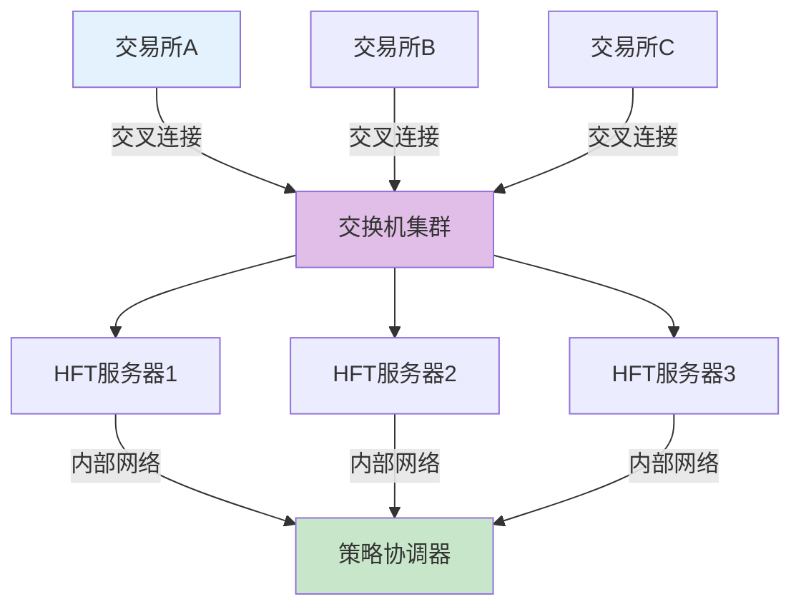
```mermaid
graph TB
    A[交易所A] -->|交叉连接| B[交换机集群]
    C[交易所B] -->|交叉连接| B
    D[交易所C] -->|交叉连接| B
    
    B --> E[HFT服务器1]
    B --> F[HFT服务器2]
    B --> G[HFT服务器3]
    
    E -->|内部网络| H[策略协调器]
    F -->|内部网络| H
    G -->|内部网络| H
    
    style A fill:#e3f2fd
    style B fill:#e1bee7
    style H fill:#c8e6c9
```

在这个架构中：

- **交易所接入层**：通过交叉连接直接与多个交易所相连，确保能够同时接收多个市场的行情和发送订单
- **交换机集群**：使用高性能的低延迟交换机（如Arista、Cisco的低延迟系列），减少数据包转发延迟
- **HFT服务器集群**：部署多台服务器，分别负责不同的策略或资产类别
- **策略协调器**：集中管理各服务器的仓位和风险，避免冲突交易

**优化要点：**

- **最短路径**：减少数据包经过的跳数（Hop Count）。每经过一个网络设备，都会引入几微秒的延迟，因此需要尽量减少中间节点
- **冗余设计**：关键路径需要有备份，防止单点故障。例如，与交易所的连接应该有主备两条线路
- **专用交换机**：HFT公司通常使用专用的低延迟交换机，而不是与其他用户共享的设备，避免资源竞争
- **网络隔离**：将行情接收网络、订单发送网络、内部管理网络物理隔离，避免相互干扰

### 3.5 监控系统

尽管HFT系统追求极致性能，但稳定性和可观测性同样重要。一个微小的Bug可能导致巨额损失（如Knight Capital事件），因此需要完善的监控系统。

**实时监控指标：**

HFT公司通常会监控以下几类指标：

| 类别 | 指标 | 告警阈值 |
|------|------|---------|
| **延迟** | 端到端延迟P99 | > 20μs |
| **吞吐量** | 每秒处理消息数 | < 预期80% |
| **错误率** | 订单拒绝率 | > 1% |
| **资源** | CPU/内存使用率 | > 85% |
| **业务** | P&L波动 | 超出VaR |

**延迟监控**是最核心的指标。系统会持续测量从接收行情到发出订单的端到端延迟，并计算P50、P95、P99等分位数。如果P99延迟超过20微秒（正常应该在10微秒以内），说明系统可能存在性能问题，需要立即排查。

**吞吐量监控**确保系统能够处理预期的消息负载。如果每秒处理的消息数突然下降，可能是网络拥塞、系统过载或外部攻击的信号。

**错误率监控**关注订单被交易所拒绝的比例。正常情况下，订单拒绝率应该接近于零。如果超过1%，说明可能存在参数错误、协议问题或合规问题。

**资源监控**跟踪CPU、内存、网络带宽等资源的使用情况。如果资源使用率持续超过85%，说明系统可能接近容量极限，需要扩容或优化。

**业务监控**关注策略的盈亏状况和风险指标。如果实际亏损超过了风险价值（VaR）的限制，系统应该自动停止交易并告警。

**可视化面板：**

为了直观地展示这些指标，HFT公司通常使用Prometheus + Grafana等技术栈构建实时监控面板：

```mermaid
graph LR
    A[实时数据流] --> B[Prometheus采集]
    B --> C[Grafana展示]
    C --> D1[延迟热力图]
    C --> D2[P&L实时曲线]
    C --> D3[订单簿快照]
    C --> D4[系统健康度]
    
    style A fill:#fff3e0
    style C fill:#e3f2fd
```

**延迟热力图**以颜色深浅表示不同时间段的延迟水平，帮助快速识别性能异常的时间点。

**P&L实时曲线**展示策略的实时盈亏状况，交易员可以直观地看到策略的表现。

**订单簿快照**定期保存订单簿的状态，用于事后分析和策略优化。

**系统健康度**综合多个指标给出一个整体的健康评分，便于快速判断系统状态。

通过这些监控手段，HFT公司能够在问题发生的早期阶段发现并解决，避免重大损失。

---

## 四、HFT盈利模式

### 4.1 收入来源拆解

```mermaid
pie title "典型HFT基金收入构成"
    "买卖价差" : 45
    "交易所返佣" : 30
    "套利收益" : 15
    "其他" : 10
```

**1. 买卖价差收入**

```
单次毛利 = 价差 × 成交量

例如：
- 价差：$0.02
- 日均成交：100万股
- 日毛利：$20,000
- 年化（252天）：$5,040,000
```

**2. 交易所返佣（Maker-Taker模型）**

```mermaid
flowchart LR
    A[订单类型] --> B[提供流动性<br/>Maker]
    A --> C[消耗流动性<br/>Taker]
    
    B --> D[获得返佣<br/>-$0.003/股]
    C --> E[支付费用<br/>+$0.003/股]
    
    style B fill:#c8e6c9
    style D fill:#c8e6c9
    style C fill:#ffccbc
    style E fill:#ffccbc
```

**HFT策略：** 主要作为Maker，赚取返佣

**3. 套利收益**

- 统计套利：年化10-20%
- 跨市场套利：年化5-15%
- ETF套利：年化3-8%

### 4.2 成本结构

**固定成本：**

| 项目 | 年成本（美元） | 说明 |
|------|--------------|------|
| **托管费** | 50万-200万 | 交易所colocation |
| **硬件设备** | 100万-500万 | FPGA、服务器、网络设备 |
| **数据费用** | 50万-100万 | Level 2/3行情、另类数据 |
| **人力成本** | 200万-1000万 | 工程师、研究员、交易员 |
| **合规与法律** | 20万-50万 | 牌照、审计、法律顾问 |

**可变成本：**

| 项目 | 计算方式 | 占比 |
|------|---------|------|
| **交易费用** | Taker费用 - Maker返佣 | 可正可负 |
| **清算费用** | 按交易量计费 | 1-2% |
| **融资成本** | 杠杆利息 | 视杠杆率而定 |

**盈亏平衡点：**

```
日均交易量需达到：5000万-1亿股

才能覆盖固定成本
```

### 4.3 盈利能力分析

**头部HFT基金表现：**

| 公司 | 年均收益 | 管理规模 | 备注 |
|------|---------|---------|------|
| **Citadel Securities** | 20-30% | 自营为主 | 美国最大做市商 |
| **Jump Trading** | 15-25% | 自营 | 专注期货和加密币 |
| **Two Sigma** | 10-20% | $600亿 | 多策略对冲基金 |
| **DE Shaw** | 12-18% | $500亿 | 量化先驱 |

**利润率：**

- **毛利率**：60-80%
- **净利率**：30-50%
- **ROE**：20-40%

**但注意：** 行业分化严重，头部效应明显

### 4.4 容量限制

**HFT策略的资金容量有限：**

```mermaid
xychart-beta
    title "策略收益随资金规模的变化"
    x-axis ["$100万", "$1000万", "$5000万", "$1亿", "$5亿"]
    y-axis "年化收益率 %" 0 --> 50
    line [45, 35, 20, 10, 3]
```

**原因：**

1. **市场冲击**：大订单影响价格
2. **流动性限制**：无法在不影响价格的情况下建立大仓位
3. **策略拥挤**：太多资金追逐相同机会

**典型容量：**

| 策略类型 | 单策略容量 | 说明 |
|---------|-----------|------|
| **做市** | $1000万-5000万 | 依赖价差和返佣 |
| **统计套利** | $5000万-2亿 | 依赖价格均值回归 |
| **延迟套利** | $1000万-3000万 | 依赖速度优势 |
| **执行算法** | $1亿-10亿 | 服务机构大单 |

---

## 五、HFT的主要风险


**1. 技术风险**

```mermaid
flowchart TD
    A[技术故障] --> B1[代码Bug]
    A --> B2[硬件故障]
    A --> B3[网络中断]
    A --> B4[数据错误]
    
    B1 --> C1[Knight Capital事件<br/>4.5亿美元损失]
    B2 --> C2[服务器宕机]
    B3 --> C3[无法撤单]
    B4 --> C4[基于错误数据交易]
    
    style A fill:#ffcdd2
    style C1 fill:#ffcdd2
```

**案例：Knight Capital（2012）**

- **原因**：部署新代码时未正确测试
- **后果**：45分钟内亏损4.5亿美元
- **结局**：公司被收购

**教训：** 严格的测试和灰度发布流程至关重要

**2. 市场风险**

| 风险类型 | 描述 | 案例 |
|---------|------|------|
| **闪崩** | 流动性瞬间枯竭 | 2010年美股闪崩 |
| **黑天鹅** | 极端市场事件 | 2020年疫情爆发 |
| **相关性崩溃** | 原本相关的资产脱钩 | 2007年量化危机 |
| **监管突变** | 政策突然改变 | 欧盟MiFID II |

**3. 模型风险**

- **过拟合**：历史表现优异，实盘失效
- **参数漂移**：市场环境变化导致参数失效
- **假设违背**：模型假设（如正态分布）不成立

**4. 操作风险**

- 人为错误（输错参数、误操作）
- 内部欺诈
- 外部攻击（黑客、DDoS）


---

## 结语：速度与智慧的平衡

高频交易是金融市场演化的产物，代表了**技术与金融的深度融合**。

**核心洞察：**

✅ **HFT不是魔法**：它是工程学、数学、计算机科学的综合应用  
✅ **速度并非唯一**：策略智慧同样重要，甚至更重要  
✅ **监管是必然**：自由市场需要规则保障公平  
✅ **持续进化**：技术、策略、监管都在不断变化  

**给从业者的建议：**

1. **打好基础**：深入理解市场微观结构理论
2. **重视工程**：延迟优化是系统工程，非单点突破
3. **风险管理**：技术风控与业务风控同等重要
4. **合规意识**：主动拥抱监管，而非对抗
5. **终身学习**：这个领域变化太快，停滞即倒退

**给观察者的提醒：**

- HFT既不是恶魔也不是救世主，它是中性的技术工具
- 理解其运作机制，才能做出理性判断
- 关注其对市场质量的真实影响，而非情绪化批评


> **对市场本质的深刻理解 + 对技术的极致追求 + 对风险的敬畏之心**

---
1. 高频交易是利用速度优势在毫秒级时间内获利的交易方式
2. 做市、套利、延迟套利是HFT的三大核心策略类型
3. FPGA、微波通信、托管服务构成HFT的技术壁垒
4. HFT面临技术、市场、模型等多重风险，监管趋严是必然趋势