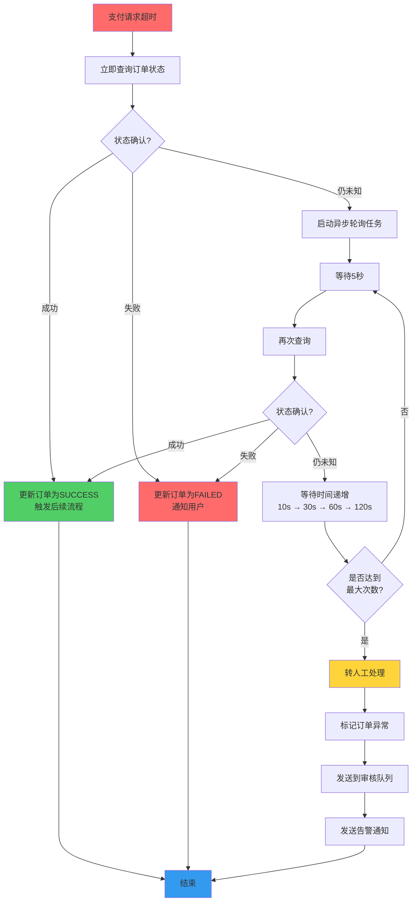
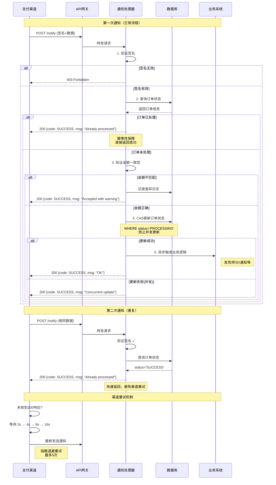
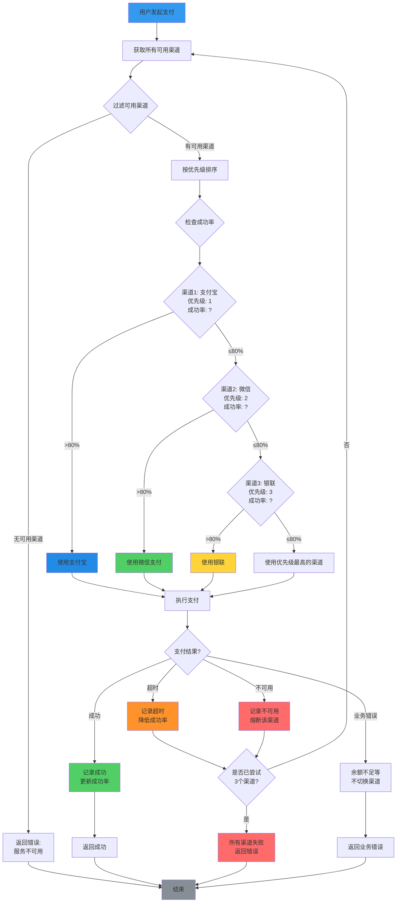
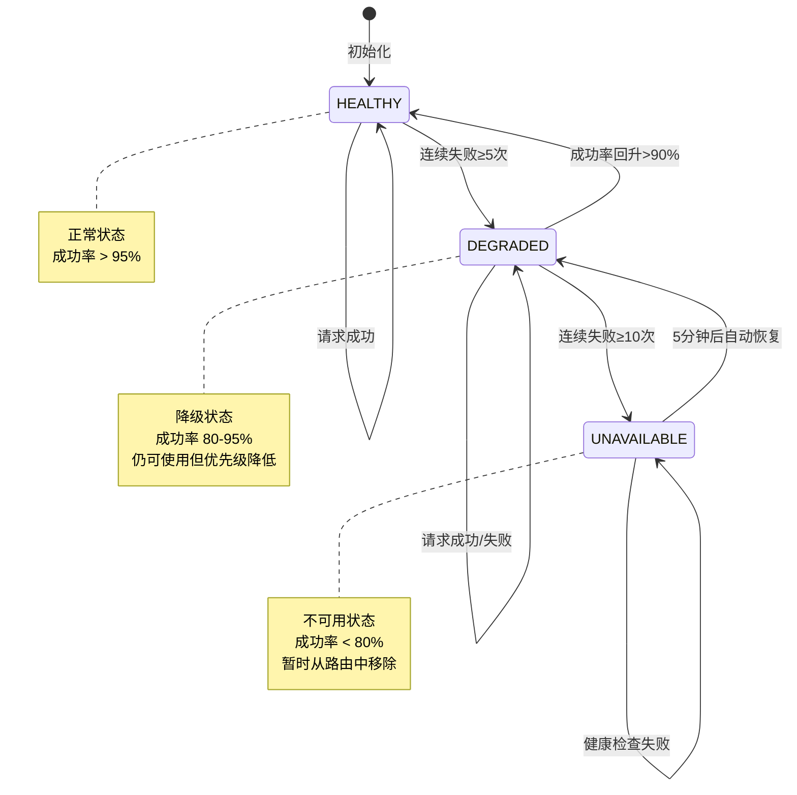
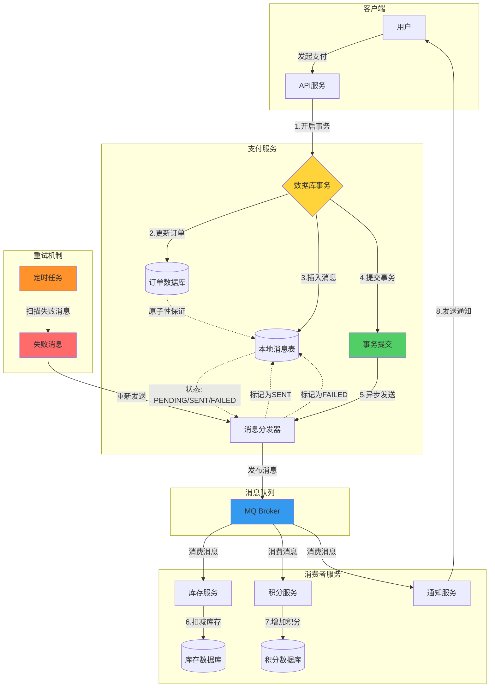
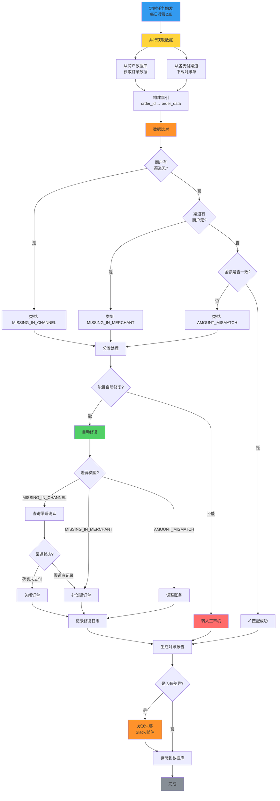
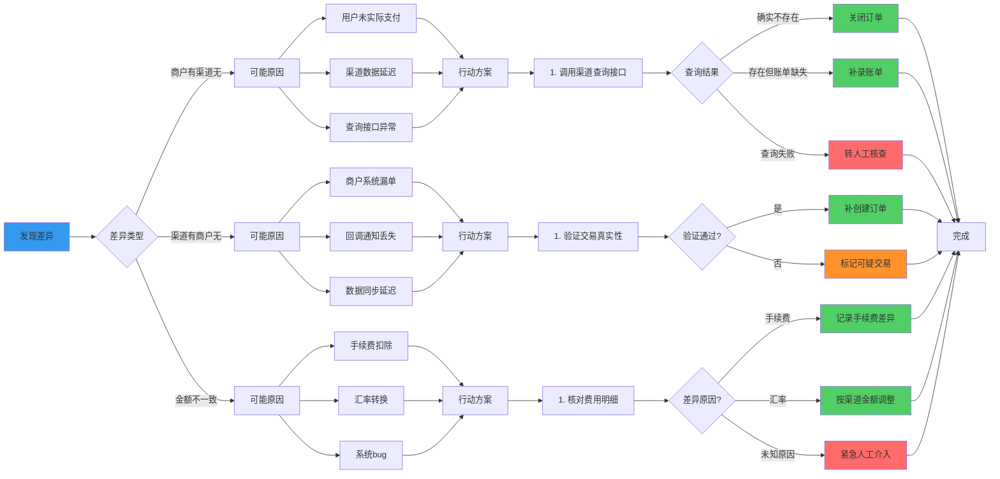

## 引言：支付异常的复杂性

在支付系统中，异常不是例外，而是常态：

```
真实世界的统计数据：
- 3-5% 的支付请求会遇到某种异常
- 0.1-0.5% 的订单需要人工介入
- 每天可能有数十种不同的错误码

关键认知：
异常处理的质量决定了支付系统的可靠性
```

**常见误区：**

```
误区1："正常流程跑通就OK"
现实：80% 的代码应该在处理异常

误区2："重试能解决所有问题"
现实：盲目重试可能导致重复扣款

误区3："异步通知很可靠"
现实：通知可能延迟、丢失、重复
```

本文将通过真实的代码示例，展示如何处理支付系统中的各种异常情况。

## 第一部分：核心异常模式

### 1.1 超时未知状态

**最危险的场景：**

在支付系统中，超时未知状态是最让工程师头疼的问题。想象这样一个场景：用户点击支付按钮后，你的系统向银行发起了扣款请求，但等待了 30 秒后接口超时返回。此时你面临一个两难困境——银行到底有没有扣款？

```
你发起了支付请求
等待 30 秒后超时
不知道银行是否扣款

此时：
- 重试？可能导致重复扣款
- 不重试？用户可能已付款但订单未更新
```

这种不确定性源于分布式系统的本质：网络调用不是原子的，可能存在"部分成功"的中间状态。银行侧可能已经完成了扣款，但在返回结果给你的过程中网络断开了；也可能银行根本没收到请求，或者收到了但因系统故障未能处理。

**为什么不能简单重试？**

如果盲目重试，可能会造成灾难性后果：用户被扣了两次款，但只生成了一笔订单。这不仅会导致用户投诉，还会引发复杂的退款流程，严重影响用户体验和公司声誉。

**为什么不能直接放弃？**

如果直接标记为失败，而实际上银行已经扣款，用户会发现钱少了但订单没生成。这种情况下，用户需要联系客服、提供支付凭证、等待人工核查，整个流程可能需要数天时间。

**处理流程：**

针对这个棘手问题，我们设计了一个多阶段的处理策略：



这个流程图展示了完整的决策路径：

**第一阶段：立即查询（同步）**
当检测到超时时，我们不立即返回错误，而是立刻调用银行的查询接口。这是因为超时可能只是响应延迟，实际交易已经成功。立即查询能在大多数情况下快速解决问题，避免不必要的等待。

**第二阶段：异步轮询（后台任务）**
如果立即查询仍然返回"处理中"或超时，说明银行侧确实还在处理这笔交易。此时我们启动一个异步轮询任务，在后台持续查询，同时立即给用户返回"支付处理中"的状态。这样做的好处是不阻塞用户界面，用户可以稍后查看订单状态。

轮询采用指数退避策略：第一次等待 5 秒，第二次 10 秒，然后 30 秒、60 秒、120 秒。这种设计基于以下考虑：
- 银行处理通常需要几秒到几分钟
- 频繁查询会给银行接口造成压力
- 随着时间推移，查询频率应该降低

**第三阶段：人工介入（兜底方案）**
如果轮询 10 次后（约 10 分钟）仍无法确定状态，系统将订单标记为异常，发送到人工审核队列，并发送告警通知运营人员。这是最后的兜底方案，确保没有任何一笔订单被遗漏。

人工客服会联系用户确认是否扣款，同时通过银行提供的对账文件进行核实。虽然这种情况很少见（通常不到 0.1%），但必须有完善的处理机制。

**完整解决方案：**

下面的代码实现了上述策略：

```python
import asyncio
import logging
from datetime import datetime, timedelta
from enum import Enum
from typing import Optional

logger = logging.getLogger(__name__)

class PaymentState(Enum):
    SUCCESS = "SUCCESS"
    FAILED = "FAILED"
    UNKNOWN = "UNKNOWN"
    PENDING = "PENDING"

class TimeoutUnknownHandler:
    """超时未知状态处理器"""
    
    def __init__(self, payment_gateway, order_repository):
        self.gateway = payment_gateway
        self.repo = order_repository
    
    async def handle_timeout(self, order_id: str) -> PaymentState:
        """
        处理超时情况
        
        策略：
        1. 立即查询订单状态
        2. 如果仍未知，启动轮询任务
        3. 设置超时保护，避免无限等待
        """
        
        logger.info(f"Payment timeout for order {order_id}, start querying")
        
        # 第一步：立即查询
        state = await self.query_order_state(order_id)
        
        if state != PaymentState.UNKNOWN:
            logger.info(f"Order {order_id} state confirmed: {state}")
            return state
        
        # 第二步：启动异步轮询
        asyncio.create_task(
            self.polling_query(order_id, max_attempts=10)
        )
        
        # 第三步：返回临时状态
        return PaymentState.PENDING
    
    async def query_order_state(self, order_id: str) -> PaymentState:
        """查询订单实际状态"""
        
        try:
            # 调用支付渠道查询接口
            response = await self.gateway.query_order(order_id)
            
            # 解析响应
            if response['status'] == 'SUCCESS':
                # 支付成功：更新订单并发货
                await self.handle_success(order_id, response)
                return PaymentState.SUCCESS
                
            elif response['status'] == 'FAILED':
                # 支付失败：更新订单并通知用户
                await self.handle_failure(order_id, response)
                return PaymentState.FAILED
                
            elif response['status'] == 'PROCESSING':
                # 仍在处理中
                return PaymentState.UNKNOWN
            
            else:
                logger.warning(f"Unknown status from gateway: {response['status']}")
                return PaymentState.UNKNOWN
        
        except GatewayTimeoutError:
            # 查询也超时了
            logger.error(f"Query timeout for order {order_id}")
            return PaymentState.UNKNOWN
        
        except GatewayError as e:
            # 网关其他错误
            logger.error(f"Gateway error: {e}")
            return PaymentState.UNKNOWN
    
    async def handle_success(self, order_id: str, response: dict):
        """处理支付成功"""
        
        # 使用事务保证原子性
        async with self.repo.transaction():
            # 1. 更新订单状态（CAS）
            updated = await self.repo.update_order_status_cas(
                order_id=order_id,
                from_status='PROCESSING',
                to_status='SUCCESS',
                transaction_no=response['transaction_no'],
                paid_at=response['paid_at']
            )
            
            if not updated:
                logger.warning(f"Order {order_id} already processed")
                return
            
            # 2. 记录支付流水
            await self.repo.save_payment_record({
                'order_id': order_id,
                'transaction_no': response['transaction_no'],
                'amount': response['amount'],
                'channel': response['channel'],
                'paid_at': response['paid_at']
            })
            
            # 3. 触发后续流程
            await self.trigger_fulfillment(order_id)
            
            # 4. 发送通知
            await self.notify_merchant(order_id, 'SUCCESS')
    
    async def polling_query(self, order_id: str, max_attempts: int):
        """轮询查询订单状态"""
        
        intervals = [5, 10, 30, 60, 120]  # 秒
        
        for attempt in range(max_attempts):
            # 计算等待时间
            if attempt < len(intervals):
                wait_time = intervals[attempt]
            else:
                wait_time = intervals[-1]
            
            logger.info(
                f"Polling attempt {attempt + 1}/{max_attempts} "
                f"for order {order_id}, wait {wait_time}s"
            )
            
            # 等待
            await asyncio.sleep(wait_time)
            
            # 查询
            state = await self.query_order_state(order_id)
            
            if state != PaymentState.UNKNOWN:
                logger.info(f"Order {order_id} resolved after {attempt + 1} attempts")
                return
        
        # 轮询结束仍未确定：转人工处理
        logger.error(f"Order {order_id} still unknown after polling")
        await self.escalate_to_manual(order_id)
    
    async def escalate_to_manual(self, order_id: str):
        """升级到人工处理"""
        
        # 1. 标记订单为异常
        await self.repo.mark_as_abnormal(order_id, reason='TIMEOUT_UNKNOWN')
        
        # 2. 发送到人工审核队列
        await send_to_review_queue({
            'order_id': order_id,
            'type': 'PAYMENT_TIMEOUT',
            'priority': 'HIGH',
            'created_at': datetime.now().isoformat()
        })
        
        # 3. 发送告警
        await send_alert(
            level='WARNING',
            message=f"Order {order_id} requires manual review",
            channel='slack'
        )
```

**关键点解析：**

这段代码体现了几个重要的设计原则：

**1. 立即查询 + 异步轮询：用户体验与系统可靠性的平衡**

当超时时，我们首先同步查询一次，如果仍无法确定状态，就启动异步轮询任务并立即返回。这种设计的精妙之处在于：
- **不阻塞主流程**：用户不需要等待漫长的轮询过程，可以快速得到"处理中"的反馈
- **后台持续跟进**：异步任务会在后台继续查询，确保最终能确定订单状态
- **资源合理利用**：使用 `asyncio.create_task` 创建协程，不会占用额外的线程资源

**2. CAS（Compare-And-Swap）更新状态：防止并发冲突**

注意 `update_order_status_cas` 方法中的关键逻辑：

```python
updated = await self.repo.update_order_status_cas(
    order_id=order_id,
    from_status='PROCESSING',  # 期望的当前状态
    to_status='SUCCESS',        # 目标状态
    ...
)
```

这个 SQL 语句实际上是这样的：

```sql
UPDATE orders 
SET status = 'SUCCESS', transaction_no = 'xxx', paid_at = NOW()
WHERE order_id = 'xxx' AND status = 'PROCESSING'
```

通过 `WHERE status = 'PROCESSING'` 条件，我们确保了：
- 如果订单已经被其他进程更新为 SUCCESS，这条 SQL 不会影响任何行（返回 updated = false）
- 避免了重复触发发货、通知等后续流程
- 即使收到多次支付成功通知，也只会处理一次

这是实现幂等性的经典模式，在分布式系统中至关重要。

**3. 指数退避轮询：给银行时间，也保护自己**

轮询间隔设置为 `[5, 10, 30, 60, 120]` 秒，而不是固定的每隔几秒查询一次，这背后有深刻的考量：

- **银行处理需要时间**：大多数支付在几秒到一分钟内完成，但也可能需要更长时间（特别是跨境支付、大额交易）
- **避免接口限流**：频繁查询可能触发银行的速率限制，导致后续查询失败
- **降低系统负载**：随着时间推移，这笔订单已经成功的概率在降低，应该减少资源投入

当所有间隔用完后，保持最后一次的间隔（120 秒），避免无限增长。

**4. 最终兜底：没有银弹，人工是最后的保障**

无论自动化程度多高，总有一些极端情况无法通过程序解决：
- 银行系统故障，查询接口也超时
- 数据不一致，银行说成功了但查不到交易号
- 网络分区，长时间无法与银行通信

这时必须有人工介入。我们的做法是：
- **标记异常**：在数据库中标记这笔订单，方便后续追踪
- **加入审核队列**：运营人员可以在管理后台看到所有待处理的异常订单
- **发送告警**：通过 Slack/邮件通知相关人员，确保及时处理

这种"自动为主，人工为辅"的策略，既保证了效率，又确保了可靠性。

### 1.2 重复通知处理

**场景：**

在分布式系统中，"至少一次"交付是常态，"恰好一次"才是例外。支付渠道的异步通知机制就是一个典型例子：为了保证商户一定能收到通知，渠道会采用重试策略，这导致同一笔订单的通知可能被推送多次。

```
支付渠道可能多次推送同一笔订单的通知：
- 网络抖动导致重传
- 商户系统响应超时
- 渠道侧重试机制

要求：无论收到多少次通知，只处理一次
```

**为什么会出现重复通知？**

从渠道的角度看，它无法确定你是否真的收到了通知。可能的情况包括：
- 通知已经到达你的服务器，但你在处理过程中崩溃了
- 你返回了成功响应，但响应在网络中丢失了
- 你的服务器处理太慢，触发了渠道的超时重试

因此，渠道会选择"宁可多推，不可漏推"的策略。作为商户，我们必须在这种不确定性中保证业务逻辑的正确性。

**核心挑战：幂等性**

幂等性（Idempotency）是指同一个操作执行多次，产生的效果与执行一次相同。在支付场景中，这意味着：
- 第一次收到通知：更新订单状态、触发发货、发送通知
- 第二次收到通知：检测到订单已处理，直接返回成功，不做任何修改
- 第 N 次收到通知：同上

如果做不到幂等性，可能会导致：
- 订单被重复发货
- 用户收到多条通知短信
- 积分被重复增加
- 统计数据错误

**通知处理时序图：**

下面的时序图展示了完整的处理流程，包括正常流程和重复通知的处理：



**实现方案详解：**

代码中的 `NotificationHandler` 类实现了完整的通知处理流程，让我们逐步分析每个关键步骤：

**第一步：验证签名（安全第一）**

```python
if not self.verify_signature(params):
    logger.warning("Invalid signature in notification")
    raise HTTPException(status_code=403, detail="Invalid signature")
```

在处理任何业务逻辑之前，必须先验证签名的合法性。这是因为：
- **防篡改**：确保通知内容在传输过程中没有被修改
- **防伪造**：确保通知确实来自支付渠道，而不是攻击者伪造的
- **早期拒绝**：如果签名无效，立即返回 403，避免后续的资源浪费

签名验证通常有两种方式：
- **RSA/RSA2**：非对称加密，安全性更高，支付宝等主流渠道采用
- **HMAC-SHA256**：对称加密，实现简单，适合内部系统

**第二步：幂等性检查（核心逻辑）**

```python
# 4.2 检查是否已处理
if order.status == 'SUCCESS':
    logger.info(f"Order {order_id} already processed, skip")
    return {"code": "SUCCESS", "message": "Already processed"}
```

这是整个函数的核心。通过检查订单当前状态，我们判断是否已经处理过这笔通知：
- 如果状态是 SUCCESS，说明之前已经处理过了，直接返回成功
- **关键点**：即使已经处理过，也要返回成功响应，否则渠道会继续重试

这里有一个容易被忽视的细节：为什么不在数据库层面通过唯一约束来保证幂等性？答案是性能考虑。数据库层面的冲突会导致异常，需要捕获和处理，而应用层的提前判断更高效、更清晰。

**第三步：金额验证（数据一致性）**

```python
if order.amount != amount:
    logger.error(f"Amount mismatch...")
    await self.repo.log_discrepancy(...)
    return {"code": "SUCCESS", "message": "Accepted with warning"}
```

金额不一致虽然罕见，但确实可能发生：
- 渠道侧的计算错误（极少）
- 汇率转换导致的精度问题
- 手续费扣除方式不同

遇到这种情况，我们的策略是：
1. **记录差异**：保存到专门的差异表，供后续对账使用
2. **仍然返回成功**：避免渠道无限重试
3. **人工核查**：由财务人员确认以哪个金额为准

这种"宽容接受，事后核查"的策略，避免了因为小问题导致整个流程阻塞。

**第四步：CAS 更新状态（并发安全）**

```python
updated = await self.repo.update_order_status_cas(
    order_id=order_id,
    from_status=order.status,  # 使用查询时的状态
    to_status='SUCCESS',
    ...
)

if not updated:
    logger.warning(f"Concurrent update for order {order_id}")
    return {"code": "SUCCESS", "message": "Concurrent update"}
```

即使在应用层做了幂等性检查，仍然可能存在并发问题：
- 两个通知几乎同时到达
- 第一个通知正在处理，第二个通知也通过了状态检查

CAS 更新通过在数据库层面加条件，确保只有一个请求能成功更新：
```sql
UPDATE orders 
SET status = 'SUCCESS', ...
WHERE order_id = 'xxx' AND status = 'PROCESSING'  -- 关键条件
```

如果另一个请求已经更新了状态，这条 SQL 的影响行数为 0，`updated` 为 false。此时我们也返回成功，因为订单最终确实是成功的，只是被其他请求处理了而已。

**第五步：异步触发业务逻辑（解耦）**

```python
# 4.5 触发业务流程
await self.trigger_business_logic(order_id)
```

订单更新成功后，需要触发一系列后续操作：
- 扣减库存
- 增加用户积分
- 发送发货通知
- 更新统计数据

这些操作不应该在通知处理的主流程中同步执行，原因有二：
1. **响应速度**：渠道期望快速收到响应，长时间处理可能触发重试
2. **故障隔离**：如果发货服务暂时不可用，不应该影响订单状态的更新

因此，最佳实践是将这些操作放入消息队列或后台任务中异步执行。

**通知重试机制（渠道侧视角）：**

理解渠道的重试策略，有助于我们更好地设计接收端。典型的_retry_策略如下：

```
# 等待后重试（指数退避）
if attempt < self.max_retries:
    wait_time = min(2 ** attempt, 300)  # 最多 5 分钟
    logger.info(f"Retry after {wait_time}s")
    await asyncio.sleep(wait_time)
```

重试间隔通常是：2s → 4s → 8s → 16s → 32s → ... → 最多 300s（5分钟）

这种指数退避的设计考虑了：
- **网络恢复需要时间**：如果是临时网络故障，给一些时间让它恢复
- **避免雪崩**：如果商户系统真的挂了，频繁重试只会加重负担
- **合理的时间窗口**：大多数情况下，10 分钟内能解决问题

**最佳实践总结：**

从商户和渠道两个角度，分别有不同的关注点：

**商户侧（接收方）：**
- ✓ **先验签再处理**：安全永远是第一位的
- ✓ **幂等性检查**：查订单状态是最可靠的判断依据
- ✓ **快速返回成功**：处理完核心逻辑后立即返回，耗时操作异步执行
- ✓ **异步处理业务逻辑**：解耦订单更新和后续流程
- ✓ **记录所有通知日志**：方便排查问题和审计

**渠道侧（发送方）：**
- ✓ **合理的重试策略**：指数退避，避免过度重试
- ✓ **逐渐增加重试间隔**：给商户系统恢复的时间
- ✓ **达到上限后停止**：避免无限重试
- ✓ **提供查询接口作为兜底**：当通知机制失效时，商户可以主动查询


### 1.3 渠道切换与降级

**场景：**

在现代支付系统中，依赖单一支付渠道是极其危险的。想象一下，如果你的系统只接入了支付宝，而某天支付宝的接口突然大规模故障（这种情况确实发生过），你的整个业务就会瘫痪。


主支付渠道（支付宝）突然不可用：
- 接口返回 503
- 响应超时
- 大量交易失败

需要：自动切换到备用渠道（微信/银联）


**为什么需要多渠道？**

多渠道策略不仅仅是为了容灾，还有以下好处：
- **提高成功率**：不同渠道在不同银行、不同时间段的表现可能差异很大
- **降低成本**：可以根据费率动态选择最经济的渠道
- **满足用户需求**：有些用户偏好微信支付，有些偏好支付宝
- **合规要求**：某些行业要求必须有多个支付通道

**智能路由的核心思想：**

智能路由不是简单的"主备切换"，而是一个动态的决策系统。它需要考虑：
1. **渠道可用性**：当前渠道是否健康
2. **历史成功率**：该渠道最近的表现如何
3. **业务规则**：金额限制、用户偏好、费率等
4. **负载均衡**：避免某个渠道过载

**智能路由决策流程：**

下面的流程图展示了完整的决策过程：



**渠道健康状态转换：**



**智能路由实现：**

```python
from enum import Enum
from typing import List, Optional
import time

class ChannelStatus(Enum):
    HEALTHY = "healthy"
    DEGRADED = "degraded"
    UNAVAILABLE = "unavailable"

class PaymentChannel:
    """支付渠道"""
    
    def __init__(self, name: str, priority: int):
        self.name = name
        self.priority = priority
        self.status = ChannelStatus.HEALTHY
        self.failure_count = 0
        self.last_failure_time = None
        self.success_rate = 1.0  # 成功率
    
    def record_success(self):
        """记录成功"""
        self.failure_count = max(0, self.failure_count - 1)
        self.update_success_rate(True)
    
    def record_failure(self):
        """记录失败"""
        self.failure_count += 1
        self.last_failure_time = time.time()
        self.update_success_rate(False)
        
        # 更新状态
        if self.failure_count >= 10:
            self.status = ChannelStatus.UNAVAILABLE
        elif self.failure_count >= 5:
            self.status = ChannelStatus.DEGRADED
    
    def update_success_rate(self, success: bool):
        """更新成功率（滑动窗口）"""
        # 简化实现：指数移动平均
        alpha = 0.1
        if success:
            self.success_rate = alpha * 1 + (1 - alpha) * self.success_rate
        else:
            self.success_rate = alpha * 0 + (1 - alpha) * self.success_rate
    
    def is_available(self) -> bool:
        """是否可用"""
        
        if self.status == ChannelStatus.UNAVAILABLE:
            # 检查是否可以恢复
            if self.last_failure_time and \
               time.time() - self.last_failure_time > 300:  # 5分钟
                self.status = ChannelStatus.DEGRADED
                self.failure_count = 0
        
        return self.status != ChannelStatus.UNAVAILABLE

class SmartRouter:
    """智能路由器"""
    
    def __init__(self):
        self.channels: List[PaymentChannel] = [
            PaymentChannel('alipay', priority=1),
            PaymentChannel('wechat', priority=2),
            PaymentChannel('unionpay', priority=3),
        ]
    
    def select_channel(self, order: PaymentOrder) -> Optional[PaymentChannel]:
        """
        选择最优渠道
        
        策略：
        1. 过滤不可用渠道
        2. 按优先级排序
        3. 考虑成功率
        4. 负载均衡
        """
        
        # 1. 过滤可用渠道
        available_channels = [
            ch for ch in self.channels 
            if ch.is_available()
        ]
        
        if not available_channels:
            logger.error("No available payment channels")
            return None
        
        # 2. 按优先级排序
        available_channels.sort(key=lambda ch: ch.priority)
        
        # 3. 考虑成功率（优先级高的成功率太低则跳过）
        for channel in available_channels:
            if channel.success_rate > 0.8:  # 成功率 > 80%
                return channel
        
        # 4. 如果都低于阈值，返回优先级最高的
        return available_channels[0]
    
    def execute_payment(self, order: PaymentOrder) -> PaymentResult:
        """执行支付（带自动切换）"""
        
        tried_channels = []
        
        for attempt in range(3):  # 最多尝试 3 个渠道
            
            # 选择渠道
            channel = self.select_channel(order)
            
            if not channel:
                raise PaymentError("No available payment channel")
            
            if channel.name in tried_channels:
                break
            
            tried_channels.append(channel.name)
            logger.info(f"Trying channel: {channel.name}")
            
            try:
                # 调用渠道
                result = channel.process_payment(order)
                
                # 记录成功
                channel.record_success()
                
                return result
            
            except ChannelTimeoutError:
                logger.warning(f"Channel {channel.name} timeout")
                channel.record_failure()
                continue
            
            except ChannelUnavailableError:
                logger.error(f"Channel {channel.name} unavailable")
                channel.record_failure()
                continue
            
            except PaymentError as e:
                # 业务错误（余额不足等），不切换渠道
                logger.info(f"Payment failed: {e}")
                raise
        
        # 所有渠道都失败
        raise PaymentError("All payment channels failed")
```

**健康检查：**

```python
class HealthChecker:
    """渠道健康检查器"""
    
    def __init__(self, router: SmartRouter):
        self.router = router
    
    async def check_all_channels(self):
        """定期检查所有渠道健康状态"""
        
        for channel in self.router.channels:
            try:
                # 发送心跳请求
                is_healthy = await self.ping_channel(channel.name)
                
                if is_healthy:
                    channel.status = ChannelStatus.HEALTHY
                    logger.info(f"Channel {channel.name} is healthy")
                else:
                    channel.status = ChannelStatus.UNAVAILABLE
                    logger.warning(f"Channel {channel.name} is unhealthy")
            
            except Exception as e:
                logger.error(f"Health check failed for {channel.name}: {e}")
                channel.status = ChannelStatus.UNAVAILABLE
    
    async def ping_channel(self, channel_name: str) -> bool:
        """ping 渠道"""
        
        try:
            response = await http_client.get(
                f"https://{channel_name}.com/api/health",
                timeout=3
            )
            return response.status_code == 200
        
        except:
            return False

# 定时任务
async def start_health_check():
    checker = HealthChecker(router)
    
    while True:
        await checker.check_all_channels()
        await asyncio.sleep(60)  # 每分钟检查一次
```

**降级策略配置：**

```yaml
# config/payment_fallback.yaml

channels:
  primary: alipay
  backups:
    - wechat
    - unionpay

circuit_breaker:
  failure_threshold: 5      # 失败 5 次熔断
  recovery_timeout: 300     # 5 分钟后尝试恢复
  half_open_max_calls: 3    # 半开状态最多 3 次调用

fallback:
  # 小额可以降级为记账
  max_degraded_amount: 100
  
  # 降级时降低风控级别
  disable_risk_check: false
  
  # 是否允许延迟到账
  allow_delayed_settlement: true
```

## 第二部分：数据一致性保障

### 2.1 分布式事务问题

**经典问题：**

在支付系统中，一笔成功的交易往往涉及多个系统的协同工作：

```
支付成功后需要：
1. 更新订单状态（订单系统）
2. 扣减库存（库存系统）
3. 增加积分（积分系统）
4. 发送通知（消息系统）

如果第 3 步失败了怎么办？
- 回滚？已经扣款了不能回滚
- 补偿？如何保证最终一致
```

这就是经典的分布式事务问题。与单体应用中的本地事务不同，分布式事务涉及多个独立的服务、多个数据库，无法通过简单的 `BEGIN...COMMIT` 来保证原子性。

**为什么分布式事务如此困难？**

根本原因在于"部分失败"的可能性：
- 订单更新成功了，但库存扣减失败了
- 库存扣减成功了，但积分增加超时了
- 所有操作都成功了，但通知发送失败了

在传统的关系型数据库中，我们可以通过 ACID 事务来保证要么全部成功、要么全部失败。但在分布式系统中，这种强一致性会带来严重的性能问题和可用性风险。

**CAP 定理的权衡：**

根据 CAP 定理，分布式系统只能在以下三者中选择两个：
- **Consistency（一致性）**：所有节点看到的数据是一致的
- **Availability（可用性）**：系统始终可用，每个请求都能得到响应
- **Partition tolerance（分区容错性）**：即使网络分区，系统仍能工作

对于支付系统来说：
- **P 是必须的**：网络故障随时可能发生，系统必须能容忍
- **A 很重要**：用户不能接受支付时系统不可用
- **C 可以妥协**：可以接受短时间的不一致，只要最终能达成一致

因此，大多数支付系统选择 **AP + 最终一致性** 的架构。

**解决方案对比：**

针对分布式事务，业界有多种解决方案，各有优劣：

| 方案 | 优点 | 缺点 | 适用场景 |
|------|------|------|---------|
| **本地消息表** | 简单可靠，不依赖外部组件 | 性能略低，有轮询开销 | 中小规模系统 |
| **事务消息** | 解耦性好，实时性高 | 依赖 MQ 支持事务消息 | 大规模系统，有成熟 MQ |
| **Saga 模式** | 灵活，支持长事务 | 复杂度高，需要实现补偿逻辑 | 业务流程长的场景 |
| **TCC** | 强一致性，可控性好 | 侵入性强，开发成本高 | 金融核心系统 |

**本地消息表方案详解：**

在所有方案中，本地消息表是最简单、最可靠的方案，特别适合中小型系统。它的核心思想是：

**将分布式事务转化为本地事务 + 异步消息**

具体步骤如下：

1. **在同一事务中完成业务操作和消息记录**
   - 更新订单状态
   - 插入一条待发送的消息记录
   - 这两步在同一个数据库事务中，保证原子性

2. **事务提交后，异步发送消息**
   - 启动后台任务，读取待发送的消息
   - 发送到消息队列
   - 标记为已发送

3. **消费者处理消息**
   - 库存服务消费消息，扣减库存
   - 积分服务消费消息，增加积分
   - 每个消费者独立处理，互不影响

4. **失败重试机制**
   - 如果发送消息失败，标记为 FAILED
   - 定时任务扫描失败的消息，重新发送
   - 最多重试 N 次，仍失败则转人工

**为什么这个方案能保证最终一致性？**

关键在于两点：

**第一，原子性保证**：订单更新和消息记录在同一个事务中，要么都成功，要么都失败。不会出现"订单更新了但消息没记录"的情况。

**第二，可靠投递**：即使消息发送失败，我们仍然在数据库中有这条记录。定时任务会不断重试，直到成功为止。这保证了消息最终一定会被发送出去。

**可能的疑问：**

**Q: 如果事务提交了，但程序崩溃了，消息还没发送怎么办？**

A: 没关系。定时任务会扫描所有状态为 PENDING 或 FAILED 的消息，重新发送。即使程序重启，消息也不会丢失。

**Q: 消息可能被重复发送，消费者如何处理？**

A: 消费者需要实现幂等性。通常的做法是：
- 维护一个已处理消息的列表（processed_messages 表）
- 处理前先检查是否已处理
- 使用唯一键约束防止重复插入

**Q: 这个方案的性能如何？**

A: 相比直接调用其他服务，确实有一些额外开销：
- 多了一次数据库写入（消息记录）
- 需要定时任务轮询
- 消息是异步的，有延迟

但对于大多数支付场景，这些开销是可以接受的。优点是简单、可靠、易于理解和维护。

**本地消息表架构：**



**关键流程说明：**

```
1. 原子性保证（步骤1-4）
   - 在同一个数据库事务中完成
   - 订单更新 + 消息插入要么都成功，要么都失败
   - 这是本地消息表的核心优势

2. 异步解耦（步骤5）
   - 事务提交后立即返回用户
   - 消息分发在后台异步执行
   - 不影响主流程响应时间

3. 最终一致性（步骤6-8）
   - 各消费者独立处理消息
   - 通过幂等性保证重复消费安全
   - 即使某一步骤失败，可通过重试恢复

4. 故障恢复（Retry部分）
   - 定时任务扫描失败的消息
   - 自动重试最多5次
   - 仍失败则转人工处理
```

**本地消息表实现：**

```python
class LocalMessageTable:
    """本地消息表方案"""
    
    async def process_payment_with_message(self, order_id: str):
        """
        使用本地消息表保证最终一致性
        
        步骤：
        1. 开启事务
        2. 更新订单状态
        3. 插入消息记录
        4. 提交事务
        5. 异步发送消息
        """
        
        async with db.transaction():
            
            # 1. 更新订单
            await db.execute(
                """
                UPDATE orders 
                SET status = 'SUCCESS', paid_at = NOW()
                WHERE order_id = %s AND status = 'PROCESSING'
                """,
                (order_id,)
            )
            
            # 2. 插入消息（同一事务）
            message_id = str(uuid.uuid4())
            await db.execute(
                """
                INSERT INTO outbox_messages 
                (message_id, topic, payload, status, created_at)
                VALUES (%s, 'payment.success', %s, 'PENDING', NOW())
                """,
                (message_id, json.dumps({'order_id': order_id}))
            )
        
        # 3. 事务已提交，异步发送消息
        asyncio.create_task(
            self.dispatch_message(message_id)
        )
    
    async def dispatch_message(self, message_id: str):
        """分发消息"""
        
        try:
            # 获取消息
            message = await db.fetchrow(
                "SELECT * FROM outbox_messages WHERE message_id = %s",
                (message_id,)
            )
            
            if not message:
                return
            
            # 发送到 MQ
            await mq.publish(
                topic=message['topic'],
                payload=json.loads(message['payload'])
            )
            
            # 标记为已发送
            await db.execute(
                """
                UPDATE outbox_messages 
                SET status = 'SENT', sent_at = NOW()
                WHERE message_id = %s
                """,
                (message_id,)
            )
            
            logger.info(f"Message {message_id} dispatched")
        
        except Exception as e:
            logger.error(f"Failed to dispatch message {message_id}: {e}")
            
            # 标记为失败，由定时任务重试
            await db.execute(
                """
                UPDATE outbox_messages 
                SET status = 'FAILED', error = %s
                WHERE message_id = %s
                """,
                (str(e), message_id)
            )

# 定时任务：重试失败的消息
async def retry_failed_messages():
    """重试失败的消息"""
    
    messages = await db.fetch(
        """
        SELECT * FROM outbox_messages 
        WHERE status = 'FAILED' 
        AND retry_count < 5
        ORDER BY created_at ASC
        LIMIT 100
        """
    )
    
    for message in messages:
        await dispatch_message(message['message_id'])
        
        # 增加重试次数
        await db.execute(
            """
            UPDATE outbox_messages 
            SET retry_count = retry_count + 1
            WHERE message_id = %s
            """,
            (message['message_id'],)
        )
```

**消费者幂等处理：**

```python
class InventoryConsumer:
    """库存消费者"""
    
    async def consume(self, message: dict):
        """消费支付成功消息"""
        
        order_id = message['order_id']
        
        # 幂等性检查
        if await self.is_processed(order_id):
            logger.info(f"Order {order_id} already processed")
            return
        
        try:
            # 扣减库存
            await self.deduct_inventory(order_id)
            
            # 标记为已处理
            await self.mark_as_processed(order_id)
            
            logger.info(f"Inventory deducted for order {order_id}")
        
        except Exception as e:
            logger.error(f"Failed to deduct inventory: {e}")
            raise  # 抛出异常，MQ 会重试
    
    async def is_processed(self, order_id: str) -> bool:
        """检查是否已处理"""
        
        result = await db.fetchval(
            "SELECT 1 FROM processed_orders WHERE order_id = %s",
            (order_id,)
        )
        
        return result is not None
    
    async def mark_as_processed(self, order_id: str):
        """标记为已处理"""
        
        await db.execute(
            """
            INSERT INTO processed_orders (order_id, processed_at)
            VALUES (%s, NOW())
            ON CONFLICT (order_id) DO NOTHING
            """,
            (order_id,)
        )
```

### 2.2 对账差异处理

**为什么需要对账？**

即使有再完善的异常处理机制，仍然可能出现数据不一致的情况：
- 网络故障导致通知丢失
- 系统 bug 导致状态更新错误
- 渠道侧的数据调整（如退款、冲正）
- 人为操作失误

对账就是定期比对我们系统中的数据和渠道方的数据，发现并修复差异。这是支付系统的最后一道防线。

**对账的核心挑战：**

1. **数据量大**：每天可能有数十万甚至上百万笔交易
2. **时效性要求**：需要尽快发现差异，避免损失扩大
3. **自动化程度**：大部分差异应该能自动修复，只有少数需要人工介入
4. **准确性**：不能误判，否则会造成新的问题

**自动化对账流程：**

一个完整的对账流程包括以下几个阶段：



**流程详解：**

**第一阶段：数据准备（并行执行）**

对账的第一步是获取两边的数据。为了加快速度，我们并行执行：
- 从自己的数据库中查询指定日期的所有订单
- 从各个支付渠道下载对账单文件（通常是 CSV 或 Excel 格式）

这里的关键是**时间窗口的选择**。通常选择"自然日"，即 00:00:00 到 23:59:59 的交易。但需要注意：
- 有些交易可能跨天（23:59 发起，00:01 完成）
- 时区差异（特别是跨境支付）
- 渠道的对账单可能有延迟（T+1 才能拿到前一天的）

因此，实际实现中可能需要考虑"滚动窗口"或"多次对账"的策略。

**第二阶段：数据比对**

拿到两边数据后，需要逐一比对。为了提高效率，我们先构建哈希索引：

```python
merchant_index = {o['order_id']: o for o in merchant_orders}
channel_index = {b['out_trade_no']: b for b in channel_bills}
```

这样可以将比对的时间复杂度从 O(n²) 降低到 O(n)。

比对逻辑分为三种情况：

**情况一：商户有，渠道无（MISSING_IN_CHANNEL）**

可能的原因：
- 用户发起了支付，但最终没有完成（取消、超时）
- 渠道的对账单有延迟
- 我们的系统记录了订单，但实际没有向渠道发起请求

处理方式：
- 调用渠道的查询接口，确认这笔交易的真实状态
- 如果渠道确实没有记录，关闭订单
- 如果渠道有记录但对账单缺失，等待下一轮对账或手动补录

**情况二：渠道有，商户无（MISSING_IN_MERCHANT）**

这是最危险的情况，意味着：
- 用户被扣款了，但我们系统里没有这笔订单
- 可能是回调通知丢失，或者订单创建失败

处理方式：
- 立即补创建订单
- 触发后续流程（发货、通知等）
- 调查为什么会出现这种情况，修复 bug

**情况三：金额不一致（AMOUNT_MISMATCH）**

可能的原因：
- 手续费扣除方式不同（有的渠道显示含税金额，有的显示净额）
- 汇率转换导致的精度差异
- 真的出现了数据错误

处理方式：
- 核对费用明细，确认差异来源
- 如果是手续费或汇率问题，记录差异但不修正
- 如果是未知原因，需要人工介入调查

**第三阶段：自动修复 vs 人工审核**

不是所有差异都能自动修复。我们需要根据差异的类型和严重程度，决定处理方式：

**可以自动修复的情况：**
- 明确的漏单（渠道有，商户无）→ 补单
- 明确的未支付订单（商户有，渠道无，查询确认）→ 关单
- 已知的手续费差异 → 记录差异

**需要人工审核的情况：**
- 金额差异较大且原因不明
- 同一订单多次出现差异
- 可疑交易（可能是欺诈）

**第四阶段：生成报告和告警**

对账完成后，生成详细的报告：
- 总订单数
- 差异数量
- 自动修复数量
- 需要人工审核的数量
- 每个差异的详细信息

如果有差异，通过 Slack、邮件等方式通知相关人员。报告的示例：

```
📊 对账报告 - 2025-06-20

总订单数: 125,847
渠道账单数: 125,832
差异数量: 23
  - 自动修复: 18
  - 需人工审核: 5

差异类型分布:
  - MISSING_IN_CHANNEL: 12 (已自动关单)
  - MISSING_IN_MERCHANT: 3 (已补单)
  - AMOUNT_MISMATCH: 8 (5个手续费差异，3个待核查)

⚠️ 需要关注的订单:
  - Order #12345: 金额差异 ¥50.00，原因不明
  - Order #67890: 连续3天出现差异，请检查
```

**差异处理决策树：**

下面的决策树展示了不同类型差异的详细处理逻辑：



**自动化对账系统：**

```python
class AutomatedReconciliation:
    """自动化对账系统"""
    
    def __init__(self):
        self.merchant_db = MerchantDatabase()
        self.channel_clients = {
            'alipay': AlipayClient(),
            'wechat': WechatClient(),
        }
    
    async def daily_reconciliation(self, date: str):
        """每日对账"""
        
        logger.info(f"Start reconciliation for {date}")
        
        # 1. 并行获取数据
        merchant_orders, channel_bills = await asyncio.gather(
            self.merchant_db.get_orders(date),
            self.download_all_channel_bills(date)
        )
        
        # 2. 构建索引
        merchant_index = {o['order_id']: o for o in merchant_orders}
        channel_index = {b['out_trade_no']: b for b in channel_bills}
        
        # 3. 比对
        discrepancies = await self.compare_data(merchant_index, channel_index)
        
        # 4. 分类处理
        auto_fixed = []
        manual_review = []
        
        for diff in discrepancies:
            if self.can_auto_fix(diff):
                result = await self.auto_fix(diff)
                auto_fixed.append(result)
            else:
                manual_review.append(diff)
        
        # 5. 生成报告
        report = {
            'date': date,
            'total_merchant': len(merchant_orders),
            'total_channel': len(channel_bills),
            'discrepancies': len(discrepancies),
            'auto_fixed': len(auto_fixed),
            'manual_review': len(manual_review),
            'details': discrepancies
        }
        
        # 6. 发送报告
        await self.send_report(report)
        
        logger.info(
            f"Reconciliation completed: "
            f"{len(discrepancies)} discrepancies, "
            f"{len(auto_fixed)} auto-fixed, "
            f"{len(manual_review)} need review"
        )
        
        return report
    
    async def compare_data(self, merchant: dict, channel: dict) -> list:
        """比对数据"""
        
        discrepancies = []
        
        # 检查商户有但渠道没有的
        for order_id in merchant:
            if order_id not in channel:
                discrepancies.append({
                    'type': 'MISSING_IN_CHANNEL',
                    'order_id': order_id,
                    'merchant_amount': merchant[order_id]['amount'],
                    'severity': 'HIGH'
                })
        
        # 检查渠道有但商户没有的
        for order_id in channel:
            if order_id not in merchant:
                discrepancies.append({
                    'type': 'MISSING_IN_MERCHANT',
                    'order_id': order_id,
                    'channel_amount': channel[order_id]['total_amount'],
                    'severity': 'CRITICAL'
                })
        
        # 检查金额不一致的
        for order_id in set(merchant.keys()) & set(channel.keys()):
            m_amount = Decimal(merchant[order_id]['amount'])
            c_amount = Decimal(channel[order_id]['total_amount'])
            
            if m_amount != c_amount:
                discrepancies.append({
                    'type': 'AMOUNT_MISMATCH',
                    'order_id': order_id,
                    'merchant_amount': m_amount,
                    'channel_amount': c_amount,
                    'diff': c_amount - m_amount,
                    'severity': 'HIGH'
                })
        
        return discrepancies
    
    async def auto_fix(self, discrepancy: dict) -> dict:
        """自动修复"""
        
        order_id = discrepancy['order_id']
        
        if discrepancy['type'] == 'MISSING_IN_CHANNEL':
            # 商户有，渠道无：查询确认
            status = await self.query_channel_status(order_id)
            
            if status == 'NOT_FOUND':
                # 确实未支付，关闭订单
                await self.close_order(order_id)
                return {'action': 'CLOSE_ORDER', 'order_id': order_id}
            
            else:
                # 渠道有记录，补单
                await self.create_missing_order(order_id)
                return {'action': 'CREATE_ORDER', 'order_id': order_id}
        
        elif discrepancy['type'] == 'MISSING_IN_MERCHANT':
            # 渠道有，商户无：补单
            await self.create_missing_order(order_id)
            return {'action': 'CREATE_ORDER', 'order_id': order_id}
        
        elif discrepancy['type'] == 'AMOUNT_MISMATCH':
            # 金额不一致：以渠道为准，调整账务
            await self.adjust_accounting(order_id, discrepancy)
            return {'action': 'ADJUST_ACCOUNTING', 'order_id': order_id}
    
    async def send_report(self, report: dict):
        """发送对账报告"""
        
        # 发送到 Slack
        if report['discrepancies'] > 0:
            await slack_notify(
                channel='#finance-alerts',
                message=f"⚠️ Reconciliation alert: {report['discrepancies']} discrepancies found"
            )
        
        # 发送邮件
        await send_email(
            to=['finance@company.com'],
            subject=f"Daily Reconciliation Report - {report['date']}",
            body=self.format_report(report)
        )
        
        # 存储到数据库
        await db.execute(
            """
            INSERT INTO reconciliation_reports 
            (report_date, report_data, created_at)
            VALUES (%s, %s, NOW())
            """,
            (report['date'], json.dumps(report))
        )
```

## 第三部分：监控与告警

### 3.1 关键指标

**支付系统核心指标：**

```promql
# 1. 交易量
payment_transactions_total{status="success"}
payment_transactions_total{status="failed"}

# 2. 成功率
rate(payment_transactions_total{status="success"}[5m]) 
/ 
rate(payment_transactions_total[5m])

# 3. 响应时间
histogram_quantile(0.95, rate(payment_duration_seconds_bucket[5m]))

# 4. 渠道可用性
payment_channel_availability{channel="alipay"}

# 5. 异常订单数
payment_abnormal_orders_total

# 6. 对账差异
reconciliation_discrepancies_total
```

**告警规则：**

```
# prometheus/alerts.yml

groups:
- name: payment-alerts
  rules:
  
  # 成功率下降
  - alert: PaymentSuccessRateLow
    expr: |
      rate(payment_transactions_total{status="success"}[5m]) 
      / 
      rate(payment_transactions_total[5m]) < 0.95
    for: 5m
    labels:
      severity: critical
    annotations:
      summary: "Payment success rate below 95%"
  
  # 响应时间过长
  - alert: PaymentLatencyHigh
    expr: |
      histogram_quantile(0.95, rate(payment_duration_seconds_bucket[5m])) > 5
    for: 5m
    labels:
      severity: warning
    annotations:
      summary: "Payment latency P95 > 5s"
  
  # 渠道不可用
  - alert: PaymentChannelDown
    expr: payment_channel_availability == 0
    for: 2m
    labels:
      severity: critical
    annotations:
      summary: "Payment channel {{ $labels.channel }} is down"
  
  # 异常订单激增
  - alert: AbnormalOrdersSpike
    expr: |
      rate(payment_abnormal_orders_total[15m]) > 0.1
    for: 10m
    labels:
      severity: warning
    annotations:
      summary: "Abnormal orders rate increased"
  
  # 对账差异
  - alert: ReconciliationDiscrepancy
    expr: reconciliation_discrepancies_total > 0
    for: 1h
    labels:
      severity: warning
    annotations:
      summary: "{{ $value }} reconciliation discrepancies found"
```

### 3.2 全链路追踪

**为什么需要全链路追踪？**

在微服务架构中，一个用户请求可能经过多个服务：
```
用户 → API Gateway → Order Service → Payment Service → Channel SDK → 支付宝
```

当出现问题时（比如支付超时），如何快速定位是哪个环节出了问题？
- 是 Gateway 转发慢？
- 是 Order Service 处理久？
- 是 Payment Service 调用渠道超时？
- 还是支付宝接口本身就慢？

传统的日志排查方式需要登录多台服务器、grep 日志、关联时间戳，效率极低。全链路追踪通过为每个请求分配唯一的 Trace ID，并在所有服务间传递，让我们能够：
- **可视化整个调用链**：一眼看到请求经过了哪些服务
- **定位性能瓶颈**：精确到每个环节的耗时
- **快速故障诊断**：发现哪个服务出错或异常

**Trace ID 的传递机制：**

Trace ID 就像快递单号，贯穿整个物流过程。在 HTTP 请求中，通常通过 Header 传递：

```python
# 在入口处生成或提取 Trace ID
carrier = {
    'x-request-id': request.headers.get('x-request-id'),
    'x-trace-id': request.headers.get('x-trace-id'),
}

span_ctx = tracer.extract(Format.HTTP_HEADERS, carrier)

# 在每个服务中创建 Span
with tracer.start_span('create_payment', child_of=span_ctx) as span:
    span.set_tag('order_id', request.order_id)
    # ... 业务逻辑
```

每次调用下游服务时，都需要将 Trace ID 注入到请求头中：

```python
headers = {}
tracer.inject(span.context, Format.HTTP_HEADERS, headers)
response = http_client.post(url, data=data, headers=headers)
```

这样，无论请求经过多少层服务，都能通过同一个 Trace ID 串联起来。

**全链路追踪架构：**

```mermaid
flowchart LR
    subgraph UserLayer["用户层"]
        Browser[浏览器/App] -->|1.发起请求| Gateway
    end
    
    subgraph GatewayLayer["网关层"]
        Gateway[API Gateway] -->|生成TraceID| TraceGen[TraceID: abc123]
        Gateway -->|注入Header| Headers[x-trace-id: abc123]
    end
    
    subgraph ServiceLayer["服务层"]
        Headers --> OrderSvc[订单服务]
        OrderSvc -->|提取TraceID| Span1[Span: create_order]
        Span1 -->|调用| PaymentSvc[支付服务]
        
        PaymentSvc -->|继承TraceID| Span2[Span: create_payment]
        Span2 -->|调用| ChannelSDK[渠道SDK]
        
        ChannelSDK -->|继承TraceID| Span3[Span: alipay_api]
    end
    
    subgraph ExternalLayer["外部调用"]
        Span3 -->|HTTP请求| Alipay[支付宝API]
        Alipay -->|响应| Span3
    end
    
    subgraph CollectionLayer["数据采集"]
        Span1 -.->|上报| Agent1[Jaeger Agent]
        Span2 -.->|上报| Agent2[Jaeger Agent]
        Span3 -.->|上报| Agent3[Jaeger Agent]
    end
    
    subgraph StorageLayer["存储层"]
        Agent1 --> Collector[Collector]
        Agent2 --> Collector
        Agent3 --> Collector
        
        Collector --> DB[(Elasticsearch)]
    end
    
    subgraph VisualizationLayer["可视化"]
        DB --> Query[Query Service]
        Query --> UI[Jaeger UI]
        UI --> Display[链路展示]
    end
    
    style TraceGen fill:#ffd43b
    style Headers fill:#339af0
    style Span1 fill:#51cf66
    style Span2 fill:#51cf66
    style Span3 fill:#51cf66
    style Collector fill:#ff922b
    style UI fill:#845ef7
```



**典型调用链示例：**

通过 Jaeger 或 Zipkin 等追踪系统，我们可以看到一个真实的调用链：

```
Trace ID: abc123-def456-ghi789

┌─────────────────────────────────────────────────────────────┐
│ 总耗时: 2.3s                                                │
└─────────────────────────────────────────────────────────────┘

[0ms]     ┌──────────────────────────────────────────┐
          │ API Gateway                              │
          │ x-trace-id: abc123                       │
          └──────────────────────────────────────────┘
               ↓
[10ms]    ┌──────────────────────────────────────────┐
          │ Order Service                            │
          │ Span: create_order (150ms)               │
          │ - 验证参数: 5ms                          │
          │ - 创建订单记录: 20ms                     │
          └──────────────────────────────────────────┘
               ↓
[160ms]   ┌──────────────────────────────────────────┐
          │ Payment Service                          │
          │ Span: create_payment (2.1s)              │
          │ - 风控检查: 100ms                        │
          │ - 选择渠道: 10ms                         │
          └──────────────────────────────────────────┘
               ↓
[270ms]   ┌──────────────────────────────────────────┐
          │ Alipay SDK                               │
          │ Span: alipay_api (2.0s)                  │
          │ - 签名生成: 5ms                          │
          │ - HTTP请求: 1.9s ⚠️                      │
          │ - 响应解析: 50ms                         │
          └──────────────────────────────────────────┘
               ↓
[2.3s]    ┌──────────────────────────────────────────┐
          │ 返回结果给用户                            │
          └──────────────────────────────────────────┘

问题定位：
❗ Alipay API 耗时 1.9s，远超预期的 500ms
👉 需要检查支付宝接口性能或考虑切换渠道
```

从这个例子可以看出，全链路追踪的价值在于：
- **精确定位瓶颈**：一眼看出是支付宝接口慢，而不是我们的代码有问题
- **量化影响程度**：知道具体慢了多久，评估优化优先级
- **数据驱动决策**：基于真实数据决定是否需要切换渠道

**可视化链路：**

在实际系统中，Trace ID 的传递路径如下：

```
用户请求 → API Gateway → Order Service → Payment Service → Channel SDK
   ↓           ↓              ↓               ↓                  ↓
 TraceID   TraceID        TraceID         TraceID           TraceID
 
Jaeger/Zipkin 收集所有 Span
↓
可视化调用链
↓
定位瓶颈和故障点
```

每个服务都会将自己的 Span（一段操作的记录）上报给追踪系统。Span 包含：
- **操作名称**：如 "create_order"、"call_alipay_api"
- **时间戳**：开始时间和结束时间
- **标签**：如 order_id、amount、channel 等业务信息
- **日志**：关键事件和错误信息
- **父子关系**：指向父 Span，形成树状结构

通过这些信息，追踪系统能够重建完整的调用链，并以可视化的方式展示出来。

**实施建议：**

如果你打算在项目中引入全链路追踪，建议：

1. **选择合适的工具**：
   - **Jaeger**：Uber 开源，功能强大，社区活跃
   - **Zipkin**：Twitter 开源，轻量级，易于部署
   - **SkyWalking**：Apache 项目，对 Java 生态支持好
   - **商业方案**：AWS X-Ray、Google Cloud Trace 等

2. **逐步接入**：
   - 先在核心链路（如支付流程）中接入
   - 验证效果后，再推广到其他服务
   - 避免一开始就全面铺开，增加复杂度

3. **注意性能开销**：
   - 采样率不要设得太高（1-10% 即可）
   - Span 的数量要控制，避免过度细分
   - 异步上报，不要阻塞业务逻辑

4. **结合其他监控手段**：
   - 追踪系统擅长定位问题，但不适合实时监控
   - 需要配合 Prometheus + Grafana 做指标监控
   - 需要配合 ELK 做日志分析

三者结合，才能构建完整的可观测性体系。


## 结语：异常处理的艺术

支付异常处理不是简单的 try-catch，而是一套完整的工程体系。

**核心原则：**

**防御性编程：**
- 假设一切都会失败
- 为每个外部调用设置超时
- 验证所有输入和输出

**幂等性优先：**
- 所有写操作都要幂等
- 使用唯一键防止重复
- CAS 更新保证一致性

**可观测性：**
- 详细的日志记录
- 完善的监控指标
- 及时的告警通知

**自动化修复：**
- 尽可能自动处理异常
- 无法自动的转人工
- 持续优化自动化率


---

- 超时未知状态的完整处理方案
- 重复通知的幂等性处理
- 渠道切换与智能路由降级
- 分布式事务的本地消息表方案
- 自动化对账与差异修复
- 监控告警与全链路追踪