## 引言：支付安全的重要性

在支付系统中，安全不是功能，而是生命线：

```
真实案例：
- 某电商平台因签名漏洞损失 500 万
- 某支付公司被重放攻击盗刷 1000 万
- 某银行接口被撞库攻击泄露 10 万用户信息

教训：
安全漏洞的代价远高于安全建设的投入
```

**支付安全的三大支柱：**

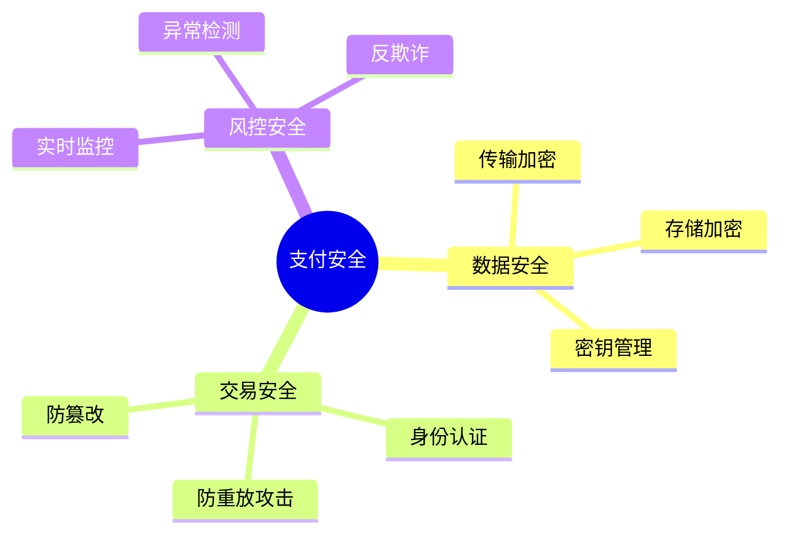

本文将带你构建完整的支付安全防护体系，从底层加密到上层风控，全面保护资金安全。

## 第一部分:基础安全防护

### 1.1 接口签名机制

**为什么需要签名?**

在分布式支付系统中,接口签名是确保通信安全的第一道防线。想象一下这样的场景:商户系统向支付网关发起一笔10万元的转账请求,如果这个请求在传输过程中被中间人拦截并修改了金额或收款账户,后果不堪设想。

数字签名通过密码学技术解决了三个核心问题:身份认证(确认请求确实来自合法商户)、数据完整性(确保数据未被篡改)和不可否认性(商户无法否认已发送的请求)。

```
问题:
- 如何确保请求来自合法商户?
- 如何防止数据在传输中被篡改?
- 如何防止重放攻击?

解决:数字签名
```

**签名的工作原理:**

签名机制基于非对称加密算法,其核心思想是:商户使用私钥对请求参数生成签名,支付网关使用对应的公钥验证签名。由于私钥只有商户持有,因此可以确保请求来源的真实性;而签名与请求内容绑定,任何参数修改都会导致验签失败。

常见的签名算法包括RSA、ECDSA等。在实际应用中,通常采用"参数排序+拼接+哈希+签名"的流程,确保相同参数无论顺序如何都能生成一致的签名。

**签名与验签的完整流程:**

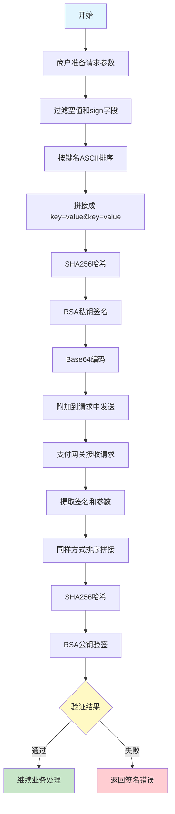

这个流程图清晰展示了从参数准备到最终验证的完整链路。关键点在于:商户和平台必须使用完全相同的参数处理逻辑(过滤、排序、拼接),否则即使数据未被篡改,验签也会失败。这也是为什么在实际开发中,通常会提供统一的SDK来确保一致性。

**防重放攻击时序图:**

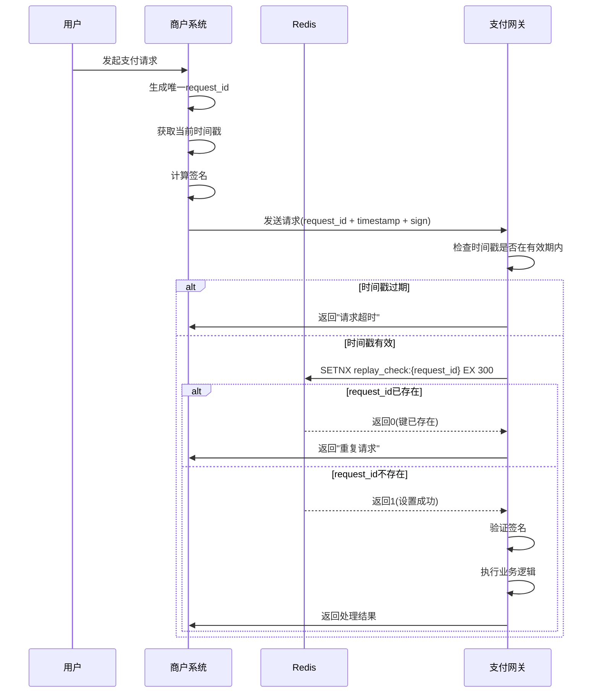

Redis的SETNX命令在这里发挥了关键作用——它是一个原子操作,要么成功设置键并返回1,要么发现键已存在并返回0。这避免了并发场景下的竞态条件问题。同时,通过设置TTL(生存时间),可以自动清理过期的request_id,防止Redis内存无限增长。

**RSA签名实现:**

```python
import hashlib
import base64
from cryptography.hazmat.primitives.asymmetric import rsa, padding
from cryptography.hazmat.primitives import hashes

class SignatureService:
    """签名服务"""
    
    def __init__(self, private_key: rsa.RSAPrivateKey):
        self.private_key = private_key
    
    def sign(self, params: dict) -> str:
        """
        生成签名
        
        params:请求参数字典
        """
        
        # 1. 过滤空值和签名字段
        filtered_params = {k: v for k, v in params.items() if v and k != 'sign'}
        
        # 2. 按键名ASCII排序
        sorted_params = sorted(filtered_params.items())
        
        # 3. 拼接成 key=value&key=value
        query_string = '&'.join(f"{k}={v}" for k, v in sorted_params)
        
        # 4. SHA256哈希
        hash_digest = hashlib.sha256(query_string.encode()).digest()
        
        # 5. RSA私钥签名
        signature = self.private_key.sign(
            hash_digest,
            padding.PKCS1v15(),
            hashes.SHA256()
        )
        
        # 6. Base64编码
        return base64.b64encode(signature).decode()

# 使用示例
private_key = rsa.generate_private_key(
    public_exponent=65537,
    key_size=2048
)

signer = SignatureService(private_key)

params = {
    'amount': 10000,
    'currency': 'CNY',
    'recipient': '1234567890',
    'timestamp': int(time.time())
}

signature = signer.sign(params)
print(signature)

```

**RSA验签实现:**

```python
import hashlib
import base64
from cryptography.hazmat.primitives.asymmetric import rsa, padding
from cryptography.hazmat.primitives import hashes

class SignatureService:
    """签名服务"""
    
    def __init__(self, private_key: rsa.RSAPrivateKey):
        self.private_key = private_key
    
    def sign(self, params: dict) -> str:
        """
        生成签名
        
        params:请求参数字典
        """
        
        # 1. 过滤空值和签名字段
        filtered_params = {k: v for k, v in params.items() if v and k != 'sign'}
        
        # 2. 按键名ASCII排序
        sorted_params = sorted(filtered_params.items())
        
        # 3. 拼接成 key=value&key=value
        query_string = '&'.join(f"{k}={v}" for k, v in sorted_params)
        
        # 4. SHA256哈希
        hash_digest = hashlib.sha256(query_string.encode()).digest()
        
        # 5. RSA私钥签名
        signature = self.private_key.sign(
            hash_digest,
            padding.PKCS1v15(),
            hashes.SHA256()
        )
        
        # 6. Base64编码
        return base64.b64encode(signature).decode()
    
    def verify(self, params: dict, signature: str) -> bool:
        """
        验证签名
        
        params:请求参数字典
        signature:Base64编码的签名
        """
        
        # 1. 过滤空值和签名字段
        filtered_params = {k: v for k, v in params.items() if v and k != 'sign'}
        
        # 2. 按键名ASCII排序
        sorted_params = sorted(filtered_params.items())
        
        # 3. 拼接成 key=value&key=value
        query_string = '&'.join(f"{k}={v}" for k, v in sorted_params)
        
        # 4. SHA256哈希
        hash_digest = hashlib.sha256(query_string.encode()).digest()
        
        # 5. RSA公钥验签
        try:
            self.private_key.public_key().verify(
                base64.b64decode(signature),
                hash_digest,
                padding.PKCS1v15(),
                hashes.SHA256()
            )
            return True
        except Exception as e:
            logger.error(f"Signature verification failed: {e}")
            return False

# 使用示例
private_key = rsa.generate_private_key(
    public_exponent=65537,
    key_size=2048
)

signer = SignatureService(private_key)

params = {
    'amount': 10000,
    'currency': 'CNY',
    'recipient': '1234567890',
    'timestamp': int(time.time())
}

signature = signer.sign(params)
print(signature)

# 验证
is_valid = signer.verify(params, signature)
print(is_valid)  # True

```

**防重放攻击机制:**

重放攻击是指攻击者截获合法的支付请求后,多次重复发送该请求,导致用户资金被多次扣除。防御重放攻击的核心思路是为每个请求添加唯一标识和时间戳,服务端通过检查这两个字段来识别重复请求。

具体实现时,商户在每次请求中生成唯一的request_id(可使用UUID),同时附带当前时间戳。服务端收到请求后,首先检查时间戳是否在有效窗口内(如5分钟),然后检查request_id是否已被处理过。Redis的SETNX命令非常适合这种场景,它能原子性地检查键是否存在并设置过期时间。

```python
import time
import redis

class ReplayAttackPrevention:
    """防重放攻击"""
    
    def __init__(self, redis_client: redis.Redis, ttl: int = 300):
        self.redis = redis_client
        self.ttl = ttl  # 时间窗口(秒)
    
    def check_and_mark(self, request_id: str, timestamp: int) -> bool:
        """
        检查并标记请求
        
        返回:True=允许,False=拒绝(重放)
        """
        
        # 1. 检查时间戳是否在有效窗口内
        current_time = int(time.time())
        if abs(current_time - timestamp) > self.ttl:
            logger.warning(f"Request timestamp expired: {timestamp}")
            return False
        
        # 2. 检查 request_id 是否已存在
        key = f"replay_check:{request_id}"
        
        # 使用 SETNX 原子操作
        result = self.redis.set(key, "1", nx=True, ex=self.ttl)
        
        if not result:
            logger.warning(f"Replay attack detected: {request_id}")
            return False
        
        return True

# 集成到签名验证
def verify_request(params: dict) -> bool:
    """验证请求(签名 + 防重放)"""
    
    # 1. 验证签名
    if not signer.verify(params, params['sign']):
        return False
    
    # 2. 验证防重放
    replay_checker = ReplayAttackPrevention(redis_client)
    
    request_id = params.get('request_id')
    timestamp = int(params.get('timestamp', 0))
    
    if not replay_checker.check_and_mark(request_id, timestamp):
        return False
    
    return True
```

**最佳实践:**


✓ 使用 RSA/ECDSA 非对称加密

✓ 每次请求包含唯一 request_id

✓ 添加时间戳并验证有效期

✓ 服务端缓存已处理的 request_id

✓ 定期轮换密钥

✗ 不要使用 MD5(已不安全)

✗ 不要在 URL 中传递敏感参数

✗ 不要硬编码密钥


### 1.2 数据加密

**敏感数据分级保护策略:**

支付系统处理的数据敏感度差异巨大,从公开的订单号到极度敏感的银行卡CVV码,需要采取分级保护策略。这种分级不仅影响加密方式的选择,还决定了数据存储、访问控制和审计的要求。

极高敏感数据(如完整卡号、CVV、密码)必须使用强加密算法存储,且密钥与数据分离管理;高敏感数据(如身份证号)建议加密存储,但在某些场景下可采用脱敏展示;中低敏感数据则可根据业务需求灵活处理。

| 数据类型 | 示例 | 加密要求 | 存储方式 | 访问控制 |
|---------|------|---------|---------|---------|
| **极高敏感** | 银行卡号、CVV、密码 | 必须加密存储 | AES-256-GCM | 严格限制,双人授权 |
| **高敏感** | 身份证号、手机号 | 建议加密存储 | AES-256或脱敏 | 角色权限控制 |
| **中敏感** | 姓名、地址 | 可脱敏展示 | 明文或加密 | 常规权限 |
| **低敏感** | 订单号、商品名 | 无需加密 | 明文 | 公开访问 |

**加密算法选择:**

现代支付系统推荐使用AES-256-GCM算法,它不仅提供机密性保护,还通过GCM模式的消息认证码(MAC)确保数据完整性。相比传统的AES-CBC模式,GCM避免了填充 oracle 攻击的风险,且性能更优。

对于密钥管理,应采用分层架构:主密钥(Master Key)离线存储在硬件安全模块(HSM)中,用于加密数据密钥(Data Key);数据密钥用于实际的业务数据加密,定期轮换;会话密钥(Session Key)则在短期通信中使用,用完即弃。

```python
from cryptography.fernet import Fernet
from cryptography.hazmat.primitives.ciphers import Cipher, algorithms, modes
from cryptography.hazmat.backends import default_backend
import os
import base64

class DataEncryption:
    """数据加密服务"""
    
    def __init__(self, master_key: bytes):
        """
        初始化加密服务
        
        master_key: 主密钥(32字节)
        """
        
        if len(master_key) != 32:
            raise ValueError("Master key must be 32 bytes")
        
        self.master_key = master_key
    
    def encrypt_card_number(self, card_number: str) -> str:
        """
        加密银行卡号
        
        使用 AES-256-GCM(authenticated encryption)
        """
        
        # 1. 生成随机 IV
        iv = os.urandom(12)
        
        # 2. 创建加密器
        cipher = Cipher(
            algorithms.AES(self.master_key),
            modes.GCM(iv),
            backend=default_backend()
        )
        
        encryptor = cipher.encryptor()
        
        # 3. 加密
        ciphertext = encryptor.update(card_number.encode()) + encryptor.finalize()
        
        # 4. 获取 authentication tag
        tag = encryptor.tag
        
        # 5. 组合:IV + Tag + Ciphertext
        encrypted_data = iv + tag + ciphertext
        
        # 6. Base64 编码
        return base64.b64encode(encrypted_data).decode()
    
    def decrypt_card_number(self, encrypted_data: str) -> str:
        """解密银行卡号"""
        
        # 1. Base64 解码
        data = base64.b64decode(encrypted_data)
        
        # 2. 分解:IV (12) + Tag (16) + Ciphertext
        iv = data[:12]
        tag = data[12:28]
        ciphertext = data[28:]
        
        # 3. 创建解密器
        cipher = Cipher(
            algorithms.AES(self.master_key),
            modes.GCM(iv, tag),
            backend=default_backend()
        )
        
        decryptor = cipher.decryptor()
        
        # 4. 解密
        plaintext = decryptor.update(ciphertext) + decryptor.finalize()
        
        return plaintext.decode()
    
    def mask_card_number(self, card_number: str) -> str:
        """
        脱敏显示
        
        例如:622202******1234
        """
        
        if len(card_number) < 8:
            return '*' * len(card_number)
        
        return card_number[:6] + '*' * (len(card_number) - 10) + card_number[-4:]

# 使用示例
master_key = os.urandom(32)  # 生产环境应从密钥管理系统获取
encryption = DataEncryption(master_key)

# 加密存储
encrypted = encryption.encrypt_card_number("6222021234567890")
db.save({'card_number_encrypted': encrypted})

# 解密使用
decrypted = encryption.decrypt_card_number(encrypted)

# 脱敏展示
masked = encryption.mask_card_number(decrypted)
print(masked)  # 622202******7890
```

**AES-256-GCM加密流程:**

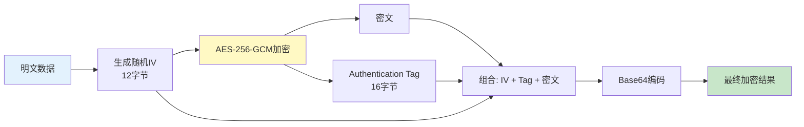

**解密流程则是逆向操作:**

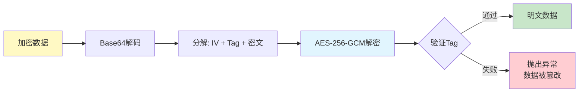

GCM模式的优势在于它将加密和认证合二为一。传统的CBC模式只保证机密性,需要额外的HMAC来保证完整性;而GCM在加密过程中自动生成认证标签(Tag),解密时会自动验证数据是否被篡改。如果Tag验证失败,说明数据在传输或存储过程中被修改,此时应该立即拒绝使用该数据并触发安全告警。

**密钥分层管理架构:**

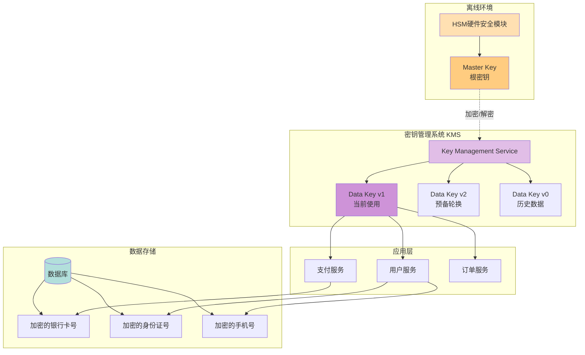

这种分层架构的核心思想是:根密钥永远不离开安全的HSM环境,它只用于加密/解密数据密钥;数据密钥可以在多个服务间共享,定期轮换;即使某个数据密钥泄露,影响范围也仅限于该密钥加密的数据,且可以通过轮换快速止损。

**密钥管理体系:**

密钥管理是数据加密中最容易被忽视却最关键的环节。再强的加密算法,如果密钥管理不当,也形同虚设。业界曾发生多起因密钥硬编码在代码仓库或配置文件中而导致的安全事故。

完善的密钥管理应遵循以下原则:

```
原则:
1. 密钥分级
   - Master Key:根密钥,离线存储于HSM
   - Data Key:数据密钥,用于加密数据,定期轮换
   - Session Key:会话密钥,临时使用,用完销毁

2. 密钥轮换
   - 定期更换(90天)
   - 旧密钥保留一段时间用于解密历史数据
   - 支持紧急轮换机制

3. 访问控制
   - 最小权限原则
   - 多因素认证(MFA)
   - 审计所有密钥访问记录

4. 安全存储
   - 使用 HSM(硬件安全模块)
   - 或云服务商 KMS(AWS KMS/Azure Key Vault)
   - 绝不硬编码在代码中
   - 开发/测试/生产环境隔离
```

**AWS KMS 集成示例:**

云服务提供商的密钥管理服务(KMS)为密钥管理提供了便捷且安全的解决方案。以AWS KMS为例,它不仅负责密钥的生成、存储和轮换,还提供了细粒度的访问控制和完整的审计日志。

```python
import boto3

class KMSManager:
    """AWS KMS 密钥管理"""
    
    def __init__(self, key_id: str):
        self.kms_client = boto3.client('kms')
        self.key_id = key_id
    
    def encrypt(self, plaintext: bytes) -> bytes:
        """使用 KMS 加密"""
        
        response = self.kms_client.encrypt(
            KeyId=self.key_id,
            Plaintext=plaintext
        )
        
        return response['CiphertextBlob']
    
    def decrypt(self, ciphertext: bytes) -> bytes:
        """使用 KMS 解密"""
        
        response = self.kms_client.decrypt(
            CiphertextBlob=ciphertext
        )
        
        return response['Plaintext']
    
    def rotate_key(self):
        """轮换密钥"""
        
        self.kms_client.rotate_key_on_demand(
            KeyId=self.key_id
        )
```

### 1.3 HTTPS 与证书管理

**TLS协议的重要性:**

HTTPS基于TLS(Transport Layer Security)协议,它为网络通信提供了加密通道,防止数据在传输过程中被窃听或篡改。对于支付系统而言,TLS不仅是合规要求,更是保护用户隐私和资金安全的基础设施。

TLS 1.2和1.3是目前广泛使用的版本,其中TLS 1.3在安全性、性能和隐私方面都有显著提升。它简化了握手过程,减少了往返次数,同时移除了不安全的加密套件和特性。

**Nginx TLS 配置最佳实践:**

合理的TLS配置能够最大化安全性同时兼顾兼容性。以下配置禁用了已知存在漏洞的协议版本和加密套件,启用了前向保密(Forward Secrecy),并配置了HSTS强制浏览器使用HTTPS连接。

```nginx
# Nginx 配置
server {
    listen 443 ssl http2;
    
    # 证书
    ssl_certificate /etc/ssl/certs/payment.crt;
    ssl_certificate_key /etc/ssl/private/payment.key;
    
    # 协议版本(禁用不安全的)
    ssl_protocols TLSv1.2 TLSv1.3;
    
    # 加密套件(优先选择强加密)
    ssl_ciphers 'ECDHE-ECDSA-AES256-GCM-SHA384:ECDHE-RSA-AES256-GCM-SHA384';
    ssl_prefer_server_ciphers on;
    
    # HSTS(强制 HTTPS)
    add_header Strict-Transport-Security "max-age=31536000; includeSubDomains" always;
    
    # OCSP Stapling
    ssl_stapling on;
    ssl_stapling_verify on;
    
    # 会话缓存
    ssl_session_cache shared:SSL:10m;
    ssl_session_timeout 10m;
}
```

**证书生命周期管理:**

SSL/TLS证书有过期时间,通常为1年。证书过期会导致服务中断,严重影响用户体验和业务连续性。因此,建立自动化的证书监控和续期机制至关重要。

Let's Encrypt等免费证书颁发机构提供了自动化续期的能力,配合certbot等工具可以实现零人工干预的证书管理。对于企业级应用,建议使用商业CA提供的OV或EV证书,它们提供更长的有效期和更高的信任级别。

```python
import ssl
import socket
from datetime import datetime

def check_certificate_expiry(domain: str, port: int = 443) -> dict:
    """检查证书过期时间"""
    
    context = ssl.create_default_context()
    
    with socket.create_connection((domain, port)) as sock:
        with context.wrap_socket(sock, server_hostname=domain) as ssock:
            cert = ssock.getpeercert()
            
            # 解析过期时间
            expire_date = datetime.strptime(
                cert['notAfter'], 
                '%b %d %H:%M:%S %Y %Z'
            )
            
            days_remaining = (expire_date - datetime.now()).days
            
            return {
                'domain': domain,
                'issuer': cert['issuer'],
                'expire_date': expire_date.isoformat(),
                'days_remaining': days_remaining,
                'status': 'OK' if days_remaining > 30 else 'WARNING'
            }

# 定时检查
async def monitor_certificates():
    """监控证书过期"""
    
    domains = ['api.payment.com', 'pay.payment.com']
    
    for domain in domains:
        info = check_certificate_expiry(domain)
        
        if info['days_remaining'] < 30:
            await send_alert(
                level='WARNING',
                message=f"Certificate for {domain} expires in {info['days_remaining']} days"
            )
```

## 第二部分:风控系统

### 2.1 风控架构

**风控系统的核心价值:**

传统的风控思维是"事后诸葛亮"——在欺诈发生后才进行分析。而现代支付风控追求的是"事前预防、事中拦截、事后追溯"的全链路防护。通过在毫秒级别内完成风险识别和决策,风控系统能够在用户无感知的情况下阻止可疑交易,既保护了资金安全,又不影响正常用户体验。

一个成熟的风控系统需要平衡三个看似矛盾的目标:高准确率(减少误杀)、低延迟(不影响支付体验)和强适应性(应对新型欺诈手段)。这需要通过分层架构、多维度特征和持续迭代来实现。

**风控决策流程详解:**

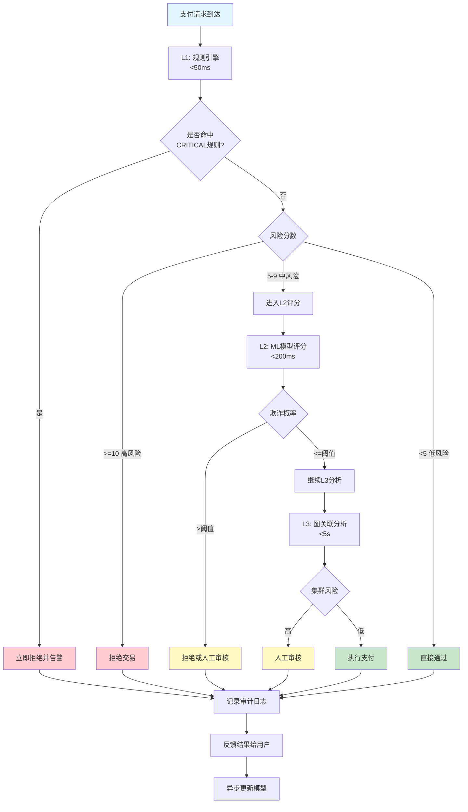

这个流程图展示了风控系统如何分层决策。大部分正常交易会在L1层快速通过(低风险)或被拦截(CRITICAL规则),只有中等风险的请求才会进入更耗时的L2和L3层。这种设计在保证安全性的同时,最大限度地减少了对用户体验的影响。

**整体架构设计:**

风控系统采用分层处理架构,不同层级承担不同的职责。L1层通过简单的规则快速拦截明显的欺诈行为;L2层利用机器学习模型进行精细化评分;L3和L4层则进行深度分析和模式挖掘,为模型优化提供数据支持。这种设计既保证了实时性,又兼顾了准确性。

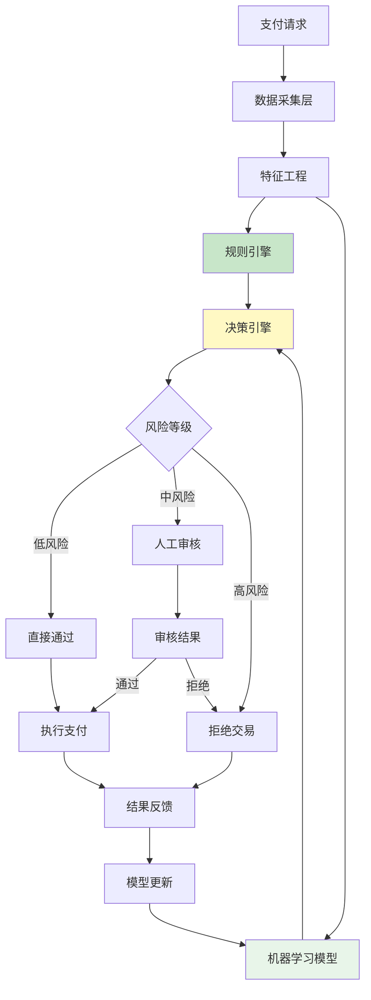

**风控分层策略:**

不同层级的风控策略在响应时间、准确率和覆盖率上各有侧重。实时拦截层追求极致的速度,通常在50毫秒内完成判断;实时评分层则在200毫秒内给出风险概率;准实时和离线层虽然耗时较长,但能够发现更复杂的欺诈模式。

| 层级 | 内容 | 响应时间 | 准确率 | 覆盖率 | 典型应用 |
|------|------|---------|--------|--------|---------|
| **L1 - 实时拦截** | 黑名单、规则引擎 | < 50ms | 95%+ | 30% | 黑名单用户、超限交易 |
| **L2 - 实时评分** | 机器学习模型 | < 200ms | 85-90% | 70% | 异常行为检测 |
| **L3 - 准实时分析** | 关联分析、图谱 | < 5s | 80-85% | 50% | 团伙欺诈识别 |
| **L4 - 离线挖掘** | 模式识别、聚类 | T+1 | 75-80% | 100% | 新欺诈模式发现 |

**数据采集与特征工程:**

风控的准确性高度依赖于数据的质量和丰富度。数据采集层需要从多个维度收集信息:用户基本信息、设备指纹、地理位置、行为序列、社交关系等。这些数据经过清洗、转换和聚合后,形成数百甚至上千个特征变量,供规则引擎和机器学习模型使用。

特征工程是风控系统中技术含量最高的环节之一。优秀的特征不仅能够准确刻画用户行为,还要具备良好的稳定性和可解释性。常见的特征包括:统计类特征(如过去1小时交易次数)、比率类特征(如夜间交易占比)、趋势类特征(如金额增长率)和关联类特征(如同设备用户数)。

### 2.2 规则引擎

**为什么需要规则引擎?**

规则引擎是风控系统的第一道防线,它通过预定义的业务规则快速识别已知的高风险场景。相比机器学习模型,规则引擎具有可解释性强、响应速度快、易于调整的优势。当发现新的欺诈手法时,风控人员可以在几分钟内部署新规则,立即生效。

然而,规则引擎也有局限性:它只能识别已知的欺诈模式,对于新型或变种欺诈无能为力;规则过多会导致维护成本上升,甚至出现规则冲突;过于严格的规则可能误伤正常用户。因此,规则引擎通常与机器学习模型配合使用,形成互补。

**规则引擎工作原理:**

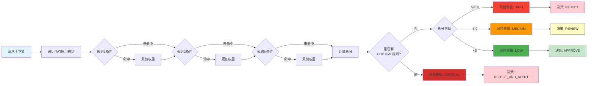

规则引擎的核心逻辑其实很简洁:遍历所有启用的规则,检查是否命中,累加命中的规则权重,最后根据总分和是否有CRITICAL规则来确定最终的风险等级。这种设计使得规则的添加、修改和删除都非常灵活,不会影响整体架构。

**典型风控规则示例:**

```
from enum import Enum
from typing import List, Dict, Any
from dataclasses import dataclass

class RiskLevel(Enum):
    LOW = "low"           # 低风险,直接通过
    MEDIUM = "medium"     # 中风险,人工审核
    HIGH = "high"         # 高风险,拒绝
    CRITICAL = "critical" # 极高风险,拒绝并告警

@dataclass
class Rule:
    """风控规则"""
    
    rule_id: str
    name: str
    description: str
    condition: callable  # 条件函数
    risk_level: RiskLevel
    weight: int = 1      # 权重
    enabled: bool = True

class RuleEngine:
    """规则引擎"""
    
    def __init__(self):
        self.rules: List[Rule] = []
    
    def add_rule(self, rule: Rule):
        """添加规则"""
        self.rules.append(rule)
    
    def evaluate(self, context: Dict[str, Any]) -> Dict:
        """
        评估风险
        
        返回:风险等级、命中的规则、风险分数
        """
        
        hit_rules = []
        total_score = 0
        
        for rule in self.rules:
            if not rule.enabled:
                continue
            
            try:
                # 执行条件判断
                if rule.condition(context):
                    hit_rules.append({
                        'rule_id': rule.rule_id,
                        'name': rule.name,
                        'risk_level': rule.risk_level.value,
                        'weight': rule.weight
                    })
                    
                    # 累加分数
                    total_score += rule.weight
                    
            except Exception as e:
                logger.error(f"Rule {rule.rule_id} execution error: {e}")
        
        # 确定最终风险等级
        final_risk = self.determine_risk_level(total_score, hit_rules)
        
        return {
            'risk_level': final_risk.value,
            'risk_score': total_score,
            'hit_rules': hit_rules,
            'decision': self.make_decision(final_risk)
        }
    
    def determine_risk_level(self, score: int, hit_rules: List) -> RiskLevel:
        """确定风险等级"""
        
        # 如果有 CRITICAL 规则命中,直接 CRITICAL
        if any(r['risk_level'] == 'critical' for r in hit_rules):
            return RiskLevel.CRITICAL
        
        # 根据分数判断
        if score >= 10:
            return RiskLevel.HIGH
        elif score >= 5:
            return RiskLevel.MEDIUM
        else:
            return RiskLevel.LOW
    
    def make_decision(self, risk_level: RiskLevel) -> str:
        """做出决策"""
        
        decisions = {
            RiskLevel.LOW: 'APPROVE',
            RiskLevel.MEDIUM: 'REVIEW',
            RiskLevel.HIGH: 'REJECT',
            RiskLevel.CRITICAL: 'REJECT_AND_ALERT'
        }
        
        return decisions[risk_level]

# 初始化规则引擎
engine = RuleEngine()

# 添加规则
engine.add_rule(Rule(
    rule_id='R001',
    name='黑名单用户',
    description='用户在黑名单中',
    condition=lambda ctx: ctx.get('user_id') in BLACKLIST_USERS,
    risk_level=RiskLevel.CRITICAL,
    weight=10
))

engine.add_rule(Rule(
    rule_id='R002',
    name='单笔金额超限',
    description='单笔交易金额超过限制',
    condition=lambda ctx: ctx.get('amount', 0) > 50000,
    risk_level=RiskLevel.HIGH,
    weight=5
))

engine.add_rule(Rule(
    rule_id='R003',
    name='频繁交易',
    description='短时间内多次交易',
    condition=lambda ctx: ctx.get('tx_count_1h', 0) > 10,
    risk_level=RiskLevel.MEDIUM,
    weight=3
))

engine.add_rule(Rule(
    rule_id='R004',
    name='异地登录',
    description='非常用地登录并交易',
    condition=lambda ctx: ctx.get('is_new_location', False),
    risk_level=RiskLevel.MEDIUM,
    weight=2
))

# 使用
context = {
    'user_id': 'U123456',
    'amount': 99999,
    'tx_count_1h': 15,
    'is_new_location': True
}

result = engine.evaluate(context)
print(result)
# {
#   'risk_level': 'critical',
#   'risk_score': 20,
#   'hit_rules': [...],
#   'decision': 'REJECT_AND_ALERT'
# }
```

**规则管理最佳实践:**

随着业务发展,规则数量会快速增长,良好的规则管理机制变得至关重要。建议建立规则版本控制、灰度发布和效果监控机制。新规则上线前应在历史数据上进行回测,评估其命中率和准确率;上线初期采用观察模式,只记录不拦截,验证无误后再正式启用;定期清理失效规则,避免规则库膨胀。

### 2.3 机器学习模型

**机器学习在风控中的应用:**

规则引擎擅长处理已知的、明确的欺诈模式,但对于隐蔽性强、变化快的新型欺诈则力不从心。机器学习模型通过分析海量历史数据,自动学习正常用户和欺诈用户的行为差异,能够发现人类难以察觉的复杂模式和细微异常。

在支付风控场景中,常用的算法包括逻辑回归(LR)、梯度提升树(XGBoost/LightGBM)、随机森林和深度学习模型。其中,XGBoost因其出色的性能、良好的可解释性和对缺失值的鲁棒性,成为业界首选。

**特征工程详解:**

特征质量直接决定模型效果。优秀的特征应该具备区分度(能区分正常和欺诈)、稳定性(随时间变化小)、可解释性(业务含义清晰)和时效性(能快速计算)。以下是支付风控中常用的特征类别:

```python
class FeatureExtractor:
    """特征提取器"""
    
    async def extract_features(self, user_id: str, transaction: dict) -> dict:
        """
        提取风控特征
        
        返回:特征字典
        """
        
        features = {}
        
        # 1. 用户基本特征
        user_info = await self.get_user_info(user_id)
        features['user_age_days'] = user_info['age_days']
        features['user_level'] = user_info['level']
        features['verified'] = user_info['verified']
        
        # 2. 交易特征
        features['amount'] = transaction['amount']
        features['hour_of_day'] = transaction['timestamp'].hour
        features['day_of_week'] = transaction['timestamp'].weekday()
        
        # 3. 行为特征(过去 1 小时)
        stats_1h = await self.get_user_stats(user_id, hours=1)
        features['tx_count_1h'] = stats_1h['count']
        features['total_amount_1h'] = stats_1h['total_amount']
        features['avg_amount_1h'] = stats_1h['avg_amount']
        features['max_amount_1h'] = stats_1h['max_amount']
        
        # 4. 行为特征(过去 24 小时)
        stats_24h = await self.get_user_stats(user_id, hours=24)
        features['tx_count_24h'] = stats_24h['count']
        features['unique_merchants_24h'] = stats_24h['unique_merchants']
        
        # 5. 设备特征
        device_info = await self.get_device_info(transaction['device_id'])
        features['is_new_device'] = device_info['is_new']
        features['device_trust_score'] = device_info['trust_score']
        
        # 6. 位置特征
        location_info = await self.get_location_info(user_id, transaction['ip'])
        features['is_new_location'] = location_info['is_new']
        features['distance_from_last'] = location_info['distance_km']
        features['impossible_travel'] = location_info['impossible_travel']
        
        # 7. 关联特征
        graph_features = await self.get_graph_features(user_id)
        features['connected_fraud_users'] = graph_features['fraud_connections']
        features['cluster_risk_score'] = graph_features['cluster_risk']
        
        return features
    
    async def get_user_stats(self, user_id: str, hours: int) -> dict:
        """获取用户统计信息"""
        
        since = datetime.now() - timedelta(hours=hours)
        
        result = await db.fetchrow(
            """
            SELECT 
                COUNT(*) as count,
                COALESCE(SUM(amount), 0) as total_amount,
                COALESCE(AVG(amount), 0) as avg_amount,
                COALESCE(MAX(amount), 0) as max_amount,
                COUNT(DISTINCT merchant_id) as unique_merchants
            FROM transactions
            WHERE user_id = $1 
            AND created_at >= $2
            """,
            user_id, since
        )
        
        return dict(result)
```

**模型训练与评估:**

风控模型面临的最大挑战是样本极度不平衡——欺诈交易通常只占总交易的千分之几甚至万分之几。这种不平衡会导致模型倾向于预测所有样本为正常类,从而获得很高的准确率但毫无实际价值。

解决样本不平衡的方法包括:过采样(如SMOTE)、欠采样、代价敏感学习(给少数类更高的权重)和集成方法。在实际应用中,通常结合多种方法,并通过AUC、Precision-Recall曲线等指标全面评估模型性能。

```python
import xgboost as xgb
from sklearn.model_selection import train_test_split
from sklearn.metrics import roc_auc_score, precision_recall_curve

class FraudDetectionModel:
    """欺诈检测模型"""
    
    def __init__(self):
        self.model = None
        self.threshold = 0.5
    
    def train(self, features_df, labels_df):
        """
        训练模型
        
        features_df: 特征数据框
        labels_df: 标签(0=正常,1=欺诈)
        """
        
        # 划分训练集和测试集
        X_train, X_test, y_train, y_test = train_test_split(
            features_df, labels_df, test_size=0.2, random_state=42
        )
        
        # 处理类别不平衡
        scale_pos_weight = (y_train == 0).sum() / (y_train == 1).sum()
        
        # 训练 XGBoost
        self.model = xgb.XGBClassifier(
            n_estimators=1000,
            max_depth=6,
            learning_rate=0.01,
            scale_pos_weight=scale_pos_weight,
            use_label_encoder=False,
            eval_metric='auc'
        )
        
        self.model.fit(
            X_train, y_train,
            eval_set=[(X_test, y_test)],
            early_stopping_rounds=50,
            verbose=True
        )
        
        # 评估
        y_pred_proba = self.model.predict_proba(X_test)[:, 1]
        auc_score = roc_auc_score(y_test, y_pred_proba)
        
        print(f"Model AUC: {auc_score:.4f}")
        
        # 选择最优阈值
        self.threshold = self.find_optimal_threshold(y_test, y_pred_proba)
    
    def predict(self, features: dict) -> dict:
        """
        预测风险
        
        返回:风险分数、是否欺诈
        """
        
        # 转换为 DataFrame
        feature_df = pd.DataFrame([features])
        
        # 预测概率
        fraud_probability = self.model.predict_proba(feature_df)[0][1]
        
        # 判断
        is_fraud = fraud_probability >= self.threshold
        
        return {
            'fraud_probability': float(fraud_probability),
            'is_fraud': bool(is_fraud),
            'threshold': self.threshold
        }
    
    def find_optimal_threshold(self, y_true, y_scores):
        """找到最优阈值(最大化 F1)"""
        
        precisions, recalls, thresholds = precision_recall_curve(y_true, y_scores)
        
        f1_scores = 2 * (precisions * recalls) / (precisions + recalls + 1e-8)
        optimal_idx = np.argmax(f1_scores)
        
        return thresholds[optimal_idx] if optimal_idx < len(thresholds) else 0.5
```

**阈值选择的艺术:**

模型输出的是欺诈概率,但最终决策需要将其转化为"通过"或"拒绝"。这个转化过程就是阈值选择,它直接影响业务的两个关键指标:误杀率(False Positive Rate)和漏杀率(False Negative Rate)。

降低阈值会提高召回率(捕获更多欺诈),但也会增加误杀(影响正常用户体验);提高阈值则相反。最优阈值的选择需要综合考虑业务目标、风险承受能力和运营成本。通常通过绘制Precision-Recall曲线,找到F1分数最大化的点作为初始阈值,然后根据实际运营情况进行微调。

**在线预测服务:**

```python
class RealTimeScoring:
    """实时评分服务"""
    
    def __init__(self, model: FraudDetectionModel, feature_extractor: FeatureExtractor):
        self.model = model
        self.feature_extractor = feature_extractor
    
    async def score_transaction(self, user_id: str, transaction: dict) -> dict:
        """实时评分"""
        
        # 1. 提取特征
        features = await self.feature_extractor.extract_features(user_id, transaction)
        
        # 2. 模型预测
        prediction = self.model.predict(features)
        
        # 3. 记录日志
        await self.log_prediction(user_id, transaction['order_id'], prediction)
        
        return prediction

# 集成到支付流程
async def process_payment_with_risk_control(order: PaymentOrder):
    """带风控的支付处理"""
    
    # 1. 规则引擎
    rule_result = rule_engine.evaluate({
        'user_id': order.user_id,
        'amount': order.amount,
        # ... 其他上下文
    })
    
    if rule_result['decision'] == 'REJECT':
        raise PaymentRejectedError("Blocked by rule engine")
    
    # 2. 机器学习模型
    scoring_service = RealTimeScoring(model, feature_extractor)
    ml_result = await scoring_service.score_transaction(
        order.user_id, 
        {'order_id': order.order_id, 'amount': order.amount}
    )
    
    if ml_result['is_fraud']:
        logger.warning(f"Fraud detected: {order.order_id}")
        raise PaymentRejectedError("Blocked by ML model")
    
    # 3. 继续支付流程
    return execute_payment(order)
```

**机器学习模型训练流程:**

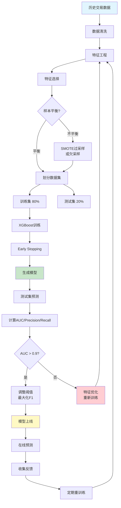

机器学习模型的训练是一个迭代优化的过程。从原始数据到最终上线,需要经过数据清洗、特征工程、样本平衡、模型训练、评估调优等多个环节。其中,特征工程往往占据了70%以上的工作量,因为好的特征比复杂的算法更重要。

**Precision-Recall权衡:**

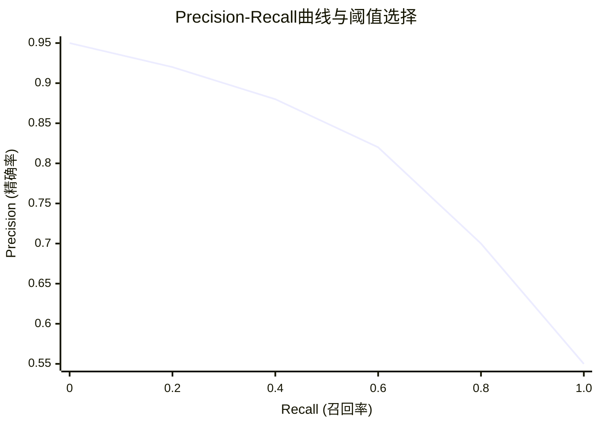

这张曲线图展示了精确率和召回率之间的权衡关系。当阈值较高时,精确率高但召回率低(只捕获最明显的欺诈,误杀少但漏杀多);当阈值降低时,召回率提高但精确率下降(捕获更多欺诈,但误杀也增加)。最优阈值通常选择在F1分数最大化的点,即精确率和召回率的调和平均值最大处。

**特征重要性分析:**

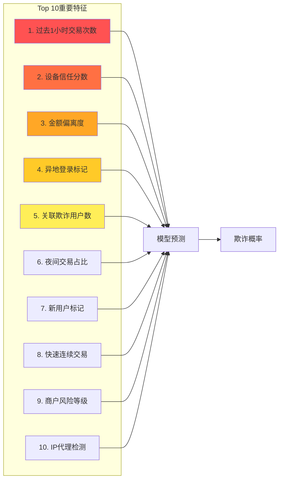

通过XGBoost的feature_importance_属性,可以获取每个特征对模型预测的贡献度。这不仅有助于理解模型的决策逻辑,还能指导特征工程的优化方向——移除贡献度低的特征,重点挖掘高贡献度特征的衍生变量。

### 2.4 图计算与关联分析

**为什么需要图计算?**

传统的风控方法主要关注单个用户的行为特征,但现代欺诈越来越呈现组织化、团伙化特征。欺诈分子会使用大量虚假身份、设备和账户,形成复杂的关联网络。如果孤立地分析每个账户,很难发现异常;但一旦将这些账户放入关系图中,异常的聚集模式就会显现出来。

图计算通过将用户、设备、IP地址、银行卡等实体作为节点,将它们之间的关系作为边,构建出庞大的知识图谱。在这个图谱上,可以运用社区发现、中心性分析、路径搜索等图算法,识别出潜在的欺诈团伙。

**欺诈团伙检测实战:**

Neo4j是最流行的图数据库之一,它原生支持Cypher查询语言,能够高效地执行图遍历和模式匹配。以下示例展示了如何查找与目标用户相关联的已知欺诈用户,以及计算用户所在集群的风险分数。

```python
from neo4j import GraphDatabase

class FraudGraphAnalyzer:
    """欺诈图谱分析"""
    
    def __init__(self, uri: str, user: str, password: str):
        self.driver = GraphDatabase.driver(uri, auth=(user, password))
    
    def find_fraud_ring(self, user_id: str, depth: int = 3) -> list:
        """
        查找欺诈团伙
        
        通过共享设备、IP、银行卡等关联
        """
        
        query = """
        MATCH (u:User {id: $user_id})-[:USED_DEVICE|USED_IP|USED_CARD*1..3]-(related:User)
        WHERE related.fraud_label = true
        RETURN related.id as fraud_user, 
               COUNT(*) as connection_count,
               COLLECT(DISTINCT type(relationship)) as connection_types
        ORDER BY connection_count DESC
        LIMIT 10
        """
        
        with self.driver.session() as session:
            result = session.run(query, user_id=user_id)
            
            return [dict(record) for record in result]
    
    def calculate_cluster_risk(self, user_id: str) -> float:
        """计算用户所在集群的风险分数"""
        
        query = """
        MATCH (u:User {id: $user_id})-[:RELATED_TO*1..2]-(cluster:User)
        WITH cluster, COUNT(*) as connections
        WHERE cluster.fraud_label = true
        RETURN SUM(connections) as fraud_connections
        """
        
        with self.driver.session() as session:
            result = session.run(query, user_id=user_id)
            record = result.single()
            
            fraud_connections = record['fraud_connections'] if record else 0
            
            # 归一化到 0-1
            risk_score = min(fraud_connections / 10.0, 1.0)
            
            return risk_score
    
    def add_relationship(self, user1: str, user2: str, relationship_type: str):
        """添加用户关系"""
        
        query = """
        MATCH (u1:User {id: $user1}), (u2:User {id: $user2})
        MERGE (u1)-[r:RELATED_TO {type: $type}]->(u2)
        ON CREATE SET r.created_at = timestamp()
        """
        
        with self.driver.session() as session:
            session.run(query, user1=user1, user2=user2, type=relationship_type)
```

**欺诈团伙图谱示例:**

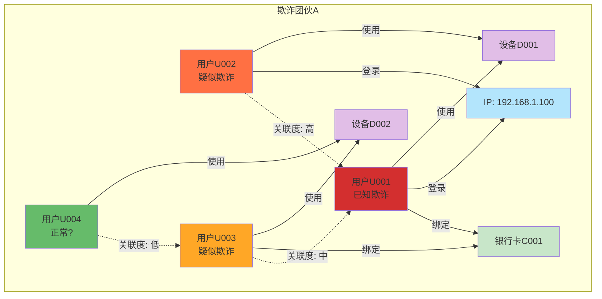

这个图谱展示了一个典型的欺诈团伙结构:多个用户共享相同的设备、IP地址或银行卡。已知的欺诈用户U001作为种子节点,通过图遍历发现了与其关联的U002和U003,它们的关联度分别为高和中,很可能是同一团伙的成员。而U004虽然也与团伙有间接关联,但关联度较低,可能是无辜的"路人"。

**图算法应用场景对比:**

| 算法 | 原理 | 应用场景 | 计算复杂度 | 实时性 |
|------|------|---------|-----------|--------|
| **BFS/DFS遍历** | 广度/深度优先搜索 | 查找N度关联用户 | O(V+E) | 毫秒级 |
| **PageRank** | 基于链接的重要性排序 | 识别团伙核心节点 | O(kE) | 分钟级 |
| **Louvain社区发现** | 模块化优化 | 自动识别欺诈团伙 | O(NlogN) | 小时级 |
| **最短路径** | Dijkstra/BFS | 发现隐藏关联 | O(V²) | 秒级 |
| **标签传播** | 邻居投票机制 | 半监督风险预测 | O(kE) | 分钟级 |

**图谱构建与更新策略:**

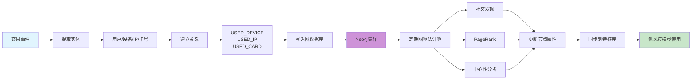

图数据库的实时更新能力使其能够及时反映用户关系的变化。每次交易发生后,系统会提取涉及的实体(用户、设备、IP、卡号等),在图中创建或更新相应的节点和边。然后,定期运行图算法计算社区结构、节点重要性等指标,将这些结果作为特征同步到风控模型中。

## 第三部分:合规与审计

### 3.1 审计日志

**审计日志的战略意义:**

在支付系统中,审计日志不仅是技术需求,更是法律和合规的刚性要求。当发生资金纠纷、监管检查或安全事件时,完整、不可篡改的审计日志是还原事实真相的唯一依据。它记录了系统中每一个关键操作的"五W一H":Who(谁)、What(做了什么)、When(何时)、Where(从哪里)、Why(为什么)和How(结果如何)。

与传统的应用日志不同,审计日志具有以下特点:不可变性(一旦写入不得修改或删除)、完整性(覆盖所有关键业务操作)、可追溯性(能够关联到具体的人和事)和长期保存(满足法规要求的保留期限)。

**完整的审计追踪体系:**

```python
import json
from datetime import datetime

class AuditLogger:
    """审计日志"""
    
    async def log_payment_action(self, action: dict):
        """
        记录支付操作
        
        必须包含:
        - 谁(who)
        - 做了什么(what)
        - 何时(when)
        - 从哪里(where)
        - 结果如何(result)
        """
        
        audit_record = {
            'event_id': str(uuid.uuid4()),
            'timestamp': datetime.utcnow().isoformat(),
            'event_type': action['type'],  # PAYMENT_CREATE, PAYMENT_SUCCESS, etc.
            'actor': {
                'user_id': action.get('user_id'),
                'ip_address': action.get('ip'),
                'user_agent': action.get('user_agent'),
            },
            'resource': {
                'order_id': action.get('order_id'),
                'amount': action.get('amount'),
                'currency': action.get('currency'),
            },
            'action': action.get('action'),
            'result': {
                'status': action.get('status'),
                'error_code': action.get('error_code'),
            },
            'metadata': action.get('metadata', {})
        }
        
        # 写入审计日志表(不可修改)
        await db.execute(
            """
            INSERT INTO audit_logs 
            (event_id, timestamp, event_type, actor, resource, action, result, metadata)
            VALUES ($1, $2, $3, $4, $5, $6, $7, $8)
            """,
            audit_record['event_id'],
            audit_record['timestamp'],
            audit_record['event_type'],
            json.dumps(audit_record['actor']),
            json.dumps(audit_record['resource']),
            audit_record['action'],
            json.dumps(audit_record['result']),
            json.dumps(audit_record['metadata'])
        )
        
        # 同时发送到日志系统(ELK)
        await elasticsearch.index(
            index='payment-audit-logs',
            body=audit_record
        )

# 使用
audit_logger = AuditLogger()

await audit_logger.log_payment_action({
    'type': 'PAYMENT_CREATE',
    'user_id': 'U123',
    'ip': '192.168.1.1',
    'order_id': 'ORD001',
    'amount': 99.99,
    'action': 'CREATE_ORDER',
    'status': 'SUCCESS'
})
```

**分级存储策略:**

审计日志的数据量会随着业务发展快速增长,全部存储在高性能数据库中成本高昂。合理的做法是根据访问频率采用分级存储策略:近期数据存放在热存储中支持快速查询,中期数据归档到对象存储,远期数据转移到低成本的冷存储。

```
法规要求:
- 支付交易日志:至少 5 年
- 用户身份信息:账户注销后 5 年
- 审计日志:至少 3 年

实现:
1. 热存储(最近 6 个月)
   - Elasticsearch
   - 快速查询
   - 实时监控
   
2. 温存储(6 个月 - 2 年)
   - 对象存储(S3/OSS)
   - 压缩归档
   - 按需加载
   
3. 冷存储(2 年以上)
   - Glacier/Archive Storage
   - 低成本长期保存
   - 合规备查
```

**审计日志的完整生命周期:**

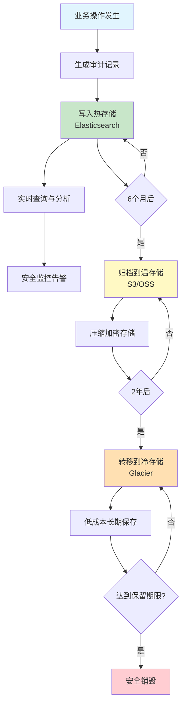

审计日志从产生到销毁的整个生命周期都需要严格管理。热存储支持实时的安全监控和异常检测,温存储用于合规查询和审计,冷存储则满足长期法规要求。每个阶段的转换都应该自动化执行,并记录转换日志,确保数据不会意外丢失或提前销毁。

**日志防篡改技术对比:**

| 技术方案 | 原理 | 优势 | 劣势 | 适用场景 |
|---------|------|------|------|---------|
| **WORM存储** | Write-Once-Read-Many | 简单可靠,成本低 | 需要硬件支持 | 企业内部审计 |
| **数字签名** | 每条日志附加签名 | 可验证完整性 | 密钥管理复杂 | 高安全要求场景 |
| **区块链存证** | 哈希上链,不可篡改 | 去中心化,公信力强 | 成本高,性能低 | 司法取证 |
| **多方备份** | 多副本异地存储 | 容灾能力强 | 存储成本高 | 关键业务系统 |
| **Merkle Tree** | 树形哈希结构 | 高效验证,空间优化 | 实现复杂 | 大规模日志系统 |

### 3.2 合规检查清单

**PCI DSS合规实施路线图:**

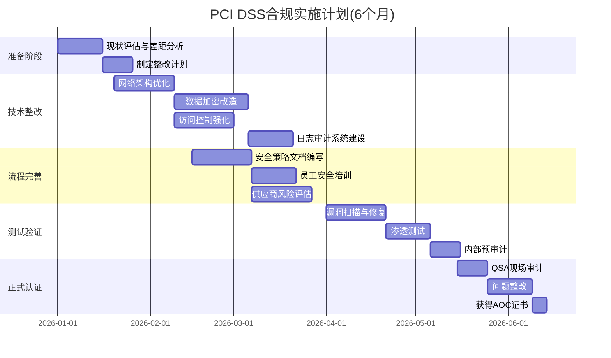

PCI DSS合规是一个系统工程,通常需要3-6个月的准备时间。从现状评估开始,识别与标准要求的差距,然后分阶段进行技术整改、流程完善和测试验证,最后由合格的安全公司审计。


**GDPR合规要点:**

通用数据保护条例(GDPR)赋予欧盟公民对个人数据的广泛控制权,对全球企业都有深远影响。支付系统作为个人金融数据的处理者,必须严格遵守GDPR的各项规定。

```
1. 数据最小化原则
   - 只收集必要的个人信息
   - 明确数据处理目的
   - 定期清理过期数据
   - 匿名化/假名化处理

2. 用户权利保障
   - 提供数据导出功能(JSON/CSV格式)
   - 支持删除账户和数据("被遗忘权")
   - 允许更正不准确的信息
   - 反对自动化决策的权利

3. 同意管理
   - 明确的隐私政策(通俗易懂)
   - 用户可随时撤回同意
   - 区分必需和可选的数据处理
   - 记录同意历史

4. 数据泄露通知
   - 72小时内报告监管机构
   - 高风险情况下通知受影响的用户
   - 建立应急响应流程
   - 定期进行应急演练

5. 跨境数据传输
   - 确保接收国具有充分的数据保护水平
   - 使用标准合同条款(SCC)
   - 实施额外的技术保护措施
```

**国内合规要求:**

在中国运营支付业务,还需要遵守《网络安全法》、《数据安全法》、《个人信息保护法》等法律法规。关键要求包括:数据本地化存储、重要数据出境安全评估、个人信息分类分级保护、关键信息基础设施安全保护等。

## 结语:安全是持续的过程

支付安全不是一次性的项目,而是持续的工程。技术会演进,攻击手法会更新,业务场景会变化,唯有保持警惕、持续投入,才能在这场没有终点的马拉松中保持领先。

**纵深防御(Depth Defense):**

不要依赖单一的安全措施,而应该构建多层防护体系。就像城堡的防御一样,有护城河、城墙、内堡等多道防线。即使攻击者突破了外层防御,内层仍然能够提供保护。在支付系统中,这体现为:网络层的防火墙、应用层的签名验证、数据层的加密存储、业务层的风控规则、监控层的异常检测。每一层都独立运作,相互补充,形成整体的安全态势。

**最小权限(Least Privilege):**

每个用户、进程、系统组件只应该拥有完成其任务所必需的最小权限。这不仅减少了攻击面,也限制了潜在的内部威胁。实践中,这意味着:数据库账号不应该有DROP TABLE权限,开发人员不应该有生产环境的写权限,微服务之间应该通过API网关通信而不是直接访问数据库。定期审查权限分配,及时撤销不再需要的权限。

**零信任(Zero Trust):**

传统的网络安全基于"边界防御"思维——认为内部网络是可信的,只需要防范外部攻击。但现代安全理念已经转向"零信任"——永不信任,始终验证。无论是来自外部的请求还是内部的调用,都需要进行身份认证和授权。这种理念特别适合云原生和微服务架构,其中服务间的通信边界模糊,传统的网络隔离难以奏效。

**持续监控与改进:**

安全是一个动态的过程,需要建立闭环的监控和改进机制:

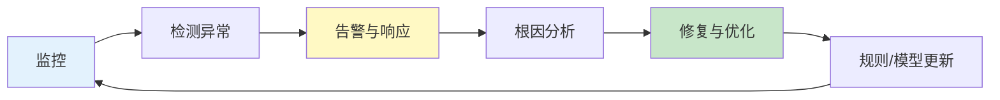

- **实时监控**: 通过SIEM系统聚合各类日志,运用关联分析发现可疑行为
- **定期审计**: 每季度进行配置审查,每年进行渗透测试和红蓝对抗
- **威胁情报**: 关注行业安全动态,及时了解新型攻击手法
- **安全培训**: 提升全员安全意识,减少人为失误
- **应急演练**: 定期模拟安全事件,检验响应流程的有效性

**安全运营成熟度模型:**

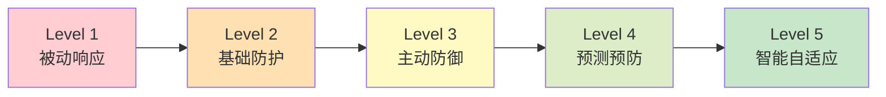

大多数组织处于Level 2-3阶段,具备基础的安全防护能力,但缺乏预测和自适应能力。达到Level 5需要长期的投入和积累,包括:完善的威胁情报体系、自动化的响应编排(SOAR)、AI驱动的异常检测、持续的攻击面管理等。

**记住:**

> 攻击者只需要找到一个漏洞,就能突破整个防线。
> 
> 防御者必须保护所有地方,不能有丝毫疏忽。
> 
> 安全建设永远在路上,今天的最佳实践可能明天就会过时。

在这场攻防博弈中,没有绝对的胜利,只有不断的进化。唯有保持敬畏之心,持续学习、持续改进,才能守护好每一笔交易,保护好每一位用户的信任。

---

- 接口签名机制与防重放攻击的实现原理
- 数据加密算法选择与密钥管理体系
- HTTPS/TLS配置最佳实践与证书生命周期管理
- 风控系统分层架构设计思路
- 规则引擎与机器学习模型的协同工作
- 图计算在欺诈团伙检测中的应用
- 审计日志的完整性保障与分级存储
- PCI DSS、GDPR等合规要求解读
- 纵深防御、最小权限、零信任等安全理念
