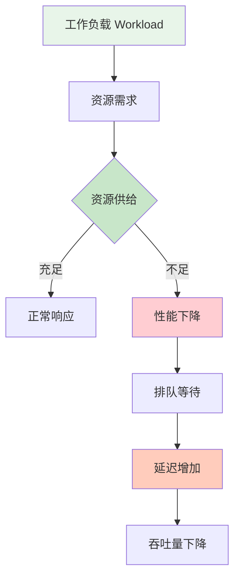
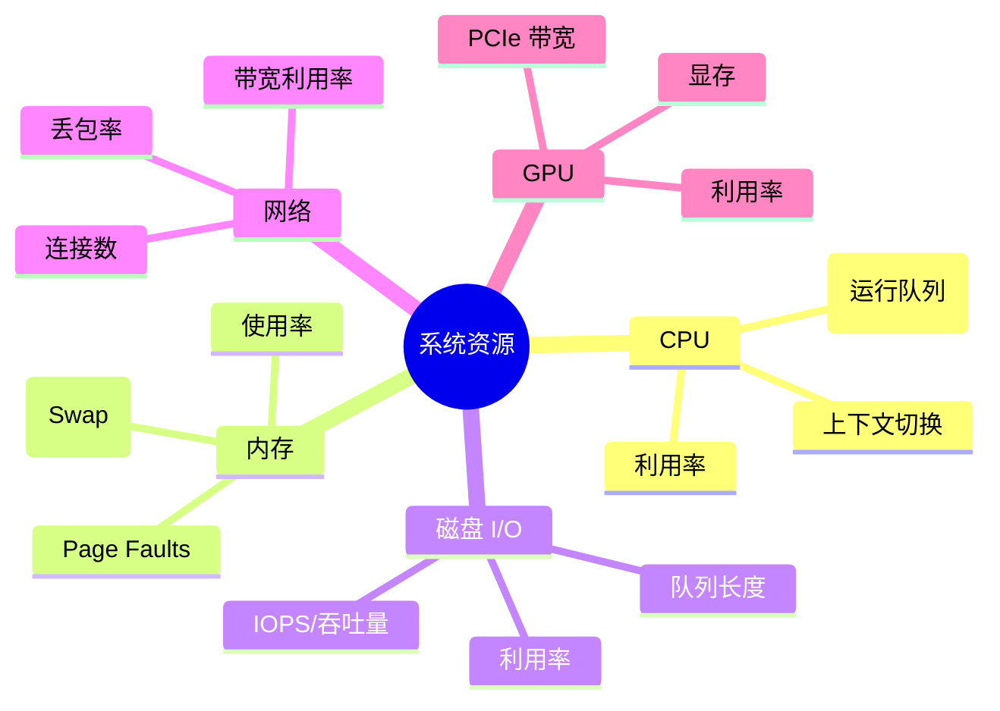
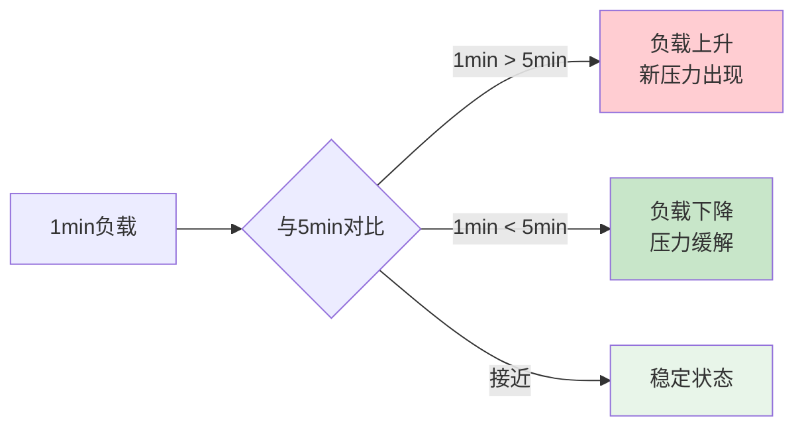
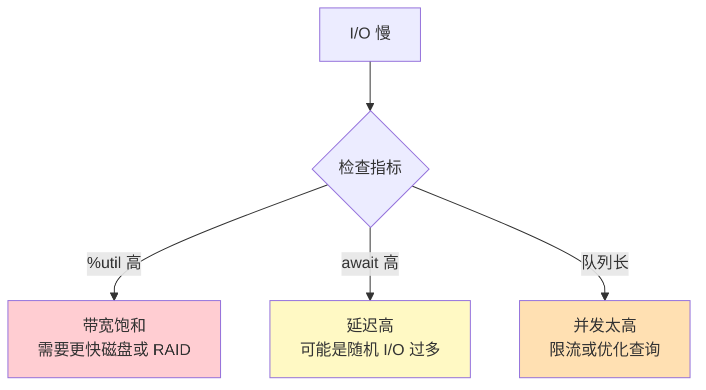
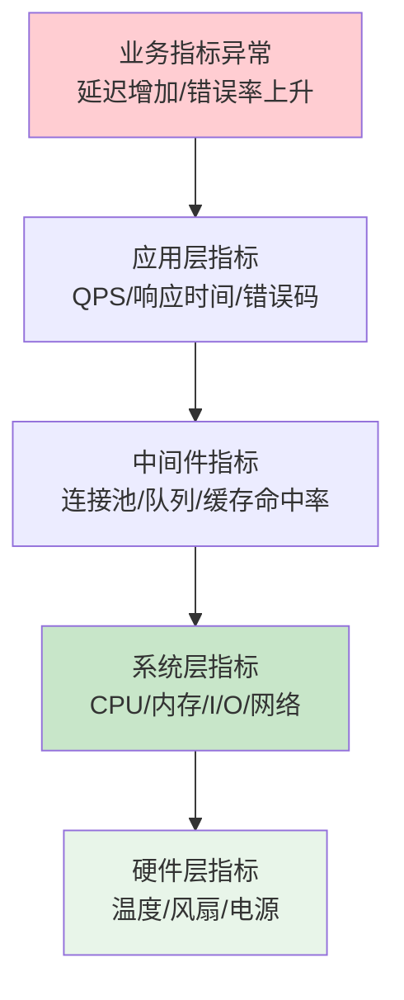
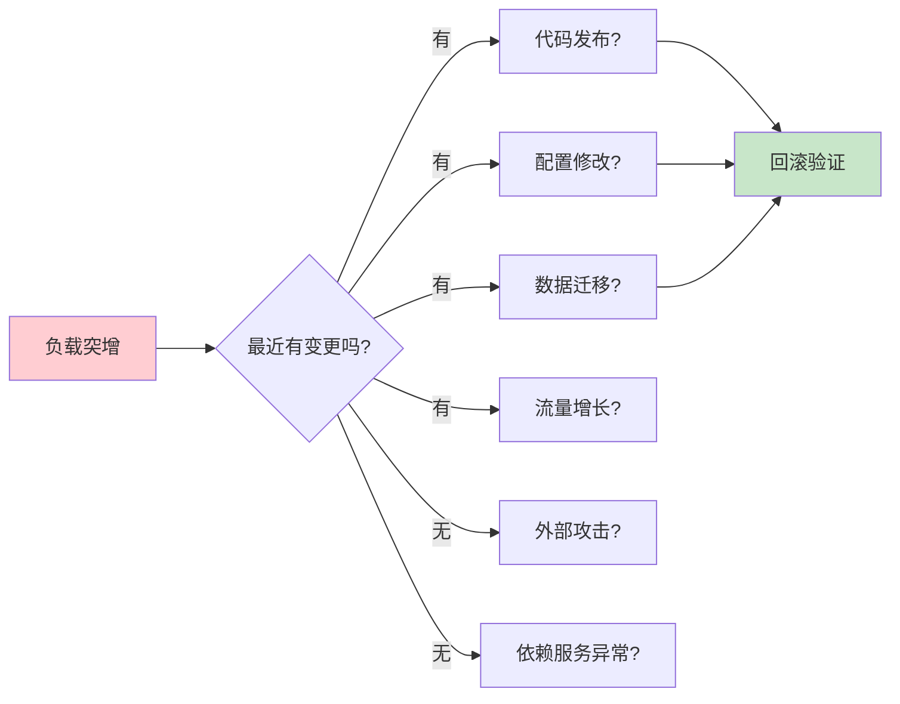
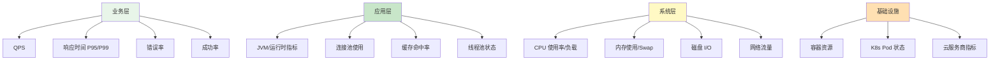

## 引言：什么是系统负载？

当你发现网站响应变慢、API 超时、用户投诉增加时，第一个反应是什么？

**查看系统负载。**

但"负载"这个词背后隐藏着复杂的含义。很多运维工程师和开发者在日常工作中会频繁提到"负载高"，却往往混淆了不同的概念。有人看到 CPU 使用率达到 80% 就紧张不已，有人则对 Load Average 超过 10 依然淡定自若。这种认知差异的根源在于，我们未能准确理解系统负载的本质。

```
负载 ≠ CPU 使用率
负载 ≠ 内存占用
负载 ≠ 请求数量

负载是系统资源需求与供给之间的平衡状态
```

要真正理解系统负载，我们需要从资源供需的角度来思考。想象一下高速公路的场景：车流量本身不是问题，问题是道路容量能否承载当前的车流。当车辆数量接近或超过道路设计容量时，就会出现拥堵——车辆排队等待通过，通行时间延长，整体效率下降。计算机系统也是如此，工作负载产生资源需求，而硬件和软件层提供资源供给，两者之间的动态平衡决定了系统的表现。

**系统负载的本质:**



这个流程图揭示了负载问题的核心机制。当资源供给充足时，请求能够被及时处理，系统表现出正常的响应速度。但一旦资源供给不足，请求就会进入排队状态，就像车辆在收费站前排起长队。排队的直接后果是延迟增加，用户感受到的就是页面加载缓慢、接口响应超时。更严重的是，随着排队队列的增长，系统处理新请求的能力下降，吞吐量随之降低，形成恶性循环。

理解这一机制后，我们就能明白为什么单纯关注某个指标（如 CPU 使用率）是不够的。CPU 使用率高可能是正常的批处理任务在运行，也可能是因为大量请求在等待 I/O 导致进程频繁切换。只有将利用率、饱和度和错误三个维度结合起来，才能全面评估系统的健康状态。

**关键问题：**

- 如何量化系统的负载状态？
- 哪些指标真正反映性能问题？
- 如何从海量监控数据中找到根因？
- 何时需要扩容，何时需要优化？

本文将带你深入系统负载分析的核心，掌握从指标采集到根因定位的完整方法论。我们将首先介绍 USE 方法这一系统性分析框架，然后逐一解析 CPU、内存、磁盘 I/O 和网络四大核心资源的负载指标。在此基础上，我们会探讨自上而下和自下而上两种分析方法论，并通过实际案例展示如何诊断常见的负载模式。最后，我们将讨论如何构建有效的监控告警体系，以及从短期应急到长期能力建设的优化策略。

## 第一部分：核心负载指标

### 1.1 USE 方法:系统性分析框架

在面对复杂的系统性能问题时,最忌讳的就是"头痛医头,脚痛医脚"。看到 CPU 高就优化代码,看到内存不足就加机器,这种零散的应对方式往往治标不治本。Brendan Gregg 提出的 USE 方法为我们提供了一套系统性的分析框架,帮助我们从全局视角审视系统资源的使用状况。

**USE 方法(Brendan Gregg 提出):**

```
对每个资源,检查三个指标:

U - Utilization(利用率):资源 busy 的时间比例
S - Saturation(饱和度):有多少工作在排队等待
E - Errors(错误):错误事件的数量
```

这三个指标看似简单,实则蕴含深刻的洞察。利用率告诉我们资源是否被充分利用,但它无法区分"健康的繁忙"和"危险的过载"。例如,一个专门用于视频编码的服务器,CPU 利用率长期维持在 90% 以上是正常现象,因为它的设计目标就是最大化计算能力。但对于一个 Web 应用服务器来说,同样的利用率可能意味着请求正在排队,用户体验正在恶化。

这就是引入饱和度指标的意义。饱和度反映了排队等待的程度,它直接关联到用户感知的延迟。当饱和度为零时,即使利用率很高,系统也能及时响应每个请求。但一旦饱和度开始上升,就意味着请求需要等待资源空闲才能被处理,延迟随之增加。饱和度的典型表现包括 CPU 的运行队列长度、磁盘 I/O 的队列深度、网络的丢包率等。

错误指标则帮助我们识别那些利用率和饱和度都无法捕捉的问题。某些错误不会导致资源使用率升高,也不会引起明显的排队,但它们会直接影响业务的正确性。例如,网络中的偶发丢包可能导致请求重试,虽然整体带宽利用率不高,但用户体验已经受到影响。又如,内存分配失败可能触发应用的降级逻辑,虽然内存使用率正常,但功能已经受损。

**为什么 USE 方法有效?**

| 维度 | 说明 | 例子 |
|------|------|------|
| **全面性** | 覆盖所有资源类型 | CPU、内存、磁盘、网络 |
| **系统性** | 避免遗漏关键指标 | 不仅看利用率,还看饱和度 |
| **可操作性** | 直接指导优化方向 | 高饱和 → 扩容或优化 |

USE 方法的强大之处在于它的普适性。无论是传统的物理服务器、虚拟机,还是现代的容器化环境、云原生架构,这套方法都适用。我们可以将系统中的每一个资源——CPU 核心、内存条、磁盘、网卡、甚至 GPU——都套用这个框架进行检查。这种系统性的检查避免了"只见树木不见森林"的陷阱,确保我们不会遗漏关键的瓶颈点。

在实际应用中,USE 方法通常与资源清单配合使用。我们需要先明确系统中有哪些资源需要监控,然后对每个资源分别采集利用率、饱和度和错误三类指标。这种结构化的思维方式,使得性能分析变得有章可循,而不是依赖个人的经验和直觉。

**资源清单:**



这张思维导图展示了常见系统资源的分类及其对应的关键指标。需要注意的是,不同类型的系统关注的重点资源可能不同。对于计算密集型应用(如机器学习训练、视频转码),CPU 和 GPU 是核心;对于数据库系统,磁盘 I/O 和内存更为关键;而对于微服务架构,网络连接数和带宽往往是瓶颈所在。因此,在实际应用中,我们需要根据业务特点调整监控的优先级。

接下来,我们将逐一深入探讨每类资源的负载指标,理解它们的含义、采集方法以及如何解读。

### 1.2 CPU 负载指标

CPU 作为计算机的核心计算资源,其负载状况直接影响系统的整体性能。然而,CPU 负载的分析远比看起来复杂。很多人习惯性地关注"CPU 使用率"这一个数字,却忽略了背后的细节。实际上,CPU 时间的分配、进程的调度行为、以及与其他资源的交互,都会影响我们对 CPU 负载的判断。

#### 利用率(Utilization)

**定义:** CPU 处于非空闲状态的时间比例。

在 Linux 系统中,CPU 时间被细分为多个类别,每一类都反映了不同的工作状态。理解这些细分项,有助于我们更准确地判断 CPU 负载的性质。

**Linux 中的分解:**

```
user%:   用户空间进程消耗
system%: 内核空间消耗
iowait%: 等待 I/O 完成的时间
steal%:  虚拟化环境中被其他 VM 抢占的时间
idle%:   空闲时间

总利用率 = 100% - idle% - steal%
```

user% 代表应用程序在用户空间执行指令所消耗的 CPU 时间。这是我们最关心的部分,因为它直接反映了业务逻辑的计算开销。如果 user% 持续偏高,通常意味着应用正在进行大量的计算工作,比如数据处理、加密解密、序列化等。

system% 则是内核态的 CPU 消耗,包括系统调用、中断处理、进程调度等。正常情况下,system% 应该远低于 user%,通常在 5%-10% 以内。如果 system% 异常升高,可能的原因包括:频繁的系统调用(如大量的文件读写操作)、高频率的中断(如网络包到达)、或者内核级别的锁竞争。

iowait% 是一个特别值得关注的指标。它表示 CPU 空闲但仍有未完成的磁盘 I/O 请求时的时间占比。换句话说,CPU 本身并不忙,它在等待磁盘返回数据。这种情况下,虽然 CPU 利用率看起来不高(因为 iowait 不计入 busy 时间),但系统性能已经受到 I/O 瓶颈的制约。识别 iowait% 偏高的情况,可以帮助我们快速定位问题方向——不是 CPU 不够用,而是磁盘太慢。

steal% 主要出现在虚拟化环境中。当多个虚拟机共享同一台物理主机时,hypervisor 需要在它们之间分配 CPU 时间片。如果某个 VM 需要的 CPU 时间超过了分配给它的份额,它就必须等待,这段时间就被计为 steal time。高 steal% 表明宿主机资源紧张,或者当前 VM 的 CPU 配额不足。在云环境中,这种现象被称为" noisy neighbor"(吵闹的邻居)问题。

**健康阈值:**

| 利用率范围 | 状态 | 建议 |
|-----------|------|------|
| 0-60% | 健康 | 正常 |
| 60-80% | 警告 | 关注趋势 |
| 80-90% | 危险 | 准备扩容 |
| >90% | 紧急 | 立即处理 |

这些阈值提供了一个大致的参考,但必须结合具体场景来理解。对于一个离线批处理任务来说,CPU 利用率达到 100% 是完全正常的,甚至是期望的——我们希望充分利用资源尽快完成任务。但对于一个在线服务而言,长期维持 90% 以上的利用率就非常危险,因为任何流量的突发增长都可能导致请求堆积,进而引发雪崩效应。

**注意:** 高利用率不一定是问题!

```
场景1:批处理任务,CPU 100%,但按时完成 ✓
场景2:Web 服务,CPU 100%,请求超时 ✗

关键看:是否影响业务 SLA
```

这个对比揭示了一个重要的原则:性能分析的最终目标是保障业务目标的达成,而不是追求某个指标的完美。在评估 CPU 负载时,我们必须将其与业务的 SLA(Service Level Agreement)结合起来。如果 CPU 利用率高但响应时间仍在可接受范围内,错误率也没有上升,那么这可能只是一个资源利用效率的问题,而非性能故障。反之,即使 CPU 利用率只有 50%,但如果 P99 延迟已经超过阈值,那同样是需要紧急处理的问题。

#### 饱和度(Saturation)

如果说利用率告诉我们 CPU "忙不忙",那么饱和度则告诉我们 CPU "忙得过来吗"。饱和度反映的是等待 CPU 资源的进程数量,它直接关系到请求的排队延迟。

**定义:** 等待 CPU 时间的进程数量。

在操作系统层面,CPU 饱和度主要通过两个指标来体现:运行队列长度和上下文切换频率。

**关键指标:**

```
运行队列长度(run queue length):
- top 命令中的 load average
- /proc/stat 中的 procs_running

上下文切换(context switches):
- vmstat 中的 cs
- 每秒切换次数
```

运行队列长度是指当前处于"可运行"状态的进程数量。这些进程已经准备好执行,只是在等待 CPU 时间片。理想情况下,运行队列长度应该小于或等于 CPU 核心数。如果运行队列长度持续超过核心数的两倍,就说明 CPU 资源已经明显不足,进程需要等待较长时间才能获得执行机会。

**Load Average 解读:**

Load Average 是 Unix/Linux 系统中最经典的负载指标之一,但它也是最容易被误解的指标。

```
uptime 输出:
load average: 1.50, 2.30, 3.20

分别表示:
- 过去 1 分钟的平均负载
- 过去 5 分钟的平均负载
- 过去 15 分钟的平均负载
```

这三个数字代表了不同时间窗口内的平均负载值。1 分钟的值反映了当前的即时状态,对短期波动敏感;15 分钟的值则体现了长期趋势,更加平滑稳定。通过对比这三个值,我们可以判断负载的变化方向。

**如何判断是否正常?**

Load Average 的绝对值本身意义有限,必须结合 CPU 核心数来解读。

```
经验法则:
Load Average / CPU 核心数

< 0.7:健康
0.7-1.0:正常
1.0-2.0:需要注意
> 2.0:可能存在瓶颈

例如:4 核 CPU
- Load = 2.0 → 50% 饱和,正常
- Load = 8.0 → 200% 饱和,严重过载
```

这个比值的含义是:平均每个 CPU 核心上有多少个进程在等待或运行。比值为 1.0 意味着每个核心恰好有一个进程在运行,没有排队。比值大于 1.0 说明有进程在排队等待 CPU 时间。比值越高,排队越严重,延迟也就越大。

需要注意的是,Load Average 在不同操作系统中的计算方式略有差异。在 Linux 中,它不仅包括处于运行状态的进程,还包括处于不可中断睡眠状态(D 状态)的进程。这意味着,如果系统中有大量进程在等待磁盘 I/O,Load Average 也会升高,即使 CPU 本身并不忙。这一点在分析负载时必须牢记,避免误判。

**趋势分析:**



通过观察 Load Average 的趋势变化,我们可以更早地发现潜在问题。如果 1 分钟负载明显高于 5 分钟负载,说明系统正在经历一波新的压力,可能是流量突增、定时任务启动、或者某个异常进程的出现。相反,如果 1 分钟负载低于 5 分钟负载,说明之前的压力正在消退,系统正在恢复。如果三个值接近且稳定,说明系统处于稳态,当前的负载水平是可预期的。

除了 Load Average,上下文切换频率也是衡量 CPU 饱和度的重要指标。上下文切换发生在操作系统从一个进程切换到另一个进程时,需要保存当前进程的状态并恢复下一个进程的状态。这个过程本身会消耗 CPU 时间,如果切换过于频繁,会导致大量的 CPU 开销浪费在调度上,而不是执行业务逻辑。

正常的上下文切换频率取决于系统的工作负载类型。对于一个单线程的应用,上下文切换应该很少。但对于一个高并发的 Web 服务器,每秒数千次的上下文切换是正常的。关键是要建立基线,观察相对变化。如果上下文切换频率突然翻倍,即使 CPU 利用率没有明显变化,也值得深入调查。

#### 错误(Errors)

CPU 层面的错误相对较少,但一旦发生,往往意味着严重的问题。

**常见 CPU 相关错误:**

```
- Soft lockup:内核线程长时间占用 CPU
- Hard lockup:完全无响应
- OOM Killer:内存不足杀死进程(间接相关)
- Throttling:CPU 降频(温度过高)
```

Soft lockup 是指内核线程连续占用 CPU 超过一定阈值(通常是 20 秒),导致其他任务无法得到调度。这通常是由于内核代码中存在死循环或者持有锁的时间过长。Hard lockup 则更加严重,整个系统完全无响应,连中断都无法处理,通常需要硬重启才能恢复。

CPU Throttling(降频)是现代处理器的自我保护机制。当 CPU 温度过高时,处理器会自动降低运行频率以减少发热。这会导致性能突然下降,表现为原本能轻松处理的工作负载现在变得吃力。在数据中心环境中,Throttling 通常暗示着散热系统存在问题,或者机房温度控制不当。

**检测命令:**

```bash
# 查看内核日志
dmesg | grep -i "lockup\|throttl"

# 查看 CPU 频率
cat /proc/cpuinfo | grep "MHz"

# 监控上下文切换
vmstat 1
```

通过这些命令,我们可以及时发现 CPU 层面的异常情况。特别是 `dmesg` 命令,它记录了内核的各种事件和错误信息,是排查底层问题的重要工具。

### 1.3 内存负载指标

内存管理的复杂性远超很多人的想象。与现代操作系统的虚拟内存机制、页面缓存、交换空间等特性相结合,内存负载的分析需要综合考虑多个维度。简单地看着"已用内存百分比"来判断内存是否充足,往往会得出错误的结论。

#### 利用率(Utilization)

要理解 Linux 的内存使用情况,首先需要澄清一个常见的误区:Linux 会尽可能多地利用空闲内存来做磁盘缓存。这意味着,当你看到 `free` 命令显示的"可用内存"很少时,并不意味着系统真的缺内存。那些被标记为"cached"或"buffers"的内存,在应用程序需要时可以迅速释放出来。

**Linux 内存模型:**

```
total = used + free + buffers/cache

used = applications + slab + page tables
free = 完全未使用的内存
buffers = 块设备缓存
cache = 页面缓存(文件内容)

可用内存 ≈ free + buffers + cache(可回收)
```

这个公式揭示了 Linux 内存分配的真相。`used` 部分包括了应用程序实际占用的内存、内核对象缓存(slab)以及页表等系统开销。`free` 是完全没有被使用的内存,这部分在正常运行系统中通常很小。关键在于 `buffers` 和 `cache`,它们是为了提升 I/O 性能而存在的,属于"借来的"内存,随时可以归还给应用程序。

因此,判断内存是否充足的正确方式是查看"available memory"(可用内存),而不是"free memory"(空闲内存)。在现代 Linux 发行版中,`free -h` 命令会直接显示 available 列,这个数字才是真正反映内存压力的指标。

**关键指标:**

| 指标 | 命令 | 含义 |
|------|------|------|
| **MemUsed%** | `free -m` | 应用实际占用 |
| **Cache%** | `free -m` | 文件系统缓存 |
| **SwapUsed** | `free -m` | 交换空间使用 |
| **Slab** | `slabtop` | 内核对象缓存 |

在这些指标中,Swap 的使用情况尤其值得关注。Swap 是磁盘上的一块空间,当物理内存不足时,操作系统会将部分不常用的内存页换出到 Swap 中。由于磁盘的速度远慢于内存,频繁的 Swap 活动会导致性能急剧下降。因此,一个健康的系统应该尽量避免使用 Swap,或者仅在极低频率下偶尔使用。

**健康判断:**

```
✓ MemUsed% < 80%:健康
⚠ MemUsed% 80-90%:关注
✗ MemUsed% > 90%:危险

但要注意:
- Linux 会充分利用空闲内存做 cache
- high cache% 是好事(减少磁盘 I/O)
- 关键是 available memory 是否充足
```

这里提到的 MemUsed% 指的是应用程序实际占用的内存比例,不包括 cache 和 buffers。如果这个值超过 90%,系统很可能已经开始面临内存压力,需要密切关注 Swap 的使用情况和 OOM Killer 的触发风险。

同时,我们也要理性看待高 Cache%。如果一个数据库服务器的 Cache% 达到 70%,这通常是好现象,说明操作系统正在利用多余内存缓存经常访问的数据文件,从而减少磁盘 I/O。只有当 Cache% 高且 available memory 低时,才需要担心。

#### 饱和度(Saturation)

内存饱和度的表现形式与 CPU 不同。内存本身不存在"排队"的概念,但当内存不足时,系统会通过多种机制来应对,这些机制带来的副作用就是饱和度的体现。

**Page Faults:**

页面错误(Page Fault)是内存管理中的核心概念。当程序访问一个虚拟内存地址时,如果对应的物理页面不在内存中,就会触发 Page Fault。操作系统需要根据情况处理这个异常。

```
Minor fault:页面在内存中,只需更新页表
Major fault:页面不在内存,需要磁盘 I/O

高频 major fault → 内存不足或内存碎片
```

Minor fault(次要错误)的处理非常快,因为数据已经在内存中,只是需要建立虚拟地址到物理地址的映射。这种情况在程序首次访问某段内存时很常见,属于正常现象。

Major fault(主要错误)则严重得多。它意味着所需的数据不在物理内存中,可能需要从磁盘读取(如果之前被换出到 Swap)或者从零分配并初始化。Major fault 涉及磁盘 I/O,耗时可能是 Minor fault 的数百倍甚至上千倍。如果系统中频繁出现 Major fault,说明内存严重不足,或者存在严重的内存碎片化问题。

我们可以通过 `/proc/vmstat` 文件查看系统的 Page Fault 统计信息,或者使用 `vmstat` 命令实时监控。

**Swap 活动:**

Swap 的使用情况是判断内存饱和度的直观指标。

```bash
# 监控 swap 进出
vmstat 1

si(swap in):从磁盘读入内存
so(swap out):从内存写入磁盘

持续非零值 → 严重内存压力
```

`vmstat` 命令输出的 `si` 和 `so` 列分别表示每秒从 Swap 换入和换出的数据量(以 KB 为单位)。在健康的系统中,这两个值应该长期为零或接近零。如果它们持续保持非零值,尤其是数值较大时,说明系统正在频繁地进行 Swap 交换,这会显著拖慢整体性能。

值得注意的是,偶尔的 Swap 活动不一定代表问题。例如,当一个长时间运行的后台任务被唤醒时,它的部分内存页可能已经被换出到 Swap,此时会发生一次性的换入操作。但只要这种活动不是持续性的,对性能的影响就有限。真正危险的是持续的、高频的 Swap 交换,这被称为"thrashing"(抖动),会导致系统几乎无法正常工作。

**OOM Score:**

当内存极度紧张时,Linux 内核会启动 OOM Killer(Out Of Memory Killer)机制,选择一个或多个进程强制终止,以释放内存。这是一个"壮士断腕"的最后手段,虽然能暂时缓解内存压力,但会导致服务中断和数据丢失。

```
# 查看进程的 OOM 分数
cat /proc/[pid]/oom_score

分数越高,越可能被 OOM Killer 选中
```

每个进程都有一个 OOM score,内核根据这个分数决定在内存不足时优先杀死哪个进程。分数的计算考虑了多个因素,包括进程占用的内存大小、运行时间、是否是 root 用户等。一般来说,占用内存越多、运行时间越短的进程,分数越高,越容易被选中。

通过监控关键进程的 OOM score,我们可以预判哪些服务面临被杀的风险,并提前采取措施,比如增加内存限制、优化内存使用,或者调整 OOM score 的手动权重(`/proc/[pid]/oom_score_adj`)。

#### 错误(Errors)

内存相关的错误通常具有灾难性的后果,因为它们往往导致服务中断或数据不一致。

```
- OOM Killer 触发
- Allocation failures
- Memory leaks(持续增长)
- Fragmentation(碎片化)
```

OOM Killer 的触发是最严重的内存错误。当系统可用内存耗尽,且无法通过回收 cache 或 Swap 来释放足够空间时,内核会被迫杀死进程。这不仅影响被杀死的进程本身,还可能波及依赖它的其他服务,引发连锁反应。

Memory leak(内存泄漏)是一种渐进式的问题。应用程序由于编程缺陷,不断分配内存但从未释放,导致内存占用持续增长。内存泄漏的隐蔽性在于,它在初期很难被发现,只有当积累到一定程度、触发 OOM 时才会暴露。因此,建立长期的内存使用趋势监控至关重要。

Fragmentation(内存碎片化)是指虽然总的可用内存足够,但由于分散在不连续的物理地址空间中,无法满足大块连续内存的分配请求。这在长期运行的系统中比较常见,尤其是那些频繁分配和释放不同大小内存块的应用。碎片化会导致分配失败率上升,即使 `free` 命令显示还有大量可用内存。

### 1.4 磁盘 I/O 负载指标

磁盘 I/O 往往是现代应用系统中最大的性能瓶颈。相比于 CPU 和内存的纳秒级操作,磁盘 I/O 的延迟通常在毫秒级,相差数个数量级。即使是高性能的 SSD,其随机读写性能也远不如顺序读写。因此,深入理解磁盘 I/O 的负载特征,对于优化系统性能至关重要。

#### 利用率(Utilization)

磁盘 I/O 的利用率反映了存储设备的忙碌程度。但与 CPU 不同,磁盘可以同时处理多个 I/O 请求(通过队列和并发机制),所以利用率的解读需要更加细致。

**关键指标:**

| 指标 | 含义 | 工具 |
|------|------|------|
| **%util** | 设备 busy 的时间比例 | `iostat -x` |
| **await** | I/O 请求平均等待时间(ms) | `iostat -x` |
| **svctm** | I/O 请求平均服务时间(ms) | `iostat -x` |

`%util` 是 `iostat -x` 命令输出的一个重要字段,表示在采样时间内,设备有 I/O 请求处于活跃状态的时间比例。如果 `%util` 接近 100%,说明设备几乎一直在处理 I/O 请求,没有空闲时间。但这并不一定意味着设备已经达到性能极限,因为现代存储设备支持命令队列和并行处理,即使在 100% util 的情况下,仍可能有余力处理更多请求。

`await` 是更直接的延迟指标,它表示从 I/O 请求发出到完成的平均时间,包括在队列中等待的时间和实际服务的时间。对于 SSD 来说,await 通常在 1ms 以下;对于传统 HDD,则在 5-10ms 左右。如果 await 显著高于这些基准值,说明 I/O 子系统存在瓶颈。

`svctm` 仅包含实际服务时间,不包括排队等待。在大多数情况下,我们应该更关注 `await`,因为它反映了用户实际体验到的延迟。`svctm` 的价值在于,通过对比 `await` 和 `svctm`,我们可以判断排队延迟的大小。如果 `await` 远大于 `svctm`,说明大部分时间花在等待上,队列可能过长。

**健康阈值:**

```
%util < 60%:健康
%util 60-80%:需要注意
%util > 80%:可能成为瓶颈

await < 10ms:优秀(SSD)
await < 20ms:良好(HDD)
await > 50ms:需要优化
```

这些阈值提供了初步的判断标准,但实际应用中需要结合具体的存储介质和工作负载类型。例如,对于大规模顺序读写场景(如日志聚合、数据备份),即使 `%util` 达到 90%,只要 `await` 保持在合理范围内,也是可以接受的。但对于随机读写为主的数据库负载,`%util` 超过 70% 就可能成为性能瓶颈。

#### 饱和度(Saturation)

磁盘 I/O 的饱和度主要体现在队列长度和吞吐能力上。当 I/O 请求的到达速率超过设备的处理能力时,请求会在队列中堆积,导致延迟增加。

**队列长度:**

```
avgqu-sz:平均队列长度

> 1-2:可能存在饱和
> 5:严重饱和
```

`avgqu-sz` 是 `iostat -x` 输出的另一个关键字段,表示采样时间内的平均队列长度。这个值反映了并发 I/O 请求的数量。对于单个磁盘设备,队列长度保持在 1-2 以内通常是健康的。如果队列长度持续超过 5,说明设备已经严重过载,新的 I/O 请求需要等待很长时间才能被处理。

需要注意的是,对于 RAID 阵列或由多个磁盘组成的存储池,队列长度的阈值可以适当放宽,因为这些设备具有更高的并发处理能力。但基本原则不变:队列长度与设备数量的比值应该保持在合理范围内。

**IOPS 和吞吐量:**

IOPS(Input/Output Operations Per Second)和吞吐量(Throughput)是衡量存储设备性能的两个核心指标,它们分别反映了设备处理小 IO 和大 IO 的能力。

```bash
iostat -x 1

rrqm/s, wrqm/s:合并的请求数
r/s, w/s:每秒读写次数(IOPS)
rkB/s, wkB/s:每秒读写吞吐量
```

`r/s` 和 `w/s` 分别表示每秒的读和写操作次数,即 IOPS。这个指标对于随机小 IO 场景(如数据库查询、元数据操作)尤为重要。传统 HDD 的随机 IOPS 通常在 100-200 左右,而高性能 SSD 可以达到数万甚至数十万 IOPS。

`rkB/s` 和 `wkB/s` 表示每秒读写的千字节数,即吞吐量。这个指标对于顺序大 IO 场景(如文件拷贝、日志写入)更为关键。HDD 的顺序吞吐量通常在 100-200 MB/s,SSD 则可以达到 500 MB/s 甚至更高(NVMe SSD 可达数 GB/s)。

理解 IOPS 和吞吐量的区别很重要,因为它们受限于不同的物理因素。IOPS 主要受限于寻道时间和旋转延迟(对于 HDD)或闪存单元的访问延迟(对于 SSD)。吞吐量则主要受限于数据传输带宽。一个设备可能 IOPS 很高但吞吐量有限(处理大量小文件),也可能吞吐量很高但 IOPS 较低(处理少量大文件)。

**判断瓶颈类型:**



这个决策树帮助我们根据监控指标快速定位 I/O 瓶颈的类型。如果 `%util` 很高但 `await` 尚可,说明设备的带宽已经接近极限,需要考虑升级硬件(如从 HDD 升级到 SSD,或使用 RAID 0/10 提升吞吐)。如果 `await` 很高,尤其是远高于 `svctm`,说明 I/O 请求在队列中等待时间过长,可能是随机 I/O 过多导致寻道开销大,此时应优化访问模式(如增加索引、批量操作)。如果队列长度异常高,说明并发 I/O 请求太多,超出了设备的并行处理能力,需要从应用层进行限流或优化查询逻辑。

#### 错误(Errors)

磁盘 I/O 错误通常预示着硬件故障或配置问题,需要立即关注。

```
- I/O errors:硬件故障
- Timeouts:请求超时
- Retries:重试次数
- Bad sectors:坏道
```

I/O errors 是最严重的错误类型,通常由硬件故障引起,如磁盘损坏、连接线松动、控制器故障等。这类错误会导致数据读写失败,可能引发数据丢失或服务中断。一旦发现 I/O errors,应立即检查硬件状态,必要时更换设备并从备份恢复数据。

Timeouts 表示 I/O 请求在规定时间内未完成而被系统放弃。这可能是由于设备响应过慢、驱动程序 bug、或者固件问题导致的。频繁的 timeouts 会影响应用的稳定性,需要深入排查根本原因。

Retries 是设备或驱动层面对失败请求的重试次数。少量的 retries 是正常的,尤其是在网络存储(NAS/SAN)环境中。但如果 retries 频率很高,说明底层存在不稳定因素,长期来看会增加延迟并降低可靠性。

Bad sectors(坏道)是磁盘表面物理损伤导致的不可用区域。现代硬盘都有备用扇区机制,可以自动映射坏道,但坏道数量的持续增长是磁盘即将失效的前兆。通过 `smartctl` 工具可以监控磁盘的 SMART 属性,提前预警潜在的硬件故障。

### 1.5 网络负载指标

在网络化日益深入的今天,网络已成为分布式系统的生命线。微服务架构、容器编排、云原生应用等都高度依赖网络通信。网络负载的分析不仅关乎带宽使用,更涉及连接管理、协议效率、以及网络拓扑的合理性。

#### 利用率(Utilization)

网络利用率的核心是带宽使用情况。与磁盘 I/O 类似,我们需要区分峰值利用率和平均利用率,并结合业务特点来判断是否合理。

**带宽使用:**

```
接收带宽:rx_bytes/s
发送带宽:tx_bytes/s

利用率 = 实际带宽 / 理论带宽

例如:1Gbps 网卡
- 使用 800Mbps → 80% 利用率
```

带宽利用率的计算相对直观,但有几个细节需要注意。首先,网络带宽通常以 bit(比特)为单位,而监控系统采集的数据多以 byte(字节)为单位,需要进行单位转换(1 byte = 8 bits)。其次,网卡的理论带宽是在理想条件下的最大值,实际可用带宽会受到协议开销(CPU 封装解包、校验和计算等)、MTU 设置、以及网络设备性能的影响。一般来说,持续超过 70% 的带宽利用率就应该引起警惕,因为这可能意味着网络正在成为瓶颈。

**包速率:**

```
pps(packets per second)

小包场景下,pps 可能先于带宽达到瓶颈
```

包速率(pps)是另一个重要的利用率指标,尤其在处理大量小包的场景中。网络设备(交换机、路由器、网卡)处理每个数据包都需要消耗 CPU 和内存资源,无论包的大小。因此,即使总带宽不高,如果 pps 过高,也可能导致设备过载。

例如,一个 1Gbps 的网卡,如果传输的都是 64 字节的最小以太网帧,理论上最大 pps 约为 1.48M。但实际上,由于协议栈处理和中断开销,很多网卡在 pps 达到几十万时就开始出现丢包或延迟抖动。对于微服务架构中的 RPC 调用、心跳检测等小包通信,pps 往往比带宽更早成为瓶颈。

#### 饱和度(Saturation)

网络饱和度的表现形式多样,包括丢包、重传、连接排队等。这些现象直接影响通信的可靠性和延迟。

**队列和丢包:**

```bash
# 查看网络统计
netstat -s

# 关键指标:
- retransmits:重传次数
- drops:丢弃的包
- errors:错误包
```

`netstat -s` 命令提供了丰富的网络统计信息,包括各协议层的详细计数。其中,重传(retransmits)和丢包(drops)是判断网络饱和度的关键指标。

TCP 协议通过重传来保证可靠性,少量的重传是正常的,尤其是在广域网环境中。但如果重传率(重传次数/总发送段数)超过 1-2%,就说明网络质量较差,可能存在拥塞、链路故障、或缓冲区溢出等问题。高频重传会导致有效吞吐量下降,因为带宽被浪费在重复发送相同的数据上。

丢包(drops)通常发生在网络设备(如交换机、路由器)或主机的网络栈中,当队列满时,新到达的包会被丢弃。丢包的后果比重传更严重,因为它可能导致 TCP 拥塞控制算法降低发送窗口,进一步减少吞吐量。持续的丢包需要通过调整缓冲区大小、优化路由、或升级网络设备来解决。

**连接数:**

TCP 连接的状态分布反映了应用的连接管理健康状况。

```
TCP 连接状态分布:
- ESTABLISHED:活跃连接
- TIME_WAIT:等待关闭
- CLOSE_WAIT:对方已关闭

TIME_WAIT 过多 → 端口耗尽风险
CLOSE_WAIT 过多 → 应用未正确关闭连接
```

ESTABLISHED 状态的连接是当前正在通信的连接,其数量应与业务的并发请求量相匹配。如果 ESTABLISHED 连接数异常高,可能是连接泄漏(创建了连接但未复用)或遭受了连接洪水攻击。

TIME_WAIT 状态出现在主动关闭连接的一方,持续时间通常为 2MSL(Maximum Segment Lifetime,约 60-120 秒)。这是为了确保网络上残留的旧数据包不会干扰新连接。在高并发短连接场景下(如 HTTP/1.0 请求),TIME_WAIT 连接可能大量累积,占用本地端口资源。当可用端口耗尽时,新连接将无法建立。解决方案包括:启用 TCP 连接复用(HTTP Keep-Alive)、调整 `tcp_tw_reuse` 内核参数、或使用连接池。

CLOSE_WAIT 状态表示远程端已关闭连接,但本地应用尚未调用 `close()` 释放 socket。这通常是应用程序的 bug,如忘记关闭连接、异常处理不当等。CLOSE_WAIT 连接会持续占用文件描述符和内存资源,长期累积可能导致资源泄漏。排查此类问题需要检查应用代码,确保在所有分支(包括异常路径)都正确关闭连接。

#### 错误(Errors)

网络错误的原因复杂多样,从物理层的光纤断裂到应用层的 DNS 解析失败,都可能影响通信质量。

```
- Packet loss:丢包
- Retransmissions:重传
- Connection resets:连接重置
- DNS resolution failures:DNS 解析失败
```

Packet loss 和 Retransmissions 已在前文讨论,这里不再赘述。

Connection resets(RST)表示连接被异常终止。RST 可能由多种原因触发:一方发送 RST 包主动断开、防火墙拦截、后端服务崩溃、或协议状态不一致。少量的 RST 是正常的,尤其是在客户端主动取消请求的场景下。但大规模的 RST 通常意味着系统性问题,如负载均衡器健康检查失败、后端服务频繁重启、或中间网络设备配置错误。

DNS resolution failures 在现代分布式系统中越来越常见。微服务之间通过服务名而非 IP 地址通信,依赖 DNS 进行服务发现。如果 DNS 解析失败或延迟过高,会导致服务间调用失败或超时。DNS 问题的典型表现包括:间歇性的连接失败、首包延迟增加、以及错误日志中出现 "Name or service not known" 等提示。解决 DNS 问题需要从多个层面入手:优化 DNS 缓存策略(TTL 设置)、部署本地 DNS 缓存(如 nscd、CoreDNS)、使用多个 DNS 服务器以提高可用性、以及监控 DNS 查询的延迟和成功率。

## 第二部分:负载分析方法论

掌握了各类资源的负载指标后,接下来的挑战是如何在出现问题时高效地定位根因。面对成百上千的监控指标和日志记录,如果没有系统性的分析方法,很容易陷入"数据海洋"中迷失方向。本节介绍四种经过实践验证的负载分析方法论,它们各有侧重,可以单独使用,也可以组合运用。

### 2.1 自上而下分析法

自上而下分析法是从业务表现出发,逐层向下追踪,直到找到系统层面的根本原因。这种方法的优势在于始终围绕业务影响展开,避免陷入无关的技术细节。

**思路:从业务指标到系统指标**



这个分层模型清晰地展示了问题定位的路径。我们从最顶层的业务指标开始,当发现异常时,逐步深入到下一层,直到找到具体的技术原因。每一层都有其代表性的指标和分析重点。

**步骤:**

**1. 确认问题现象**

在开始技术分析之前,首先要明确问题的具体表现。模糊的描述如"系统很慢"无法指导有效的排查。我们需要回答以下问题:

- 哪些用户受影响?是所有用户还是特定地域、特定终端类型的用户?
- 影响程度如何?延迟增加了多少?错误率上升到什么水平?是否有用户完全无法访问?
- 何时开始?是突然出现还是逐渐恶化?是否与某个时间点(如发布、促销活动)相关?

这些问题的答案将帮助我们确定问题的范围和紧急程度。如果只有少数用户受影响,可能是局部问题(如某个 CDN 节点故障);如果所有用户都受影响,则更可能是核心服务或基础设施的问题。

**2. 缩小范围**

明确了问题现象后,下一步是缩小排查范围。现代系统通常由多个服务组成,我们需要确定是哪个环节出了问题。

- **单个服务还是多个服务?** 如果只有一个服务的指标异常,问题很可能在该服务内部;如果多个服务同时异常,可能是共享的基础设施(如数据库、网络)出了问题。
- **特定接口还是全局?** 如果只有某个 API 接口变慢,可能是该接口的代码逻辑或依赖资源有问题;如果所有接口都变慢,可能是服务器整体负载过高。
- **特定时间段?** 观察问题的时间模式有助于定位原因。如果是周期性的(如每天固定时间),可能与定时任务或流量高峰有关;如果是随机的,可能是偶发的资源竞争或外部干扰。

**3. 逐层深入**

确定了问题所在的服务或模块后,我们开始逐层深入分析。

**应用层:** 首先检查应用的性能指标,如 QPS(每秒请求数)、响应时间的百分位值(P50、P95、P99)、错误码分布等。如果 QPS 正常但响应时间增加,说明每个请求的处理时间变长了,可能是资源瓶颈或代码效率问题。如果错误率上升,需要查看错误类型和堆栈信息,判断是业务逻辑错误还是基础设施错误。

**中间件层:** 接下来检查应用依赖的中间件,如数据库连接池、消息队列、缓存系统等。连接池耗尽会导致请求等待可用连接;缓存命中率下降会增加后端负载;消息队列积压会导致异步处理延迟。这些中间件的问题往往会被误认为是应用本身的问题,因此需要仔细区分。

**系统层:** 如果应用层和中间件层都没有明显异常,就需要检查操作系统层面的资源使用情况。这就是我们前面详细介绍的 CPU、内存、磁盘 I/O、网络四大类指标。通过 USE 方法系统地检查每个资源,找出利用率过高、饱和度过大或错误频发的资源。

**硬件层:** 最后,如果系统层指标也正常,可能需要检查硬件状态。虽然这种情况较少见,但硬件故障(如磁盘坏道、内存条损坏、网卡故障)确实会导致难以解释的性能问题。云环境中还需要考虑虚拟化层的资源争用(noisy neighbor)。

**4. 定位根因**

经过层层深入,我们最终应该能够定位到具体的根因。根因可能是一个具体的技术问题(如某个 SQL 查询缺少索引),也可能是一个架构设计缺陷(如单点故障、容量不足)。无论哪种情况,都需要提出明确的解决方案,并验证其有效性。

自上而下分析法的优点是目标明确,始终围绕业务影响展开,不会偏离方向。缺点是如果顶层指标采集不全或不够准确,可能会导致错误的判断。因此,建立完善的监控体系是使用这种方法的前提。

### 2.2 自下而上检查法

与自上而下相反,自下而上检查法是从系统底层资源开始,全面扫描所有可能的瓶颈点。这种方法适用于没有明确业务症状,但怀疑系统存在潜在问题的场景,或者用于定期的健康检查。

**思路:系统性检查所有资源**

自下而上的核心思想是"地毯式搜索",不放过任何一个可能的异常点。我们按照资源类型逐一检查,建立系统的健康档案。

**检查清单:**

```bash
# 1. CPU
top -bn1 | head -20
mpstat -P ALL 1 3

# 2. 内存
free -m
vmstat 1 5

# 3. 磁盘 I/O
iostat -x 1 5
iotop -o

# 4. 网络
sar -n DEV 1 5
ss -s

# 5. 进程
ps aux --sort=-%cpu | head -10
lsof -p [pid] | wc -l  # 文件描述符
```

这个清单涵盖了系统的主要资源维度。每个命令都有其特定的作用:

- `top` 提供实时的系统概览,包括 Load Average、CPU 使用率、内存使用、进程列表等。
- `mpstat` 显示每个 CPU 核心的详细使用情况,有助于发现负载不均的问题。
- `free` 和 `vmstat` 提供内存和 Swap 的使用情况,以及页面错误、上下文切换等指标。
- `iostat` 和 `iotop` 展示磁盘 I/O 的详细统计,包括利用率、等待时间、吞吐量等。
- `sar` 是系统活动报告工具,可以查看历史数据和实时数据,支持多种资源类型。
- `ss` 替代了传统的 `netstat`,提供更高效的网络连接统计。
- `ps` 和 `lsof` 帮助识别占用资源最多的进程及其打开的文件描述符数量。

**快速诊断脚本:**

为了简化日常检查,我们可以将常用命令整合成一个脚本:

```
#!/bin/bash
echo "=== System Load Check ==="
echo ""

echo "1. Load Average:"
uptime
echo ""

echo "2. Top CPU Processes:"
ps aux --sort=-%cpu | head -6
echo ""

echo "3. Memory Usage:"
free -h
echo ""

echo "4. Disk I/O:"
iostat -x 1 2 | tail -20
echo ""

echo "5. Network Stats:"
sar -n DEV 1 2 | tail -10
```

这个脚本可以在几秒钟内提供系统的关键健康指标,非常适合快速巡检。我们可以将其保存为 `check_load.sh`,并设置别名或定时执行。

**自下而上法的优势与局限:**

优势在于全面性,不会遗漏任何潜在的瓶颈点。即使没有明显的业务症状,也能发现系统中的隐患,如缓慢增长的内存泄漏、逐渐增加的磁盘碎片等。

局限在于耗时较长,且需要分析人员具备全面的系统知识,能够从大量数据中识别出真正的异常。此外,如果没有业务上下文,很难判断某个指标的异常是否真的会影响用户体验。

因此,自下而上法更适合与自上而下法结合使用:平时用自下而上法做定期健康检查,建立基线;出现问题时用自上而下法快速定位根因。

### 2.3 对比分析法

对比分析法是通过比较不同时间点、不同环境、或不同组件的指标差异,来发现问题线索的方法。人类的视觉和直觉非常擅长识别模式和异常,对比分析正是利用了这一特点。

**时间对比:**

最常见的时间对比是当前状态与历史基线的对比。

```
当前 vs 历史基线

例如:
- 今天 CPU 80%,昨天同一时间 40%
- 上周此时 I/O await 5ms,现在 50ms

工具:
- Grafana 时间范围对比
- Prometheus query_range
```

时间对比的价值在于揭示变化趋势。很多性能问题是渐进式的,如内存泄漏、数据增长导致的查询变慢、缓存失效等。通过与历史数据对比,我们可以更早地发现这些缓慢恶化的问题,而不是等到它们爆发时才察觉。

在 Grafana 等监控平台中,我们可以轻松地叠加多个时间范围的曲线,直观地看到差异。Prometheus 的 `query_range` API 也支持查询历史数据,便于程序化对比。

除了与历史对比,还可以对比不同时间段的模式。例如,工作日 vs 周末、白天 vs 夜晚、促销期 vs 平常期。这些对比有助于理解系统的负载特征,为容量规划提供依据。

**环境对比:**

环境对比是在不同的部署环境之间进行比较,如生产环境 vs 测试环境 vs 预发环境。

```
生产 vs 测试 vs 预发

如果只有生产有问题:
- 数据量差异?
- 流量模式不同?
- 配置不一致?
```

当一个问题只在生产环境出现,而在测试环境无法复现时,环境对比就显得尤为重要。常见的差异包括:

- **数据量**: 生产环境的数据量通常是测试环境的数十倍甚至数百倍,这会导致查询计划不同、索引效果不同、缓存命中率不同。
- **流量模式**: 生产的真实流量具有复杂的时间和空间分布,而测试流量往往是均匀的、简化的。
- **配置差异**: 由于安全考虑或历史原因,生产环境的配置(如 JVM 参数、连接池大小、超时时间)可能与测试环境不同。
- **硬件差异**: 生产服务器可能使用了不同的硬件型号、存储类型、网络拓扑。

通过系统地对比这些差异,我们可以找到导致问题的关键因素,并在测试环境中模拟生产条件,进行更有针对性的优化和测试。

**组件对比:**

组件对比是在同一系统的不同实例之间进行比较,如服务器 A vs 服务器 B、数据库主库 vs 从库、不同可用区的节点等。

```
服务器 A vs 服务器 B

如果 A 负载高,B 正常:
- 负载均衡不均?
- A 上有特殊进程?
- 硬件差异?
```

在分布式系统中,我们通常期望各个节点的负载是相对均衡的。如果某个节点明显高于其他节点,就说明存在不均衡问题。可能的原因包括:

- **负载均衡算法问题**: 轮询、加权轮询、最少连接等算法在某些场景下可能导致不均衡。
- **数据倾斜**: 某些节点处理的数据量或复杂度远高于其他节点,如分片键选择不当导致的热分片。
- **资源争用**: 某个节点上运行了额外的进程(如备份任务、日志收集),占用了共享资源。
- **硬件老化**: 某个节点的硬件性能下降,如磁盘坏道增多、CPU 降频等。

组件对比不仅可以帮助我们发现不均衡问题,还可以用于验证优化效果。例如,在对某个节点进行优化后,对比它与未优化节点的性能差异,就能直观地看到优化的收益。

**对比分析的最佳实践:**

- **建立基线**: 定期记录系统在正常状态下的指标,作为对比的基准。
- **标准化对比**: 确保对比的对象具有可比性,如相同的时间段、相同的负载水平、相同的配置。
- **多维度对比**: 不要只对比单一指标,要综合多个维度(利用率、饱和度、错误率)进行判断。
- **自动化对比**: 利用监控平台的对比功能或编写脚本,自动执行对比分析,提高效率。

### 2.4 变更关联法

变更关联法是基于一个简单但强大的假设:**大多数性能问题都是由最近的变更引起的**。无论是代码发布、配置修改、数据迁移,还是基础设施调整,变更都会打破系统原有的平衡,可能引入新的问题。

**检查最近的变更:**



这个决策树体现了变更关联法的核心逻辑:首先确认是否有变更,然后分类变更类型,最后通过回滚或逆向操作来验证因果关系。

**变更清单:**

为了有效地应用变更关联法,我们需要维护一份完整的变更记录,包括:

- **代码部署记录**: 每次发布的版本号、发布时间、发布人、变更内容(最好是 Git commit log 或 release notes)。
- **配置文件修改**: 哪些配置文件被修改、修改了什么参数、谁修改的、何时修改的。配置管理工具(如 Ansible、Terraform)可以帮助追踪这些变更。
- **数据库 schema 变更**: 表结构修改、索引增减、数据迁移等操作都应该有详细的记录和回滚方案。
- **基础设施调整**: 服务器扩容/缩容、网络拓扑变化、存储设备更换等基础设施的变更也需要记录在案。
- **第三方服务变更**: 依赖的外部 API、SaaS 服务、CDN 提供商等的变更或维护通知,都可能影响我们的系统。

**变更与问题的时间关联:**

一旦发现问题,立即检查变更时间线。如果问题出现的时间点与某个变更的时间点高度吻合(通常在几分钟到几小时内),那么这个变更就很可疑。

例如:
- 14:00 发布了新版本 v2.3.1
- 14:05 开始收到用户投诉,页面加载缓慢
- 14:10 监控显示 CPU 使用率从 40% 飙升到 90%

这种紧密的时间关联强烈暗示新版本引入了性能回归(performance regression)。此时,最快速的验证方法就是回滚到上一个版本,观察问题是否消失。

**回滚验证:**

回滚是验证变更因果关系的黄金标准。如果回滚后问题立即解决,就证实了变更是根因。回滚的策略包括:

- **代码回滚**: 恢复到上一个稳定的代码版本。
- **配置回滚**: 恢复修改前的配置参数。
- **数据回滚**: 如果有备份,可以恢复数据到变更前的状态(但这通常成本较高,仅在必要时使用)。
- **基础设施回滚**: 撤销扩容、迁移等操作,恢复到之前的架构。

需要注意的是,并非所有变更都可以轻易回滚。数据迁移、schema 变更等操作可能是不可逆的,或者回滚成本极高。因此,在执行这类变更前,必须充分测试并制定详细的回滚预案。

**无变更时的问题排查:**

如果确认最近没有任何变更,但问题依然出现,就需要考虑其他可能性:

- **外部攻击**: DDoS 攻击、爬虫风暴、恶意刷接口等都可能导致负载突增。检查流量来源、请求模式、IP 分布等,判断是否存在异常。
- **依赖服务异常**: 我们依赖的下游服务(如支付网关、短信服务、地图 API)出现故障或性能下降,会连锁影响我们的系统。检查依赖服务的状态页面、SLA 报告,或直接联系服务提供商。
- **自然增长**: 业务的自然增长(用户数增加、数据量膨胀)可能导致系统逐渐接近容量极限。这种情况下,问题不是突然出现的,而是有一个渐进的过程。
- **周期性事件**: 某些周期性事件(如月末结算、季度报表、年度促销)会带来可预期的负载高峰。如果容量规划不足,这些事件就可能触发性能问题。

**变更管理的最佳实践:**

为了减少变更引发的性能问题,建议采取以下措施:

- **灰度发布**: 先在小部分流量或少数节点上发布新版本,观察一段时间确认无问题后再全量发布。
- **性能测试**: 在发布前进行性能测试,对比新旧版本的性能指标,确保没有性能回归。
- **变更窗口**: 选择在低峰期进行变更,减少对用户的影响,并有充足的时间应对突发问题。
- **监控告警**: 在变更后的关键时期(如发布后 1 小时、24 小时),加强监控和告警,及时发现异常。
- **变更评审**: 对于重大变更,进行事前评审,评估潜在风险,制定应急预案。

变更关联法的强大之处在于它的简洁性和高效性。据统计,70%-80% 的生产问题都与最近的变更有关。因此,养成"先查变更"的习惯,可以大幅缩短问题排查时间。

## 第三部分:常见负载模式与诊断

在掌握了分析方法和指标体系后,我们通过几个典型的负载模式来实战演练。每种模式都有其独特的特征、常见原因和解决方案。理解这些模式,可以帮助我们在面对实际问题时快速归类,缩小排查范围。

### 3.1 CPU 密集型负载

CPU 密集型负载是指系统的瓶颈主要在 CPU 计算能力上。这类负载的特点是 CPU 利用率高,但 I/O 等待较低,因为进程大部分时间都在执行计算指令,而不是等待外部资源。

**特征:**

```
✓ user% 或 system% 高
✓ iowait% 低
✓ 运行队列长度适中
✓ 上下文切换正常
```

user% 高说明应用程序本身在进行大量计算,如数据处理、算法执行、加密解密等。system% 高则可能是内核态的操作频繁,如系统调用、中断处理。iowait% 低表明磁盘 I/O 不是瓶颈,CPU 不需要等待数据。运行队列长度适中说明虽然 CPU 忙,但还没有到严重排队的程度。上下文切换正常意味着进程调度开销可控。

**常见原因:**

| 原因 | 表现 | 解决方案 |
|------|------|---------|
| **计算密集任务** | 持续高 CPU | 优化算法、异步化 |
| **无限循环** | 单核 100% | 修复 bug |
| **频繁 GC** | Java 应用 system% 高 | 调优 JVM、减少对象创建 |
| **序列化/反序列化** | JSON/XML 处理 | 使用更高效格式(Protobuf) |
| **加密/解密** | SSL/TLS 握手 | 硬件加速、会话复用 |

计算密集任务是 CPU 高负载的最常见原因。例如,图像处理、视频编码、机器学习推理、复杂的数据聚合等操作都需要大量的 CPU 周期。如果这些任务是业务必需的,优化的方向就是提高算法效率(降低时间复杂度)、利用并行计算(多核、分布式)、或者将任务异步化(不阻塞主线程)。

无限循环是编程错误导致的极端情况。某个线程陷入死循环,独占一个 CPU 核心,导致该核心利用率达到 100%。这种情况通常伴随着应用功能异常(如页面无响应、接口超时)。通过 `top -H` 查看线程级别的 CPU 使用,可以快速定位到问题线程,然后通过线程 dump(jstack)找到对应的代码位置。

频繁的垃圾回收(GC)是 Java 应用中常见的 CPU 高负载原因。当堆内存不足或对象创建速率过快时,JVM 会频繁触发 GC,而 GC 过程需要暂停应用线程(STW,Stop-The-World)并消耗 CPU 资源进行标记和清理。表现为 system% 升高,应用响应延迟增加。解决方案包括:增加堆内存、优化对象生命周期(减少短命对象)、选择合适的 GC 算法(G1、ZGC)、调整 GC 参数。

序列化和反序列化是将对象转换为字节流(或反之)的过程,在 RPC 调用、缓存存储、消息传递中广泛使用。JSON 和 XML 是常见的序列化格式,但它们的解析效率较低,尤其是对于大型对象。如果系统中存在高频的序列化操作,CPU 开销会显著增加。优化方案是使用更高效的序列化框架,如 Protobuf、Avro、Kryo,它们的二进制格式更紧凑,解析速度更快。

加密和解密操作,特别是 SSL/TLS 握手,是 CPU 密集型的。每次 HTTPS 连接建立时,客户端和服务器都需要进行密钥交换、证书验证、对称密钥协商等操作,这些操作涉及大量的数学运算(如 RSA、ECDHE)。在高并发场景下,SSL 握手可能成为 CPU 瓶颈。优化手段包括:启用 TLS 会话复用(Session Resumption)、使用硬件加速(如 Intel QAT)、卸载到专用负载均衡器(Nginx、HAProxy)、采用更高效的加密算法(如 ChaCha20-Poly1305)。

**诊断工具:**

```bash
# 找出高 CPU 进程
top -c

# 查看线程级别
top -H -p [pid]

# Java 应用:线程 dump
jstack [pid]

# 性能剖析
perf top
perf record -g -p [pid]
perf report
```

`top -c` 显示完整的命令行,帮助我们识别是哪个进程占用了大量 CPU。`top -H -p [pid]` 进一步深入到线程级别,查看进程中哪个线程最耗 CPU。对于 Java 应用,`jstack` 可以生成线程 dump,显示每个线程的堆栈信息,从而定位到具体的代码行。

`perf` 是 Linux 下的性能分析神器。`perf top` 提供实时的函数级 CPU 热点图,显示哪些函数消耗了最多的 CPU 时间。`perf record` 记录一段时间内的性能数据,`perf report` 则以火焰图的形式展示调用栈,直观地揭示性能瓶颈所在的路径。

**案例分析:**

```
现象:Java 应用 CPU 突然从 30% 升到 90%

排查:
1. top 找到 PID 12345,CPU 90%
2. top -H -p 12345 找到线程 ID 12350
3. 转换线程 ID:printf "%x\n" 12350 → 0x303e
4. jstack 12345 | grep 0x303e
   发现线程在执行某个正则表达式匹配
5. 检查代码:正则表达式存在 Catastrophic Backtracking
6. 修复:优化正则表达式

结果:CPU 降回 30%
```

这个案例展示了 CPU 密集型问题的典型排查流程。关键点在于:
1. 从进程到线程的逐层深入
2. 线程 ID 的十六进制转换(top 显示的是十进制,jstack 需要十六进制)
3. 通过堆栈信息定位到具体代码
4. 识别出正则表达式的灾难性回溯(Catastrophic Backtracking)问题

灾难性回溯是正则表达式引擎在某些模式下(特别是包含嵌套量词时)可能出现指数级回溯的现象。例如,正则 `(a+)+b` 在匹配字符串 `aaaaaaaaac`(没有 b)时,会尝试所有可能的分组方式,导致回溯次数呈指数增长。修复方法是重写正则表达式,避免嵌套量词,或使用原子组(atomic group)、占有量词(possessive quantifier)等高级特性。

### 3.2 内存密集型负载

内存密集型负载的特征是内存使用持续增长,最终可能导致 OOM(Out Of Memory)。这类问题往往具有隐蔽性,因为在初期症状不明显,只有当内存接近耗尽时才会爆发。

**特征:**

```
✓ MemUsed% 持续增长
✓ Swap 使用增加
✓ Page faults 频繁
✓ 可能触发 OOM Killer
```

MemUsed% 持续增长是最明显的信号。如果内存使用曲线呈现单调上升趋势,没有明显的下降或波动,很可能存在内存泄漏。Swap 使用增加说明物理内存已经不足,操作系统开始将部分内存页换出到磁盘。Page faults 频繁(尤其是 major fault)表明内存访问模式不佳,或者内存严重不足。最终,如果内存完全耗尽,OOM Killer 会被触发,强制杀死某些进程以释放内存。

**常见原因:**

| 原因 | 表现 | 解决方案 |
|------|------|---------|
| **内存泄漏** | 内存单调增长 | 修复泄漏、重启缓解 |
| **缓存过大** | Cache% 高 | 限制缓存大小、LRU 策略 |
| **大数据集处理** | 峰值高 | 流式处理、分页加载 |
| **碎片化** | 可用内存少 | 内存池、紧凑分配 |
| **Buffer bloat** | 网络 buffer 大 | 调整 socket buffer |

内存泄漏是内存密集型问题的头号杀手。它可能由多种原因引起:未关闭的资源(文件句柄、数据库连接、HTTP 连接)、静态集合无限增长(如全局 Map、List)、监听器未注销、闭包引用等。内存泄漏的可怕之处在于它的渐进性:每天只泄漏几十 MB,短期内看不出问题,但几个月后就会耗尽内存。预防内存泄漏的最佳实践是:使用 try-with-resources 自动关闭资源、定期审查静态集合的大小、使用弱引用(WeakReference)打破循环引用、定期进行 heap dump 分析。

缓存是为了提升性能而牺牲内存的典型例子。合理的缓存可以大幅减少后端负载,但如果缓存策略不当(如无上限、无过期时间),缓存本身可能成为内存黑洞。解决方案是实现 LRU(Least Recently Used)淘汰策略、设置最大容量限制、为不同优先级的数据设置不同的 TTL(Time To Live)、定期清理过期缓存。

大数据集处理是指一次性加载大量数据到内存中进行处理。例如,导出百万级用户的 Excel 报表、全量数据聚合分析、大规模图像批处理等。如果数据集超过可用内存,就会导致 OOM。优化方案是采用流式处理(Streaming),边读边写,不将所有数据同时加载到内存;或者分页加载,每次只处理一小批数据;也可以使用外部排序、MapReduce 等分布式处理框架。

内存碎片化是指虽然总的可用内存足够,但由于分散在不连续的空闲块中,无法满足大块连续内存的分配请求。这在长期运行的系统中比较常见,尤其是那些频繁分配和释放不同大小内存块的应用。碎片化会导致分配失败率上升,即使 `free` 命令显示还有大量可用内存。缓解碎片化的方法包括:使用内存池(Memory Pool)预分配固定大小的内存块、采用紧凑的内存布局(如结构体数组而非数组结构体)、定期重启服务以重置内存状态。

Buffer bloat 是网络层面的内存问题。当网络带宽不足或延迟较高时,TCP 协议栈会增加发送和接收缓冲区的大小,以维持吞吐量。但如果缓冲区过大,会占用大量内存,并增加延迟(因为数据在缓冲区中排队等待发送)。Linux 内核提供了自动调整机制,但在某些场景下可能需要手动调整 `/proc/sys/net/ipv4/tcp_rmem` 和 `tcp_wmem` 参数,限制缓冲区的最大值。

**诊断工具:**

```bash
# 查看内存使用详情
cat /proc/meminfo

# 查看进程内存
smem -t -k

# Java heap dump
jmap -dump:format=b,file=heap.hprof [pid]

# 分析 heap
MAT (Memory Analyzer Tool)
```

`/proc/meminfo` 提供了系统内存的详细分解,包括总内存、空闲内存、缓存、slab、页面表等各项指标。`smem` 是一个更友好的内存统计工具,它可以按进程、用户、映射等维度汇总内存使用情况,并区分 RSS( Resident Set Size)、PSS(Proportional Set Size)、USS(Unique Set Size)等不同口径。

对于 Java 应用,`jmap` 可以生成 heap dump,这是分析内存泄漏的核心工具。heap dump 包含了堆中所有对象的快照,包括它们的类型、大小、引用关系。使用 MAT(Memory Analyzer Tool)、VisualVM、JProfiler 等工具打开 heap dump,可以进行深入的分析:查找支配树(Dominator Tree)识别占用内存最多的对象、对比多个时间点的 dump 找出持续增长的对象类型、追踪引用链(GC Roots)定位泄漏源头。

**内存泄漏检测:**

```
1. 监控内存趋势(Grafana)
2. 定期 heap dump
3. 对比不同时间点的 dump
4. 查找持续增长的对象
5. 追踪引用链,找到泄漏点
```

这是一个系统化的内存泄漏检测流程。首先,通过监控系统(如 Grafana)观察内存使用的长期趋势,确认是否存在持续增长的模式。然后,定期(如每隔几小时)生成 heap dump,保存多个时间点的数据。使用 MAT 等工具对比这些 dump,找出数量或大小持续增长的对象类型。最后,通过 GC Roots 追踪这些对象的引用链,找到是谁在持有它们的引用,从而定位到泄漏的代码位置。

### 3.3 I/O 密集型负载

**特征:**

```
✓ iowait% 高
✓ %util 接近 100%
✓ await 时间长
✓ 队列长度大
```

**常见原因:**

| 原因 | 表现 | 解决方案 |
|------|------|---------|
| **大量小文件读写** | IOPS 高，吞吐低 | 合并文件、使用 SSD |
| **日志写入频繁** | 持续写 I/O | 异步日志、批量写入 |
| **数据库全表扫描** | 随机读多 | 添加索引、优化查询 |
| **Swap 活动** | si/so 非零 | 增加内存、限制进程 |
| **备份任务** | 阶段性高峰 | 限速、错峰执行 |

**诊断工具:**

```bash
# 实时 I/O 监控
iotop -o

# 详细 I/O 统计
iostat -x 1

# 查看进程 I/O
pidstat -d 1

# 跟踪 I/O 调用
strace -p [pid] -e trace=read,write
```

**案例分析:**

```
现象：数据库服务器 I/O wait 80%

排查：
1. iostat -x 发现 sda %util 95%, await 100ms
2. iotop 发现 mysqld 进程大量读取
3. 查看慢查询日志：多个全表扫描
4. EXPLAIN 分析：缺少索引
5. 添加复合索引

结果：I/O wait 降到 10%，查询速度提升 10 倍
```

### 3.4 网络密集型负载

网络密集型负载是指系统的瓶颈在网络通信上。随着微服务架构的普及,服务间的 RPC 调用、消息传递、数据同步等操作都依赖网络,网络问题会直接影响分布式系统的整体性能。

**特征:**

```
✓ 带宽利用率高
✓ 丢包或重传增加
✓ 连接数激增
✓ 延迟抖动
```

带宽利用率高说明网络链路接近饱和,新的数据传输需要排队等待。丢包或重传增加表明网络质量下降,可能是拥塞、链路故障、或缓冲区溢出导致的。连接数激增可能是正常的业务增长,也可能是连接泄漏或攻击行为。延迟抖动(jitter)是指网络延迟的不稳定性,忽高忽低,这对实时性要求高的应用(如视频通话、在线游戏)影响极大。

**常见原因:**

| 原因 | 表现 | 解决方案 |
|------|------|---------|
| **大文件传输** | 带宽饱和 | CDN、压缩、分片 |
| **DDoS 攻击** | 连接数暴增 | WAF、限流、黑洞路由 |
| **微服务调用风暴** | 内部流量大 | 服务网格、缓存、批处理 |
| **DNS 问题** | 解析慢 | 本地缓存、备用 DNS |
| **MTU 不匹配** | 分片多 | 统一 MTU、Path MTU Discovery |

大文件传输(如视频流、软件更新包、数据集下载)会迅速占满网络带宽,导致其他请求延迟增加。解决方案包括:使用 CDN(Content Delivery Network)将内容分发到边缘节点,减少主干网压力;启用压缩(Gzip、Brotli)减少传输数据量;采用分片上传/下载,支持断点续传;实施带宽限制(QoS),保证关键业务的带宽优先权。

DDoS(Distributed Denial of Service)攻击是通过海量伪造请求淹没目标系统,使其无法正常服务合法用户。表现为连接数暴增、带宽饱和、CPU/内存资源耗尽。防御 DDoS 需要多层措施:在网络层使用 WAF(Web Application Firewall)过滤恶意流量、实施速率限制(Rate Limiting)、启用 SYN Cookie 抵御 SYN Flood;在架构层使用 Anycast 分散攻击流量、设置黑洞路由丢弃攻击流量;在云服务商层面启用 DDoS 防护服务(如 AWS Shield、阿里云 DDoS 防护)。

微服务调用风暴是指在微服务架构中,服务间的 RPC 调用产生的巨大网络流量。一个用户请求可能触发数十个服务间的调用,如果设计不当(如同步调用链过长、缺乏缓存、重复调用),网络开销会远超业务逻辑本身的计算开销。优化方案包括:引入服务网格(Service Mesh,如 Istio、Linkerd)管理服务间通信、实施缓存策略(本地缓存、分布式缓存)减少远程调用、采用批处理和异步化降低调用频率、优化服务粒度避免过度拆分。

DNS 问题在现代分布式系统中越来越突出。微服务通过服务名而非 IP 地址通信,依赖 DNS 进行服务发现。如果 DNS 解析失败或延迟过高,会导致服务间调用失败或超时。DNS 问题的典型表现包括:间歇性的连接失败、首包延迟增加、错误日志中出现 "Name or service not known"。解决方案包括:优化 DNS 缓存策略(调整 TTL、使用 nscd/CoreDNS 等本地缓存)、配置多个 DNS 服务器提高可用性、监控 DNS 查询的延迟和成功率、在服务网格中使用 Sidecar 代理绕过 DNS。

MTU(Maximum Transmission Unit)不匹配会导致 IP 分片。MTU 是网络链路能传输的最大数据包大小,以太网的标准 MTU 是 1500 字节。如果发送端发出的包超过路径上某个链路的 MTU,就会被分片成多个小包。分片会增加协议开销、降低传输效率、提高丢包风险(任何一个分片丢失都会导致整个包重传)。Path MTU Discovery(PMTUD)机制可以自动探测路径上的最小 MTU,但某些防火墙会阻止 ICMP 消息,导致 PMTUD 失效。最佳实践是:在整个网络中统一 MTU 设置(如都使用 1500 或都启用 Jumbo Frame 9000)、在应用层控制发送包的大小、监控分片率并告警。

**诊断工具:**

```bash
# 网络流量
iftop
nethogs

# 连接统计
ss -s
ss -tan | awk '{print $1}' | sort | uniq -c

# 抓包分析
tcpdump -i eth0 -w capture.pcap
wireshark capture.pcap

# DNS 测试
dig example.com
```

`iftop` 显示实时的网络流量,按连接对(source-destination)展示带宽使用情况,有助于识别流量大户。`nethogs` 按进程显示网络流量,可以直接看到哪个进程占用了多少带宽。`ss` 是新一代的网络连接统计工具,比 `netstat` 更高效。`ss -s` 显示总体统计(各状态的连接数),`ss -tan` 列出所有 TCP 连接,结合 `awk` 和 `uniq` 可以统计各状态的分布。

`tcpdump` 是命令行下的抓包工具,可以捕获指定网卡、指定条件的网络包,保存为 pcap 文件。`wireshark` 是图形化的抓包分析工具,提供强大的解码、过滤、统计功能,适合深入分析复杂的网络问题。抓包分析是网络问题排查的终极手段,但需要一定的网络协议知识。

`dig` 是 DNS 查询工具,可以测试 DNS 解析的延迟和正确性。`dig example.com` 显示完整的解析过程,包括查询时间、返回的 IP 地址、权威服务器等信息。通过对比不同 DNS 服务器的解析结果,可以判断是否存在 DNS 污染或缓存不一致的问题。

## 第四部分:负载监控与告警

监控和告警是负载管理的眼睛和耳朵。没有完善的监控,我们就像盲人摸象,无法全面了解系统状态;没有精准的告警,我们无法及时发现问题,只能在用户投诉后才被动响应。本节讨论如何构建有效的监控告警体系。

### 4.1 监控指标体系

监控不是越多越好,而是要有层次、有重点。一个好的监控体系应该覆盖从业务到基础设施的各个层面,形成完整的可观测性(Observability)。

**分层监控:**



这个四层监控模型体现了从外到内、从抽象到具体的监控思路。

**业务层**监控关注的是用户体验和业务目标。QPS(Queries Per Second)反映系统的负载强度;响应时间的百分位值(P50、P95、P99)比平均值更能反映真实体验,因为平均值会被极端值拉偏;错误率和成功率直接衡量系统的可靠性。这些指标通常通过应用埋点(APM)或日志分析获得。

**应用层**监控关注的是运行时环境和中间件。对于 Java 应用,JVM 指标(堆内存使用、GC 次数和时间、线程数)至关重要;连接池使用率反映数据库或其他外部资源的访问压力;缓存命中率决定后端负载的高低;线程池状态(活跃线程数、队列长度、拒绝次数)揭示并发处理能力。这些指标帮助我们从应用内部视角理解性能瓶颈。

**系统层**监控就是我们前面详细讨论的 CPU、内存、磁盘 I/O、网络四大类指标。这是操作系统层面的基础监控,通常通过 node_exporter、collectd、telegraf 等代理采集。

**基础设施层**监控针对现代化的部署环境。容器资源(CPU limit/usage、内存 limit/usage)帮助我们发现资源限制是否合理;K8s Pod 状态(Running、CrashLoopBackOff、OOMKilled)反映应用的健康状况;云服务商指标(EC2 状态、RDS 性能、ELB 流量)提供托管服务的可视性。

**黄金指标(Google SRE):**

Google 在《Site Reliability Engineering》一书中提出了"四个黄金信号"(Four Golden Signals),这是监控设计的黄金法则:

```
1. Latency(延迟):请求处理时间
2. Traffic(流量):系统负载(QPS、带宽)
3. Errors(错误):失败率
4. Saturation(饱和度):资源使用程度
```

这四个指标涵盖了性能监控的核心维度。Latency 直接反映用户体验;Traffic 帮助我们理解负载规模和趋势;Errors 衡量系统的可靠性;Saturation 预测未来的瓶颈。任何监控系统都应该至少包含这四个维度的指标。

### 4.2 告警策略设计

告警的目的是在问题影响用户之前通知工程师,以便及时干预。但告警设计是一门艺术:告警太少会漏掉重要问题,告警太多会导致"告警疲劳"(Alert Fatigue),工程师会对告警麻木,甚至忽略真正紧急的告警。

**告警分级:**

| 级别 | 响应时间 | 例子 |
|------|---------|------|
| **P0 紧急** | 立即 | 服务不可用、数据丢失 |
| **P1 高** | 15 分钟 | CPU > 95%、错误率 > 5% |
| **P2 中** | 1 小时 | CPU > 80%、延迟增加 |
| **P3 低** | 工作日 | 趋势预警、容量规划 |

告警分级的核心是根据问题的紧急程度和影响范围,设定不同的响应时间要求。P0 级别需要立即响应,通常通过电话、短信通知 on-call 工程师;P1 级别要求在 15 分钟内响应,可以通过 IM(如 Slack、钉钉);P2 级别可以在 1 小时内处理,邮件通知即可;P3 级别是非紧急的提醒,可以在工作时间内处理。

**告警规则示例(Prometheus):**

```
# CPU 使用率过高
- alert: HighCpuUsage
  expr: 100 - (avg by(instance) (rate(node_cpu_seconds_total{mode="idle"}[5m])) * 100) > 85
  for: 10m
  labels:
    severity: warning
  annotations:
    summary: "CPU 使用率超过 85%"

# 内存不足
- alert: LowMemory
  expr: (node_memory_MemAvailable_bytes / node_memory_MemTotal_bytes) * 100 < 10
  for: 5m
  labels:
    severity: critical
  annotations:
    summary: "可用内存低于 10%"

# 磁盘 I/O 等待过高
- alert: HighIoWait
  expr: rate(node_cpu_seconds_total{mode="iowait"}[5m]) > 0.2
  for: 15m
  labels:
    severity: warning
  annotations:
    summary: "I/O wait 超过 20%"

# 磁盘空间不足
- alert: DiskSpaceLow
  expr: (node_filesystem_avail_bytes / node_filesystem_size_bytes) * 100 < 15
  for: 10m
  labels:
    severity: warning
  annotations:
    summary: "磁盘空间低于 15%"
```

这些 Prometheus 告警规则展示了如何定义阈值、持续时间、严重级别和描述信息。关键点包括:

- **expr**: PromQL 表达式,定义触发条件。例如,`rate(node_cpu_seconds_total{mode="idle"}[5m])` 计算过去 5 分钟的平均空闲 CPU 比例。
- **for**: 持续时间,要求条件持续满足这么久才触发告警。这可以避免瞬时波动导致的误报。
- **labels.severity**: 严重级别,用于告警路由和分级。
- **annotations**: 告警的描述信息,包括 summary(简短摘要)和 description(详细说明),帮助工程师快速理解问题。

### 4.3 避免告警疲劳

告警疲劳是监控系统面临的最大挑战之一。当工程师每天收到几十甚至上百条告警时,他们会逐渐对告警产生免疫力,开始忽略或延迟处理,最终导致真正紧急的问题被遗漏。

**问题:** 太多告警导致忽略真正重要的。

**最佳实践:**

```
1. 基于症状而非原因告警
   ✗ CPU > 80%
   ✓ 响应时间 P99 > 500ms

2. 设置合理的持续时间(for)
   避免瞬时波动触发

3. 告警分组和抑制
   相关告警合并

4. 定期审查和调整
   删除无用告警
   调整阈值

5. 提供 actionable 信息
   告警中包含:
   - 发生了什么
   - 影响范围
   - 建议操作
   - 相关链接
```

**基于症状而非原因告警**是避免告警疲劳的首要原则。CPU > 80% 是一个"原因"指标,它告诉我们资源使用率高,但不告诉我们是否真的有问题。也许 CPU 高是因为正常的批处理任务,也许系统仍然能够快速响应请求。相反,响应时间 P99 > 500ms 是一个"症状"指标,它直接反映用户体验受损,无论根本原因是什么,都需要立即关注。因此,告警应该基于对用户有实际影响的指标(延迟、错误率、吞吐量),而不是底层的资源指标。

**设置合理的持续时间**可以减少瞬时波动导致的误报。例如,CPU 使用率偶尔飙升到 90% 持续几秒钟是正常的,但如果持续 10 分钟以上,就说明存在问题。`for` 参数的设置需要根据指标的特性和业务容忍度来权衡:太短会误报多,太长会延迟发现。

**告警分组和抑制**是将相关的告警合并,避免轰炸。例如,当一台服务器宕机时,可能会触发 CPU、内存、磁盘、网络等多个告警。通过告警分组,可以将这些告警合并为一条"服务器不可用"的告警。告警抑制是指当一个高级别告警触发时,抑制相关的低级别告警。例如,当"服务不可用"(P0)告警触发时,抑制"CPU 高"(P2)告警,因为前者已经包含了后者的信息。

**定期审查和调整**是保持告警系统健康的关键。建议每季度进行一次告警审查:统计告警数量、响应时间、误报率;删除从未触发或触发后无需操作的告警;调整阈值以减少误报;根据业务变化新增必要的告警。目标是保持告警的"信噪比"高,每条告警都值得关注和行动。

**提供 actionable 信息**是让告警真正发挥作用的关键。一条好的告警应该告诉工程师:发生了什么(问题描述)、影响范围(哪些用户/服务受影响)、建议操作(如何处理)、相关链接(监控面板、runbook、联系人)。这样工程师收到告警后,可以立即采取行动,而不是花费大量时间调查背景信息。

## 第五部分:负载优化策略

负载优化的目标是在满足业务需求的前提下,最大化资源利用效率,最小化成本和风险。优化策略可以分为三个层次:短期应急措施(救火)、中期优化方案(治病)、长期能力建设(养生)。

### 5.1 短期应急措施

**目标:快速恢复服务**

当系统出现严重的负载问题时,首要任务是尽快恢复服务,减少对用户的影响。这时候不应该追求完美的解决方案,而是采取最快见效的应急措施。

```
graph LR
    A[负载过高] --> B{紧急措施}
    B --> C[限流/降级]
    B --> D[重启服务]
    B --> E[临时扩容]
    B --> F[kill 异常进程]
    
    C --> G[恢复服务]
    D --> G
    E --> G
    F --> G
    
    style A fill:#ffcdd2
    style G fill:#c8e6c9
```

这个决策树展示了常见的应急措施。选择哪种措施取决于问题的性质和可用的资源。

**具体措施:**

**1. 限流(Rate Limiting):**

限流是通过限制请求速率来保护系统不被过载的一种手段。当系统负载过高时,主动拒绝部分请求,保证剩余请求能够得到及时处理。

```nginx
# Nginx 限流
limit_req_zone $binary_remote_addr zone=one:10m rate=10r/s;

location /api/ {
    limit_req zone=one burst=20 nodelay;
}
```

这段 Nginx 配置实现了一个简单的限流策略:`limit_req_zone` 定义了一个名为 `one` 的限流区域,基于客户端 IP(`$binary_remote_addr`)进行区分,每个 IP 每秒最多允许 10 个请求。`limit_req` 在实际 location 中应用限流,`burst=20` 允许突发 20 个请求,`nodelay` 表示不延迟处理突发请求。

限流的策略有多种:基于 IP 的限流(防止单个用户滥用)、基于用户的限流(需要认证)、基于接口的限流(保护脆弱接口)、全局限流(保护整体容量)。限流的副作用是会拒绝部分请求,返回 429(Too Many Requests)或 503(Service Unavailable)错误,因此需要在限流的同时提供友好的错误提示和重试机制。

**2. 服务降级:**

服务降级是指在负载过高时,暂时关闭非核心功能,以保证核心功能的可用性。这是一种"舍车保帅"的策略。

```
- 关闭非核心功能
- 返回缓存数据
- 简化响应内容
- 延迟非关键任务
```

例如,一个电商网站在促销高峰期,可以关闭推荐系统、评论功能、个性化排序等非核心功能,只保留商品浏览、下单、支付等核心流程。或者,当数据库负载过高时,可以暂时返回缓存的商品信息,而不是实时查询数据库。服务降级需要提前设计好降级开关和降级后的行为,确保在紧急情况下可以快速执行。

**3. 重启服务:**

重启是最简单粗暴但往往最有效的应急措施。它可以清除内存泄漏、重置连接池、释放锁资源、终止异常进程。

```
# 优雅重启
systemctl restart service

# 滚动重启(K8s)
kubectl rollout restart deployment/app
```

"优雅重启"(Graceful Restart)是指在重启前先停止接收新请求,等待现有请求处理完毕,然后再重启进程。这样可以避免中断正在处理的请求。在 K8s 环境中,`rollout restart` 会逐个重启 Pod,保证服务始终有部分实例可用,实现零停机重启。

重启的局限是它只是暂时缓解问题,如果根因(如代码 bug、配置错误)没有解决,问题很快会再次出现。因此,重启后应该立即着手排查根因,而不是依赖定期重启作为长期方案。

**4. 临时扩容:**

临时扩容是通过增加资源来提升系统承载能力的方法。在云环境中,扩容可以非常快速地完成。

```
# K8s 手动扩容
kubectl scale deployment app --replicas=10

# 云主机快速创建
aws ec2 run-instances ...
```

K8s 的 `scale` 命令可以快速增加 Deployment 的副本数,从 5 个扩展到 10 个,负载均衡器会自动将流量分发到新的实例。云服务商提供的 Auto Scaling Group(自动伸缩组)可以根据 CPU、内存等指标自动扩容缩容。

临时扩容的优点是见效快,缺点是成本高(增加了资源消耗),并且可能掩盖真正的性能问题。因此,扩容应该是应急手段,而不是长期的优化策略。扩容后应该分析为什么需要这么多资源,是否有优化空间。

### 5.2 中期优化方案

**目标:提升系统承载能力**

中期优化方案着眼于从根本上提升系统的性能和容量,而不是临时应对。这需要投入时间和资源进行代码重构、架构调整、配置优化等工作。

**代码层面:**

```
1. 算法优化
   - 降低时间复杂度
   - 减少不必要的计算

2. 缓存策略
   - 多级缓存(本地 + Redis)
   - 缓存预热
   - 合理的 TTL

3. 异步化处理
   - 消息队列解耦
   - 后台任务
   - 事件驱动

4. 连接池优化
   - 数据库连接池
   - HTTP 连接复用
   - 合理的大小配置
```

**算法优化**是性能优化的根本。很多性能问题源于低效的算法,如 O(n²) 的嵌套循环、重复计算、不必要的数据拷贝。通过优化算法(如使用哈希表替代线性搜索、动态规划避免重复计算、惰性求值减少中间结果),可以获得数量级的性能提升。算法优化需要对业务逻辑有深入的理解,找出计算瓶颈所在。

**缓存策略**是提升性能最有效的手段之一。缓存的核心思想是"用空间换时间",将计算结果或远程数据存储在快速访问的介质中,避免重复计算或远程调用。多级缓存(本地缓存 + 分布式缓存)可以兼顾速度和一致性:本地缓存(如 Guava Cache、Caffeine)速度极快,但容量有限且多实例间不一致;分布式缓存(如 Redis、Memcached)容量大且共享,但有网络开销。缓存预热是在系统启动或低峰期预先加载热点数据到缓存,避免冷启动时的缓存穿透。TTL(Time To Live)的设置需要权衡一致性和性能:TTL 太短会导致缓存频繁失效,增加后端负载;TTL 太长会导致数据过时,影响业务正确性。

**异步化处理**是将同步阻塞的操作改为异步非阻塞,提升系统的并发能力。消息队列(如 Kafka、RabbitMQ、RocketMQ)是异步化的核心组件,它将生产者(发送消息)和消费者(处理消息)解耦,生产者不需要等待消费者处理完成,可以立即返回。异步化适用于非实时性要求的场景,如发送通知、生成报表、数据同步等。后台任务(Background Job)是将耗时的操作放到后台线程或进程中执行,不阻塞主线程。事件驱动(Event-Driven)架构是通过事件总线(Event Bus)传递事件,各个服务订阅感兴趣的事件并做出响应,实现松耦合的系统集成。

**连接池优化**是减少资源创建开销的重要手段。数据库连接、HTTP 连接、Redis 连接等的建立都需要消耗时间和资源(握手、认证、分配资源)。连接池预先创建一批连接,保存在池中,应用需要时直接从池中获取,使用完毕后归还,避免了频繁创建和销毁连接的开销。连接池的大小配置需要根据并发量和响应时间来权衡:太小会导致请求等待可用连接,太大会占用过多资源。一般经验法则是:连接池大小 = (核心数 × 2) + 有效磁盘数,但这只是起点,需要根据实际压测结果调整。

**架构层面:**

```
1. 读写分离
2. 分库分表
3. CDN 加速
4. 负载均衡优化
5. 服务拆分(微服务)
```

**读写分离**是将读请求和写请求分发到不同的数据库实例。主库(Master)负责写操作,从库(Slave)负责读操作。这样可以减轻主库的压力,提升读性能。读写分离适用于读多写少的场景(如博客、新闻网站)。挑战在于数据一致性:从库的数据同步有延迟,可能导致读到旧数据。解决方案包括:强制关键查询走主库、使用半同步复制减少延迟、在应用层处理一致性需求。

**分库分表**是将一个大表水平或垂直拆分成多个小表,分布到不同的数据库实例。水平分表是按行拆分(如按用户 ID 取模),垂直分表是按列拆分(将常用字段和不常用字段分开)。分库分表可以突破单机的存储和性能限制,支持海量数据。挑战在于跨分片的查询(JOIN、聚合)变得复杂,需要应用层组装或使用中间件(如 ShardingSphere、MyCAT)。

**CDN 加速**是将静态资源(图片、CSS、JS、视频)分发到全球各地的边缘节点,用户从最近的节点获取资源,减少延迟和主干网带宽压力。CDN 特别适合内容分发型应用(如视频网站、新闻资讯)。现代 CDN 还支持动态内容加速、SSL 卸载、WAF 等功能。

**负载均衡优化**是将流量均匀分发到多个后端实例,避免单点过载。负载均衡算法包括:轮询(Round Robin)、加权轮询(Weighted Round Robin)、最少连接(Least Connections)、IP Hash(会话保持)、响应时间(最快响应)。选择合适的算法需要考虑业务特点:如果需要会话保持,使用 IP Hash;如果后端性能差异大,使用加权轮询;如果追求最低延迟,使用响应时间算法。

**服务拆分(微服务)**是将单体应用拆分为多个独立的服务,每个服务负责一个业务领域。微服务的好处是可以独立开发、部署、扩展,技术栈灵活,故障隔离。但微服务也带来了复杂性:服务间通信开销、分布式事务、服务发现、配置管理等。因此,服务拆分需要谨慎,遵循"单一职责"和"高内聚低耦合"原则,避免过度拆分导致的"分布式单体"。

**配置层面:**

```
1. JVM 参数调优
2. 线程池大小调整
3. 超时时间优化
4. 重试策略
5. 内核参数调整
```

配置优化是成本最低、见效最快的优化手段。JVM 参数调优包括:堆内存大小(-Xms、-Xmx)、GC 算法选择(-XX:+UseG1GC)、GC 日志记录等。线程池大小调整需要根据并发量和任务类型(CPU 密集型 vs I/O 密集型)来确定。超时时间优化是设置合理的超时阈值,既不过长(导致资源占用过久)也不过短(导致误判失败)。重试策略需要设置重试次数、退避间隔(Exponential Backoff)、熔断机制,避免重试风暴。内核参数调整包括:TCP 缓冲区大小、文件描述符限制、网络连接追踪表大小等,这些参数会影响系统的并发能力和网络性能。

### 5.3 长期能力建设

**目标:构建弹性系统**

长期能力建设着眼于构建一个能够自我适应、自我修复、自我优化的弹性系统(Resilient System)。这需要从组织、流程、技术多个维度进行投入。

**容量规划:**

```
1. 建立基线
   - 正常负载下的资源使用
   - 峰值负载特征

2. 预测增长
   - 业务增长趋势
   - 季节性波动

3. 预留缓冲
   - 保持 30-50% 余量
   - 应对突发流量

4. 自动化扩容
   - HPA(Horizontal Pod Autoscaler)
   - 云自动伸缩组
```

容量规划是确保系统有足够资源支撑业务发展的基础工作。建立基线是通过长期监控,了解系统在正常负载和峰值负载下的资源使用情况,形成参考标准。预测增长是基于业务发展计划(如用户增长、营销活动、新功能上线),预估未来的负载需求。预留缓冲是为了应对不确定性,通常保持 30-50% 的资源余量,这样在流量突增时有足够的缓冲空间。自动化扩容是通过 HPA(K8s 的水平 Pod 自动伸缩)或云服务商的 Auto Scaling Group,根据实时负载自动调整实例数量,实现弹性伸缩。

**混沌工程:**

```
定期注入故障,验证系统韧性:

- CPU 压力测试
- 内存泄漏模拟
- 网络延迟注入
- 磁盘 I/O 限制

工具:Chaos Mesh、LitmusChaos
```

混沌工程(Chaos Engineering)是通过主动注入故障,验证系统在异常情况下的表现,发现潜在的弱点。它的理念是:"与其等待故障发生,不如主动制造故障"。常见的混沌实验包括:CPU 压力测试(模拟高负载)、内存泄漏模拟(验证 OOM 处理)、网络延迟注入(测试超时和重试)、磁盘 I/O 限制(验证降级策略)、杀死 Pod 或节点(测试故障转移)。通过定期进行混沌实验,可以发现系统中的单点故障、资源泄漏、配置缺陷等问题,并在它们引发真实事故之前修复。Chaos Mesh 和 LitmusChaos 是流行的混沌工程平台,提供了丰富的故障注入能力和实验管理功能。

**性能测试常态化:**

```
1. 基准测试:单次性能评估
2. 负载测试:逐步增加负载
3. 压力测试:超出正常负载
4. 稳定性测试:长时间运行

集成到 CI/CD 流程
```

性能测试不应该是一次性的活动,而应该成为开发和发布流程的常规环节。基准测试(Benchmark)是评估系统在标准负载下的性能基线,用于对比不同版本的变化。负载测试(Load Test)是逐步增加负载,观察系统在不同负载下的表现,找出性能瓶颈和最大承载能力。压力测试(Stress Test)是将负载推到超出正常范围,测试系统的极限和崩溃点。稳定性测试(Stability Test 或 Soak Test)是让系统在中等负载下长时间运行(如 24-72 小时),检测内存泄漏、资源泄漏等渐进式问题。将这些测试集成到 CI/CD 流程中,每次代码提交或发布前自动执行,确保没有性能回归。

**可观测性建设:**

```
1. 完善的监控覆盖
2. 分布式追踪
3. 结构化日志
4. 自动化根因分析
5. 智能告警(AIOps)
```

可观测性(Observability)是继监控之后的新一代运维理念。传统的监控是"已知未知"(Known Unknowns),我们知道要监控什么(如 CPU、内存),但不知道何时会出问题。可观测性是"未知未知"(Unknown Unknowns),我们通过收集丰富的数据(指标、日志、追踪),能够在出现问题时快速探索和诊断,即使是我们从未见过的问题。

完善的监控覆盖是基础,确保所有关键组件都有指标采集。分布式追踪(Distributed Tracing)是跟踪一个请求在整个分布式系统中的流转路径,记录每个服务的处理时间和依赖关系,帮助定位延迟瓶颈。工具包括 Jaeger、Zipkin、SkyWalking。结构化日志(Structured Logging)是将日志以 JSON 等结构化格式输出,便于机器解析和分析,而不是纯文本。自动化根因分析是利用机器学习算法,自动分析监控数据,识别异常模式,推测可能的根因,减少人工排查时间。智能告警(AIOps)是基于历史数据和机器学习,动态调整告警阈值,减少误报,实现更精准的告警。

## 结语:负载分析的艺术

系统负载分析既是科学,也是艺术。

**科学的一面:**
- 明确的指标体系
- 系统化的分析方法
- 可重复的诊断流程

**艺术的一面:**
- 经验的积累
- 直觉的判断
- 对业务的理解

负载本身不是问题,**不可控的负载**才是问题。一个设计良好的系统,应该能够预见负载的变化,并做出相应的调整:在负载低时节约资源,在负载高时弹性扩容,在负载异常时快速降级。

通过持续的监控、分析和优化,我们可以:

- 提前发现潜在风险
- 快速定位性能瓶颈
- 构建弹性的系统架构

---

- 系统负载的核心指标:CPU、内存、I/O、网络的 USE 方法
- Load Average 的正确解读与饱和度分析
- 自上而下和自下而上的负载分析方法论
- 四种常见负载模式(CPU/内存/I/O/网络密集型)的诊断
- 监控告警体系设计与避免告警疲劳的最佳实践
- 从短期应急到长期能力建设的优化策略
