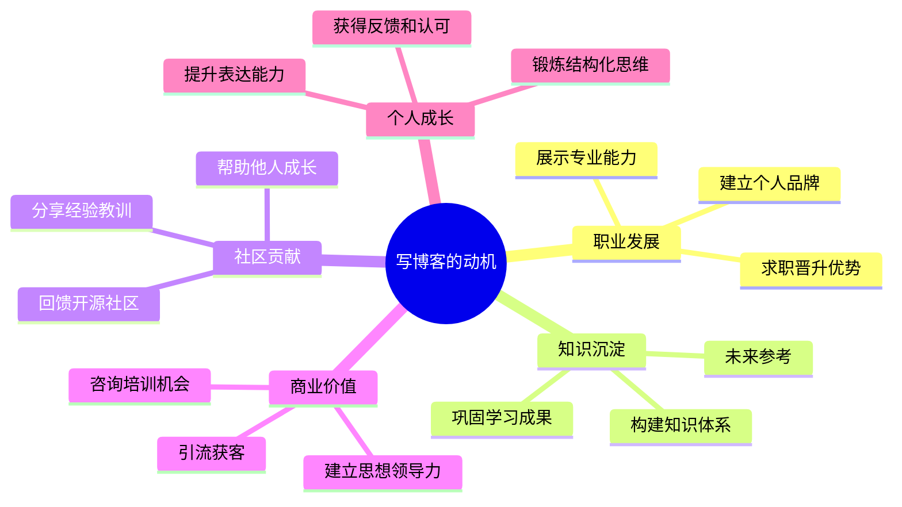
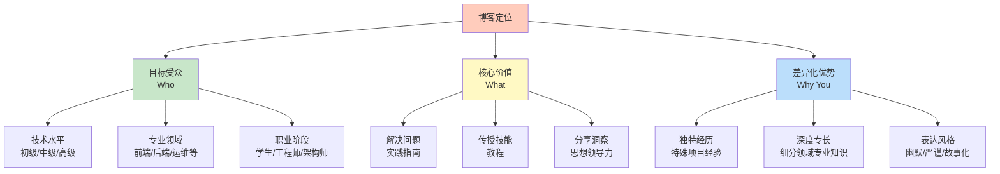
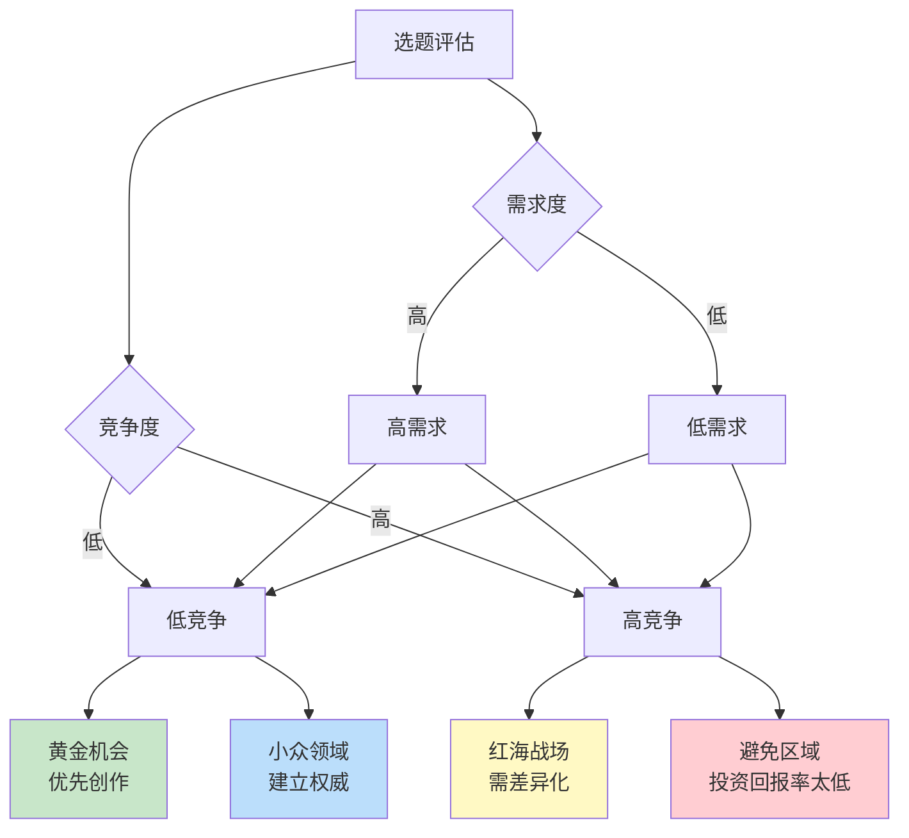
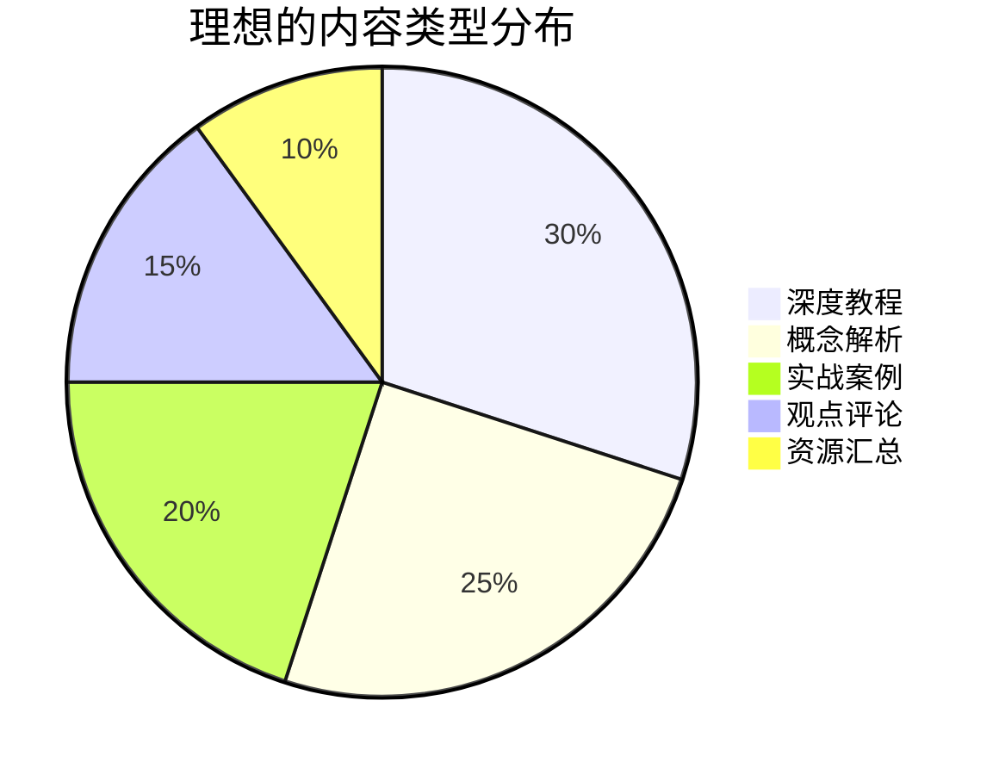
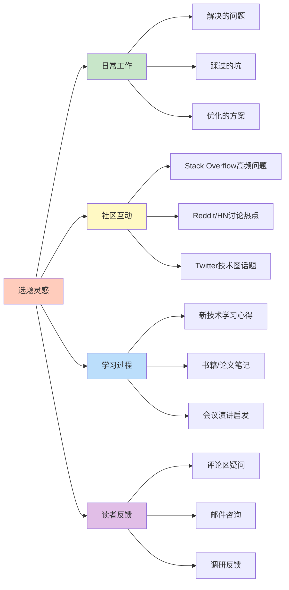
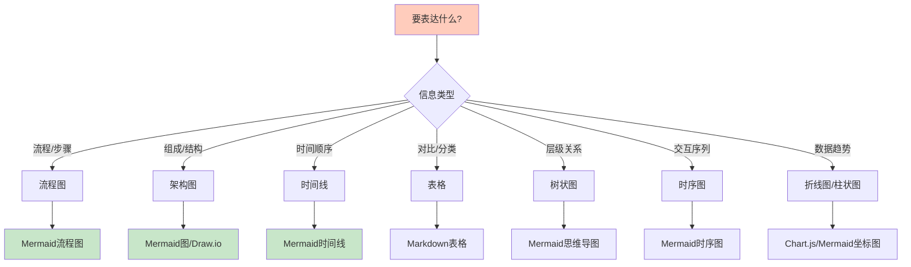

## 引言：为什么你要写技术博客？

在数字化时代，技术博客已经成为开发者展示专业能力、沉淀知识资产和建立个人品牌的重要载体。然而，许多技术人员在开始写作时往往缺乏清晰的战略规划，导致内容零散、受众模糊，最终难以持续。

在深入探讨具体的创作方法之前，我们需要先回答一个根本问题：为什么要投入时间和精力写技术博客？这个问题的答案将直接影响你的内容策略、写作风格和长期坚持的动力。

### 常见的写作动机

不同背景的开发者有着不同的写作驱动力。理解自己的核心动机，有助于在遇到瓶颈时保持方向感。



**职业发展维度**：对于处于职业上升期的工程师而言，技术博客是展示专业能力的最佳舞台。通过系统性地输出高质量内容，你可以在特定领域建立起"专家"形象，这在求职面试、内部晋升或自由职业接单时都能带来显著优势。招聘经理和技术负责人往往会通过候选人的博客来评估其技术深度、沟通能力和学习热情。

**知识沉淀维度**：费曼学习法告诉我们，最好的学习方式就是教会别人。当你尝试将一个复杂的技术概念用通俗易懂的语言表达出来时，你被迫重新梳理知识结构，填补认知盲区。这种"以教促学"的过程能够将短期记忆转化为长期记忆，同时帮助你构建系统化的知识框架，而非碎片化的知识点。

**社区贡献维度**：开源精神的核心在于分享与协作。许多开发者在解决棘手问题后，会将解决方案整理成博客文章，帮助其他遇到同样困境的人。这种利他行为不仅能获得社区的认可和尊重，还能建立起高质量的同行网络，为未来的合作创造机会。

**商业价值维度**：对于独立开发者、技术顾问或创业者来说，博客是低成本获客的有效渠道。通过持续输出有价值的内容，你可以吸引潜在客户，展示专业能力，并最终转化为咨询项目、培训课程或产品销售机会。这种"内容营销"的方式比传统广告更具可信度和可持续性。

**个人成长维度**：写作本身就是一种高强度的思维训练。它要求你具备清晰的逻辑结构、准确的表达能力和对读者需求的敏锐洞察。长期坚持写作能够显著提升你的沟通能力、批判性思维和影响力，这些软技能在技术职业生涯中同样至关重要。

### 数据说话：博客带来的实际收益

理论上的好处可能显得抽象，让我们用数据来验证技术博客的实际价值：

| 收益类型 | 具体影响 | 数据来源 |
|---------|---------|---------|
| 职业机会 | 73%的技术招聘经理会查看候选人博客 | Stack Overflow Survey 2023 |
| 薪资提升 | 有技术博客的开发者平均薪资高15-20% | HackerRank Report |
| 网络扩展 | 博客作者获得的LinkedIn连接数是普通用户的3倍 | LinkedIn Data |
| 学习强化 | 写作可将知识保留率从10%提升到90% | Learning Pyramid研究 |
| 商业转化 | B2B企业中，博客是前三的内容营销渠道 | Content Marketing Institute |

这些数据揭示了一个重要事实：技术博客不仅仅是"锦上添花"的个人爱好，而是能够带来实质性职业回报的战略投资。

### 但现实是残酷的

尽管好处显而易见，但大多数技术博客都以失败告终：

- **90%的技术博客在发布3篇文章后就停止了**。这种现象被称为"博客死亡谷"，通常发生在作者发现写作比预期更困难、反馈不如预期热烈时。
- **平均每篇技术博客的阅读时间只有2.5分钟**。这意味着如果文章内容不够吸引人或缺乏清晰的结构，读者会在扫视几段后就离开。
- **只有5%的博客能建立起稳定的读者群体**。绝大多数博客停留在"自说自话"的阶段，无法形成有效的传播和互动。

### 差距在哪里？

通过分析大量成功和失败的技术博客案例，我们发现失败的根源通常不在于技术水平，而在于以下几个关键维度的缺失：

**清晰的定位和受众定义**：许多博主试图"写给所有人看"，结果谁都无法满足。没有明确的目标读者，就无法确定内容的深度、广度和表达方式。

**系统的内容策略**：随机选题、不定期更新、缺乏主题聚焦，这样的博客难以建立读者预期，也无法在搜索引擎中获得良好的排名。

**有效的传播方法**：即使写出了优质内容，如果不懂得如何通过社交媒体、邮件列表、技术社区等渠道进行推广，文章的影响力也会大打折扣。

**持续的运营机制**：博客不是一次性的项目，而是需要长期投入的"产品"。缺乏数据分析、用户反馈收集和内容迭代机制，就难以持续改进和优化。

### 本文的价值主张

本文将提供一套经过验证的系统方法，帮助你避开上述陷阱，创作出有价值、有影响力、可持续的技术博客。我们将按照以下五个阶段展开：

1. **战略规划**：明确定位、定义内容支柱、设定可衡量目标
2. **内容策划**：选题策略、内容类型组合、建立选题库
3. **内容创作**：文章结构、写作技巧、代码示例、视觉元素
4. **优化与发布**：SEO优化、多渠道推广、数据驱动改进
5. **长期运营**：内容更新、建立飞轮效应、变现策略

每个阶段都包含具体的方法论、实操工具和案例分析，确保你能够将理论转化为行动。无论你是刚刚开始写作的新手，还是希望提升影响力的资深博主，都能从中获得有价值的见解。

现在，让我们进入第一阶段：战略规划。

## 第一阶段：战略规划

战略规划是技术博客成功的基石。就像建造房屋需要先有蓝图一样，博客创作也需要在动笔之前明确方向、目标和路径。这一阶段的核心任务是回答三个关键问题：为谁写（目标受众）、写什么（内容定位）、以及为何写（价值主张）。

### 1.1 明确你的博客定位

博客定位决定了你内容的边界和特色。一个清晰的定位能够帮助你在众多博客中脱颖而出，吸引到真正需要你的内容的读者群体。

#### 定位三要素模型

有效的博客定位包含三个相互关联的要素：目标受众（Who）、核心价值（What）和差异化优势（Why You）。这三个要素共同构成了你的"定位三角"，缺一不可。



**目标受众（Who）**：这是定位的起点。你需要尽可能具体地描述你的理想读者画像，包括他们的技术水平、专业领域、职业阶段、面临的挑战和学习目标。例如，"3-5年经验的前端工程师"比"程序员"要具体得多；"正在准备系统架构师面试的中高级开发者"比"想学习架构的人"更有针对性。

**核心价值（What）**：明确你为读者提供的主要价值类型。是帮助他们解决具体的技术问题（如调试技巧、性能优化）？还是传授系统化的技能（如完整的技术栈教程）？亦或是分享行业洞察和最佳实践（如技术选型决策、架构演进经验）？不同的价值类型对应不同的内容形式和表达方式。

**差异化优势（Why You）**：在众多同主题博客中，读者为什么要选择你的内容？这可能是基于你独特的项目经历（如在大规模分布式系统中的实战经验）、深度的技术专长（如对某个框架源码的深入研究），或者是独特的表达风格（如善于用类比解释复杂概念、幽默风趣的叙述方式）。找到并强化这个差异化点，是建立个人品牌的关键。

#### 定位练习：完成你的定位陈述

为了将抽象的定位转化为具体的行动指南，请尝试完成以下定位陈述模板：

```
我的博客主要帮助 [目标受众] 
解决 [具体问题/挑战]
通过 [你的独特方法/视角]
让他们能够 [期望的结果]
```

这个练习的价值在于迫使你从模糊的想法转向精确的表达。每一个括号中的内容都需要经过深思熟虑，并且要能够经得起读者的检验。

#### 案例对比：模糊定位 vs 清晰定位

让我们通过两个对比案例来理解定位的重要性：

**❌ 模糊的定位：**
```
> "我写各种技术文章，包括前端、后端、数据库等等。"
```
这种表述存在三个致命问题：

**第一，受众不明确**。"各种技术文章"意味着没有特定的目标读者群体。初学者会觉得内容太深，高级开发者会觉得内容太浅，最终谁都无法满足。

**第二，价值不清晰**。读者无法从这句话中了解到阅读你的博客能获得什么具体帮助。是学习新技能？解决bug？还是了解行业趋势？

**第三，无差异化**。互联网上已经有数以万计的技术博客覆盖这些主题，你的博客与它们有何不同？如果没有明确的差异化，读者没有理由选择你而非其他更知名、更权威的博客。

**✅ 清晰的定位：**
```
> "我的博客帮助3-5年经验的前端工程师深入理解React底层原理和性能优化，通过实际案例和源码分析，让他们能够独立解决复杂的技术难题并成长为团队技术骨干。"
```
这个定位的优势体现在：

**目标明确**：精准锁定"3-5年经验的前端工程师"这个群体。这个阶段的学习者已经掌握了基础，但尚未达到专家水平，他们有强烈的进阶需求，也具备理解深度内容的能力。

**价值具体**：明确指出能帮助读者"解决复杂的技术难题"和"成长为团队技术骨干"。这两个结果都是目标受众高度关注的职业发展痛点。

**方法独特**：强调"源码分析"和"实战案例"，这与那些只讲API用法的入门教程形成鲜明对比，体现了内容的深度和实用性。

当你有了这样清晰的定位后，后续的选题决策、内容深度、表达方式都会变得更加容易判断。每篇文章都可以问自己："这对3-5年前端工程师理解React底层原理有帮助吗？"如果答案是否定的，那么这篇文章可能就不适合你的博客。

#### 定位的动态调整

需要注意的是，定位并非一成不变。随着你自身能力的成长、市场需求的变化以及读者反馈的积累，你可能需要适时调整定位。但这种调整应该是渐进式的，而非跳跃式的。例如，从"React性能优化"扩展到"前端性能优化体系"是合理的演进，但从"前端开发"突然跳到"人工智能算法"就会让老读者感到困惑，也难以建立新的读者群体。

建议在博客运行6-12个月后，进行一次定位复盘。分析哪些类型的内容最受欢迎、哪些话题引发了最多的讨论、哪些文章带来了最多的订阅者。这些数据将帮助你验证初始定位的有效性，并为下一步的调整提供依据。

### 1.2 定义内容支柱（Content Pillars）

在明确了博客的整体定位后，下一步是将其细化为具体的内容支柱。内容支柱是你博客的3-5个核心主题领域，所有内容都围绕这些支柱展开。这个概念类似于杂志的专栏设置，每个专栏都有明确的主题边界，但又共同服务于杂志的整体定位。

#### 为什么需要内容支柱？

内容支柱的存在解决了技术博客创作中的几个关键问题：

**保持内容聚焦和一致性**：没有内容支柱的博客容易陷入"想到什么写什么"的随机状态，导致主题分散、读者困惑。内容支柱就像 guardrails，确保你的内容始终在既定轨道上运行。

**建立专业权威性**：当读者发现你在某个领域持续输出高质量内容时，他们会逐渐将你视为该领域的专家。这种权威性的建立需要时间和一致性，而内容支柱提供了必要的框架。

**便于读者形成预期**：稳定的内容结构让读者知道可以从你的博客中获得什么。例如，如果一个读者关注了你的"React性能优化"支柱，他会期待定期收到相关主题的更新，而不是突然看到一篇关于区块链的文章。

**简化选题决策**：面对"下一篇写什么"的困境时，内容支柱提供了清晰的决策框架。你只需要在每个支柱下寻找具体话题，而不必从零开始思考。

#### 内容支柱的设计原则

设计内容支柱时，需要考虑以下几个维度：

**数量控制**：3-5个支柱是理想范围。太少会导致内容单一，太多会分散精力。每个支柱应该占据不同的权重比例，反映你的专业重心和读者兴趣。

**层级结构**：每个支柱下应该有2-4个子主题，形成清晰的内容层次。这有助于系统化地覆盖该领域的各个方面，避免遗漏重要话题。

**动态平衡**：支柱之间应该保持合理的比例关系。通常建议将60-70%的精力投入到1-2个核心支柱，其余分配到辅助支柱。这样既能保证深度，又能维持多样性。

#### 示例：某全栈开发者的内容支柱体系

让我们看一个具体的例子，理解如何设计内容支柱：

```
内容支柱体系
├─ 支柱1: React深度解析 (40%)
│  ├─ 源码分析
│  ├─ 性能优化
│  └─ 高级模式
├─ 支柱2: 系统架构设计 (30%)
│  ├─ 微服务实践
│  ├─ 分布式系统
│  └─ 可扩展性
├─ 支柱3: 工程效能提升 (20%)
│  ├─ CI/CD最佳实践
│  ├─ 测试策略
│  └─ 监控告警
└─ 支柱4: 职业成长心得 (10%)
   ├─ 技术领导力
   ├─ 沟通协作
   └─ 学习路径
```

这个设计的精妙之处在于：

**主次分明**：React深度解析占据40%的比重，表明这是博主的核心竞争力所在。系统架构设计占30%，体现其全栈能力。工程效能和职业成长作为辅助支柱，分别占20%和10%，丰富了内容维度但不过度分散精力。

**逻辑关联**：这四个支柱之间存在内在联系。React是具体技术栈，系统架构是更宏观的设计思维，工程效能是开发流程优化，职业成长是软技能提升。它们共同构成了一个完整的全栈工程师能力模型。

**可执行性强**：每个子主题都可以转化为具体的文章选题。例如，"React性能优化"支柱下可以写出"useMemo使用陷阱"、"Virtual DOM diff算法详解"、"大型应用代码分割策略"等文章。

#### 选择内容支柱的评估框架

如何确定哪些主题应该成为你的内容支柱？可以使用以下五维评估框架：

| 原则 | 说明 | 检查方法 |
|------|------|---------|
| **热情** | 你真的感兴趣吗？ | 能否持续写2年？ |
| **专长** | 你有足够经验吗？ | 能否写出深度内容？ |
| **需求** | 有人需要吗？ | 搜索量/讨论热度？ |
| **差异** | 你有独特视角吗？ | 与现有内容区别？ |
| **可行** | 你能持续产出吗？ | 时间和资源够吗？ |

**热情维度**：写作是一场马拉松，只有真正感兴趣的主题才能支撑你长期投入。问自己：即使没有读者，我是否仍然愿意研究并分享这个主题？如果答案是否定的，那么它不适合作为核心支柱。

**专长维度**：你需要在该领域有足够的实战经验和深度理解，才能提供超越表面知识的见解。评估标准包括：工作年限、项目复杂度、解决过的问题类型、对底层原理的理解程度等。

**需求维度**：再好的内容如果没有人需要，也无法产生影响力。通过以下方式验证需求：Google Trends搜索趋势、Stack Overflow相关问题数量、Reddit/Hacker News讨论热度、招聘市场对该技能的需求等。

**差异维度**：评估你能为该主题带来什么独特的价值。这可能来自你的特殊项目经历、跨领域的知识融合、独特的教学方法，或者是对某个细分场景的深度探索。

**可行维度**：最后要考虑实际的可执行性。你有足够的时间和精力在这个主题上持续产出吗？是否需要额外的学习成本？是否有足够的案例和素材支撑长期写作？

对每个潜在的内容支柱进行这五个维度的打分（1-5分），总分超过18分的主题值得考虑作为核心支柱，15-18分的可以作为辅助支柱，低于15分的建议暂缓或放弃。

#### 内容支柱的迭代优化

内容支柱并非一经设定就永久不变。建议每季度进行一次回顾，根据以下指标进行调整：

- **读者反馈**：哪些支柱下的文章获得最多的评论、分享和订阅？
- **个人成长**：你是否在某些领域积累了新的经验和见解，可以开辟新的支柱？
- **市场变化**：是否有新兴技术或趋势值得纳入内容体系？
- **产出效率**：哪些支柱的文章写得最顺畅？哪些经常遇到瓶颈？

通过持续的监测和调整，你的内容支柱体系会越来越贴合自身优势和市场需求，形成良性循环。

### 1.3 设定可衡量的目标

战略规划的最后一步是设定清晰、可衡量的目标。没有目标的博客就像没有目的地的航行，容易迷失方向或半途而废。目标不仅为你提供了努力的方向，也是评估进展和调整策略的依据。

#### 为什么需要明确的目标？

许多技术博主失败的根本原因之一就是缺乏明确的目标。他们可能有一个模糊的愿望（"我想分享知识"、"我想建立个人品牌"），但没有将其转化为具体的、可执行的、可衡量的目标体系。这导致：

**无法评估进展**：不知道自己是进步了还是退步了，容易产生挫败感或自满情绪。

**难以坚持**：当遇到写作瓶颈或反馈不佳时，没有明确的目标作为动力支撑，很容易放弃。

**资源分配混乱**：不知道应该将时间和精力投入到哪些方面，可能在低价值活动上浪费太多时间。

**错失机会**：没有目标导向的行动，即使出现了好的机会（如演讲邀请、合作邀约），也可能因为准备不足而错过。

#### SMART 目标框架

在设定博客目标时，可以采用经典的 SMART 框架，确保每个目标都具备以下特征：

- **Specific（具体的）**：目标要清晰明确，避免模糊表述
- **Measurable（可衡量的）**：有明确的量化指标，可以追踪进度
- **Achievable（可实现的）**：具有挑战性但不至于遥不可及
- **Relevant（相关的）**：与你的整体定位和长期愿景一致
- **Time-bound（有时限的）**：有明确的截止日期或时间周期

#### 错误示范 vs 正确示范

让我们通过对比来理解如何设定有效的博客目标：

**❌ 错误示范：**
```
> "我想把博客写好，让更多人看到。"
```
这个目标的问题在于：
- **不具体**："写好"是什么标准？"更多人"是多少人？
- **不可衡量**：如何判断是否达成了目标？
- **无时限**：什么时候达成？一个月？一年？
- **缺乏行动指引**：为了实现这个目标，具体应该做什么？

**✅ 正确示范：**

```markdown
## 博客年度目标（2024）

### 输出目标
- 发布24篇高质量文章（每月2篇）
- 其中12篇深度长文（>3000字）
- 4篇系列教程（每系列3-5篇）

### 影响力目标  
- 月独立访客达到5,000
- Email订阅者增长到1,000
- 单篇最高阅读量突破10,000

### 质量目标
- 平均阅读时长>5分钟
- 跳出率 < 60%
- 读者满意度评分>4.5/5

### 职业目标
- 通过博客获得3个演讲邀请
- 建立与10位行业意见领袖的连接
- 产生2个咨询机会
```

这个目标体系的优势在于：

**多维度覆盖**：不仅关注数量（输出目标），也关注质量（质量目标）、影响力（影响力目标）和职业发展（职业目标）。这种平衡避免了单一维度的短视行为。

**量化清晰**：每个目标都有明确的数字指标，便于追踪和评估。例如，"月独立访客达到5,000"比"增加流量"要具体得多。

**层次分明**：从基础的产出目标，到中期的影响力目标，再到长期的职业目标，形成了清晰的进阶路径。

**可执行性强**：基于这些目标，可以反向推导出每周/每月需要完成的具体任务，如"本周需要完成一篇深度文章的初稿"。

#### 目标分类详解

**1. 输出目标 (Output Goals)**

这是最基础也是最可控的目标类型，完全取决于你的投入程度。建议包括：

- **文章数量**：根据你可用的时间和写作速度设定合理的节奏。对于兼职写作的工程师，每月1-2篇是比较可持续的频率。
- **内容类型分布**：规划不同类型内容的比例，如深度教程、实战案例、观点评论等，确保内容多样性。
- **系列化内容**：系列教程能够提高读者粘性和完读率，建议每年至少规划1-2个系列。

**关键原则**：输出目标应该是"底线"而非"上限"，即最低承诺而非最高限制。设定一个你即使在最忙的情况下也能完成的数量，然后在此基础上尽力超额完成。

**2. 影响力目标 (Impact Goals)**

这类目标衡量你的内容触达和影响的人群规模，包括：

- **流量指标**：月度页面浏览量（PV）、独立访客（UV）、页面浏览量等
- **订阅增长**：Email订阅者数量、RSS订阅者、社交媒体关注者
- **传播指标**：文章分享次数、反向链接数量、被引用次数

**注意事项**：影响力目标受多种外部因素影响（如SEO算法变化、平台政策调整），不完全可控。因此应该将其视为方向性指引，而非刚性考核。

**3. 质量目标 (Quality Goals)**

质量目标关注读者的参与度和满意度，反映内容的实际价值：

- **参与度指标**：平均阅读时长、滚动深度、评论数量
- **留存指标**：跳出率、回访率、订阅转化率
- **满意度指标**：读者评分、净推荐值（NPS）、正面反馈比例

**重要洞察**：质量目标往往比数量目标更能预测长期成功。一篇高质量的深度文章可能带来持续的长尾流量和口碑传播，远胜于十篇浅尝辄止的内容。

**4. 职业目标 (Career Goals)**

如果你的博客服务于职业发展，那么应该设定相关的职业目标：

- **机会获取**：Speaking 邀请、播客嘉宾邀请、会议演讲机会
- **网络扩展**：与行业意见领袖建立连接、加入专业社群、获得导师指导
- **商业转化**：咨询项目、培训课程销售、联盟营销收入

**战略意义**：职业目标将博客与你的整体职业规划联系起来，确保博客创作不是孤立的爱好，而是职业发展的有机组成部分。

#### 目标追踪仪表板

有了目标之后，需要建立有效的追踪机制。建议创建一个简单的仪表板，定期更新关键指标：

```
博客关键指标仪表板
├─ 流量指标
│  ├─ 月度PV/UV
│  ├─ 流量来源分布（有机搜索、直接访问、社交媒体、引荐流量）
│  └─ 热门页面排行（浏览量前10的文章）
├─ 参与指标
│  ├─ 平均阅读时长
│  ├─ 滚动深度（25%/50%/75%/100%）
│  └─ 评论/分享数
├─ 增长指标
│  ├─ 订阅者增长率（周环比/月环比）
│  ├─ 回访率
│  └─ 社交媒体关注者增长
└─ 转化指标
   ├─ 邮件通讯打开率和点击率
   ├─ 产品/服务咨询数量
   └─ 合作邀请数量
```

**工具推荐**：

| 工具 | 用途 | 特点 |
|------|------|------|
| Google Analytics | 流量分析 | 免费、功能强大、学习曲线陡峭 |
| Plausible/Matomo | 隐私友好的分析工具 | 符合GDPR、简洁易用 |
| ConvertKit/Substack | 邮件订阅管理 | 自动化工作流、用户分群 |
| Hotjar | 用户行为热力图 | 可视化用户交互、会话录制 |
| Notion/Airtable | 目标追踪 | 自定义仪表板、团队协作 |

**追踪频率**：

- **日常**：快速浏览关键指标（流量、新订阅者）
- **每周**：详细分析文章表现，识别趋势
- **每月**：全面回顾目标进展，调整下月计划
- **每季度**：战略性复盘，评估定位和内容支柱的有效性

#### 目标的动态调整

目标设定后并非一成不变。建议每季度进行一次目标回顾，问自己以下问题：

1. **目标是否仍然相关？** 市场环境和你的优先级是否发生了变化？
2. **目标是否具有挑战性但可实现？** 如果连续几个月轻松超额完成，可能需要提高目标；如果始终无法达成，可能需要降低预期或调整策略。
3. **是否有新的机会或约束出现？** 例如，突然获得了演讲机会，或者工作量增加导致可用时间减少。
4. **哪些目标带来了最大的价值？** 集中精力在高投资回报率的目标上，削减或放弃低价值的目标。

通过持续的目标管理和迭代优化，你将建立起一个数据驱动、结果导向的博客运营体系，不断提升内容质量和影响力。

## 第二阶段：内容策划

### 2.1 选题策略矩阵

完成了战略规划后，接下来进入内容策划阶段。这一阶段的核心任务是解决"写什么"的问题。很多技术博主在这个环节遇到困难：要么选题枯竭，不知道写什么；要么选题随意，缺乏系统性。本节将提供一套科学的选题方法论，帮助你建立起可持续的内容管道。

选题是博客成功的关键决策点。一个好的选题能够在创作之前就决定文章的潜在影响力。为了系统化地进行选题决策，我们引入"四象限选题法"，从两个维度评估每个潜在选题：**需求度**（有多少人需要）和**竞争度**（有多少人在写）。

#### 四象限模型详解



这个矩阵将选题分为四个象限，每个象限有不同的特征和策略：

**第一象限：黄金机会（高需求+低竞争）**

这是最理想的选题区域，代表那些读者迫切需要但市场上供给不足的内容。这类选题通常具有以下特征：

- **新兴技术领域**：刚刚兴起的技术栈或方法论，尚未形成大量的教程和指南。例如，"Rust在WebAssembly中的内存管理陷阱"、"边缘计算架构设计模式"。

- **特定场景的最佳实践**：通用教程很多，但针对特定行业或场景的深度指导很少。例如，"金融行业Kubernetes安全合规实践"、"医疗数据HIPAA合规架构"。

- **未被充分探讨的问题**：存在一些痛点问题，但现有的解决方案不够系统或深入。例如，"微服务分布式事务的最终一致性实现"、"GraphQL Federation在企业级应用中的挑战"。

**策略建议**：对于黄金机会类选题，应该快速行动，建立先发优势。尽早发布高质量内容，占据搜索引擎排名，成为该话题的首选资源。同时，可以考虑围绕该主题创建系列文章，进一步巩固权威性。

**第二象限：红海战场（高需求+高竞争）**

这是大多数技术博主首先想到的选题区域，因为需求明显，但也意味着竞争激烈。典型例子包括：

- **主流技术教程**：如"React入门教程"、"Python数据分析基础"、"Docker使用指南"。这些主题已经有成千上万的文章，新入局者很难脱颖而出。

- **入门级指南**：面向初学者的基础知识，门槛低但竞争者也最多。

- **热门框架介绍**：每当新技术发布，都会涌现大量介绍文章，同质化严重。

**策略建议**：如果必须进入红海战场，关键在于找到独特角度，实现差异化竞争。具体方法包括：

- **更深度的技术剖析**：别人讲API用法，你讲源码实现；别人讲怎么做，你讲为什么。

- **更实用的真实案例**：结合真实项目案例，展示在实际生产环境中的应用，而非玩具示例。

- **更好的教学方法**：用更清晰的结构、更生动的类比、更系统的讲解方式，提升学习体验。

- **独特的个人经验**：分享你在特殊场景下的实践经验，如超大规模系统、极端性能要求、复杂业务逻辑等。

**关键原则**：在红海中竞争，要么做到最好，要么做到不同。如果只是重复已有的内容，几乎没有成功的可能。

**第三象限：小众领域（低需求+低竞争）**

这个象限的选题看似吸引力不足，但实际上可能蕴含巨大价值。特征包括：

- **非常专业的领域**：只有特定群体关注的细分技术，如"嵌入式系统实时调度算法"、"编译器优化pass开发"。

- **传统技术**：虽然不再流行但仍然广泛使用的技术，如"COBOL系统现代化迁移"、"大型机运维最佳实践"。这些领域的专家稀缺，因此即使受众小，单个读者的价值也很高。

- **学术研究转化**：将前沿研究成果转化为工程实践指南，如"形式化验证在智能合约中的应用"、"量子计算算法的工程实现"。

**策略建议**：小众领域的核心价值在于建立思想领导力和吸引高价值受众。虽然流量不大，但读者往往是资深从业者或决策者，具有更高的专业价值。这类内容适合：

- 建立你在某个细分领域的专家地位
- 吸引高质量的社交网络机会
- 为咨询或专项培训创造机会

**第四象限：避免区域（低需求+高竞争）**

这是应该尽量避免的选题区域，特征是投入产出比极低：

- **过度饱和的主题**：如"Hello World教程"，已有无数版本，且内容高度同质化。

- **商品化内容**：简单的API文档复述、官方教程的翻译，没有增加额外价值。

- **无新见解的对比**：如"XX vs YY哪个更好"，如果没有深入的基准测试或独特见解，只是重复已知信息。

**策略建议**：除非你有非凡的角度或资源，否则应该跳过这类选题。它们会消耗你的时间和精力，但几乎不会带来任何回报。

#### 选题评估实操流程

基于四象限模型，建立一个系统化的选题评估流程：

**步骤1：头脑风暴**

通过多种渠道收集潜在的选题想法：
- 工作中遇到的问题和解决方案
- Stack Overflow上的高频问题
- Reddit/Hacker News的技术讨论
- Twitter技术圈的话题趋势
- 读者评论和邮件咨询
- 新技术发布和学习心得

**步骤2：初步筛选**

对每个想法进行快速的需求和竞争评估：
- 使用Google Trends查看搜索趋势
- 在Google中搜索相关关键词，观察搜索结果数量和质量
- 检查Medium、Dev.to、个人博客等平台的相关内容
- 评估现有内容的质量和覆盖度

**步骤3：象限定位**

将选题放入四象限矩阵，确定其所属类别。可以使用以下评分标准：

| 维度 | 高分（4-5） | 中分（2-3） | 低分（0-1） |
|------|----------|----------|----------|
| **需求度** | 搜索量>10k/月，多个社区热议 | 搜索量1k-10k/月，有一定讨论 | 搜索量<1k/月，鲜有人问津 |
| **竞争度** | 高质量内容<10篇，或现有内容质量差 | 中等质量内容10-50篇 | 高质量内容>50篇，覆盖全面 |

*注意：竞争度得分越高表示竞争越激烈（即越难做），所以在矩阵中"低竞争"对应的是更容易进入的区域。*

**步骤4：优先级排序**

根据象限位置和综合评分，确定选题的优先级：
- **P0（立即执行）**：黄金机会象限，评分>4.0
- **P1（近期计划）**：红海战场但有差异化角度，或小众领域有高价值，评分3.5-4.0
- **P2（备选池）**：其他有潜力的选题，评分3.0-3.5
- **P3（暂不考虑）**：避免区域或评分<3.0

**步骤5：验证与调整**

在正式写作前，进行最后的验证：
- 与目标读者交流，确认他们确实需要这个内容
- 检查是否有新的竞争对手发布了类似内容
- 评估自己的时间和资源是否允许

通过这个系统化的流程，你可以确保每个选题都经过充分论证，最大化成功的可能性。

### 2.2 内容类型组合

**多元化的内容形式：**



**各类内容的特点：**

| 类型 | 篇幅 | 创作难度 | SEO价值 | 社交传播 | 例子 |
|------|------|---------|---------|---------|------|
| **深度教程** | 3000-8000字 | 高 | 很高 | 中 | "X完全指南" |
| **概念解析** | 2000-4000字 | 中 | 高 | 中 | "理解X" |
| **实战案例** | 1500-3000字 | 中 | 中 | 高 | "我如何构建X" |
| **观点评论** | 1000-2000字 | 低 | 低 | 很高 | "为什么X是错误的" |
| **资源汇总** | 1000-2000字 | 低 | 中 | 高 | "X的最佳工具" |
| **快讯解读** | 500-1000字 | 很低 | 很低 | 很高 | "X发布：意味着什么" |

**内容节奏建议：**

**月度内容日历示例：**

```
第1周：深度教程（主力内容）
  - 耗时：8-12小时
  - 目的：SEO长尾流量，建立权威
  
第2周：实战案例（中等篇幅）
  - 耗时：4-6小时
  - 目的：展示实践能力，社交分享
  
第3周：概念解析或观点评论
  - 耗时：3-5小时
  - 目的：思想领导力，引发讨论
  
第4周：资源汇总或快讯解读
  - 耗时：2-3小时
  - 目的：维护活跃度，轻松完成
```

### 2.3 建立选题库

**灵感来源渠道：**



**选题评估框架：**

对每个潜在选题打分（1-5分）：

| 维度 | 权重 | 说明 |
|------|------|------|
| **兴趣度** | 20% | 你自己有多想写？ |
| **专业度** | 25% | 你的专业知识匹配度？ |
| **需求量** | 25% | 搜索量/讨论热度？ |
| **差异化** | 15% | 你能提供独特价值吗？ |
| **可行性** | 15% | 时间和资源允许吗？ |

**总分 = 各维度得分 × 权重之和**

**优先级划分：**
- 4.5-5.0：立即执行
- 4.0-4.4：近期计划
- 3.5-3.9：备选池
- <3.5：暂不考虑

**工具推荐：**

| 工具 | 用途 | 特点 |
|------|------|------|
| Notion/Airtable | 选题管理 | 数据库+看板 |
| Google Trends | 趋势分析 | 搜索热度变化 |
| AnswerThePublic | 问题挖掘 | 用户真实提问 |
| Ubersuggest | SEO研究 | 关键词难度 |
| Twitter Advanced Search | 话题发现 | 实时讨论 |

## 第三阶段：内容创作


### 3.1 写作技巧精要

#### 技巧1：清晰性（Clarity）

**原则：** 让读者毫不费力地理解

**实践方法：**

**短句优先：**
```
- ❌ "考虑到在当前系统架构下，由于多个微服务之间的相互依赖性以及对数据一致性的严格要求，我们需要实施一种能够有效处理分布式事务的解决方案。"
- ✅ "我们的微服务需要处理分布式事务。"
```
**主动语态：**
```
- ❌ "The data was processed by the server."
- ✅ "The server processed the data."
```
**具体而非抽象：**
```
- ❌ "优化性能"
- ✅ "将首屏加载时间从3秒降低到1秒"
```
**一段一意：**
每个段落只表达一个核心观点。

#### 技巧2：简洁性（Conciseness）

**原则：** 用最少的词表达完整意思

**删减冗余：**

| 冗余表达 | 简洁版本 |
|---------|---------|
| "in order to" | "to" |
| "due to the fact that" | "because" |
| "at this point in time" | "now" |
| "has the ability to" | "can" |
| "for the purpose of" | "for" |

**避免filler words：**
- "very", "really", "quite", "basically", "actually"

**示例精简：**

❌ **冗长版本（82字）：**
```
> "In this section, we will basically be talking about how you can actually implement the caching mechanism in your application, which is something that is very important for improving the overall performance of your system."
```
✅ **简洁版本（18字）：**
```
> "This section covers implementing caching to improve performance."
```
#### 技巧3：连贯性（Coherence）

**原则：** 逻辑流畅，易于跟随

**过渡技巧：**

```markdown
**承上启下：**
"理解了原理后，让我们看看如何应用..."

**对比转折：**
"虽然这个方法有效，但在某些场景下..."

**递进关系：**
"不仅如此，我们还可以进一步优化..."

**因果关系：**
"正因为如此，我们需要..."

**举例说明：**
"例如，考虑以下场景..."
```

**视觉线索：**

- 使用副标题组织内容
- 使用项目符号列举要点
- 使用**粗体**强调关键概念
- 使用`代码`突出技术术语
- 使用> 引用块引用重要观点

#### 技巧4：吸引力（Engagement）

**原则：** 让读者愿意读完

**故事化叙述：**

```markdown
❌ 枯燥写法：
"Redis是一个key-value存储系统，支持多种数据结构。"

✅ 故事化写法：
"上周三凌晨2点，我们的API突然响应时间从50ms飙升到5s。排查后发现，每次请求都要查询数据库100+次。引入Redis缓存后，响应时间降回50ms，数据库负载下降80%。这就是为什么你需要了解Redis..."
```

**对话式语气：**

- 使用"你"而非"用户"
- 提出反问引发思考
- 分享个人经历和故事
- 诚实地承认不确定性

**互动元素：**

```
**思考题：**
> 在你的项目中，哪个场景最适合应用这个模式？

**小测验：**
```javascript
// 这段代码有什么问题？
const [state, setState] = useState({});
setState({ ...state, key: value });
```

> 试试在你的项目中应用这个技巧,然后在评论区告诉我效果如何!


### 3.2 代码示例最佳实践

**原则:代码即文档**

#### 1. 完整性

❌ **不完整示例:**
```javascript
function fetchData() {
  // 获取数据
}
```

✅ **完整示例:**
```javascript
import { useState, useEffect } from 'react';

function fetchData(url) {
  return fetch(url)
    .then(response => {
      if (!response.ok) {
        throw new Error(`HTTP error! status: ${response.status}`);
      }
      return response.json();
    });
}

function UserProfile({ userId }) {
  const [user, setUser] = useState(null);
  const [error, setError] = useState(null);

  useEffect(() => {
    fetchData(`/api/users/${userId}`)
      .then(setUser)
      .catch(err => setError(err.message));
  }, [userId]);

  if (error) return <div>错误:{error}</div>;
  if (!user) return <div>加载中...</div>;
  
  return (
    <div>
      <h1>{user.name}</h1>
      <p>{user.email}</p>
    </div>
  );
}
```

#### 2. 注释质量

```javascript
// ❌ 无用注释
// 设置变量
const timeout = 5000;

// ✅ 解释为什么而非是什么
// 5秒超时:API平均响应2秒,留余量应对网络波动
const timeout = 5000;

// ❌ 过时注释
// 使用jQuery发送请求
$.ajax({...});

// ✅ 保持更新
// 使用Fetch API(现代浏览器原生支持)
fetch(url).then(...);
```

#### 3. 渐进式示例


**Level 1: 基础用法**
```javascript
const cache = new Map();
cache.set('key', 'value');
```

**Level 2: 添加TTL**
```javascript
class TTLCache {
  constructor(ttl) {
    this.cache = new Map();
    this.ttl = ttl;
  }
  
  set(key, value) {
    this.cache.set(key, {
      value,
      expiry: Date.now() + this.ttl
    });
  }
  
  get(key) {
    const item = this.cache.get(key);
    if (!item || Date.now() > item.expiry) {
      this.cache.delete(key);
      return undefined;
    }
    return item.value;
  }
}
```

**Level 3: 生产级实现**
```javascript
// 添加LRU eviction、metrics、async support等
```


#### 4. 可运行性

**提供:**
- CodeSandbox/StackBlitz在线示例链接
- GitHub仓库地址
- Docker配置(如需要)
- 明确的运行指令


**运行示例：**
```markdown
bash
git clone https://github.com/yourname/example
cd example
npm install
npm start


访问 http://localhost:3000 查看效果。
```

### 3.3 视觉元素运用

#### 图表选择指南



#### 截图规范

**应该做的:**
- ✅ 高分辨率（至少1920px宽）
- ✅ 标注重点区域（箭头、方框）
- ✅ 一致的配色和主题
- ✅ 包含上下文（浏览器窗口、终端提示符）

**不应该做的:**
- ❌ 模糊或像素化
- ❌ 包含敏感信息
- ❌ 过大文件（压缩到<500KB）
- ❌ 无替代文本

**工具推荐:**
- Shottr/CleanShot X：macOS截图标注
- Snagit：跨平台截图编辑
- Carbon：美观的代码截图
- Excalidraw：手绘风格图表


## 结语：写作是一场马拉松，不是短跑

成功的技术博客不是一夜建成的。它需要：

- **耐心：** 前6个月可能几乎没有流量
- **坚持：** 即使动力低落也要发布
- **学习：** 持续改进写作和营销技能
- **真诚：** 真正帮助读者，而非仅仅追逐指标

**起步行动计划：**

```
第1个月：
□ 确定细分领域和目标受众
□ 搭建博客平台
□ 发布3篇基础文章

第2-3个月：
□ 建立发布节奏（每周/每两周）
□ 启动邮件通讯
□ 开始在社交媒体推广

第4-6个月：
□ 分析数据，优化策略
□ 建立内容日历
□ 与其他创作者连接

第7-12个月：
□ 扩大内容生产规模
□ 探索变现方式
□ 建立社区功能
```

**最后的提醒：**

> "开始写博客的最佳时间是5年前，次佳时间是现在。"

不要等待完美时刻。开始写作，开始学习，开始成长。

---

**核心要点总结：**

- 技术博客创作需明确定位、内容支柱和可衡量目标
- 选题策略采用四象限法：高需求低竞争为黄金机会
- 文章结构包含标题、引言、主体、代码、常见问题解答、总结七部分
- SEO优化涵盖关键词研究、页面优化检查和结构化数据标记
- 长期运营需建立内容飞轮和多元化变现策略
