## 引言

在现代软件开发中，我们几乎不再从零开始构建 everything。npm上有超过200万个包，Maven中央仓库有超过400万个构件，PyPI有超过40万个包。我们站在巨人的肩膀上，但这也带来了新的挑战：**如何管理这些外部依赖的版本？**

版本管理不当会导致一系列问题：
- **依赖地狱**：不同库要求不同版本的同一个依赖
- **兼容性问题**：升级后API变更导致编译失败或运行时错误
- **安全漏洞**：使用含有已知漏洞的旧版本
- **构建不稳定**：每次构建可能拉取不同的依赖版本

根据Snyk的研究，平均每个项目有超过100个直接和间接依赖，其中30%包含已知安全漏洞。更可怕的是，很多团队甚至不知道自己使用了哪些版本。

版本基线管理不是简单的"使用最新版本"，而是一套需要深思熟虑的策略。它涉及版本规范、依赖解析、升级流程、风险控制等多个方面。本文将带你系统学习版本基线管理的最佳实践，帮助你在这个复杂的依赖生态中游刃有余。

## 版本管理基础

### 为什么需要版本?

版本号不仅仅是一串数字,它是软件演进的坐标,是团队协作的契约,是系统稳定性的保障。理解版本的核心价值,是建立科学版本管理体系的第一步。

**版本的核心价值体现在四个维度**:

首先是**可追溯性**。在软件开发生命周期中,每一次代码变更都应该有据可查。版本号就像历史的里程碑,记录了系统在特定时间点的状态。当生产环境出现问题时,我们可以通过版本号快速定位到具体的代码版本,查看变更记录,理解当时的设计决策。这种可追溯能力对于问题排查、责任界定和历史分析都至关重要。没有版本管理,我们就如同在没有路标的迷宫中摸索,无法回答"这个功能是什么时候引入的"、"那个bug是在哪个版本出现的"这样的基本问题。

其次是**兼容性保证**。软件系统从来不是孤立存在的,它需要与其他组件、库、服务协同工作。版本号承载了关于兼容性的重要信息:哪些接口保持稳定,哪些功能被废弃,哪些行为发生了改变。通过遵循良好的版本规范,开发者可以在升级依赖时做出明智的决策,避免因为不兼容的变更导致系统崩溃。版本号就像是组件之间的"握手协议",明确了双方的期望和承诺。

第三是**协作基础**。在团队开发中,版本号提供了明确的沟通语言。当团队成员说"请使用2.1.3版本"时,所有人都知道确切指的是哪个代码状态。这种精确的引用消除了歧义,使得代码审查、问题报告、文档编写等工作更加高效。版本号也是复现环境的关键:测试人员可以用特定版本重现bug,运维人员可以回滚到稳定的历史版本,新加入的成员可以快速搭建与团队一致的开发环境。

最后是**风险管理**。软件开发充满不确定性,任何变更都可能引入新的问题。版本管理系统提供了安全的实验空间:我们可以在新版本中尝试创新,如果发现问题,可以快速回滚到之前的稳定版本。这种能力支持灰度发布、A/B测试等高级部署策略,让我们能够在控制风险的前提下持续改进系统。版本号成为了风险控制的锚点,确保我们在创新的道路上不会迷失方向。

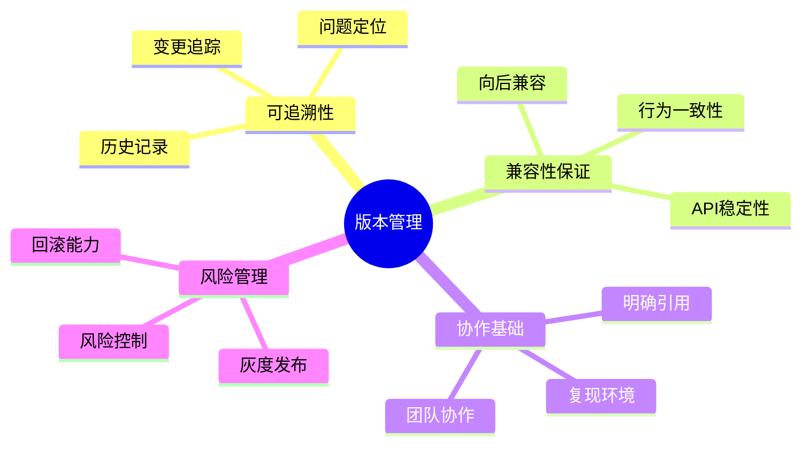

**没有版本管理的后果是灾难性的**:

想象一下这样的场景:开发人员Alice在她的机器上修复了一个bug,并告诉团队"已经解决了"。但当Bob拉取代码运行时,问题依然存在。原因是Alice升级了某个依赖库,而Bob使用的是旧版本。更糟糕的是,当这个问题最终在生产环境爆发时,没有人能够确定是哪个版本引入了问题,因为根本没有版本记录。团队花费数天时间排查,最终发现是一个第三方库的隐式升级导致的。这个故事并不罕见,它揭示了缺乏版本管理的真实代价:时间浪费、信任危机、质量下降。

具体来说,没有版本管理会导致:
- **无法复现bug**:"在我机器上是好的"成为最常见的推诿之词,问题在不同环境中表现不一致,排查变得极其困难
- **团队成员使用不同版本导致冲突**:每个人都在自己的"平行宇宙"中工作,集成时才发现各种不兼容
- **升级后不知道改了什么**:盲目升级依赖,系统突然崩溃,却找不到原因
- **无法回滚到稳定版本**:发现问题后束手无策,只能硬着头皮修复,延长了故障时间

这些问题的累积效应是巨大的。根据Standish Group的研究,配置管理不善是导致项目失败的主要原因之一。版本管理作为配置管理的核心,其重要性怎么强调都不为过。

### 版本号命名规范

面对众多的版本命名方案,选择适合的标准至关重要。不同的方案适用于不同的场景,理解它们的特点和适用条件,能帮助我们做出明智的选择。

**常见版本方案对比分析**:

| 方案 | 格式 | 特点 | 适用场景 |
|------|------|------|---------|
| 语义化版本 | MAJOR.MINOR.PATCH | 清晰表达兼容性 | 大多数开源库和框架 |
| 日历版本 | YYYY.MM | 按时间发布 | Ubuntu、JetBrains产品 |
| 序号版本 | v1, v2, v3 | 简单直观 | 内部项目、API版本 |
| 哈希版本 | git commit hash | 精确到提交 | 持续部署、不可变构建 |

**语义化版本(Semantic Versioning)** 是目前应用最广泛的版本规范,由Tom Preston-Werner于2011年提出,已经成为事实上的行业标准。它的核心理念是通过版本号的结构化编码,让使用者能够快速判断版本间的兼容性关系。

**格式**:`MAJOR.MINOR.PATCH`(如 2.1.3)

**规则详解**:

| 版本位 | 含义 | 何时递增 | 兼容性 |
|--------|------|---------|--------|
| MAJOR | 主版本号 | 不兼容的API修改 | ❌ 不向后兼容 |
| MINOR | 次版本号 | 向后兼容的功能新增 | ✅ 向后兼容 |
| PATCH | 修订号 | 向后兼容的问题修正 | ✅ 向后兼容 |

这三个数字位构成了一个层次化的版本体系。**主版本号(MAJOR)** 的变化意味着破坏性变更,这是最需要警惕的升级。当一个库删除了公开API、改变了函数签名、调整了数据结构的行为时,就必须递增主版本号。这类变更要求使用者必须修改代码才能继续使用新版本。例如,React从15升级到16时,废弃了一些生命周期方法,这就是主版本号的典型应用场景。

**次版本号(MINOR)** 表示向后兼容的功能增强。当添加了新功能、增加了可选参数、扩展了配置选项时,应该递增次版本号。关键特征是:使用旧版本的代码无需任何修改就能在新版本上正常运行。比如一个HTTP客户端库新增了重试机制,但原有的API保持不变,这就是次版本号的升级。

**修订号(PATCH)** 用于向后兼容的bug修复。当修复了错误但没有改变任何公开行为时,应该递增修订号。这类升级通常是最安全的,理论上可以直接应用而不需要测试所有功能。当然,实践中仍建议进行回归测试,因为有些bug修复可能会暴露之前被掩盖的问题。

**示例解读**:

```
1.0.0 → 1.0.1  : Bug修复,完全兼容
1.0.1 → 1.1.0  : 新增功能,完全兼容
1.1.0 → 2.0.0  : 破坏性变更,不兼容
```

这个序列展示了一个典型的版本演进路径。从1.0.0到1.0.1,用户可以获得bug修复的好处,无需担心兼容性问题。从1.0.1到1.1.0,用户可以享受新功能,同时保持现有代码的稳定性。但从1.1.0到2.0.0,用户必须仔细阅读变更日志,评估影响,可能需要修改代码才能完成升级。

**预发布版本**是正式版本之前的试验阶段标识:
- `1.0.0-alpha`:早期测试版,API可能频繁变化,仅适合内部测试
- `1.0.0-beta`:公开测试版,API相对稳定,邀请外部用户参与测试
- `1.0.0-rc.1`:候选发布版,除非发现严重问题,否则不会再有大的变更
- `1.0.0`:正式发布,承诺稳定性和向后兼容性

预发布版本的存在让开发者可以在正式发布前收集反馈、发现问题,降低了正式发布后的风险。但需要注意的是,预发布版本之间不保证兼容性,即使是rc版本也可能存在breaking changes。

**构建元数据**提供了额外的版本信息,但不影响版本优先级比较:
- `1.0.0+20260412`:标注构建日期,便于追踪具体构建
- `1.0.0+abc123`:关联Git commit hash,实现代码级别的追溯

构建元数据常用于持续集成环境,帮助识别具体的构建产物。在调试问题时,可以通过构建元数据快速定位到对应的代码提交和CI日志。

**语义化版本的优点**使其成为主流选择:
- **人类可读,直观理解兼容性**:看到版本号就能大致判断升级风险,降低了认知负担
- **机器可解析,自动化依赖管理**:工具可以根据版本号自动决定是否可以升级,实现了依赖管理的自动化
- **行业标准,广泛支持**:几乎所有主流的包管理器都原生支持语义化版本,生态系统完善

**但语义化版本也有局限性**,需要理性看待:
- **依赖开发者自觉遵守**:规范本身没有强制力,全靠开发者的自律。现实中经常见到违反语义化版本原则的情况,比如在小版本中引入破坏性变更
- **无法表达细微的兼容性变化**:有些变更介于兼容和不兼容之间,比如性能特征的改变、边界条件的调整,这些很难通过版本号准确表达
- **不适用于所有场景**:微服务的API版本、数据库schema版本、配置文件格式版本等,可能需要更适合的 versioning 策略

因此,在实践中我们需要结合具体情况,灵活运用语义化版本,而不是机械地套用规则。

### 版本约束表达式

在实际项目中,我们很少精确指定单个版本号,而是使用版本范围来表达依赖需求。版本约束表达式是依赖管理的核心机制,理解它们的语义和行为,对于避免依赖冲突至关重要。

**常见的版本范围表示法因生态系统而异**,但核心思想相似:通过数学区间的方式定义可接受的版本集合。

**NPM风格**的版本约束最为灵活,广泛应用于JavaScript生态系统:

| 表达式 | 含义 | 示例匹配 |
|--------|------|---------|
| `1.2.3` | 精确版本 | 仅1.2.3 |
| `^1.2.3` | 兼容版本(允许MINOR和PATCH) | 1.2.3, 1.3.0, 1.9.9 |
| `~1.2.3` | 近似版本(仅允许PATCH) | 1.2.3, 1.2.4, 1.2.9 |
| `>=1.2.3` | 大于等于 | 1.2.3及以上 |
| `1.x` | 通配符 | 1.0.0, 1.5.3, 1.9.9 |
| `1.2.x` | 部分通配 | 1.2.0, 1.2.5 |

其中,**插入符号(^)** 和**波浪号(~)** 是最常用也最容易混淆的两个操作符。`^1.2.3`的含义是"与1.2.3兼容的所有版本",根据语义化版本规则,这意味着可以接受任何1.x.y的版本(x≥2),但不能接受2.0.0。这是因为主版本号不变时,理论上应该保持向后兼容。而`~1.2.3`则更为保守,只允许补丁级别的更新,即1.2.x系列,不允许次版本号的升级。这种差异看似微小,但在实际使用中影响深远:使用`^`更容易获得新功能和bug修复,但也面临更大的兼容性风险;使用`~`更加稳定,但可能错过重要的功能改进。

**Maven风格**采用区间表示法,更加数学化和精确:

| 表达式 | 含义 | 示例 |
|--------|------|------|
| `[1.0]` | 精确版本 | 1.0 |
| `[1.0,)` | 1.0及以上 | 1.0, 1.1, 2.0 |
| `[1.0,2.0)` | 1.0到2.0(不含2.0) | 1.0, 1.5, 1.9 |
| `(,2.0]` | 2.0及以下 | 1.0, 1.5, 2.0 |

方括号`[]`表示闭区间(包含端点),圆括号`()`表示开区间(不包含端点)。这种表示法的优势是可以精确表达任意区间,特别适合企业级Java项目中复杂的依赖管理需求。例如,`[1.0,2.0)`明确表示接受1.0到2.0之间的所有版本,但不包括2.0,这通常用于限制在主版本号升级前的范围内获取bug修复和功能更新。

**Python pip风格**结合了精确性和可读性:

| 表达式 | 含义 |
|--------|------|
| `==1.2.3` | 精确版本 |
| `>=1.2.3` | 大于等于 |
| `~=1.2.3` | 兼容发布(类似^) |
| `!=1.2.3` | 排除特定版本 |

Python的`~=`操作符被称为"兼容发布",`~=1.2.3`等价于`>=1.2.3, ==1.2.*`,即接受1.2.x系列的所有版本。这种设计既保证了灵活性,又避免了跨次版本号的意外升级。此外,`!=`操作符提供了排除特定版本的能力,这在某个版本存在已知问题但又不想升级到其他版本时非常有用。

**选择版本约束的最佳实践**需要根据项目的角色和依赖的性质来决定:

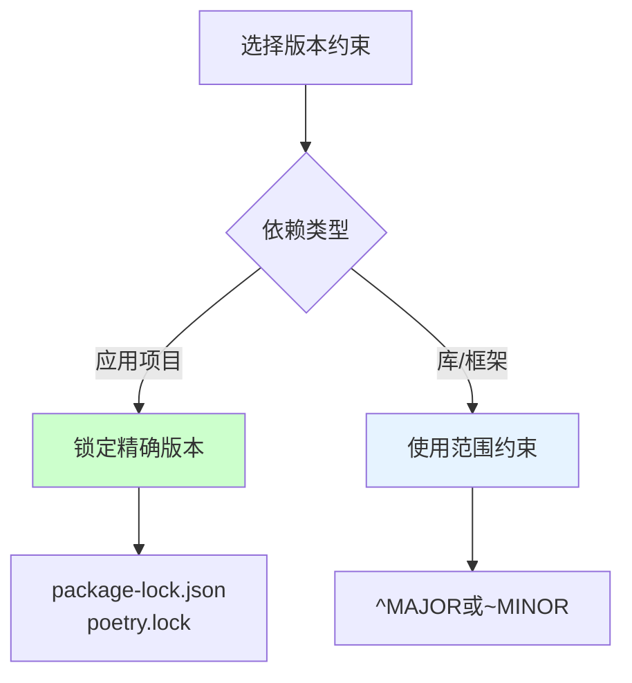

**核心原则**是区分"应用项目"和"库项目"的不同需求。

对于**应用项目**(最终部署的产品),目标是确保构建的可复现性和稳定性。因此,应该**锁定精确版本**,通过锁文件(如package-lock.json、poetry.lock、Gemfile.lock等)记录所有依赖(包括间接依赖)的确切版本。这样,无论在何时何地执行构建,都会得到完全相同的依赖树,消除了"在我的机器上可以运行"的问题。锁文件应该纳入版本控制系统,确保团队成员和CI环境使用一致的依赖版本。

对于**库项目**(被其他项目引用的组件),目标是提供最大的兼容性和灵活性。因此,应该**使用范围约束**,通常采用`^MAJOR`或`~MINOR`的形式。这样做的原因是:如果库锁定了精确版本,那么使用该库的应用可能因为版本冲突而无法安装该库的多个副本。通过放宽版本约束,库项目将版本选择的权力交给最终用户,让他们根据自己的需求决定使用哪个版本。

**在生产环境中**,无论项目类型如何,都应该始终使用锁文件来确保部署的一致性。开发阶段可以使用宽松的版本约束以便快速获得更新,但在构建生产制品时,必须基于锁文件生成确定性的依赖树。

**定期更新锁文件**同样重要。锁定版本不等于永远不更新,而是应该有节奏地、有计划地更新依赖。可以设置自动化任务定期检查新版本,评估后进行批量更新。这样既保持了稳定性,又不会落后于生态系统的演进。

### 依赖类型

现代软件的依赖关系远比表面看到的复杂。理解依赖的类型和层次,是有效管理依赖的前提。

**直接依赖 vs 间接依赖**构成了依赖树的基本结构:

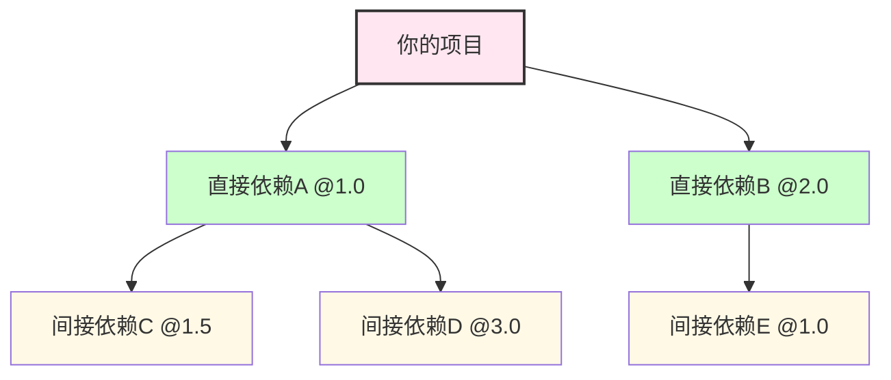

**直接依赖**是你显式声明在配置文件中的库,比如package.json中的dependencies字段。你对这些依赖有直接的控制权,可以选择版本、决定是否需要。**间接依赖**(也称为传递依赖或子依赖)是你的直接依赖所依赖的库。它们不出现在你的配置文件中,但会被自动安装。间接依赖的数量往往远超直接依赖,一个典型的Web应用可能有10个直接依赖,但却有数百个间接依赖。

**依赖树深度**反映了这种层级关系的复杂程度:
- 典型项目:3-5层依赖深度
- 复杂项目:可达10层以上
- 每层增加不确定性和风险

每一层依赖都引入了新的不确定性。你信任你的直接依赖,直接依赖的作者信任他们的依赖,依此类推。但这种信任链条越长,出现问题的概率就越大。深层依赖中的一个bug或安全漏洞,可能影响到整个应用,而你甚至不知道它的存在。这就是为什么依赖审计如此重要:不仅要检查直接依赖,还要扫描整个依赖树。

**依赖分类**从另一个维度帮助我们理解和管理依赖:

| 类型 | 说明 | 管理策略 |
|------|------|---------|
| 生产依赖 | 运行时必需 | 严格版本控制,安全审计 |
| 开发依赖 | 仅开发/测试需要 | 可相对宽松,定期更新 |
| 对等依赖 | 宿主环境提供 | 文档说明版本要求 |
| 可选依赖 | 特定功能需要 | 按需安装,条件加载 |

**生产依赖**是应用运行的基石,任何安全问题或兼容性问题都会直接影响用户体验。因此,对生产依赖的管理必须最为严格:使用精确版本锁定,定期进行安全扫描,仔细评估每次升级的影响。生产依赖的变更应该经过代码审查和充分的测试验证。

**开发依赖**包括测试框架、代码检查工具、构建插件等,仅在开发和构建阶段使用。由于不进入生产环境,对开发依赖的管理可以相对宽松。可以适当放宽版本约束,以便快速获得新功能和改进。但仍然需要定期更新,避免积累技术债务。特别要注意的是,某些开发依赖(如babel插件、webpack loader)的版本可能与生产代码的行为相关,这类依赖需要谨慎对待。

**对等依赖**是一种特殊的依赖关系,常见于插件系统。例如,一个React组件库会将React声明为对等依赖,意思是"我假设宿主环境已经安装了React,我不会自己安装它"。这种设计的目的是避免多个版本的React同时存在导致冲突。对于对等依赖,需要在文档中明确说明版本要求,并在安装时给出清晰的提示。

**可选依赖**用于实现模块化功能。例如,一个数据库ORM可能将各种数据库驱动声明为可选依赖,用户只需要安装他们实际使用的驱动。可选依赖的管理策略是"按需安装,条件加载":在代码中检测依赖是否存在,如果缺失则给出友好的错误提示,而不是直接崩溃。

理解这些依赖类型,有助于我们制定针对性的管理策略,在安全性和灵活性之间找到平衡点。

### 依赖冲突解决

依赖冲突是版本管理中最令人头疼的问题之一。当不同的依赖要求同一库的不同版本时,就产生了冲突。理解冲突的本质和解决方案,是构建稳定依赖关系的关键。

**冲突的典型场景**:

**场景1:版本冲突**
```
项目依赖:
- LibA 需要 LibC ^1.0
- LibB 需要 LibC ^2.0

冲突:LibC应该用1.x还是2.x?
```

这种情况下,LibA和LibB对LibC的版本要求互斥。如果使用1.x,LibB可能无法正常工作;如果使用2.x,LibA可能出现兼容性问题。这是一个典型的零和博弈,必须做出取舍。

**场景2:传递依赖冲突**
```
项目 → LibA → LibC@1.5
项目 → LibB → LibD → LibC@2.0
```

这种冲突更加隐蔽,因为LibC并不是项目的直接依赖,而是通过不同的路径间接引入。在这种情况下,项目甚至可能没有意识到冲突的存在,直到运行时出现问题。传递依赖冲突更难诊断,因为需要深入分析整个依赖树才能发现问题根源。

**解决策略**因包管理器的设计哲学而异:

**1. 最近优先(NPM默认)**:
这种策略选择依赖树中距离项目最近的版本。如果项目直接依赖LibC@1.5,而LibA间接依赖LibC@2.0,那么最终会使用1.5版本。这种策略的优势是尊重项目的显式选择,缺点是可能导致多个版本的LibC同时存在(如果LibA确实需要2.0的特性),增加了包体积和潜在的冲突。

**2. 最高版本优先(Maven默认)**:
Maven会选择所有要求中的最高版本。在上述例子中,会选择LibC@2.0。这种策略的优势是简化依赖树,确保只有一个版本存在,缺点是高版本可能破坏了低版本的兼容性假设,导致LibA出现意外行为。

**3. 声明优先**:
一些包管理器允许项目显式覆盖传递依赖的版本。通过在配置文件中声明LibC的具体版本,可以强制所有依赖使用这个版本。这种策略给了项目最大的控制权,但要求开发者充分了解各个版本的兼容性,否则可能引入更严重的问题。

**4. 人工裁决**:
当自动策略无法解决问题时,需要人工介入。这包括:分析各个版本的变更日志,评估兼容性影响;联系库的维护者寻求建议;在极端情况下,fork依赖库并创建自定义版本;或者寻找替代库。人工裁决虽然耗时,但往往能产生最合适的解决方案。

**冲突检测工具**是每个开发者都应该掌握的技能:

| 生态系统 | 工具 | 命令 |
|---------|------|------|
| NPM/Yarn | npm ls, yarn why | `npm ls lodash` |
| Maven | mvn dependency:tree | `mvn dependency:tree -Dverbose` |
| Gradle | dependencies任务 | `gradle dependencies` |
| Python | pipdeptree | `pipdeptree` |
| Go | go mod graph | `go mod graph` |

这些工具可以可视化依赖树,标记出版本冲突,解释为什么某个版本被选中。定期运行这些命令,可以帮助及早发现潜在的冲突问题。

**预防冲突的策略**比解决冲突更重要:


**定期审计**是预防冲突的第一道防线。通过自动化工具定期扫描依赖树,可以及时发现版本不一致的问题。审计不应该只在出现问题时才进行,而应该成为常规的开发流程。

**发现冲突后**,需要**评估影响**:这个冲突是否真的会导致问题?有些版本差异只是补丁级别的,可能不会产生实际影响;有些则是主版本号的差异,必然导致兼容性问题。评估需要结合变更日志、测试结果和实际使用情况。

基于影响评估,**制定方案**:是统一到一个版本,还是允许多版本共存?如果是前者,选择哪个版本?如果是后者,如何隔离不同版本的使用场景?

**统一版本**通常是首选方案,因为它简化了依赖管理。选择一个能够满足所有需求的版本(通常是较新的版本,前提是向下兼容),然后更新所有依赖的声明。在某些情况下,可能需要升级某些库以适配新版本。

最后,必须进行**回归测试**。即使静态分析显示兼容,运行时仍可能出现问题。全面的测试套件是验证解决方案有效性的唯一可靠方法。

通过这些系统性的方法,我们可以将依赖冲突从灾难性的问题转变为可控的技术挑战。

### 依赖锁定

依赖锁定是现代依赖管理的基石,它解决了"可复现构建"这一核心问题。理解锁文件的原理和最佳实践,对于构建可靠的软件交付流水线至关重要。

**锁文件的作用**源于动态版本约束的固有缺陷。考虑以下场景:

```json
// package.json
{
  "dependencies": {
    "lodash": "^4.17.0"
  }
}
```

这个声明表示接受4.17.0及以上的任何4.x版本。如果没有锁文件,会发生什么?

- 今天安装:lodash@4.17.21(当前最新版本)
- 明天安装:lodash@4.17.22(如果发布了新版本)
- 下周在CI服务器上安装:可能是4.17.23
- 结果:不同时间的构建可能使用不同版本

这种不确定性带来了严重的问题:开发者在本地测试通过的代码,在CI环境中可能因为依赖版本的细微差异而失败;今天部署正常的系统,明天重新部署时可能因为依赖更新而出现bug。更糟糕的是,这些问题往往难以复现和诊断,因为它们依赖于时间点而非代码本身。

**锁文件就是为了解决这个问题而诞生的**。主流生态系统都有相应的锁文件机制:

```
package-lock.json (NPM)
yarn.lock (Yarn)
poetry.lock (Python Poetry)
Gemfile.lock (Ruby Bundler)
go.sum (Go Modules)
Cargo.lock (Rust)
```

**锁文件的内容**远比表面看起来丰富:
- **所有依赖的精确版本**:不仅包括直接依赖,还包括所有间接依赖的确切版本号
- **完整性校验hash**:每个包的加密哈希值,确保下载的包未被篡改
- **依赖关系图**:记录哪个包依赖哪个包,以及解析后的版本
- **源信息**:记录包是从哪个registry下载的,便于离线安装和镜像配置

以package-lock.json为例,它不仅锁定了lodash的版本,还锁定了lodash依赖的所有子依赖的版本,形成一个完整的、确定性的依赖树。

**锁文件的生命周期管理**有一系列最佳实践:

| 实践 | 说明 |
|------|------|
| 提交锁文件 | 纳入版本控制 |
| CI使用锁文件 | 确保构建一致性 |
| 定期更新 | 不要永远锁定 |
| Review变更 | 审查锁文件变化 |
| 多环境一致 | dev/staging/prod使用相同锁文件 |

**提交锁文件到版本控制系统**是最基本也是最重要的实践。锁文件应该被视为源代码的一部分,每次依赖变更都应该伴随锁文件的更新和提交。这样可以确保:团队成员拉取代码后运行`npm install`会得到完全相同的结果;CI/CD流水线可以复现本地的构建;任何时候都可以回到历史某个状态的精确依赖配置。

有一个常见的误区是"库项目不应该提交锁文件"。这个观点有一定道理:库项目的主要消费者是其他开发者,他们有自己的锁文件,库的锁文件对他们没有直接影响。但是,即使对于库项目,提交锁文件也有好处:确保CI测试的一致性;方便贡献者搭建开发环境;作为文档展示库的实际依赖情况。因此,现代最佳实践倾向于所有项目都提交锁文件。

**CI环境必须使用锁文件**进行构建。CI的配置应该明确使用`npm ci`而不是`npm install`,前者会严格按照锁文件安装依赖,速度更快且结果更可预测。如果锁文件和package.json不一致,`npm ci`会报错,这可以及早发现配置问题。

**定期更新锁文件**同样重要。锁定不等于冻结,依赖需要与时俱进。应该建立定期的依赖更新流程:每周或每月检查可用更新,评估后进行批量升级。自动化工具如Dependabot、Renovate可以帮助完成这项工作。关键是保持更新的节奏,既不过于频繁导致不稳定,也不过于稀疏积累技术债务。

**Review锁文件变更**是代码审查的重要组成部分。当PR中包含锁文件的修改时,审查者应该关注:哪些依赖被更新了?更新的原因是什么(新功能、bug修复、安全补丁)?是否有意外的版本变化?对于大型更新,可能需要额外的测试验证。不要因为锁文件是自动生成的就忽视审查,它反映了系统依赖结构的重大变化。

**多环境一致性**是生产可靠性的保障。开发、测试、预发布、生产等所有环境都应该使用相同的锁文件。不要在某个环境中手动修改依赖版本,这会破坏环境一致性,导致"在测试环境没问题,上线就出错"的经典问题。如果需要针对不同环境使用不同配置,应该通过环境变量或配置文件来实现,而不是修改依赖版本。

**例外情况**需要特殊处理:

- **库项目**:如前所述,虽然建议提交锁文件,但要明白它对消费者的影响有限。更重要的是在README中明确说明兼容性要求和推荐的依赖版本。

- **Docker构建**:在容器化部署中,锁文件的作用有所变化。由于Docker镜像本身就是不可变的制品,一旦构建完成,依赖就被固化在镜像中。因此,Docker构建时仍然需要使用锁文件确保构建的可复现性,但运行时无需担心依赖变化的问题。最佳实践是在Dockerfile中复制锁文件,然后执行安装命令,确保镜像内的依赖与预期一致。

依赖锁定看似简单,实则是软件工程中"确定性"这一核心原则的体现。通过锁文件,我们将不确定的外部依赖转化为确定的内部状态,为软件交付提供了坚实的基础.

### 依赖最小化

在依赖管理中,有一个反直觉的原则:**依赖越少越好**。这个原则源自软件工程的本质复杂性理论:每增加一个依赖,就增加了一份不确定性、一份维护负担、一份安全风险。

**为什么要最小化依赖**?理由充分且多方面:

首先是**风险扩散**。每个依赖都是潜在的风险点:它可能包含安全漏洞,可能突然停止维护,可能引入破坏性变更,可能与其它依赖冲突。依赖越多,遭遇这些问题的概率就越大。根据概率论,如果每个依赖每年出现问题的概率是5%,那么100个依赖中至少有一个出现问题的概率高达99.4%。这不是危言耸听,而是数学事实。

其次是**攻击面扩大**。在安全领域,有一个基本原则:减少攻击面。每个依赖都增加了系统的攻击面:恶意包注入、供应链攻击、许可证陷阱等。著名的left-pad事件、event-stream劫持事件、ua-parser-js挖矿事件都警示我们:依赖不仅是技术问题,更是安全问题。

第三是**维护成本增加**。依赖需要管理:监控更新、评估兼容性、处理冲突、应对废弃。依赖越多,这些工作就越繁重。团队的时间是有限的,花在依赖管理上的时间越多,用于业务开发的时间就越少。

第四是**构建性能下降**。每个依赖都需要下载、解析、编译(对于某些语言)。依赖越多,构建时间越长,开发效率越低。在持续集成的场景中,构建时间的增加直接转化为成本的上升和反馈周期的延长。

最后是**理解难度提升**。要维护一个系统,首先需要理解它。依赖越多,系统的行为就越难以预测和理解。当出现bug时,需要排查的范围就越大。新人接手项目时,需要学习的知识就越多。

**实践依赖最小化的方法**:

**1. 定期清理未使用的依赖**

这是最简单也最有效的优化手段。在项目演进过程中,经常会添加依赖用于某个功能,后来这个功能被移除或重构,但依赖却被遗忘在配置文件中。定期运行依赖分析工具,识别未使用的依赖并移除它们。

对于JavaScript项目,可以使用`depcheck`、`npm-check`等工具;对于Python,可以使用`pipreqs`分析实际导入的模块;对于Java,IDE通常有 Unused Dependencies 的检查功能。将这些检查集成到CI流程中,可以自动发现未使用的依赖。

**2. 合并功能重叠的库**

很多时候,项目中存在多个实现相似功能的库。例如,同时使用lodash和underscore,同时使用moment.js和date-fns,同时使用axios和fetch polyfill。这种情况通常是因为不同时期、不同开发者引入的,缺乏统一的规划。

定期审视依赖列表,识别功能重叠的库,选择其中一个作为标准,逐步替换另一个。这个过程需要谨慎:首先评估两个库的差异,选择更适合项目的那个;然后制定迁移计划,分模块逐步替换;最后彻底移除旧库并清理相关代码。

**3. 用原生功能替代小工具库**

随着语言和平台的演进,许多曾经需要第三方库才能实现的功能,现在已经有了原生支持。例如:
- JavaScript的Array.prototype.includes替代了lodash的_.includes
- Python的f-string替代了string formatting库
- Java 8的Stream API替代了许多集合操作库

定期检查项目中使用的小工具库,查看是否有原生替代方案。移除这些小依赖不仅可以减少依赖数量,还可以提高性能(原生实现通常更高效)和可维护性(无需学习第三方API)。

**4. 评估新依赖的必要性**

在添加新依赖之前,建立一个评估流程:

```
添加新依赖前问自己:
- 真的需要吗?能否自己实现?
- 社区活跃吗?维护频率如何?
- 体积多大?性能影响如何?
- 许可证兼容吗?
```

**真的需要吗**:有时候,几十行代码就可以实现的功能,不值得引入一个完整的库。评估实现复杂度与维护成本的权衡。如果功能简单且稳定,自己实现可能更好;如果功能复杂且需要持续维护,使用成熟的库可能更合适。

**社区活跃度**:检查GitHub的star数、贡献者数量、最后更新时间、issue响应速度。一个健康的开源项目应该有活跃的社区、频繁的更新、及时的issue处理。避免依赖那些已经停止维护的项目,它们会成为未来的技术债务。

**体积和性能**:对于前端项目,包体积直接影响加载性能;对于后端项目,依赖数量影响启动时间和内存占用。使用bundle analyzer等工具分析依赖的大小,评估其对性能的影响。有时,一个轻量级的替代方案可以显著改善性能指标。

**许可证兼容性**:检查依赖的许可证是否与项目兼容。特别是对于商业项目,要避免使用强Copyleft许可证(如GPL)的依赖,除非准备好开源整个项目。使用FOSSA、Black Duck等工具自动化检查许可证合规性。

**5. 按需加载和Tree-shaking**

即使必须使用某个库,也可以通过技术手段减少其影响:

**Tree-shaking**是现代打包工具(Webpack、Rollup、Vite等)的重要功能,它可以分析代码,移除未使用的导出。为了充分利用tree-shaking,应该:
- 使用ES modules格式的库(支持import/export)
- 避免导入整个库,而是导入需要的模块
- 使用sideEffects标记告知打包工具哪些模块有副作用

例如,在JavaScript中:
```javascript
// 不好:导入整个lodash
import _ from 'lodash';

// 好:只导入需要的函数
import debounce from 'lodash/debounce';
```

**动态import**可以实现延迟加载,将不常用的功能拆分到单独的chunk中,在需要时才加载。这对于大型应用的性能优化特别有效。

**条件加载**用于可选依赖:只在特定条件下才加载某些依赖。例如,根据不同的数据库类型加载不同的驱动,根据功能开关加载不同的插件。

**6. 监控依赖健康度**

建立依赖健康度的监控体系,定期评估依赖的质量:

| 指标 | 健康标准 | 警告信号 |
|------|---------|---------|
| 最后更新时间 | <3个月 | >1年未更新 |
| 下载量趋势 | 稳定或增长 | 持续下降 |
| Issue响应 | <1周 | 大量未关闭issue |
| 贡献者数量 | >5人 | 仅1-2人 |
| 文档质量 | 完善 | 缺失或过时 |

## 版本升级策略

### 升级时机决策

版本升级是依赖管理中最频繁也最关键的操作。何时升级、为何升级、如何升级,这些决策直接影响系统的稳定性和团队的效率。建立科学的升级决策机制,可以避免盲目升级带来的风险,也可以防止过度保守导致的落后。

**升级决策的核心在于平衡**:一方面,我们需要及时获得新功能、bug修复和安全补丁;另一方面,我们需要保持系统的稳定性,避免不必要的变更引入新问题。这个平衡点因项目、因团队、因业务阶段而异,但有一些通用的原则和方法。

**何时升级**取决于多个因素的综合评估:

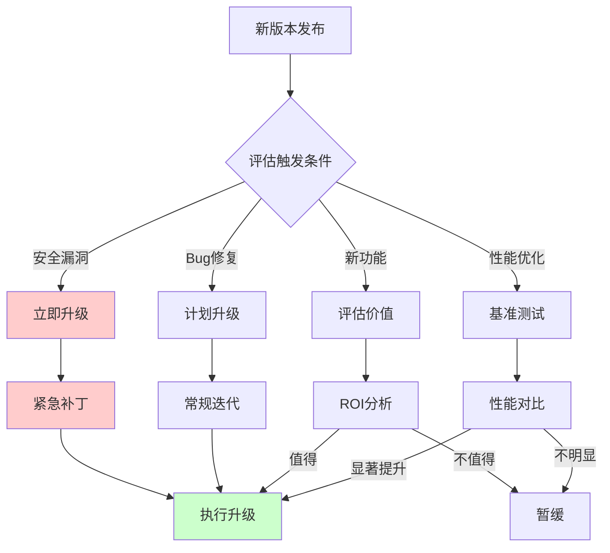

这个流程图展示了从版本发布到最终决策的完整过程。关键在于**评估环节**:不同类型的更新需要不同的评估方法。安全漏洞需要立即行动,bug修复需要计划安排,新功能需要价值评估,性能优化需要数据支撑。

**升级触发条件**可以分为四类,按照优先级从高到低排列:

| 优先级 | 条件 | 响应时间 |
|--------|------|---------|
| P0 紧急 | 严重安全漏洞(CVSS ≥ 9.0) | 24小时内 |
| P1 高 | 重要安全漏洞或关键Bug | 1周内 |
| P2 中 | 一般Bug修复或性能优化 | 下个迭代 |
| P3 低 | 新功能或次要改进 | 按需规划 |

**P0 紧急:安全漏洞**

当依赖中存在严重安全漏洞时,升级不再是选择题,而是必答题。根据CVSS(Common Vulnerability Scoring System)评分,9.0-10.0分的Critical级别漏洞应该在24小时内修复,7.0-8.9分的High级别漏洞应该在1周内修复。

安全漏洞的升级有其特殊性:
- **时间紧迫**:漏洞可能被主动利用,每延迟一天都增加风险
- **信息有限**:可能没有详细的修复说明,只有紧急补丁
- **测试不足**:由于时间压力,可能无法进行充分的回归测试
- **协调困难**:可能需要同时升级多个相关依赖

应对策略是建立应急响应机制:订阅安全公告(如GitHub Security Advisories、Snyk alerts),配置自动化扫描工具,制定紧急升级流程,预留应急窗口。当漏洞披露时,能够快速评估影响范围,制定修复方案,执行升级操作。

**P1 高:重要Bug修复**

除了安全问题,关键的bug修复也需要优先处理。这类升级的触发条件包括:
- 影响核心功能的严重bug
- 导致数据损坏或丢失的问题
- 性能退化严重影响用户体验
- 合规性或法律相关问题

与紧急安全升级不同,bug修复升级可以有更充分的评估和测试时间。通常安排在下一个迭代周期内完成,但不应无限期推迟。关键在于准确评估bug的影响范围和严重程度,确定优先级。

**P2 中:一般改进**

大多数版本更新属于这一类:新功能、性能优化、API改进、文档完善等。这类升级的价值是渐进的,风险相对较低,可以纳入常规的迭代计划中。

评估这类升级时,需要考虑:
- **ROI(投资回报率)**:新功能带来的价值是否值得升级的成本?
- **兼容性风险**:虽然是向后兼容的更新,但是否有边缘情况需要注意?
- **团队带宽**:当前是否有足够的时间和资源进行升级和测试?
- **依赖连锁反应**:升级这个库是否会触发其他依赖的升级需求?

通常的做法是每季度进行一次全面的依赖审查,批量处理P2级别的升级。这样可以减少上下文切换的成本,提高效率。

**P3 低:次要更新**

包括拼写修正、注释更新、内部重构等对用户几乎没有影响的变更。这类升级可以暂缓,或者在必要时与其他升级一起进行。不必为了这类更新专门安排升级工作。

**建立升级决策的记录机制**也很重要。对于每次升级,记录:
- 升级的原因和触发条件
- 评估过程和决策依据
- 遇到的问题和解决方案
- 升级后的效果和反馈

这些记录形成了组织的知识库,帮助未来做出更好的决策。

### 升级风险评估

升级本质上是一种变更,而变更必然伴随风险。科学的风险评估可以帮助我们在升级前识别潜在问题,制定应对措施,将风险控制在可接受范围内。

**风险矩阵**是评估升级风险的有效工具,它从多个维度综合考量:

| 风险因素 | 低风险 | 中风险 | 高风险 |
|---------|--------|--------|--------|
| 版本号变化 | PATCH | MINOR | MAJOR |
| 变更日志 | 仅Bug修复 | 新增功能 | 破坏性变更 |
| 依赖影响 | 无传递影响 | 少量影响 | 广泛影响 |
| 测试覆盖 | >90% | 70-90% | <70% |
| 使用范围 | 边缘功能 | 核心模块 | 基础设施 |

**版本号变化**是最直观的风险指标。PATCH级别的更新通常只包含bug修复,理论上完全向后兼容,风险最低。MINOR级别的更新添加了新功能,虽然承诺向后兼容,但新代码可能引入新的bug或改变边缘行为。MAJOR级别的更新包含破坏性变更,需要修改调用代码,风险最高。

但这只是起点,还需要结合其他因素综合判断。例如,一个PATCH更新如果修复的是核心算法的bug,可能比一个MINOR更新添加的边缘功能风险更大。因此,**变更日志**的分析至关重要。仔细阅读changelog,了解具体改了什么,影响了哪些模块,是否有已知的注意事项。

**依赖影响**评估升级的波及范围。如果这个依赖被项目中多个模块使用,或者被其他依赖间接引用,那么升级的影响就会放大。使用依赖树工具分析影响范围,识别所有受影响的代码路径。

**测试覆盖率**决定了我们发现问题的能力。如果测试覆盖率低于70%,升级后出现问题的概率会显著增加。在这种情况下,应该先补充关键路径的测试,再进行升级。高测试覆盖率(>90%)可以为升级提供信心保障。

**使用范围**反映了升级的业务影响。边缘功能的依赖升级即使出现问题,影响也有限;但如果是基础设施级别的依赖(如日志框架、HTTP客户端),一旦出问题可能导致整个系统不可用。

基于这些因素的综合评估,可以将升级分为低、中、高三个风险等级,采取不同的应对策略:
- **低风险**:可以直接升级,运行自动化测试即可
- **中风险**:需要在staging环境充分测试,手动验证关键路径
- **高风险**:需要制定详细的升级计划和回滚方案,分阶段灰度发布

**升级检查清单**是确保升级质量的实用工具:

**升级前**:
- [ ] 阅读Release Notes和Breaking Changes
- [ ] 检查依赖兼容性
- [ ] 评估影响范围
- [ ] 准备回滚方案
- [ ] 备份数据和配置

**升级中**:
- [ ] 在开发环境验证
- [ ] 运行完整测试套件
- [ ] 手动测试关键路径
- [ ] 性能基准对比
- [ ] 记录问题和 workaround

**升级后**:
- [ ] 部署到staging环境
- [ ] 集成测试和回归测试
- [ ] 监控异常指标
- [ ] 收集用户反馈
- [ ] 更新文档

这个清单可以根据项目的具体情况调整,但核心思想是一致的:**系统化地管理升级过程,不遗漏关键步骤**。

### 渐进式升级

对于高风险的升级,一次性全量切换往往过于冒险。渐进式升级策略通过逐步扩大影响范围,可以在控制风险的前提下完成升级。

**蓝绿部署策略**是一种经典的零停机部署方法:

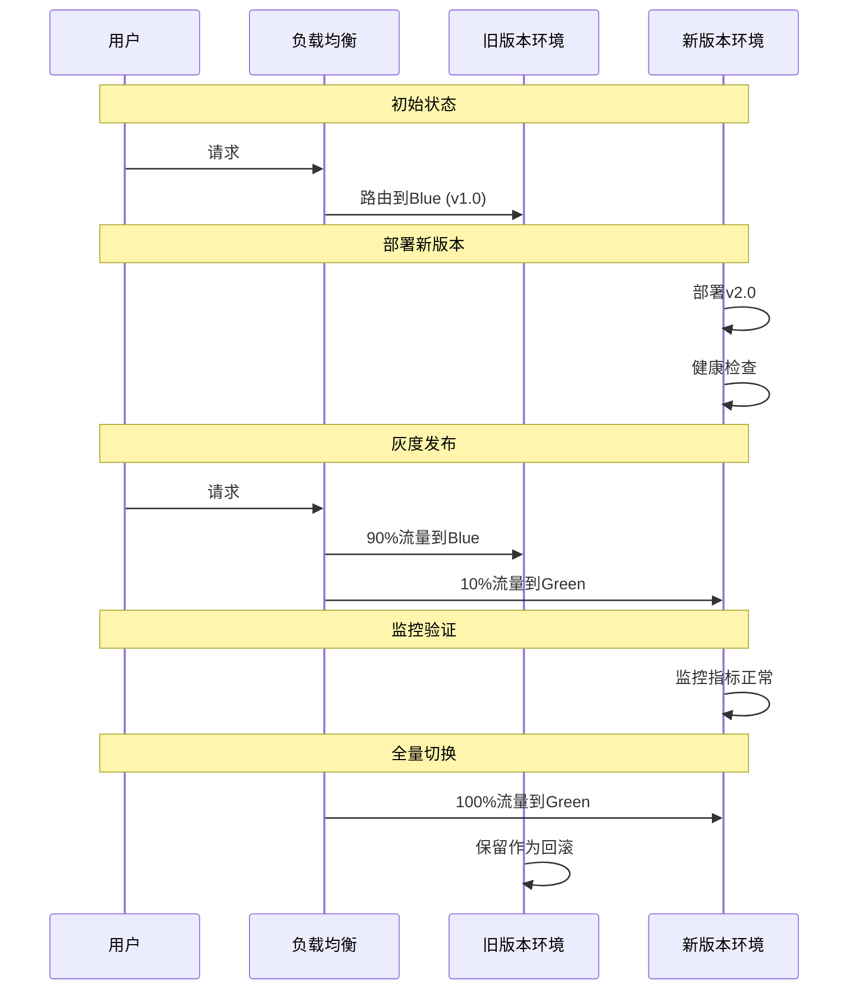

蓝绿部署的核心思想是维护两套完全相同的生产环境:Blue(旧版本)和Green(新版本)。部署时,先在Green环境部署新版本并进行健康检查,确认无误后,通过负载均衡器逐步将流量从Blue切换到Green。如果发现问题,可以立即切回Blue,实现快速回滚。

这种策略的优势是:
- **零停机**:切换过程中服务持续可用
- **快速回滚**:发现问题可以秒级切回旧版本
- **充分验证**:可以在真实流量下验证新版本的表现

缺点是成本较高,需要维护两套生产环境的资源。

**金丝雀发布**是另一种渐进式策略,特别适合大规模用户场景:
- 先在小范围用户中试用(如1%的用户)
- 逐步扩大比例(1% → 5% → 20% → 100%)
- 实时监控关键指标(错误率、延迟、吞吐量等)
- 异常时快速回滚

金丝雀发布的优势是可以更早地发现只在特定条件下才会出现的问题,比如某些用户数据触发的边界情况。通过逐步扩大范围,可以将问题的影响面控制在最小。

**特性开关**(Feature Flags)提供了更细粒度的控制能力:
- 新功能通过开关控制,可以在代码中随时启用或禁用
- 可以独立于部署启用/禁用功能,实现解耦
- 便于A/B测试和灰度发布
- 降低升级风险,支持快速回滚

特性开关的实现方式是在代码中添加条件判断,根据配置决定是否执行新逻辑。例如:

```javascript
if (featureFlags.isEnabled('newPaymentFlow')) {
  // 新的支付流程
} else {
  // 旧的支付流程
}
```

通过动态配置中心,可以实时调整开关状态,无需重新部署。这使得我们可以在生产环境中灵活控制功能的可见性,降低了升级的心理门槛和技术风险。

渐进式升级的本质是**将大风险分解为小风险**,通过多次小的、可控的变更,最终完成大的升级目标。这种策略虽然增加了操作的复杂度,但显著提高了升级的成功率和安全性。

### 自动化升级工具

手动管理依赖升级是一项繁琐且容易出错的工作。自动化工具可以大幅提高效率,让团队专注于更有价值的工作。

**主流依赖更新工具**各有特色:

| 工具 | 平台 | 功能 |
|------|------|------|
| Dependabot | GitHub | 自动PR、安全更新 |
| Renovate | 多平台 | 灵活配置、批量更新 |
| Snyk | 多平台 | 安全扫描、自动修复 |
| WhiteSource | 企业级 | 合规检查、漏洞管理 |

**Dependabot**是GitHub官方提供的依赖更新工具,集成度高,使用简单。它会监控项目的依赖,发现新版本时自动创建Pull Request,包含版本变更信息和changelog链接。Dependabot特别擅长安全更新的自动处理,可以配置为自动合并安全补丁。

**Renovate**是一个更加灵活的开源工具,支持GitHub、GitLab、Bitbucket等多个平台。它的配置选项丰富,可以精细控制更新策略:分组更新、定时更新、选择性忽略等。Renovate适合对自动化流程有较高要求的团队。

**Snyk**专注于安全领域,不仅可以检测已知漏洞,还能提供修复建议。Snyk的数据库覆盖范围广,更新及时,是企业级安全管理的优选。它还支持许可证合规检查,帮助规避法律风险。

**WhiteSource**(现为Mend)是面向大型企业的软件组成分析平台,提供全面的安全、合规、质量管理功能。它可以与CI/CD流水线深度集成,实现自动化的依赖治理。

**自动化工具的工作流程**通常如下:

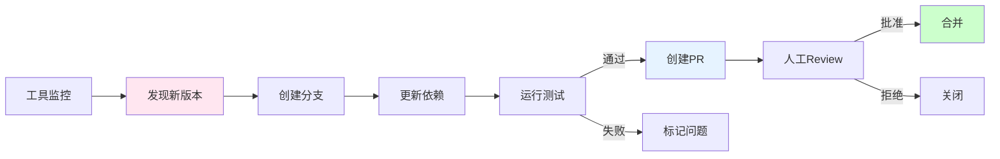

这个流程实现了从检测到合并的全自动化,但保留了人工review的关键环节。自动化负责重复性工作,人类负责决策和把关,两者结合才能达到最佳效果。

**配置建议**需要根据团队的具体情况定制:

以Dependabot为例,一个典型的配置包括:
- **更新频率**:每周检查一次,既不过于频繁打扰开发,也不至于积累太多更新
- **目标分支**:main或master分支,确保更新直接进入主干
- **Reviewers**:指定核心团队负责审核依赖更新
- **标签**:添加dependencies标签,便于分类和筛选
- **分组更新**:将相关的依赖(如React生态系的包)放在一起更新,减少PR数量
- **忽略规则**:跳过某些已知有问题的版本,或暂时不想升级的依赖

**最佳实践**总结:
- **从小范围开始试点**:先在一两个项目上尝试自动化工具,积累经验后再推广
- **设置合理的更新频率**:太频繁会产生大量PR,太稀疏会积累技术债务
- **配置自动化测试**:确保每个PR都能自动运行测试,及早发现问题
- **人工review重要依赖**:核心依赖的升级仍然需要人工仔细评估
- **批量处理小更新**:对于PATCH级别的更新,可以批量合并,减少管理开销

自动化工具不是银弹,它们不能替代人类的判断,但可以将人类从繁琐的重复劳动中解放出来,让我们有更多时间关注架构设计、性能优化等高价值工作。

## 版本基线管理

### 什么是版本基线?

随着组织规模的扩大,项目数量的增多,单纯依靠每个团队自行管理依赖版本会导致严重的碎片化问题。版本基线应运而生,成为解决这一挑战的有效手段。

**定义**:
> 版本基线(Version Baseline)是组织中所有项目在某一时间点采用的标准化依赖版本集合。

**类比理解**:
- 就像公司的"标准软件清单",规定了办公电脑应该安装哪些软件及其版本
- 确保所有团队使用经过验证的版本,避免各自为战
- 在创新和稳定性之间找到平衡点,既不过于保守也不过于激进

**基线的组成**涵盖了技术栈的各个层面:

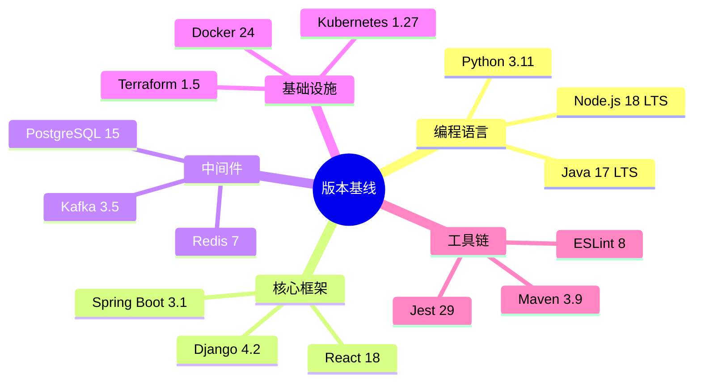

这个思维导图展示了版本基线的典型组成部分。**编程语言**是基础,选择LTS(Long Term Support)版本可以获得长期的安全更新和支持。**核心框架**决定了应用的架构风格和技术选型。**中间件**涉及数据存储、缓存、消息队列等基础设施。**基础设施**包括容器编排、IaC工具等运维层面的组件。**工具链**则是开发、测试、构建过程中使用的辅助工具。

版本基线不是一成不变的,它会随着技术演进和组织需求的变化而调整。但一旦确定,就应该在一段时间内保持稳定,给团队足够的时间适应和迁移。

### 基线管理策略

不同规模和组织结构的团队,适合不同的基线管理策略。理解各种策略的优缺点,可以帮助我们选择最适合的方案。

**集中式vs分散式**的对比:

| 策略 | 优点 | 缺点 | 适用场景 |
|------|------|------|---------|
| 集中式基线 | 统一管理、一致性强 | 灵活性差、更新慢 | 大型企业、强监管行业 |
| 分散式基线 | 灵活自主、快速迭代 | 版本碎片化、维护难 | 初创公司、敏捷团队 |
| 混合模式 | 核心统一、边缘灵活 | 管理复杂度高 | 中型企业、多业务线 |

**集中式基线**由中央团队(如架构委员会、平台工程团队)统一制定和维护。所有项目必须严格遵守基线规定,违反需要特殊审批。这种策略的优势是版本高度一致,便于统一升级、安全审计和合规检查。但缺点是灵活性差,新技术引入流程长,可能抑制创新。适合金融、医疗等强监管行业,或对一致性要求极高的大型企业。

**分散式基线**允许各团队自行决定依赖版本,只需遵循一些基本原则。这种策略的优势是灵活自主,团队可以快速采用新技术,适应业务变化。但缺点是版本碎片化严重,跨团队协作困难,安全风险难以控制。适合初创公司、小型团队,或强调创新和速度的组织。

**混合模式**试图在两者之间找到平衡:核心组件统一基线,边缘组件允许灵活选择。这既保证了一致性和安全性,又保留了创新的空間。但管理复杂度较高,需要清晰的边界定义和有效的沟通机制。适合中型企业、多业务线组织。

**推荐:分层基线模型**结合了灵活性和管控力:

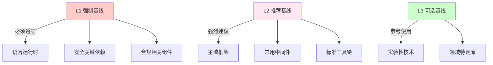

这个三层模型将依赖按照重要性和风险程度分级,采取不同的管理策略:

**L1 强制基线**是红线,必须严格遵守:
- 由架构委员会或平台团队维护
- 违反需要特殊审批和记录
- 定期安全审计,确保无漏洞
- 示例:JDK版本、加密库、认证框架

这些组件的选择直接影响系统的安全性和合规性,不容许随意变更。例如,规定所有Java项目必须使用Java 17 LTS,所有加密操作必须使用经过FIPS认证的库。

**L2 推荐基线**是最佳实践,强烈建议采用:
- 提供最佳实践和参考模板
- 新项目默认采用,老项目鼓励迁移
- 定期更新,保持与技术发展同步
- 示例:Web框架(Spring Boot、React)、ORM(Hibernate、Prisma)、常用中间件

这一层的目的是减少重复造轮子,提高开发效率。虽然不是强制的,但偏离推荐基线需要有充分的理由。例如,如果一个团队想使用Quarkus而不是Spring Boot,需要说明Quarkus带来的具体价值,以及迁移计划。

**L3 可选基线**是参考指南,供团队自主选择:
- 社区推荐的稳定版本
- 供团队参考,不作为约束
- 团队自行评估和决策
- 示例:工具库(lodash、moment)、辅助框架、领域特定库

这一层给予团队最大的自由度,鼓励技术创新和差异化竞争。但同时也要承担责任:如果选择的依赖出现问题,团队需要自行解决。

分层基线模型的核心理念是:**越核心的组件,管控越严格;越边缘的组件,自由度越高**。这样既保证了系统的基础稳固,又为创新留出了空间。

### 基线演进机制

版本基线不是一成不变的静态清单,而是一个动态演进的生态系统。建立科学的演进机制,可以确保基线始终保持活力和相关性。

**版本生命周期**描述了技术从引入到退役的完整过程:

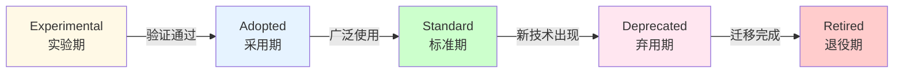

这个生命周期模型借鉴了ThoughtWorks Technology Radar的理念,将技术分为四个象限:试验(Explore)、采纳(Adopt)、评估(Assess)、持有(Hold)。在我们的模型中,对应为五个阶段:

**各阶段特征**:

| 阶段 | 持续时间 | 特点 | 管理策略 |
|------|---------|------|---------|
| 实验期 | 3-6个月 | 小范围试点 | 收集反馈、评估价值 |
| 采用期 | 6-12个月 | 逐步推广 | 提供支持、培训 |
| 标准期 | 1-3年 | 广泛使用 | 维护稳定、安全更新 |
| 弃用期 | 6-12个月 | 停止新功能 | 通知迁移、提供指导 |
| 退役期 | - | 不再支持 | 强制迁移、移除支持 |

**实验期**是技术的孵化阶段。在这个阶段,新技术被引入组织,在小范围项目中试点。目标是验证技术的可行性和价值,收集实际使用中的反馈。管理重点是观察和评估,不急于推广。如果试点项目反馈积极,技术成熟度达到预期,就可以进入采用期。

**采用期**是技术的推广阶段。在这个阶段,技术被推荐给更多团队使用,组织提供培训、文档、最佳实践等支持。目标是扩大使用范围,积累实践经验。管理重点是赋能和支持,帮助团队顺利 adoption。当技术被大多数团队接受,成为事实标准时,就进入标准期。

**标准期**是技术的成熟阶段。在这个阶段,技术被广泛应用于各类项目,成为组织的标准选择。管理重点是维护稳定性和安全性,及时应用补丁和小版本更新。这个阶段持续时间最长,是技术价值的集中体现。当出现更好的替代技术,或现有技术逐渐过时,就进入弃用期。

**弃用期**是技术的退出阶段。在这个阶段,宣布技术将在未来某个时间点停止支持,不再添加新功能,仅提供安全更新。目标是给团队充足的迁移时间,平稳过渡到新技术。管理重点是沟通和指导,提供迁移路径和最佳实践。当迁移完成后,技术进入退役期。

**退役期**是技术的终结阶段。在这个阶段,技术不再被支持,组织不再为其投入资源。如果仍有项目使用该技术,需要立即迁移。管理重点是强制执行和清理,确保没有遗留。

**演进流程**需要规范化和透明化:

**引入新技术**的流程:
1. **提案评审(RFC流程)**:提交技术提案,说明背景、价值、风险、替代方案等
2. **PoC验证**:在小规模环境中验证技术的可行性
3. **试点项目**:选择1-2个实际项目进行试点
4. **评估报告**:总结试点经验,评估是否值得推广
5. **纳入基线**:如果评估通过,正式纳入基线,制定推广计划

**淘汰旧技术**的流程:
1. **宣布弃用(提前6-12个月)**:发布公告,说明弃用原因和时间表
2. **提供迁移指南**:编写详细的迁移文档,包括步骤、注意事项、常见问题
3. **停止新功能**:不再为该技术支持新功能开发
4. **仅安全更新**:只提供关键的安全补丁
5. **最终移除**:到达截止日期后,从基线中移除,不再提供支持

这两个流程确保了技术演进的有序性和可预测性,避免了突然的技术断层。

**版本更新节奏**需要根据不同类型区别对待:

| 更新类型 | 频率 | 流程 |
|---------|------|------|
| 安全补丁 | 立即 | 紧急评审,快速发布 |
| Bug修复 | 月度 | 常规评审,批量更新 |
| 小版本 | 季度 | 全面评估,灰度发布 |
| 大版本 | 年度 | 深度调研,分阶段迁移 |

**安全补丁**优先级最高,一旦发现应立即评估和发布。这个过程应该高度自动化,减少人工干预的延迟。

**Bug修复**可以按月汇总,批量处理。这样既保证了及时性,又减少了管理开销。

**小版本**(MINOR)更新通常包含新功能和改进,需要更全面的评估。建议按季度进行,结合业务节奏安排升级窗口。在staging环境充分测试后,采用灰度发布策略逐步推广。

**大版本**(MAJOR)更新涉及破坏性变更,影响深远。应该每年进行一次深度调研,制定详细的迁移计划。大版本升级通常需要跨团队协作,投入专门资源,分阶段实施。例如,可以先升级非核心系统,积累经验后再升级核心系统。

### 基线合规检查

制定了基线标准,如何确保各个项目真正遵守?自动化合规检查是关键。

**自动化检查流程**将合规验证集成到CI/CD流水线中:

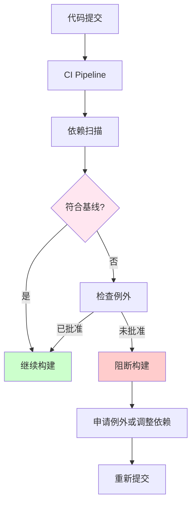

这个流程在每次代码提交时自动触发,扫描项目的依赖树,与基线标准进行比对。如果符合基线,构建继续进行;如果不符合,检查是否有批准的例外;如果没有例外,则阻断构建,要求开发者修正。

这种"左移"(Shift Left)的策略,将问题发现在早期阶段,避免了后期修复的高昂成本。同时,自动化的检查减少了人工审查的负担,提高了效率。

**检查工具**的选择取决于技术栈和组织需求:

| 工具 | 功能 | 集成方式 |
|------|------|---------|
| OWASP Dependency Check | 安全漏洞扫描 | Maven/Gradle插件 |
| Snyk | 依赖安全和许可 | CLI、CI集成 |
| FOSSA | 开源合规 | SaaS平台 |
| Sonatype Nexus IQ | 组件智能分析 | Nexus集成 |
| 自定义脚本 | 基线版本检查 | CI流水线 |

**OWASP Dependency Check**是开源的安全扫描工具,可以检测依赖中的已知漏洞(CVE)。它与Maven、Gradle等构建工具深度集成,在构建过程中自动扫描。优点是免费、开源,缺点是误报率较高,需要人工筛选。

**Snyk**是商业化的安全平台,提供更准确的漏洞检测和修复建议。它可以与GitHub、GitLab等代码托管平台集成,自动创建修复PR。Snyk的优势是用户体验好,数据库更新及时,适合中大型团队。

**FOSSA**专注于开源合规,不仅可以检测安全问题,还能分析许可证兼容性。对于需要严格合规的企业,FOSSA提供了完整的解决方案。

**Sonatype Nexus IQ**是Nexus仓库管理平台的增值服务,提供组件智能分析功能。如果组织已经使用Nexus作为内部仓库,IQ是一个自然的选择。

**自定义脚本**适合有特殊需求的场景。例如,检查特定依赖的版本是否在基线列表中,或者生成依赖报告供审计使用。自定义脚本的灵活性高,但维护成本也高。

在实际应用中,通常会组合使用多个工具,形成多层次的防护体系。例如,用Snyk做安全扫描,用FOSSA做许可证检查,用自定义脚本做基线版本验证。

**例外管理**是合规检查中不可避免的环节。再完善的基线也无法覆盖所有场景,总会有特殊情况需要例外处理。

**何时允许例外**:
- **业务紧急需求**:为了抓住市场机会,需要使用尚未纳入基线的新技术
- **技术特殊性(无替代方案)**:某些领域特定问题,基线中的技术无法满足需求
- **过渡期(正在迁移)**:老系统正在向新基线迁移,暂时无法完全符合
- **实验性项目**:创新孵化项目,需要尝试前沿技术

这些情况都有其合理性,关键是要有透明的审批流程和有效的跟踪机制。

**例外流程**应该规范化和制度化:
1. **提交例外申请**:填写申请表,说明原因、影响范围、风险评估
2. **说明原因和风险**:详细阐述为什么需要例外,可能带来什么风险,如何缓解
3. **架构委员会审批**:由专家团队评估申请的合理性,做出决策
4. **设定有效期**:例外不是永久的,应该有明确的过期时间(如3个月、6个月)
5. **定期复审**:到期前重新评估,决定是否延期或撤销

这个流程确保了例外的可控性,避免了"例外泛滥"导致基线形同虚设。

**例外跟踪**是持续改进的关键:
- **记录所有例外**:建立例外登记册,记录每个例外的详细信息
- **监控过期例外**:设置提醒,及时处理即将过期的例外
- **推动消除例外**:主动帮助团队解决困难,减少例外数量
- **定期汇报进展**:向管理层汇报例外情况,争取支持和资源

通过数据驱动的例外管理,可以不断优化基线标准,提高其适用性和可执行性。

## 安全与合规

### 漏洞管理

在数字化时代,软件漏洞已成为国家安全、经济安全的重要组成部分。建立完善的漏洞管理体系,是每个负责任的技术组织的必修课。

**漏洞披露流程**体现了负责任的 security research 文化:

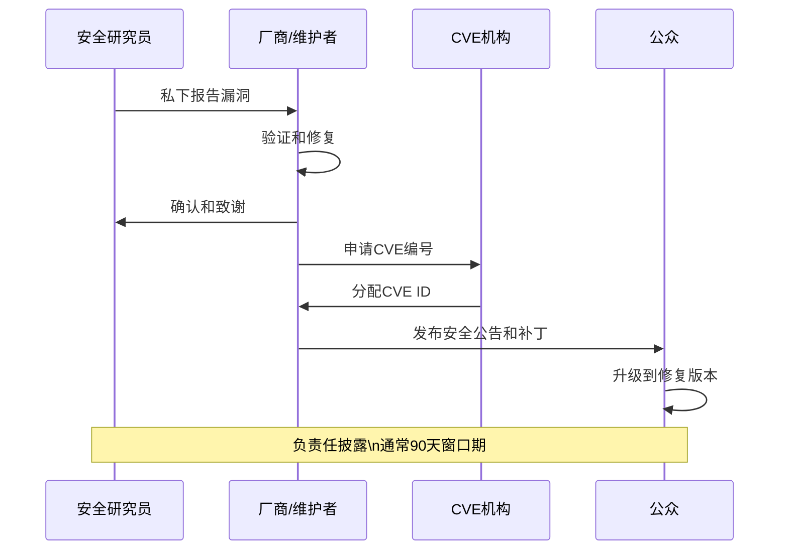

这个流程被称为"负责任披露"(Responsible Disclosure),平衡了各方利益:
- **安全研究员**发现漏洞后,首先私下通知厂商,给予修复时间,而不是直接公开
- **厂商**收到报告后,验证漏洞的真实性,开发修复方案,准备补丁
- **CVE机构**为漏洞分配唯一标识符(CVE ID),便于追踪和引用
- **公众**在补丁发布后,得知漏洞信息,升级软件以保护自己

整个过程通常有90天的窗口期:厂商有90天时间修复漏洞,之后研究员可以公开细节。这个时间框架既给了厂商充足的修复时间,又防止了无限期拖延。

**漏洞严重程度评级(CVSS)** 提供了标准化的量化指标:

| 等级 | 分数 | 响应时间 | 示例 |
|------|------|---------|------|
| Critical | 9.0-10.0 | 24小时内 | 远程代码执行 |
| High | 7.0-8.9 | 1周内 | SQL注入、XSS |
| Medium | 4.0-6.9 | 1个月内 | 信息泄露 |
| Low | 0.1-3.9 | 下次更新 | 轻微信息暴露 |

CVSS(Common Vulnerability Scoring System)从多个维度评估漏洞的严重性:
- **攻击向量**:远程攻击还是本地攻击
- **攻击复杂度**:利用难度高低
- **权限要求**:是否需要认证
- **用户交互**:是否需要用户操作
- **影响范围**:对机密性、完整性、可用性的影响

基于CVSS评分,可以制定差异化的响应策略。Critical级别的漏洞需要立即行动,甚至需要紧急发布补丁;Low级别的漏洞可以纳入常规更新计划。

**漏洞数据库**是漏洞信息的权威来源:
- **CVE**(Common Vulnerabilities and Exposures):通用漏洞标识,由MITRE维护,是行业标准
- **NVD**(National Vulnerability Database):美国国家漏洞数据库,提供详细的漏洞信息和CVSS评分
- **GitHub Security Advisories**:GitHub平台的安全公告,与代码仓库紧密集成
- **Snyk Vulnerability DB**:Snyk公司维护的漏洞库,覆盖范围广,更新及时

这些数据库相互补充,形成了完整的漏洞情报网络。订阅这些数据库的公告,可以及时了解最新的安全威胁。

**扫描策略**应该多层次、全方位:

| 扫描类型 | 频率 | 工具 |
|---------|------|------|
| 开发时 | 每次提交 | IDE插件、pre-commit hook |
| CI/CD | 每次构建 | Snyk、Dependency Check |
| 定期全面 | 每周 | 完整依赖树扫描 |
| 应急响应 | 新漏洞披露时 | 针对性扫描 |

**开发时扫描**将安全检查左移到编码阶段。IDE插件可以在编写代码时实时提示潜在的安全问题,pre-commit hook可以在提交前阻止含有漏洞的代码进入仓库。这种即时反馈机制,让开发者在第一时间发现问题,修复成本最低。

**CI/CD扫描**是质量门禁的重要组成部分。每次构建都自动扫描依赖,发现漏洞就阻断流水线。这确保了进入测试环境和生产环境的代码都是安全的。

**定期全面扫描**可以发现遗漏的问题。即使CI/CD中有扫描,也可能因为配置问题或工具限制而漏掉某些漏洞。每周的全面扫描作为补充,提高了检测的覆盖率。

**应急响应扫描**针对新披露的重大漏洞。当Log4Shell这样的史诗级漏洞出现时,需要立即扫描所有项目,评估影响范围,制定修复计划。这种能力依赖于良好的资产管理和自动化工具支持。

### 许可证合规

开源软件极大地促进了技术创新,但也带来了法律风险。理解和管理许可证合规,是避免法律纠纷的关键。

**常见开源许可证**可以分为两大类:

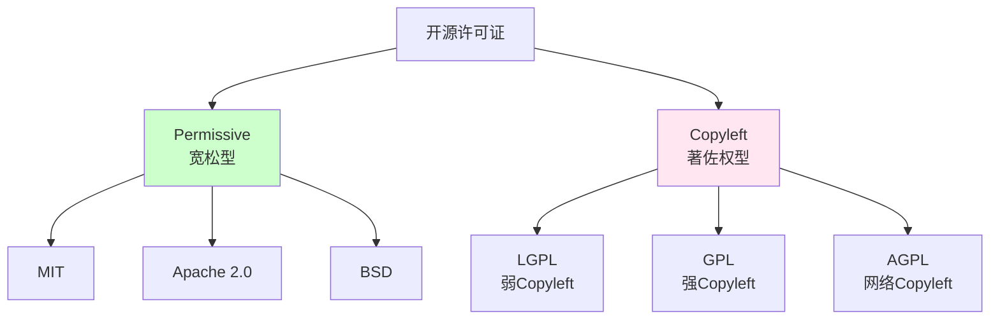

**Permissive(宽松型)** 许可证对使用者的限制很少,允许自由使用、修改、分发,甚至可以用于闭源商业产品。只需保留版权声明和许可证文本即可。这类许可证受到商业公司的欢迎,因为它们提供了最大的灵活性。

**Copyleft(著佐权型)** 许可证则要求衍生作品也必须以相同的许可证开源。这种"传染性"确保了开源成果的共享,但也限制了其在商业产品中的使用。根据传染性的强弱,Copyleft许可证又分为弱Copyleft(LGPL)、强Copyleft(GPL)、网络Copyleft(AGPL)。

**许可证对比**帮助我们理解各许可证的具体要求:

| 许可证 | 商业使用 | 修改 | 分发 | 专利授权 | Copyleft |
|--------|---------|------|------|---------|----------|
| MIT | ✅ | ✅ | ✅ | ❌ | ❌ |
| Apache 2.0 | ✅ | ✅ | ✅ | ✅ | ❌ |
| GPL v3 | ✅ | ✅ | ✅ | ✅ | ✅ |
| LGPL v3 | ✅ | ✅ | ✅ | ✅ | 部分 |
| AGPL v3 | ✅ | ✅ | ✅ | ✅ | 强 |

**MIT许可证**是最简单的开源许可证之一,只有几行文字。它允许几乎任何形式的使用,只需保留版权声明。由于简单明了,MIT成为最受欢迎的开源许可证。

**Apache 2.0许可证**在MIT的基础上,增加了专利授权条款。这意味着贡献者授予用户使用其专利的权利,避免了专利诉讼的风险。对于大型企业,Apache 2.0比MIT更有吸引力。

**GPL v3许可证**是强Copyleft许可证的代表。如果使用GPL授权的代码,整个项目也必须以GPL开源。这使得GPL不适合商业闭源产品,但对于希望保护开源成果的项目来说,GPL是理想选择。

**LGPL v3许可证**是弱Copyleft许可证。它允许动态链接LGPL库而不必开源主程序,但修改LGPL库本身仍需开源。这使得LGPL适合库类项目,既保护了库的开源性,又不影响使用者的自由度。

**AGPL v3许可证**是网络Copyleft许可证。它填补了GPL的漏洞:GPL只在分发软件时触发开源义务,而SaaS服务不分发软件,因此可以规避GPL。AGPL规定,即使用户通过网络访问服务,也必须提供源代码。这对于云时代的开源保护至关重要。

**合规风险**不容忽视:

| 风险 | 说明 | 后果 |
|------|------|------|
| 许可证冲突 |  incompatible licenses | 法律纠纷、被迫开源 |
| 未履行义务 | 未包含版权声明 | 侵权诉讼 |
| 专利风险 | 专利条款不明确 | 专利诉讼 |
| 传染性 | Copyleft扩散 | 专有代码被迫开源 |

**许可证冲突**发生在项目中使用了多个不兼容的许可证。例如,GPL和Apache 2.0在某些情况下不兼容,如果同时使用,可能导致法律问题。需要在引入依赖时仔细检查许可证兼容性。

**未履行义务**是最常见的违规形式。即使是MIT这样简单的许可证,也要求保留版权声明。如果在产品中删除了版权声明,就构成了侵权。虽然实际诉讼案例不多,但理论上存在法律风险。

**专利风险**主要与Apache 2.0等包含专利条款的许可证相关。如果贡献者后来主张专利侵权,可能会引发诉讼。好在Apache 2.0有明确的专利授权和报复条款,提供了一定保护。

**传染性**是Copyleft许可证的核心特征,也是最大风险。如果不小心将GPL代码引入商业项目,可能导致整个项目被迫开源。这种风险需要通过严格的代码审查和自动化扫描来防范。

**合规检查清单**提供了系统化的方法:
- [ ] 识别所有依赖的许可证
- [ ] 检查许可证兼容性
- [ ] 履行许可证义务(声明、源码提供)
- [ ] 记录许可证使用情况
- [ ] 定期审计和更新

这个清单应该在项目启动时执行一次,然后在每次添加新依赖时重新检查。定期(如每季度)进行全面审计,确保没有遗漏。

**工具支持**可以大幅提高合规检查的效率:
- **FOSSA**:自动化许可证合规平台,可以扫描代码库,识别所有开源组件及其许可证,生成合规报告
- **Black Duck**:Synopsys公司的软件组成分析工具,提供全面的许可证管理和风险评估
- **License Finder**:Pivotal开发的开源工具,可以扫描多种语言的项目,生成许可证清单
- **ClearlyDefined**:微软发起的开源项目,致力于改善开源组件的元数据质量,包括许可证信息

这些工具可以与CI/CD流水线集成,实现自动化的合规检查。当发现潜在的许可证问题时,及时通知团队,避免问题积累。

## 最佳实践总结

经过前面的详细讨论,我们现在可以总结出一些经过验证的最佳实践。这些实践涵盖了组织、团队和个人三个层面,形成了一个完整的版本基线管理体系。

### 组织级实践

**1. 建立版本管理委员会**

版本管理不是某个团队的责任,而是整个组织的大事。建立专门的委员会,可以统筹协调各方资源,制定统一的标准和流程。

**职责**包括:
- **制定和维护版本基线**:确定哪些技术应该纳入基线,版本如何选择,如何更新
- **评审新技术引入**:评估新技术的价值、风险、成熟度,决定是否采纳
- **审批例外申请**:处理特殊情况,平衡规范性和灵活性
- **推动老旧技术淘汰**:制定退役计划,帮助团队平稳迁移

**成员构成**应该多元化:
- **首席架构师**:提供技术视野和战略方向
- **平台团队负责人**:代表基础设施和运维视角
- **安全专家**:确保安全和合规要求得到满足
- **各业务线技术代表**:反映一线团队的实际需求和痛点

这样的组合确保了决策的全面性和可执行性。

**运作机制**应该规范化:
- **双周会议**:定期讨论议题,做出决策
- **RFC评审流程**:重大变更通过RFC(Request for Comments)流程征求社区意见
- **决策记录和公示**:所有决策都有文档记录,向全组织公开
- **定期回顾和优化**:每季度回顾委员会的工作效果,持续改进

版本管理委员会的成功关键在于**透明、开放、数据驱动**。透明的决策过程赢得信任,开放的讨论氛围激发智慧,数据驱动的决策保证科学性。

**2. 建立内部软件仓库**

内部软件仓库(Internal Software Repository)是版本基线的物理载体,也是依赖治理的基础设施。

**优势**体现在多个方面:
- **缓存外部依赖,加速构建**:从内网下载依赖比从公网快得多,特别是在大规模并行构建时
- **审核和批准后才可使用**:所有依赖必须经过安全扫描和许可证检查,才能上传到内部仓库
- **内部私有包管理**:团队的私有库可以发布到内部仓库,方便其他团队使用
- **离线构建支持**:即使外网中断,也可以从内部仓库获取依赖,保证业务连续性

**主流工具**包括:
- **JFrog Artifactory**:功能最强大的制品仓库,支持几乎所有包格式
- **Sonatype Nexus**:开源友好,社区活跃,适合中小团队
- **Azure Artifacts**:与Azure DevOps深度集成,适合微软技术栈
- **GitHub Packages**:与GitHub无缝集成,适合开源项目

选择工具时,需要考虑团队的技术栈、预算、运维能力等因素。

**3. 建立知识库**

知识是组织最重要的资产。建立版本管理的知识库,可以避免重复踩坑,加速新人成长。

**内容应该包括**:
- **版本基线文档**:当前的基线标准、历史变更记录、未来规划
- **升级指南和最佳实践**:如何安全地升级依赖,常见问题和解决方案
- **常见问题和解决方案**:FAQ形式,快速查找答案
- **历史决策和教训**:记录重要的决策过程和背后的思考,以及失败的教训

**维护原则**:
- **专人维护**:指定专人负责知识库的更新和质量控制
- **定期更新**:至少每季度审查一次,确保信息时效性
- **易于检索**:良好的分类和标签体系,支持全文搜索
- **与工具集成**:在IDE、CI/CD等工具中提供知识库链接,方便随时查阅

知识库的价值在于**积累和传承**。随着时间推移,它会成为组织的技术宝库,为新项目提供参考,为老项目提供指导。

### 团队级实践

**1. 依赖管理规范**

每个团队都应该有自己的依赖管理规范,与组织基线相协调,又适应团队特点。

**新项目**应该:
- **从模板开始**:使用组织提供的标准项目模板,包含推荐的依赖和配置
- **遵循基线版本**:严格遵守L1和L2基线, L3基线作为参考
- **添加新依赖需团队讨论**:任何新依赖的引入都应该经过团队评审,评估必要性和风险

**老项目**应该:
- **制定迁移计划**:评估当前依赖与基线的差距,制定分阶段迁移计划
- **优先升级高危依赖**:先处理安全漏洞和严重bug,再处理功能改进
- **逐步对齐基线**:不要试图一次性完成所有升级,循序渐进更可持续

规范的目的是**减少随意性,提高一致性**。但不是僵化的教条,团队可以根据实际情况灵活调整。

**2. 定期依赖审计**

依赖审计是保持健康依赖结构的关键手段。

**频率建议**:
- **每周**:自动化安全扫描,及时发现新披露的漏洞
- **每月**:依赖健康度检查,评估依赖的活跃度、维护状态
- **每季度**:全面审查和清理,移除未使用依赖,替换不健康依赖

**行动项**:
- **移除未使用依赖**:使用工具扫描,识别并删除无用依赖
- **升级过时依赖**:将落后多个版本的依赖升级到最新稳定版
- **替换不健康依赖**:寻找更活跃、更可靠的替代方案
- **记录技术债务**:对于暂时无法解决的问题,记录在案,排期处理

定期审计就像体检,可以及早发现问题,防患于未然。

**3. 升级文化**

技术栈的演进需要良好的文化支撑。培养积极的升级文化,可以让团队始终保持技术竞争力。

**核心原则**:
- **小步快跑,频繁升级**:不要等到积累了大量更新才升级,小而频繁的升级风险更低
- **自动化测试保障**:强大的测试套件是升级的信心来源
- **及时响应安全问题**:将安全升级视为最高优先级
- **分享升级经验**:团队内部分享升级过程中的经验和教训

**激励机制**:
- **奖励主动升级的团队**:在绩效考核中考虑技术债务的清理
- **分享成功案例**:宣传成功升级的故事,树立榜样
- **提供升级支持和培训**:降低升级门槛,增强团队信心

文化的形成需要时间和耐心,但一旦形成,就会成为组织最宝贵的无形资产。

### 个人级实践

**对开发者**的建议:
- **了解项目依赖树**:不仅知道自己写的代码,还要知道依赖了什么第三方库
- **谨慎添加新依赖**:每添加一个依赖都要三思,权衡利弊
- **及时报告安全问题**:发现漏洞立即上报,不要隐瞒
- **参与升级工作**:将升级视为学习机会,主动承担责任

**对Tech Lead**的建议:
- **关注技术趋势**:保持对新技术的敏感度,评估其适用性
- **评估新工具价值**:从团队和项目角度评估,不盲目追新
- **推动技术栈演进**:制定长期规划,带领团队持续进步
- **培养团队能力**:通过code review、技术分享等方式提升团队整体水平

**对架构师**的建议:
- **制定长期技术路线**:站在战略高度规划技术选型和演进路径
- **平衡创新和稳定**:既要拥抱变化,又要控制风险
- **管理技术债务**:识别、量化、优先级排序,有计划地偿还
- **建立最佳实践**:总结经验,形成方法论,推广到全组织

不同角色有不同的职责,但目标是一致的:**构建高质量、可持续的软件系统**。

## 结语

版本基线管理是一场平衡的艺术:在创新和稳定之间,在灵活性和一致性之间,在速度和安全性之间。没有放之四海而皆准的方案,每个组织都需要找到适合自己的平衡点。

**核心要点回顾**:

**1. 理解版本本质**
- 语义化版本是沟通的基础,让开发者和工具都能理解兼容性
- 版本约束表达兼容性预期,选择合适的约束策略
- 锁文件确保可复现性,是确定性构建的基石

**2. 科学管理依赖**
- 最小化依赖数量,每个依赖都有成本
- 定期审计和清理,保持依赖健康
- 自动化冲突检测,早发现早解决

**3. 制定升级策略**
- 基于风险分级响应,P0-P3不同优先级
- 渐进式发布降低风险,蓝绿部署、金丝雀发布
- 利用自动化工具提高效率,Dependabot、Renovate

**4. 建立版本基线**
- 分层管理,刚柔并济,L1-L3不同管控力度
- 明确生命周期和演进机制,实验期到退役期
- 自动化合规检查,集成到CI/CD流水线

**5. 重视安全合规**
- 持续漏洞扫描,多层次防护
- 许可证合规管理,避免法律风险
- 建立应急响应机制,快速应对安全事件

**给不同规模组织的建议**:

**初创公司(<50人)**:
- 保持简单,避免过度流程
- 重点关注安全漏洞
- 使用自动化工具(Dependabot)
- 建立基本的依赖清单

初创公司的优势是灵活,劣势是资源有限。应该充分利用开源工具和云服务,将精力集中在核心业务上。

**中型企业(50-500人)**:
- 建立推荐基线
- 实施自动化扫描
- 定期依赖审查
- 培养内部专家

中型企业开始面临规模化挑战,需要建立一些基本规范和流程,但仍然要保持敏捷性。

**大型企业(>500人)**:
- 建立正式的版本管理委员会
- 实施分层基线和例外管理
- 建设内部软件仓库
- 完整的合规审计流程

大型企业的复杂度高,需要更完善的治理体系。但同时也要警惕官僚主义,保持流程的简洁高效。

**最后的建议**:

版本管理不是一蹴而就的,而是一个持续改进的过程。从小处着手,逐步完善,找到适合你团队的节奏。

记住,**最好的版本策略是那个被团队真正执行的策略**。过于严格的流程会被绕过,过于宽松的管理会积累风险。找到平衡点,保持透明,持续沟通,你就能建立一个健康的版本管理文化。

在这个依赖无处不在的时代,掌握版本基线管理,就是掌握了软件工程的命脉。愿你的依赖树常青,版本演进顺畅,系统稳定可靠!

---

- 详细讲解了语义化版本和依赖管理
- 介绍了升级策略和自动化工具
- 提供了版本基线分层管理模型
- 涵盖了安全合规和最佳实践