## 引言:虚拟化的本质

当我们谈论虚拟化时,我们在谈论什么?

**核心定义:**

> 虚拟化是将物理资源抽象、转换和呈现为逻辑资源的技术。

但这只是表面。更深层次地看,虚拟化技术的出现彻底改变了我们使用和管理计算资源的方式。在过去,一台物理服务器只能运行一个操作系统和一组应用程序,这种"一机一用"的模式导致了严重的资源浪费——大多数服务器的 CPU 利用率长期维持在 10%-15% 的水平。虚拟化技术通过引入抽象层,使得单一物理硬件能够同时承载多个独立的虚拟环境,每个环境都拥有自己的操作系统、应用程序和资源视图,仿佛独占整台机器。

从技术演进的角度来看,虚拟化并非新鲜事物。早在 20 世纪 60 年代,IBM 就在大型机上实现了时间共享系统,允许多个用户同时使用同一台计算机。然而,直到 21 世纪初,随着 x86 架构处理器性能的提升和硬件虚拟化扩展(如 Intel VT-x 和 AMD-V)的引入,虚拟化才真正走向普及,成为现代云计算和数据中心的基石技术。

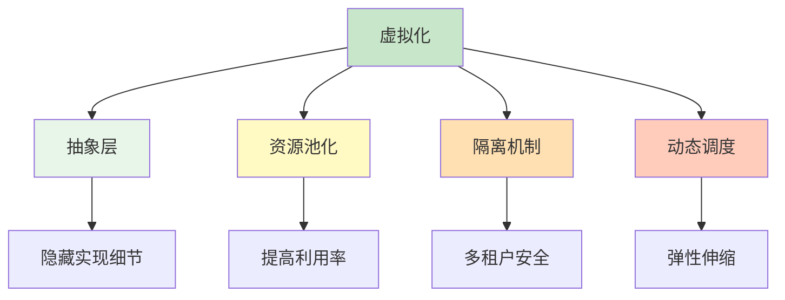

虚拟化的核心价值体现在四个维度:抽象层通过隐藏底层硬件的复杂性,使得上层软件无需关心具体的实现细节;资源池化将分散的物理资源整合为统一的资源池,显著提高了硬件利用率;隔离机制确保不同虚拟机之间互不干扰,为多租户环境提供了安全保障;动态调度则允许系统根据负载情况实时调整资源分配,实现弹性伸缩。

本文将深入虚拟机技术的底层原理,理解硬件虚拟化的工作机制,并与容器技术进行全面对比。我们将从虚拟化面临的核心挑战出发,逐步剖析 Hypervisor 的工作模式、CPU 和内存虚拟化的实现机制、I/O 虚拟化的技术方案,最后探讨主流虚拟化平台的特点以及虚拟机与容器的适用场景。

## 第一部分：虚拟化技术原理

### 1.1 虚拟化的挑战

**问题:如何让软件相信它在独占硬件?**

要理解虚拟化的技术难点,首先需要明确传统计算架构与虚拟化架构的根本差异。在传统架构中,应用程序通过操作系统内核直接访问硬件资源,操作系统拥有对硬件的最高控制权,可以执行任何指令。而在虚拟化环境中,Guest OS(客户操作系统)不再直接运行在硬件上,而是运行在 Hypervisor(虚拟机监控器)之上。这种架构变化带来了一系列技术挑战。

```
传统架构:
Application → OS → Hardware

虚拟化架构:
Application → Guest OS → Hypervisor → Hardware

挑战:
1. 特权指令:Guest OS 需要执行特权指令
2. 敏感指令:某些指令行为依赖于硬件状态
3. 性能开销:每次虚拟化操作都有成本
4. 设备模拟:如何虚拟化各种硬件设备
```

第一个挑战是**特权指令的执行**。在 x86 架构中,CPU 指令分为特权指令和非特权指令。特权指令(如修改页表、切换保护模式、访问 I/O 端口等)只能在最高权限级别(Ring 0)执行。在传统系统中,操作系统内核运行在 Ring 0,可以自由执行这些指令。但在虚拟化环境中,Hypervisor 必须占据 Ring 0 以保持对硬件的控制,Guest OS 被迫运行在较低权限级别(Ring 1 或 Ring 3)。当 Guest OS 尝试执行特权指令时,会触发异常,需要 Hypervisor 介入处理。如果每次特权指令都要陷入 Hypervisor,性能开销将是灾难性的。

第二个挑战涉及**敏感指令**。某些指令的行为依赖于当前的硬件状态或执行上下文,例如读取中断描述符表寄存器(IDTR)或全局描述符表寄存器(GDTR)。这些指令在非虚拟化环境下返回真实值,但在虚拟化环境中,如果直接返回真实值,Guest OS 可能会错误地认为自己独占了硬件,导致系统崩溃或安全漏洞。Hypervisor 必须拦截这些指令,返回经过修改的"虚拟"值,使 Guest OS 能够在隔离的环境中正常运行。

第三个挑战是**性能开销**。虚拟化本质上是在 Guest OS 和硬件之间插入了一个额外的软件层,每一次跨越这个边界的操作都会产生开销。最典型的是 VM Exit(虚拟机退出)和 VM Entry(虚拟机进入)过程:当 Guest OS 执行特权指令或访问受保护资源时,CPU 必须保存当前状态、切换到 Hypervisor 上下文、执行相应的处理逻辑,然后再恢复 Guest 状态并返回。这个过程涉及大量的寄存器保存/恢复、缓存失效和流水线清空,单次 VM Exit 的开销可达数千个 CPU 周期。如果频繁发生,整体性能将大幅下降。

第四个挑战是**设备模拟**。现代计算机系统包含大量 I/O 设备:网卡、磁盘控制器、显卡、USB 控制器等。每个设备都有复杂的寄存器接口、中断机制和 DMA(直接内存访问)能力。Hypervisor 需要为每个虚拟机提供一套完整的虚拟设备,既要保证功能正确性,又要兼顾性能。完全的软件模拟虽然兼容性好,但性能极差;而硬件直通虽然性能优异,却牺牲了灵活性和迁移能力。如何在兼容性、性能和灵活性之间取得平衡,是 I/O 虚拟化设计的核心难题。

面对这些挑战,计算机科学家 Popek 和 Goldberg 在 1974 年提出了虚拟化的三个基本要求,成为评估虚拟化方案可行性的理论基础:

**Popek and Goldberg 虚拟化要求:**

```
1. 等价性(Equivalence)
   - 程序在 VM 中的行为应与在物理机上相同
   
2. 效率(Efficiency)
   - 大部分指令应直接在硬件上执行
   
3. 资源控制(Resource Control)
   - Hypervisor 必须完全控制硬件资源
```

等价性要求保证了虚拟机的正确性:无论底层是否经过虚拟化,应用程序观察到的行为应该完全一致。这意味着 Guest OS 无法区分自己运行在虚拟机还是物理机上,所有系统调用、中断处理和内存访问的结果都必须符合预期。效率要求则关注性能:理想的虚拟化方案应该让绝大多数指令直接在硬件上执行,只有少数特权指令需要 Hypervisor 介入。如果大部分指令都需要软件模拟,虚拟化将失去实用价值。资源控制要求确保了安全性和隔离性:Hypervisor 必须能够完全掌控硬件资源的分配和访问,防止恶意或错误的 Guest OS 破坏系统稳定性或窃取其他虚拟机的数据。

这三个要求看似简单,实则难以同时满足。早期的 x86 架构并不满足 Popek-Goldberg 条件,因为存在大量无法被 Hypervisor 透明捕获的敏感指令。这导致第一代 x86 虚拟化方案不得不采用二进制翻译(Binary Translation)技术,在运行时动态修改 Guest OS 的代码,将敏感指令替换为安全的替代序列。这种方法虽然可行,但实现复杂且性能受限。直到 2005-2006 年,Intel 和 AMD 分别在处理器中引入硬件虚拟化扩展(VT-x 和 AMD-V),x86 平台才真正满足了虚拟化要求,开启了现代虚拟化的新纪元。

### 1.2 Hypervisor 类型

Hypervisor(也称为 VMM,Virtual Machine Monitor)是虚拟化系统的核心组件,负责创建、运行和管理虚拟机。根据架构设计的不同,Hypervisor 分为两大类型:Type 1(裸金属型)和 Type 2(托管型)。这两种类型在设计理念、性能特征和适用场景上存在显著差异。

**Type 1:裸金属(Bare Metal)**

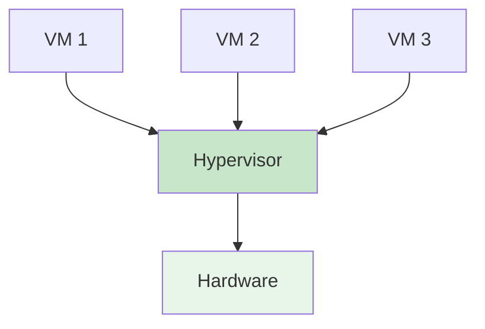

Type 1 Hypervisor 直接运行在物理硬件之上,不需要宿主操作系统的支持。它本身就是最小的、专门化的操作系统,唯一的目的就是管理虚拟机。这种设计带来了多项优势:首先,由于没有中间层,Type 1 Hypervisor 可以直接访问硬件资源,减少了上下文切换和系统调用的开销,性能接近原生水平。其次,精简的代码库意味着更小的攻击面和更高的稳定性——VMware ESXi 的核心 Hypervisor 代码仅约 150 MB,相比之下,通用操作系统的内核往往超过数 GB。第三,Type 1 Hypervisor 通常提供企业级特性,如实时迁移、高可用性、动态资源调度和集中管理,适合构建大规模数据中心和云平台。

```
特点:
- 直接运行在硬件上
- 无宿主 OS 开销
- 性能更好
- 稳定性更高

代表产品:
✓ VMware ESXi
✓ Microsoft Hyper-V(部分)
✓ Xen
✓ KVM(基于 Linux 内核)
✓ Proxmox VE

适用场景:
- 生产环境
- 数据中心
- 云平台
```

值得注意的是,KVM(Kernel-based Virtual Machine)的分类存在一定的争议。严格来说,KVM 将 Linux 内核转变为 Hypervisor,因此兼具 Type 1 和 Type 2 的特征:一方面,它利用 Linux 内核的设备驱动和调度器,保留了通用操作系统的丰富功能;另一方面,一旦加载 KVM 模块,Linux 内核就获得了 Hypervisor 的能力,可以直接管理虚拟机。在实际应用中,KVM 通常被视为 Type 1 Hypervisor,因为它在生产环境中表现出与 ESXi、Xen 相当的性能和稳定性。

**Type 2:托管型(Hosted)**

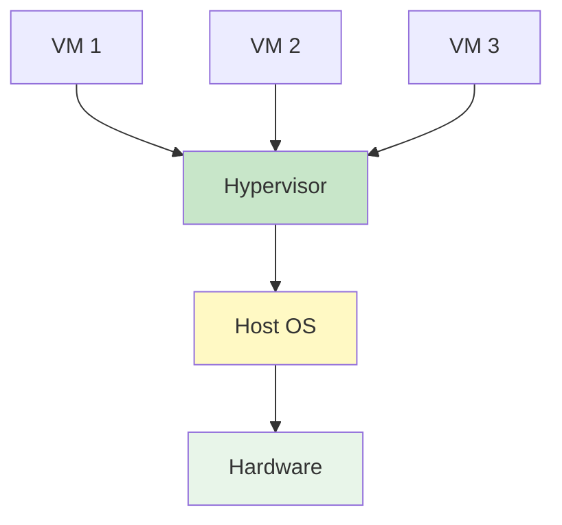

Type 2 Hypervisor 作为普通应用程序运行在宿主操作系统之上。它与其它应用程序一样,通过宿主操作系统的系统调用接口访问硬件资源。这种设计的主要优势在于易用性和兼容性:用户可以在现有的 Windows、macOS 或 Linux 系统上安装 Type 2 Hypervisor,无需重新部署整个基础设施。此外,宿主操作系统提供了丰富的驱动程序支持、用户界面工具和第三方应用生态,使得 Type 2 Hypervisor 非常适合开发测试、个人使用和教学实验。

```
特点:
- 运行在宿主 OS 之上
- 便于开发和测试
- 依赖宿主 OS
- 性能略低

代表产品:
✓ VMware Workstation
✓ VirtualBox
✓ Parallels Desktop
✓ QEMU(纯软件模拟)

适用场景:
- 开发测试
- 个人使用
- 学习实验
```

然而,Type 2 Hypervisor 的性能和稳定性受到宿主操作系统的制约。首先,所有的 I/O 请求和硬件访问都必须经过宿主操作系统的内核,增加了额外的延迟。其次,宿主操作系统的调度器会将 Hypervisor 视为普通进程,可能因为其他高优先级任务而延迟虚拟机的执行。第三,宿主操作系统的崩溃或资源耗尽会直接影响所有运行在其上的虚拟机。因此,Type 2 Hypervisor 通常不推荐用于生产环境,除非是对性能要求不高的轻量级应用。

**对比表:**

| 特性 | Type 1 | Type 2 |
|------|--------|--------|
| **性能** | 高(接近原生) | 中(有宿主开销) |
| **稳定性** | 高 | 依赖宿主 OS |
| **易用性** | 较低 | 高 |
| **成本** | 高 | 低/免费 |
| **管理** | 集中管理 | 本地管理 |
| **适用场景** | 生产环境 | 开发测试 |

选择 Hypervisor 类型时,需要综合考虑应用场景、性能需求、预算限制和管理复杂度。对于企业数据中心和云服务提供商,Type 1 Hypervisor 是毫无疑问的选择,它能够提供最佳的性能、可靠性和可扩展性。而对于开发者、学生和个人用户,Type 2 Hypervisor 则更加友好,可以快速搭建实验环境,验证技术方案,而无需投入昂贵的硬件和专业的基础设施。

### 1.3 硬件虚拟化扩展

**问题:如何高效虚拟化特权指令?**

在硬件虚拟化扩展出现之前,x86 平台的虚拟化主要依赖软件技术,如二进制翻译和陷俘-模拟(Trap-and-Emulate)。二进制翻译通过在运行时分析 Guest OS 的代码,识别并替换敏感指令,使其在虚拟化环境中安全执行。这种方法虽然能够解决兼容性问题,但实现极其复杂,且引入了显著的性能开销——每次代码执行前都需要进行分析和转换,无法充分利用 CPU 的流水线和分支预测机制。

陷俘-模拟方法则依赖于 CPU 的异常机制:当 Guest OS 执行特权指令时,触发异常并陷入 Hypervisor,由 Hypervisor 模拟该指令的效果后返回。这种方法的问题在于,x86 架构中存在大量"静默失败"的敏感指令——它们不会触发异常,但会产生错误的结果。例如,`POPFLAG` 指令会修改标志寄存器,包括中断使能位(IF),但在非特权级别执行时,IF 位的修改会被忽略,而 Guest OS 无法察觉这一差异,可能导致后续的中断处理逻辑出错。

**解决方案:CPU 虚拟化扩展**

2005 年,Intel 发布了 VT-x(Virtualization Technology)技术,随后 AMD 推出了 AMD-V(AMD Virtualization)。这些硬件扩展从根本上解决了 x86 虚拟化的难题,通过引入新的 CPU 运行模式和指令集,使得 Hypervisor 能够高效地管理虚拟机,同时保持接近原生的性能。

```
Intel VT-x / AMD-V

关键概念:
- VMX Root Mode:Hypervisor 运行模式
- VMX Non-Root Mode:Guest OS 运行模式
- VM Exit:从 Guest 切换到 Hypervisor
- VM Entry:从 Hypervisor 切换到 Guest
```

VT-x 引入了两种新的 CPU 运行模式:VMX Root Mode 和 VMX Non-Root Mode。Hypervisor 运行在 Root Mode 下,拥有对硬件的完全控制权;Guest OS 运行在 Non-Root Mode 下,可以执行大多数指令,但特权指令会触发 VM Exit,自动切换到 Root Mode 并将控制权交给 Hypervisor。这种硬件级别的模式切换比传统的软件陷俘机制快得多,因为 CPU 会自动保存和恢复关键状态,无需 Hypervisor 手动干预。

**工作原理:**

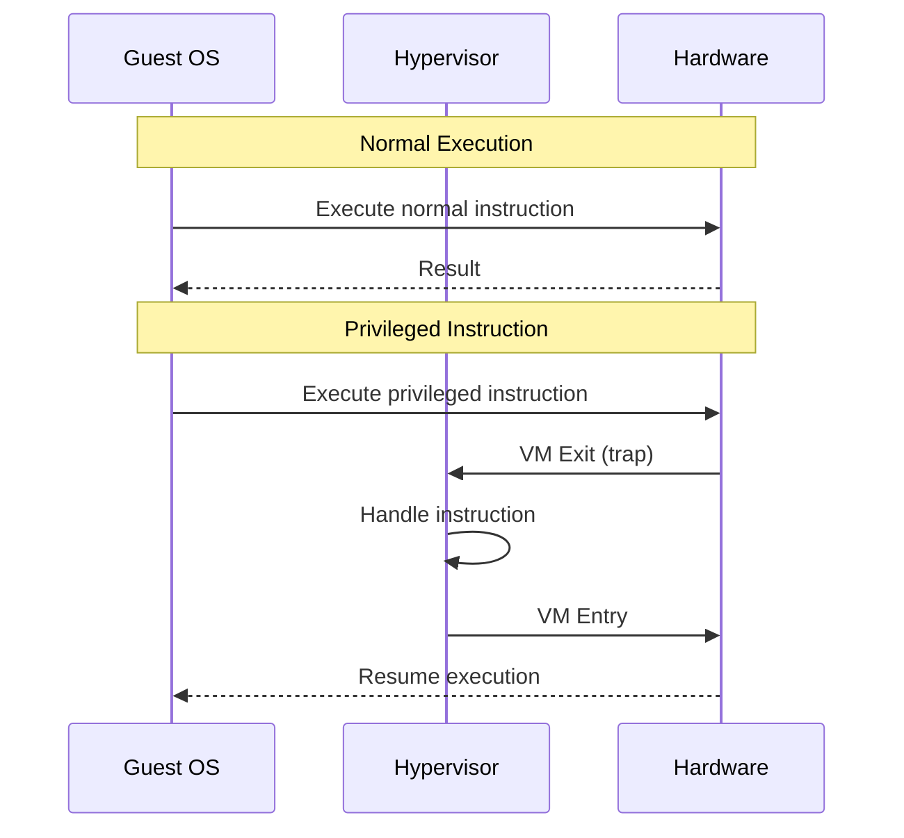

VM Exit 和 VM Entry 是硬件虚拟化扩展的核心机制。当 Guest OS 执行特权指令、访问受保护的内存区域、触发中断或执行特定的控制指令时,CPU 会自动执行 VM Exit 操作:保存 Guest 的完整状态(包括通用寄存器、控制寄存器、段寄存器等)到 VMCS(Virtual Machine Control Structure)结构中,加载 Hypervisor 的状态,然后跳转到预先指定的处理例程。Hypervisor 完成必要的处理后,执行 VM Entry 操作:恢复 Guest 状态,切换回 Non-Root Mode,并从下一条指令继续执行。整个过程由硬件加速,通常在数百个 CPU 周期内完成,相比软件模拟的数千周期有了数量级的提升。

**Intel VT-x 架构:**

```
VMCS(Virtual Machine Control Structure):
- Guest State Area:保存 Guest 状态
- Host State Area:保存 Host 状态
- VM Execution Control Fields:控制 VM 行为
- VM Exit Control Fields:控制退出行为
- VM Entry Control Fields:控制进入行为

EPT(Extended Page Tables):
- 二级地址转换
- Guest Physical → Host Physical
- 减少页表虚拟化开销
```

VMCS 是 VT-x 架构中的关键数据结构,它是一个包含数百个字段的控制块,定义了虚拟机的行为和状态。Guest State Area 保存了虚拟机的完整执行上下文,包括 RIP(指令指针)、RSP(栈指针)、CR0-CR4(控制寄存器)、段选择子等。Host State Area 保存了 Hypervisor 的状态,用于 VM Exit 时快速切换。Control Fields 则精细地控制了虚拟化的各个方面:哪些事件会触发 VM Exit、如何处理中断、是否启用 EPT、是否允许嵌套虚拟化等。通过配置这些字段,Hypervisor 可以实现细粒度的资源控制和安全管理。

EPT(Extended Page Tables)是 VT-x 的另一项重要创新,专门用于解决内存虚拟化的性能瓶颈。在传统的虚拟化方案中,Guest OS 维护自己的页表,将虚拟地址映射到"物理地址"(实际上是 Guest Physical Address,GPA)。Hypervisor 则需要维护另一套页表,将 GPA 映射到真实的 Host Physical Address(HPA)。每次内存访问都需要两次页表查询,而且 Guest 页表的修改必须同步到 Hypervisor 的页表,导致大量的 VM Exit 和性能损失。EPT 通过在硬件层面实现二级地址转换,使得 CPU 能够一次性完成 GVA → GPA → HPA 的转换,无需 Hypervisor 介入。这不仅大幅降低了内存虚拟化的开销,还简化了 Hypervisor 的实现。

**性能优化:**

```
VT-x 带来的改进:
✓ 减少 VM Exit 次数
✓ 加速上下文切换
✓ 支持嵌套虚拟化
✓ 更好的 I/O 虚拟化

典型性能提升:
- CPU 虚拟化开销:从 20-30% 降至 2-5%
- 内存虚拟化:通过 EPT 降低 50% 开销
- I/O 虚拟化:通过 SR-IOV 接近原生性能
```

硬件虚拟化扩展的引入使得 x86 虚拟化的性能发生了质的飞跃。在 VT-x 之前,虚拟机的 CPU 性能通常只有物理机的 70%-80%,因为大量的特权指令需要通过软件模拟。VT-x 之后,这一开销降至 2%-5%,几乎可以忽略不计。内存虚拟化方面,EPT 消除了影子页表的维护开销,使得内存访问性能接近原生水平。I/O 虚拟化则通过 VT-d(I/O Memory Management Unit)和 SR-IOV(Single Root I/O Virtualization)等技术,实现了设备的直接分配和硬件级隔离,进一步缩小了虚拟化与原生的差距。

除了性能提升,硬件虚拟化扩展还解锁了许多高级功能。嵌套虚拟化允许在虚拟机内部运行另一个 Hypervisor,这对于云服务商提供虚拟化服务(如 AWS EC2 运行 KVM)至关重要。虚拟机 introspection(VMI)技术使得 Hypervisor 能够在不修改 Guest OS 的情况下监控和分析其内部状态,为安全审计和故障诊断提供了强大工具。实时迁移(Live Migration)则依赖于精确的状态保存和恢复机制,使得虚拟机可以在不同物理主机之间无缝转移,而不会中断服务。

### 1.4 内存虚拟化

**挑战:如何隔离和管理多个 VM 的内存?**

内存虚拟化是虚拟化技术中最复杂的部分之一,因为它需要在保证隔离性的同时,实现高效的地址转换和资源管理。在物理系统中,操作系统通过页表机制将虚拟地址映射到物理地址,并提供内存保护、共享和交换等功能。在虚拟化环境中,这一过程变得更加复杂:Guest OS 认为自己在管理物理内存,但实际上它操作的"物理地址"只是 Hypervisor 分配的虚拟地址空间的一部分。Hypervisor 必须在 Guest OS 不知情的情况下,拦截和重定向所有的内存访问,确保不同虚拟机之间的内存完全隔离,同时最大化整体内存利用率。

内存虚拟化的核心问题是**地址空间的三重映射**:Guest Virtual Address(GVA)是应用程序看到的地址,Guest Physical Address(GPA)是 Guest OS 认为的物理地址,Host Physical Address(HPA)是真实的硬件内存地址。Hypervisor 需要维护 GVA → GPA 和 GPA → HPA 两层映射关系,并确保它们在运行时保持一致性。任何一层映射的错误或不一致都可能导致数据损坏、系统崩溃或安全漏洞。

**技术方案演进:**

**1. 影子页表(Shadow Page Tables)**

```
早期方案(无硬件支持)

原理:
- Hypervisor 维护影子页表
- Guest 页表只映射到影子页表
- 所有页表操作都被拦截

缺点:
✗ 开销大(每次页表更新都 trap)
✗ 复杂度高
✗ 性能差(30-50%  overhead)
```

影子页表是第一代内存虚拟化方案,在没有硬件支持的平台上广泛使用。其基本思想是:Hypervisor 为每个虚拟机维护一套"影子页表",这套页表直接将 GVA 映射到 HPA,绕过了 GPA 这一中间层。Guest OS 仍然维护自己的页表(GVA → GPA),但这些页表的内容被 Hypervisor 严格控制——Guest OS 不能直接写入页表,而是通过超调用(Hypercall)或 MMU 通知机制请求 Hypervisor 更新。当 Guest OS 尝试修改页表时,会触发页错误异常,Hypervisor 捕获该异常后,解析 Guest 的意图,更新影子页表,然后恢复 Guest 的执行。

影子页表的优势在于概念简单、实现直接,并且与 Guest OS 无关——无论 Guest 运行的是 Windows、Linux 还是其他操作系统,Hypervisor 都可以用统一的方式管理内存。然而,这种方案的缺陷同样明显:首先,每次页表更新都需要陷入 Hypervisor,对于频繁分配和释放内存的应用(如数据库、Web 服务器),这会带来巨大的性能开销。其次,Hypervisor 需要维护两套页表(Guest 页表和影子页表),并在它们之间保持同步,这增加了实现的复杂度和出错的可能性。第三,影子页表无法充分利用 CPU 的 TLB(Translation Lookaside Buffer)缓存,因为 TLB 中存储的是 GVA → HPA 的映射,而 Guest OS 修改的是 GVA → GPA 的映射,导致频繁的 TLB 失效和刷新。

在实际测试中,影子页表的性能开销通常达到 30%-50%,特别是在内存密集型工作负载下,这一数字可能更高。因此,随着硬件虚拟化扩展的普及,影子页表逐渐被淘汰,取而代之的是基于硬件辅助的方案。

**2. 硬件辅助(EPT/NPT)**

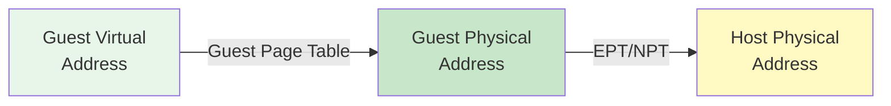

EPT(Intel Extended Page Tables)和 NPT(AMD Nested Page Tables)是第二代内存虚拟化方案,它们利用 CPU 的硬件特性,将两级地址转换卸载到硬件层面,从而大幅提升了性能。在这种方案中,Guest OS 可以自由地管理自己的页表(GVA → GPA),无需 Hypervisor 的干预。CPU 在执行内存访问指令时,会自动查询 EPT/NPT 表,完成 GPA → HPA 的转换。如果转换失败(例如访问了未映射的地址或未授权的页面),CPU 会触发 EPT Violation 异常,Hypervisor 捕获后可以决定如何处理——可能是分配新的物理页、拒绝访问或终止虚拟机。

```
Intel EPT(Extended Page Tables)
AMD NPT(Nested Page Tables)

原理:
- 两级页表转换
- 第一级:GVA → GPA(Guest 管理)
- 第二级:GPA → HPA(Hypervisor 管理)
- 硬件自动完成转换

优点:
✓ 无需影子页表
✓ 减少 VM Exit
✓ 性能接近原生(2-5% overhead)
```

EPT/NPT 的关键优势在于**解耦**:Guest OS 和 Hypervisor 各自管理自己的页表,互不干扰。Guest OS 可以像在传统系统中一样,自由地进行内存分配、页表更新和地址空间布局随机化(ASLR),而 Hypervisor 只需在必要时(如内存超分、页面迁移或安全策略变更)修改 EPT/NPT 表。这种解耦不仅简化了实现,还减少了 VM Exit 的次数——只有在真正的异常情况下才会陷入 Hypervisor,而不是每次页表修改都触发。

从性能角度来看,EPT/NPT 将内存虚拟化的开销降至 2%-5%,几乎达到了原生水平。这是因为现代的 CPU 为 EPT/NPT 设计了专门的硬件缓存和优化机制:TLB 可以同时缓存两级转换的结果,页表遍历可以使用专用的硬件单元,甚至预取器也能理解 EPT 的结构并提前加载所需的页表项。此外,EPT 还支持细粒度的权限控制,Hypervisor 可以为每个页面设置读、写、执行权限,实现内存保护和安全隔离,而无需额外的软件检查。

**3. 内存 ballooning**

```
动态调整 VM 内存

原理:
- Guest 中运行 balloon 驱动
- Hypervisor 请求回收内存
- Balloon 驱动分配内存但不使用
- Guest OS 认为内存被占用,触发 swap 或释放缓存
- Hypervisor 回收这些物理页

用途:
- 内存超分(Overcommitment)
- 动态资源调整
- 提高整体利用率
```

内存 ballooning 是一种动态调整虚拟机内存占用的技术,主要用于实现内存超分(Memory Overcommitment)——即分配的虚拟机内存总和超过物理内存总量。在云计算环境中,内存超分是提高资源利用率的重要手段,因为大多数虚拟机并不会同时达到峰值内存使用率。通过统计分析和负载均衡,Hypervisor 可以将空闲的内存从一个虚拟机转移到另一个需要更多内存的虚拟机,从而提高整体的资源利用率。

Ballooning 的工作原理类似于在 Guest OS 内部放置一个"气球":Hypervisor 通过 virtio-balloon 驱动向 Guest 发送请求,要求分配指定数量的内存页。Balloon 驱动在内核中分配这些页面,但不实际使用它们(即不进行读写操作)。从 Guest OS 的角度看,这些页面已经被占用,可用的物理内存减少。如果 Guest OS 的内存压力增大,它会触发内存回收机制,如将匿名页面交换到磁盘(swap)、释放文件系统缓存或压缩内存页面。一旦 Guest OS 释放了足够的内存,Hypervisor 就可以将这些物理页回收,并重新分配给其他虚拟机。

Ballooning 的优势在于它是**协作式**的:Guest OS 主动参与内存回收,可以选择最优的策略(如优先释放冷页面、保留热页面),从而最小化对性能的影响。相比之下,强制回收(如直接回收物理页而不通知 Guest)可能导致 Guest OS 访问已被回收的页面,触发页错误甚至系统崩溃。此外,ballooning 还可以与 KSM(Kernel Same-page Merging)结合使用,进一步提高内存利用率。

然而,ballooning 也存在一些局限性:首先,它依赖于 Guest OS 的配合,如果 Guest 中没有安装 balloon 驱动或驱动版本过旧,该技术将无法使用。其次,频繁的 ballooning 操作可能导致 Guest OS 的内存抖动(thrashing),即不断地交换页面和回收缓存,严重影响性能。第三,ballooning 的粒度较粗(通常以 4KB 页面为单位),对于小规模的内存调整不够灵活。因此,在实际应用中,Hypervisor 通常会结合多种技术(如 ballooning、KSM、swap 和压缩)来实现智能的内存管理。

**4. 内存去重(KSM)**

```
Kernel Same-page Merging

原理:
- 扫描内存页
- 识别相同内容的页
- 合并为单一副本
- 使用写时复制(COW)

效果:
- 相似 VM 可节省 30-50% 内存
- 适用于 VDI(虚拟桌面)场景

缺点:
- CPU 开销(扫描和比较)
- 可能影响性能
```

KSM(Kernel Same-page Merging)是 Linux 内核提供的一项内存去重功能,也被 KVM 等 Hypervisor 广泛用于提高内存利用率。其核心思想非常简单:如果多个虚拟机运行相同的操作系统或应用程序,它们的内存中必然存在大量内容相同的页面(如共享库、内核代码、只读数据等)。KSM 定期扫描这些页面,识别出内容相同的副本,并将它们合并为一个物理页面,多个虚拟机通过写时复制(Copy-on-Write,COW)机制共享该页面。当某个虚拟机尝试修改共享页面时,KSM 会为其创建一个私有副本,确保隔离性不受影响。

KSM 的工作流程分为三个阶段:扫描、比较和合并。在扫描阶段,KSM 选择一部分候选页面(通常是标记为可合并的匿名页面),计算它们的校验和(如 MD5 或 SHA-1)。在比较阶段,KSM 将校验和相同的页面进行逐字节比较,确认内容完全一致。在合并阶段,KSM 将这些页面映射到同一个物理帧,并修改页表权限为只读。后续如果有虚拟机尝试写入该页面,会触发页保护异常,KSM 捕获后为其分配新的物理页并复制内容,然后恢复写权限。

```
效果:
- 相似 VM 可节省 30-50% 内存
- 适用于 VDI(虚拟桌面)场景

缺点:
- CPU 开销(扫描和比较)
- 可能影响性能
```

KSM 在特定场景下效果显著。例如,在虚拟桌面基础设施(VDI)中,数十个甚至上百个虚拟机运行相同的 Windows 或 Linux 镜像,内存重复率极高。启用 KSM 后,可以节省 30%-50% 的内存,使得单台物理主机能够承载更多的虚拟机。在云计算环境中,如果多个租户部署相同的应用栈(如 LAMP、MEAN),KSM 也能带来可观的收益。

然而,KSM 的代价也不容忽视:首先,扫描和比较操作需要消耗大量的 CPU 周期,特别是在内存容量较大时,全量扫描可能需要数分钟甚至数小时。为了减轻这一负担,KSM 采用了启发式策略,优先扫描那些更可能重复的页面(如最近分配的页面或来自相同进程的页面),但仍无法完全消除开销。其次,写时复制机制引入了额外的延迟:当多个虚拟机并发修改共享页面时,会频繁触发页保护异常和页面复制,导致性能下降。第三,KSM 可能干扰 Guest OS 的内存管理策略,例如破坏 NUMA  locality 或影响透明大页的使用。

因此,KSM 的启用需要谨慎评估:在内存紧张且工作负载相似的环境中,KSM 的收益远大于成本;而在内存充足或工作负载多样化的场景中,禁用 KSM 可能获得更好的整体性能。一些先进的 Hypervisor(如 VMware vSphere)提供了更智能的去重算法,能够根据历史数据和实时负载动态调整去重策略,在节省内存和保持性能之间找到最佳平衡点。

### 1.5 I/O 虚拟化

**挑战:如何高效虚拟化各种 I/O 设备?**

如果说 CPU 和内存虚拟化是虚拟化技术的基石,那么 I/O 虚拟化则是决定用户体验的关键因素。在现代计算机系统中,I/O 设备种类繁多、接口复杂、性能各异:高速网卡需要处理数百万个数据包每秒,NVMe SSD 需要提供微秒级的访问延迟,GPU 需要支持复杂的图形渲染和并行计算,USB 控制器需要管理热插拔和设备枚举。Hypervisor 必须为每个虚拟机提供一套完整的虚拟 I/O 子系统,既要保证功能的正确性和兼容性,又要尽可能减少性能损失。

I/O 虚拟化的难点主要体现在三个方面:**多样性**、**性能**和**隔离性**。多样性指的是 I/O 设备的种类繁多,每种设备都有独特的寄存器布局、命令集、中断机制和 DMA 能力,Hypervisor 需要为每种设备提供准确的模拟或虚拟化实现。性能指的是 I/O 操作通常涉及大量的数据传输和上下文切换,如果虚拟化层引入过多的开销,将严重影响吞吐量、延迟和 CPU 利用率。隔离性指的是多个虚拟机可能同时访问同一物理设备,Hypervisor 必须确保它们的操作互不干扰,防止数据泄露、资源争用和恶意攻击。

**三种主要方案:**

针对上述挑战,业界发展出了三种主要的 I/O 虚拟化方案:完全模拟、半虚拟化和直通。每种方案在兼容性、性能和实现复杂度之间做出了不同的权衡,适用于不同的应用场景。

**1. 完全模拟(Full Emulation)**

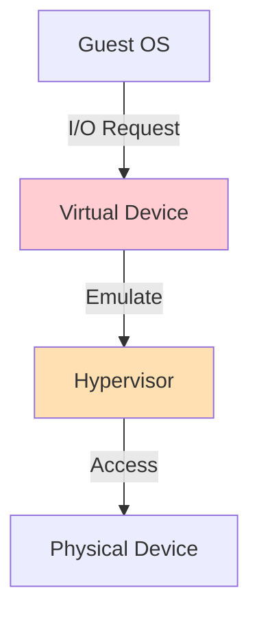

完全模拟是最传统也是最通用的 I/O 虚拟化方案。Hypervisor 通过软件完全模拟一个标准硬件设备的行为,包括寄存器读写、中断生成、DMA 传输等。Guest OS 看到这个虚拟设备时,会认为它是一个真实的物理设备,并使用标准的驱动程序与之交互。例如,QEMU 可以模拟 IDE 硬盘、e1000 网卡、VGA 显卡等设备,Guest OS 无需任何修改即可使用这些设备。

```
原理:
- Hypervisor 完全模拟硬件设备
- Guest 看到标准硬件(如 IDE、e1000)
- 所有 I/O 操作都 trap 到 Hypervisor

优点:
✓ 兼容性好(Guest 无需修改)
✓ 迁移性强(标准设备)

缺点:
✗ 性能差(每次 I/O 都 VM Exit)
✗ CPU 开销大

代表:
- QEMU 设备模拟
- VirtualBox 虚拟设备
```

完全模拟的工作流程如下:当 Guest OS 执行 I/O 指令(如 `in`、`out`)或访问内存映射的 I/O 区域(MMIO)时,CPU 检测到该操作并触发 VM Exit。Hypervisor 捕获异常后,解析 Guest 的意图(如读取哪个寄存器、写入什么数据),然后在软件中模拟设备的行为(如更新内部状态、生成中断、准备 DMA 数据)。模拟完成后,Hypervisor 将结果返回给 Guest,并恢复其执行。对于 DMA 操作,Hypervisor 还需要拦截 Guest 的 DMA 请求,将其重定向到 Hypervisor 管理的缓冲区,再与实际设备进行数据交换。

完全模拟的最大优势是**兼容性**:由于模拟的是标准硬件,任何支持该硬件的操作系统和驱动程序都可以直接使用,无需任何修改。这使得完全模拟成为迁移遗留系统、测试新操作系统和运行闭源软件的理想选择。此外,完全模拟还提供了良好的**可迁移性**:虚拟设备的行为是确定性的,不依赖于底层物理硬件的具体型号,因此虚拟机可以轻松地在不同主机之间迁移,而不会出现驱动不兼容或功能缺失的问题。

然而,完全模拟的性能代价是巨大的:首先,每次 I/O 操作都需要触发 VM Exit,而 VM Exit 的开销高达数千个 CPU 周期。对于高频的 I/O 操作(如网络数据包收发、磁盘读写),这将导致严重的性能瓶颈。其次,Hypervisor 需要在软件中模拟设备的复杂行为,包括状态机、时序控制和错误处理,这不仅增加了 CPU 负担,还可能引入延迟和不确定性。第三,完全模拟无法充分利用现代硬件的高级特性,如多队列、中断合并和卸载引擎,导致吞吐量和延迟都无法达到理想水平。

在实际测试中,完全模拟的网络吞吐量通常只有原生性能的 30%-50%,磁盘 IOPS 也只有原生的 20%-40%。对于性能敏感的应用(如数据库、高性能计算、实时交易系统),完全模拟往往是不可接受的。因此,完全模拟主要应用于对兼容性要求高于性能的场景,如开发测试、桌面虚拟化和遗留系统迁移。

**2. 半虚拟化(Paravirtualization)**

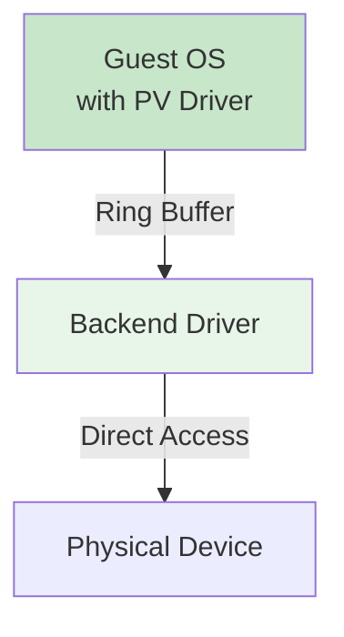

半虚拟化是一种通过修改 Guest OS 来提升 I/O 性能的方案。与完全模拟不同,半虚拟化假设 Guest OS "知道"自己运行在虚拟化环境中,并愿意与 Hypervisor 合作以提高效率。具体来说,Guest OS 中安装了特殊的前端驱动(Frontend Driver),这些驱动不再通过传统的 I/O 指令访问设备,而是通过共享内存环(Ring Buffer)和事件通知机制与 Hypervisor 的后端驱动(Backend Driver)通信。前端驱动将 I/O 请求打包成描述符(Descriptor),放入共享环中,然后通过超调用或中断通知后端驱动。后端驱动从环中取出请求,直接与物理设备交互,完成后将结果写回环中,并通知前端驱动。

```
原理:
- Guest OS 知道自己在虚拟化环境中
- 使用特殊的前端驱动(Frontend)
- Hypervisor 提供后端驱动(Backend)
- 通过共享内存和事件通知通信

优点:
✓ 性能好(减少 VM Exit)
✓ CPU 开销低

缺点:
✗ 需要修改 Guest OS
✗ 兼容性较差

代表:
- Xen PV
- Virtio(KVM)
- VMware VMXNET3
```

半虚拟化的核心优势是**性能**:首先,它大幅减少了 VM Exit 的次数。在完全模拟中,每次 I/O 操作都需要触发 VM Exit,而在半虚拟化中,多个 I/O 请求可以批量提交,只需一次或少量的 VM Exit。其次,共享内存机制避免了数据的多次拷贝:Guest 可以直接将数据写入共享缓冲区,后端驱动直接从该缓冲区读取,无需经过 Hypervisor 的中转。第三,事件通知机制(如 eventfd、irqfd)允许异步通信,Guest 可以在等待 I/O 完成时执行其他任务,提高了并发性和 CPU 利用率。

Virtio 是半虚拟化的事实标准,由 Rusty Russell 在 2007 年提出,并被 Linux 内核、KVM、QEMU 等广泛采用。Virtio 定义了一套统一的接口规范,包括 virtio-net(网络)、virtio-blk(块设备)、virtio-scsi(SCSI 设备)、virtio-console(控制台)等。每个 virtio 设备由前端驱动、后端驱动和传输层组成。传输层可以是 PCI、MMIO 或 Channel I/O,负责在前端和后端之间传递描述符和通知。Virtio 的设计非常灵活,支持多种优化技术,如间接描述符(Indirect Descriptor,允许单个描述符引用多个缓冲区)、事件抑制(Event Suppression,减少不必要的通知)和多队列(Multi-queue,提高并行度)。

```
代表:
- Xen PV
- Virtio(KVM)
- VMware VMXNET3
```

除了 Virtio,其他主流的半虚拟化方案还包括 Xen 的 PV 驱动、VMware 的 VMXNET3 网卡和 PVSCSI 存储控制器、Microsoft Hyper-V 的 Integration Services 等。这些方案虽然在具体实现上有所不同,但核心理念一致:通过 Guest OS 的配合,绕过虚拟化层的冗余操作,直接利用硬件的能力。

半虚拟化的主要缺点是**兼容性**:由于需要修改 Guest OS,对于闭源操作系统(如旧版本的 Windows)或嵌入式系统,可能无法获得合适的驱动程序。此外,半虚拟化设备的行为可能与标准硬件不完全一致,导致某些应用程序出现兼容性问题。例如,某些网络应用依赖于特定的网卡特性(如 TSO、LRO),如果 virtio-net 不支持这些特性,应用性能可能下降。因此,在选择半虚拟化方案时,需要充分测试目标工作负载的兼容性,并在必要时提供回退机制(如切换到完全模拟模式)。

**3. 直通(PCI Passthrough)**

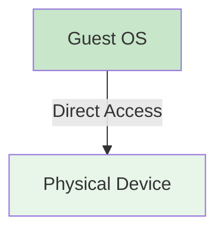

直通(PCI Passthrough)是性能最高的 I/O 虚拟化方案,它将物理设备直接分配给虚拟机,Guest OS 可以直接访问硬件,完全绕过 Hypervisor。在这种模式下,Hypervisor 仅在虚拟机启动时配置设备的 BAR(Base Address Register)、中断路由和 DMA 映射,之后的所有 I/O 操作都由 Guest OS 和设备直接完成,无需 Hypervisor 的干预。

```
原理:
- 将物理设备直接分配给 VM
- Guest 直接访问硬件
- 绕过 Hypervisor

优点:
✓ 性能最好(接近原生)
✓ 延迟最低

缺点:
✗ 设备不能共享
✗ 迁移困难
✗ 需要硬件支持(VT-d/AMD-Vi)

代表:
- Intel VT-d
- AMD-Vi
- SR-IOV(单根 I/O 虚拟化)
```

直通的实现依赖于两项关键的硬件技术:IOMMU(Input-Output Memory Management Unit)和中断重映射。IOMMU(如 Intel 的 VT-d 和 AMD 的 AMD-Vi)类似于 CPU 的 MMU,但它管理的是设备的 DMA 访问。通过 IOMMU,Hypervisor 可以为每个设备建立独立的地址转换表,将设备看到的"物理地址"映射到实际的内存区域。这样,即使 Guest OS 试图通过 DMA 访问未经授权的内存,IOMMU 也会拦截该请求并触发异常,确保隔离性。中断重映射则允许 Hypervisor 将设备产生的中断路由到正确的虚拟机,防止中断冲突和信息泄露。

直通的最大优势是**性能**:由于 Guest OS 直接使用原生驱动程序访问硬件,性能几乎与物理机无异。网络吞吐量、磁盘 IOPS、GPU 渲染速度等指标都可以达到原生水平的 95%-100%。此外,直通还支持硬件的高级特性,如 SR-IOV、RDMA(Remote Direct Memory Access)、GPUDirect 等,这些特性在完全模拟或半虚拟化中难以实现或性能受损。

然而,直通的缺点同样明显:首先,**设备不能共享**——一旦设备分配给某个虚拟机,其他虚拟机就无法使用该设备。这对于资源利用率是一个巨大的浪费,特别是对于昂贵的设备(如 GPU、高速网卡)。其次,**迁移困难**——由于虚拟机直接绑定到物理设备,实时迁移(Live Migration)变得极其复杂,通常需要中断服务或采用特殊的迁移协议。第三,**硬件要求高**——直通需要 CPU 和芯片组支持 IOMMU,并且 BIOS/UEFI 中必须启用相关选项。在一些老旧或低端硬件上,这可能无法实现。

**SR-IOV:**

```
Single Root I/O Virtualization

原理:
- 物理设备创建多个虚拟功能(VF)
- 每个 VF 可以分配给不同 VM
- 硬件级别隔离

优势:
✓ 高性能
✓ 多 VM 共享
✓ 硬件卸载

应用:
- 高速网卡(10G/25G/100G)
- GPU 虚拟化
- NVMe SSD
```

SR-IOV(Single Root I/O Virtualization)是直通的一种增强形式,它通过硬件级别的虚拟化,既保留了直通的高性能,又实现了设备的共享。SR-IOV 允许一个物理设备(称为 PF,Physical Function)创建多个虚拟功能(VF,Virtual Function),每个 VF 看起来像一个独立的 PCI 设备,拥有自己的配置空间、BAR 和中断向量。Hypervisor 可以将不同的 VF 分配给不同的虚拟机,每个虚拟机都认为自己在独占一个物理设备。

SR-IOV 的关键创新在于**硬件卸载**:VF 的数据路径完全在硬件中实现,无需 Hypervisor 或软件驱动的干预。例如,在支持 SR-IOV 的网卡中,每个 VF 都有自己的发送/接收队列、DMA 引擎和中断处理器。当虚拟机发送数据包时,数据直接从 Guest 内存复制到网卡的 TX 队列,然后通过物理端口发送出去,整个过程不涉及 Hypervisor。这种设计使得 SR-IOV 的性能几乎等同于直通,同时支持数十个甚至上百个虚拟机共享同一物理设备。

SR-IOV 广泛应用于高性能场景:在数据中心中,10G/25G/100G 网卡通过 SR-IOV 为多个虚拟机提供线速网络性能;在 AI 训练中,GPU 通过 SR-IOV 为多个容器或虚拟机提供算力隔离;在存储系统中,NVMe SSD 通过 SR-IOV 实现多租户的低延迟访问。然而,SR-IOV 也需要硬件支持,并不是所有设备都具备这一功能。此外,SR-IOV 的配置和管理相对复杂,需要 Hypervisor、驱动程序和固件的紧密配合。

**性能对比:**

| 方案 | 吞吐量 | CPU 开销 | 延迟 | 适用场景 |
|------|--------|---------|------|---------|
| **完全模拟** | 低 | 高 | 高 | 兼容性优先 |
| **半虚拟化** | 中-高 | 中 | 中 | 通用场景 |
| **直通** | 最高 | 最低 | 最低 | 高性能需求 |
| **SR-IOV** | 接近原生 | 低 | 低 | 网络/GPU |

选择合适的 I/O 虚拟化方案需要根据具体需求进行权衡。对于通用工作负载,半虚拟化(如 Virtio)提供了良好的性能和兼容性平衡,是大多数场景的首选。对于性能极致要求的场景(如高频交易、科学计算、AI 训练),直通或 SR-IOV 是更好的选择,尽管它们牺牲了一定的灵活性和可迁移性。对于遗留系统或兼容性优先的场景,完全模拟仍然是可行的方案,尽管性能受限。在实际部署中,许多云平台采用混合策略:为普通虚拟机提供 Virtio 设备,为高性能虚拟机提供 SR-IOV 或直通设备,从而在不同需求之间取得最佳平衡。

## 第二部分:主流虚拟化技术

在理解了虚拟化的基本原理之后,让我们来看看业界主流的虚拟化平台。每个平台都有其独特的设计哲学、技术特点和适用场景。本节将深入分析 KVM、Xen、VMware vSphere 和 Hyper-V 这四大主流虚拟化技术的架构特点、优势劣势以及实际应用。

### 2.1 KVM(Kernel-based Virtual Machine)

KVM 是 Linux 内核的一个模块,它将 Linux 内核转变为一个功能完整的 Hypervisor。自 2007 年被 Red Hat 收购并集成到 Linux 内核 2.6.20 版本以来,KVM 已经发展成为最流行的开源虚拟化解决方案之一,被广泛应用于云计算、数据中心和企业虚拟化环境。

**架构:**

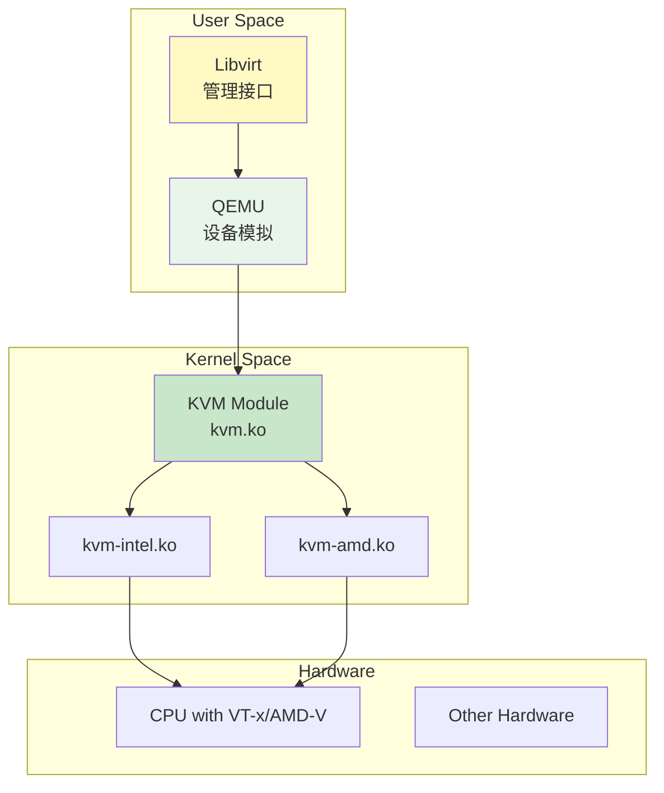

KVM 的架构设计体现了 Linux 哲学的精髓:模块化、简洁和协作。KVM 本身只负责 CPU 和内存的虚拟化,而 I/O 设备的模拟则交给用户空间的 QEMU 进程处理。这种分工使得 KVM 能够专注于核心虚拟化功能,保持代码的精简和高效,同时利用 QEMU 成熟的设备模拟能力提供完整的虚拟化体验。

具体来说,KVM 由三个主要组件组成:kvm.ko 是核心模块,提供了虚拟机的创建、运行和管理接口;kvm-intel.ko 或 kvm-amd.ko 是针对特定 CPU 虚拟化扩展(VT-x 或 AMD-V)的驱动模块;QEMU 则负责设备模拟、磁盘映像管理和网络配置等用户空间任务。Libvirt 是一个独立的管理 API 和守护进程,它提供了统一的接口来管理 KVM、Xen、LXC 等多种虚拟化技术,使得管理员可以使用相同的工具(virsh、virt-manager 等)操作不同的虚拟化平台。

**特点:**

```
✓ 集成到 Linux 内核(2.6.20+)
✓ 开源(GPL)
✓ 成熟稳定
✓ 广泛支持

组件:
- kvm.ko:核心模块
- kvm-intel.ko / kvm-amd.ko:CPU 特定模块
- QEMU:设备模拟和用户空间工具
- Libvirt:管理 API
```

KVM 的最大优势在于其与 Linux 生态系统的深度集成。作为内核的一部分,KVM 可以直接利用 Linux 的设备驱动、调度器、内存管理和安全机制,无需重新实现这些复杂的功能。这不仅降低了开发和维护成本,还确保了 KVM 能够及时获得 Linux 内核的最新改进和安全补丁。此外,KVM 的开源特性使其成为云计算平台(如 OpenStack、CloudStack、oVirt)的首选虚拟化后端,避免了供应商锁定和高昂的许可费用。

然而,KVM 也并非完美无缺。首先,KVM 依赖于 Linux 内核,这意味着它只能在 Linux 系统上运行,无法像 VMware ESXi 那样作为独立的 Hypervisor 部署。其次,KVM 的管理工具链相对分散,虽然有 Libvirt 提供统一接口,但高级功能(如实时迁移、高可用性、资源调度)需要额外的组件(如 oVirt、Proxmox VE)才能实现,增加了部署和配置的复杂度。第三,KVM 的商业支持主要来自 Red Hat(RHV)和 Canonical(Ubuntu KVM),对于中小企业而言,获取专业的技术支持可能不如 VMware 或 Microsoft 那样便捷。

**基本操作:**

```bash
# 检查硬件支持
grep -E '(vmx|svm)' /proc/cpuinfo

# 加载 KVM 模块
modprobe kvm
modprobe kvm-intel  # 或 kvm-amd

# 安装管理工具
apt install qemu-kvm libvirt-daemon-system virtinst

# 创建 VM
virt-install \
  --name ubuntu-vm \
  --memory 2048 \
  --vcpus 2 \
  --disk size=20 \
  --cdrom ubuntu.iso \
  --network bridge=virbr0 \
  --graphics vnc

# 管理 VM
virsh list
virsh start ubuntu-vm
virsh shutdown ubuntu-vm
virsh destroy ubuntu-vm  # 强制停止
```

在实际应用中,KVM 广泛用于构建私有云和公有云平台。OpenStack 作为最流行的开源云计算操作系统,其计算节点默认使用 KVM 作为虚拟化后端。通过 Nova 组件,OpenStack 可以自动化地创建、调度和管理成千上万个 KVM 虚拟机,提供与 AWS EC2 类似的云服务。在国内,阿里云、腾讯云、华为云等大型云服务商也大量使用 KVM 作为底层虚拟化技术,证明了其在大规模生产环境中的可靠性和性能。

### 2.2 Xen

Xen 是最早的开源 Hypervisor 之一,由剑桥大学计算机实验室于 2003 年发布。与 KVM 不同,Xen 采用微内核架构,Hypervisor 本身非常精简(约 1MB),所有的设备驱动和管理功能都运行在特权域(Domain 0)中。这种设计使得 Xen 具有极高的安全性和稳定性,即使 Domain 0 崩溃,Hypervisor 和其他虚拟机仍然可以继续运行。

**架构特点:**

微内核 Hypervisor

Domain 0(Dom0):
- 特权域
- 管理其他 VM
- 驱动物理设备

Domain U(DomU):
- 非特权域
- 普通 VM
- 通过 Dom0 访问设备


Xen 的架构分为三层:Hypervisor 层、Domain 0 层和 Domain U 层。Hypervisor 层是最底层,直接运行在硬件上,负责 CPU 调度、内存管理和中断路由。Domain 0 是一个特殊的虚拟机,它拥有最高的权限,可以访问物理设备、管理其他虚拟机,并提供 I/O 服务。Domain U 是普通的虚拟机,它们通过 Domain 0 提供的后端驱动访问物理设备。这种分层架构使得 Xen 能够实现严格的隔离和细粒度的资源控制。

Xen 支持两种虚拟化模式:半虚拟化(PV)和硬件虚拟化(HVM)。在半虚拟化模式下,Guest OS 需要修改以使用 Xen 的前端驱动,通过超调用与 Hypervisor 通信。这种模式在硬件虚拟化扩展出现之前是 x86 平台上唯一可行的方案,性能优异但兼容性受限。在硬件虚拟化模式下,Xen 利用 Intel VT-x 或 AMD-V 技术,可以运行未经修改的 Guest OS,兼容性更好但性能略低。PV on HVM 是一种混合模式,它在 HVM 的基础上使用 PV 驱动来提升 I/O 性能,兼顾了兼容性和性能。

**两种模式:**

| 模式 | 说明 | 性能 |
|------|------|------|
| **PV(Paravirtualized)** | 修改 Guest OS | 高 |
| **HVM(Hardware Virtualized)** | 硬件辅助,无需修改 | 中-高 |
| **PV on HVM** | 混合模式 | 最高 |

Xen 的历史地位不可忽视。在 2006-2015 年间,Xen 是云计算领域的主导技术,AWS EC2、Rackspace Cloud、IBM SoftLayer 等早期云平台都基于 Xen 构建。Xen 的成功得益于其成熟的技术、稳定的性能和强大的社区支持。然而,随着 KVM 的崛起和硬件虚拟化扩展的普及,Xen 的市场份额逐渐下降。2015 年,AWS 宣布将 EC2 从 Xen 迁移到基于 KVM 的 Nitro 系统,标志着虚拟化技术格局的重大转变。

**应用场景:**

```
✓ AWS EC2(早期)
✓ Citrix XenServer
✓ Oracle VM
✓ 云基础设施
```

尽管市场份额下降,Xen 仍然在某些领域保持着竞争优势。Citrix XenServer(现更名为 Citrix Hypervisor)是企业虚拟化市场的重要参与者,特别是在 VDI(虚拟桌面基础设施)场景中表现出色。Oracle VM 基于 Xen 构建,为 Oracle 数据库和应用服务器提供了优化的虚拟化平台。此外,Xen 在嵌入式系统、安全隔离和实时系统中仍有广泛应用,其微内核架构和低延迟特性使其成为这些特殊场景的理想选择。

### 2.3 VMware vSphere

VMware vSphere 是企业虚拟化市场的领导者,由 VMware 公司(现隶属于 Broadcom)开发。vSphere 不是一个单一的产品,而是一个完整的虚拟化套件,包括 ESXi Hypervisor、vCenter Server 管理平台、vSAN 软件定义存储、NSX 网络虚拟化等多个组件。vSphere 以其丰富的企业级特性、卓越的性能和完善的生态系统,成为全球财富 500 强企业的首选虚拟化平台。

**组件:**

```
ESXi:
- Type 1 Hypervisor
- 直接安装在硬件上

vCenter Server:
- 集中管理
- vMotion(live migration)
- HA(高可用)
- DRS(分布式资源调度)

vSAN:
- 软件定义存储
- 分布式存储

NSX:
- 网络虚拟化
- 微分段
```

ESXi 是 vSphere 的核心 Hypervisor,它采用 Type 1 架构,直接运行在硬件上。ESXi 的设计哲学是"极简主义":它的内核仅约 150 MB,不包含任何不必要的服务和驱动程序,所有额外的功能都通过插件或外部组件提供。这种设计使得 ESXi 具有极高的稳定性和安全性,启动时间通常在 1 分钟以内,补丁更新可以快速完成而无需长时间停机。

vCenter Server 是 vSphere 的管理中枢,它提供了集中化的虚拟机管理、资源调度、性能监控和自动化运维功能。通过 vCenter,管理员可以在一个统一的界面中管理成百上千台 ESXi 主机和数万台虚拟机。vCenter 的核心功能包括:vMotion(实时迁移),允许虚拟机在不同主机之间无缝转移而不会中断服务;HA(High Availability),在主机故障时自动在其他主机上重启虚拟机;DRS(Distributed Resource Scheduler),根据负载情况动态平衡集群中的资源分配;FT(Fault Tolerance),提供指令级的双机热备,实现零停机保护。

**企业特性:**

```
✓ vMotion:零停机迁移
✓ Storage vMotion:在线存储迁移
✓ HA:自动故障转移
✓ FT:容错(双机热备)
✓ DRS:自动负载均衡
✓ Snapshot:快照管理
```

vSAN 是 VMware 的软件定义存储解决方案,它将多台主机的本地磁盘聚合为一个分布式的共享存储池。vSAN 的优势在于简化了存储架构,消除了对传统 SAN/NAS 设备的依赖,同时提供了高性能、高可用性和线性扩展能力。NSX 则是网络虚拟化平台,它实现了软件定义的网络(SDN),允许管理员通过编程方式创建和管理虚拟网络,包括逻辑交换机、路由器、防火墙和负载均衡器。NSX 的微分段(Micro-segmentation)功能可以为每个虚拟机设置精细的网络安全策略,显著提升了数据中心的安全性。

**适用场景:**

```
✓ 企业数据中心
✓ 私有云
✓ VDI(虚拟桌面)
✓ 关键业务应用
```

VMware vSphere 的主要优势在于其成熟度、可靠性和生态系统。经过近 20 年的发展,vSphere 已经通过了无数企业的生产验证,支持几乎所有主流的操作系统、应用程序和硬件平台。VMware 提供了完善的技术支持、培训认证和合作伙伴网络,使得企业能够快速部署和运维虚拟化基础设施。此外,vSphere 与众多第三方产品(如备份软件、监控系统、安全工具)深度集成,形成了庞大的生态圈。

然而,vSphere 的成本也是其主要的劣势。vSphere 的许可费用昂贵,特别是包含 vCenter、vSAN、NSX 等高级功能的套件,对于中小企业而言是一笔不小的开支。此外,vSphere 的学习曲线较陡,管理员需要掌握大量的概念、配置和优化技巧,才能获得最佳的使用效果。近年来,随着开源虚拟化技术(KVM、Xen)和容器技术(Docker、Kubernetes)的兴起,vSphere 面临着越来越激烈的竞争,VMware 也在积极转型,推出 Tanzu 等云原生产品,以适应新的技术趋势。

### 2.4 Hyper-V

Hyper-V 是微软开发的虚拟化平台,首次发布于 2008 年,集成在 Windows Server 2008 及更高版本中。与 VMware vSphere 类似,Hyper-V 也是一个完整的企业级虚拟化解决方案,但它与 Windows 生态系统的深度集成是其最大的特色。Hyper-V 采用 Type 1 架构,Hypervisor 直接运行在硬件上,而父分区(Parent Partition)运行 Windows Server,负责设备驱动和管理功能。

**微软的虚拟化方案:**

```
架构:
- Parent Partition:运行 Windows Server
- Child Partitions:VMs
- Hypervisor Layer:底层虚拟化

特性:
✓ 与 Windows 生态深度集成
✓ Dynamic Memory:动态内存
✓ Checkpoints:快照
✓ Live Migration:实时迁移
✓ Shielded VMs:加密 VM
```

Hyper-V 的架构与 Xen 类似,都采用了微内核设计。Hypervisor 层非常精简,只负责 CPU 调度和内存管理。父分区(也称为管理操作系统)运行 Windows Server,拥有访问物理设备的权限,并为子分区(Child Partitions,即虚拟机)提供 I/O 服务。子分区可以是 Windows 或 Linux 系统,通过集成服务(Integration Services)获得优化的驱动程序和功能增强。

Hyper-V 提供了丰富的企业级特性,与 VMware vSphere 形成直接竞争。Dynamic Memory 允许虚拟机根据负载动态调整内存占用,提高资源利用率。Checkpoints(快照)功能可以捕获虚拟机的状态,便于备份、恢复和测试。Live Migration 支持虚拟机在不同主机之间实时迁移,类似于 VMware 的 vMotion。Failover Clustering 提供了高可用性,在主机故障时自动将虚拟机迁移到其他节点。Shielded VMs 是一项安全功能,通过加密和远程证明技术,保护虚拟机免受恶意管理员或 compromised Hypervisor 的攻击。

**适用场景:**

```
✓ Windows Server 环境
✓ Azure Stack
✓ 混合云
✓ .NET 应用
```

Hyper-V 的最大优势在于其与 Windows 生态系统的无缝集成。对于已经部署了大量 Windows Server、Active Directory、System Center 等企业 IT 基础设施的组织而言,选择 Hyper-V 可以降低学习成本、简化管理流程,并获得更好的兼容性。Hyper-V 与 Azure 云平台的集成也非常紧密,通过 Azure Stack 和 Azure Site Recovery,企业可以轻松构建混合云架构,实现本地数据中心与公有云之间的 workload 迁移和灾难恢复。

然而,Hyper-V 的劣势也很明显:首先,它对 Linux 的支持虽然不断改进,但与 KVM 或 VMware 相比仍有差距,某些高级功能(如嵌套虚拟化、GPU 直通)在 Linux Guest 上的表现不够理想。其次,Hyper-V 的管理工具(System Center Virtual Machine Manager)复杂且昂贵,对于小型部署而言可能过于笨重。第三,Hyper-V 的社区和生态系统相对较小,第三方集成和支持选项不如 VMware 丰富。因此,Hyper-V 最适合那些已经深度依赖微软技术栈的企业,对于异构环境或 Linux 为主的场景,KVM 或 VMware 可能是更好的选择。

## 第三部分:虚拟机 vs 容器

在云计算和 DevOps 时代,虚拟机和容器是两种最主要的应用部署技术。它们各有优劣,适用于不同的场景。理解它们的本质区别、技术特点和适用边界,对于做出正确的架构决策至关重要。本节将从架构原理、性能特征、生态系统和实际应用等多个维度,对虚拟机和容器进行全面的对比分析。

### 3.1 架构对比

要理解虚拟机和容器的差异,首先需要从架构层面剖析它们的本质。虚拟机通过 Hypervisor 虚拟化硬件层,为每个应用提供完整的操作系统环境;而容器则通过操作系统级别的虚拟化,共享宿主机的内核,仅隔离用户空间。这种根本性的架构差异导致了它们在性能、隔离性、启动速度和资源利用率等方面的显著不同。

**虚拟机架构:**

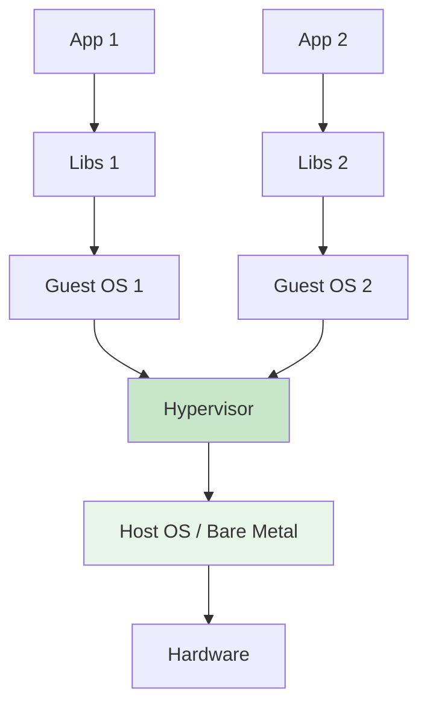

在虚拟机架构中,每个应用都运行在独立的 Guest OS 之上。Guest OS 拥有完整的内核、系统库、驱动程序和用户空间工具,仿佛独占一台物理机器。Hypervisor 负责虚拟化 CPU、内存、存储和网络等硬件资源,为每个虚拟机提供隔离的执行环境。这种架构的优势在于隔离性强、兼容性高,可以运行不同的操作系统(如 Windows、Linux、BSD),并且每个虚拟机的故障不会影响其他虚拟机或宿主机。然而,这种优势是以资源开销为代价的:每个 Guest OS 都需要占用数百 MB 到数 GB 的内存和磁盘空间,启动时间也需要数十秒到数分钟。

**容器架构:**

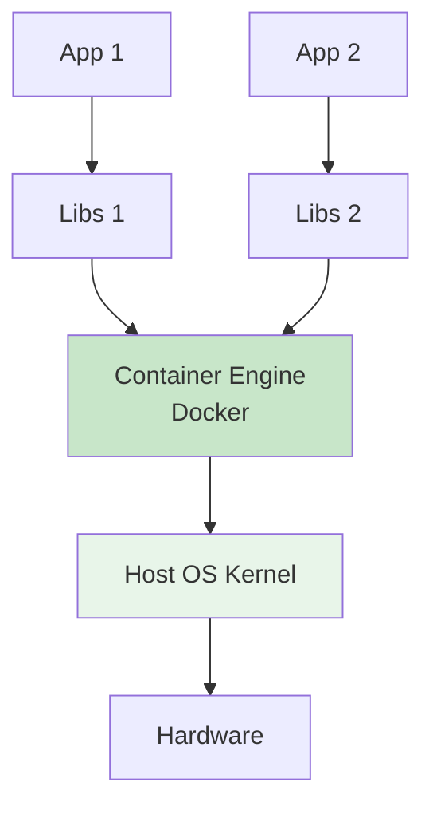

容器架构则采用了完全不同的设计思路。所有容器共享宿主机的内核,容器引擎(如 Docker、containerd)通过 Linux 内核的 Namespace 和 Cgroups 机制,为每个容器提供隔离的进程视图、文件系统、网络栈和资源限制。Namespace 实现了隔离性,使得每个容器只能看到自己的进程、文件和网络接口;Cgroups 实现了资源控制,限制了每个容器可以使用的 CPU、内存和 I/O 带宽。由于无需运行完整的 Guest OS,容器的镜像大小通常只有几十 MB,启动时间仅需几秒钟,资源开销极小。

**关键区别:**

```
虚拟机:
- 虚拟化硬件
- 完整 Guest OS
- 强隔离
- 启动慢(分钟级)

容器:
- 虚拟化操作系统
- 共享 Host Kernel
- 进程级隔离
- 启动快(秒级)
```

虚拟机和容器的核心区别可以概括为:**虚拟机虚拟化的是硬件,容器虚拟化的是操作系统**。虚拟机通过 Hypervisor 在硬件和 Guest OS 之间插入一个抽象层,使得多个操作系统可以同时运行在同一台物理机上。容器则通过操作系统的内置机制,在单个内核上创建多个隔离的用户空间实例。这种差异决定了它们的适用场景:虚拟机适合需要强隔离、多 OS 支持和高安全性的场景;容器适合需要快速迭代、高密度部署和弹性伸缩的微服务架构。

值得注意的是,虚拟机和容器并非互斥关系,而是可以互补共存。在许多生产环境中,容器运行在虚拟机内部,结合了两者 的优势:虚拟机提供了硬件级的隔离和安全边界,容器提供了轻量级的应用封装和快速部署能力。这种混合架构既保证了安全性,又提高了资源利用率和运维效率,成为现代云平台的主流选择。

### 3.2 详细对比表

为了更直观地比较虚拟机和容器的差异,我们从多个维度进行了详细的对比分析。需要注意的是,这些对比并非绝对,实际的性能和特性取决于具体的实现、配置和工作负载。

| 维度 | 虚拟机 | 容器 |
|------|--------|------|
| **隔离级别** | 硬件级(强) | 进程级(中) |
| **启动时间** | 分钟级 | 秒级 |
| **性能开销** | 5-15% | 1-5% |
| **镜像大小** | GB 级别 | MB 级别 |
| **密度** | 10-20/主机 | 100-1000/主机 |
| **OS 支持** | 多种 OS | 同 Kernel 家族 |
| **持久化** | 天然支持 | 需额外配置 |
| **网络** | 完整协议栈 | Namespace 隔离 |
| **存储** | 虚拟磁盘 | Union FS + Volume |
| **安全性** | 高(独立内核) | 中(共享内核) |
| **迁移** | vMotion(成熟) | 重建而非迁移 |
| **适用场景** | 多 OS、遗留应用 | 微服务、云原生 |
| **管理复杂度** | 中 | 低(单体)/高(集群) |
| **生态系统** | 成熟(VMware等) | 活跃(CNCF) |
| **学习曲线** | 平缓 | 陡峭(K8s) |

**隔离级别:** 虚拟机通过 Hypervisor 实现硬件级的隔离,每个虚拟机拥有独立的内核、内存空间和硬件视图。即使某个虚拟机的内核崩溃或被攻破,也不会影响其他虚拟机或宿主机。容器则通过 Namespace 实现进程级的隔离,所有容器共享同一个内核。虽然 Namespace 提供了良好的隔离性,但如果内核存在漏洞(如 Dirty COW、eBPF 漏洞),恶意容器可能突破隔离,访问宿主机的资源或其他容器的数据。因此,在多租户环境中,虚拟机的安全性更高。

**启动时间和性能开销:** 虚拟机的启动需要加载完整的 Guest OS,包括内核初始化、驱动加载、服务启动等步骤,通常需要数十秒到数分钟。容器的启动则只需创建新的 Namespace 和 Cgroups,启动用户空间进程,通常在几秒钟内即可完成。性能方面,虚拟机的 CPU 和内存虚拟化会引入 5%-15% 的开销,特别是 I/O 密集型应用受影响更大。容器的性能开销极小(1%-5%),几乎接近原生执行,因为容器进程直接在宿主机内核上运行,没有额外的虚拟化层。

**资源利用率和密度:** 由于容器无需运行完整的 Guest OS,其镜像大小通常只有几十 MB,而虚拟机镜像则需要数 GB。这意味着在相同的存储空间下,可以部署更多的容器。在运行时,容器的内存开销也更小,单个容器可能只需要几十 MB 内存,而虚拟机至少需要数百 MB。因此,单台物理主机可以运行数百甚至上千个容器,但通常只能运行几十个虚拟机。这种高密度部署能力使得容器在微服务架构和 Serverless 场景中具有明显优势。

**操作系统支持:** 虚拟机可以运行任何支持的操作系统,包括 Windows、Linux、BSD、Solaris 等,甚至可以同时运行不同版本的内核。这对于需要兼容旧系统、测试多平台或运行特定 OS 应用的场景非常有用。容器则依赖于宿主机的内核,只能运行与宿主机兼容的操作系统。例如,Linux 容器只能运行在 Linux 内核上,无法直接运行 Windows 应用(虽然可以通过 WSL2 或虚拟机间接实现)。这限制了容器在某些异构环境中的适用性。

**持久化和状态管理:** 虚拟机天然支持持久化,虚拟磁盘文件(如 VMDK、QCOW2)可以长期保存数据,虚拟机的状态也可以通过快照功能捕获和恢复。容器的设计哲学是"不可变基础设施",容器本身应该是无状态的,数据应该存储在外部卷(Volume)或分布式存储系统中。虽然 Docker Volume 和 Kubernetes PersistentVolume 提供了持久化方案,但配置和管理相对复杂,特别是在分布式环境中,需要处理数据一致性、备份恢复和跨节点迁移等问题。

**网络和存储:** 虚拟机拥有完整的网络协议栈,可以配置 IP 地址、路由表、防火墙规则等,就像一台独立的物理机器。虚拟磁盘提供了块级别的存储抽象,支持快照、克隆、精简置备等高级功能。容器的网络通过 Namespace 和虚拟网桥实现,每个容器有独立的网络命名空间,可以通过 overlay 网络实现跨主机通信。容器的存储则基于 Union File System(如 AUFS、OverlayFS),将多层镜像合并为一个统一的文件系统,并通过 Volume 挂载外部存储。容器的网络和存储模型更加灵活,但也更复杂,需要深入理解 Docker 网络驱动、Kubernetes Service 和 Ingress 等概念。

**迁移和灾备:** 虚拟机的实时迁移(vMotion、Live Migration)技术已经非常成熟,可以在不中断服务的情况下,将虚拟机从一台物理主机迁移到另一台。这对于负载均衡、硬件维护和灾难恢复非常有用。容器的"迁移"通常是重建而非移动:在新的主机上拉取镜像、创建容器、恢复状态,然后切换流量。虽然 Kubernetes 的 StatefulSet 和 Operator 模式可以简化有状态应用的迁移,但与虚拟机的无缝迁移相比仍有差距。

**生态系统和学习曲线:** 虚拟机生态系统经过近 20 年的发展,已经非常成熟。VMware、Microsoft、Red Hat 等厂商提供了完善的产品、工具和支持服务。管理员可以通过图形界面(vSphere Client、Hyper-V Manager)轻松管理虚拟机,学习曲线相对平缓。容器生态系统则更加年轻和活跃,CNCF(Cloud Native Computing Foundation)旗下有超过 150 个项目,包括 Kubernetes、Prometheus、Envoy、Helm 等。虽然容器技术带来了巨大的灵活性和效率提升,但其学习曲线陡峭,需要掌握 YAML 配置、声明式 API、服务网格、GitOps 等大量新概念和工具。

### 3.3 选择指南

面对虚拟机和容器这两种技术,如何做出正确的选择?答案取决于你的应用场景、业务需求和技术约束。以下是一个决策框架,帮助你根据具体情况做出最佳选择。

**决策树:**

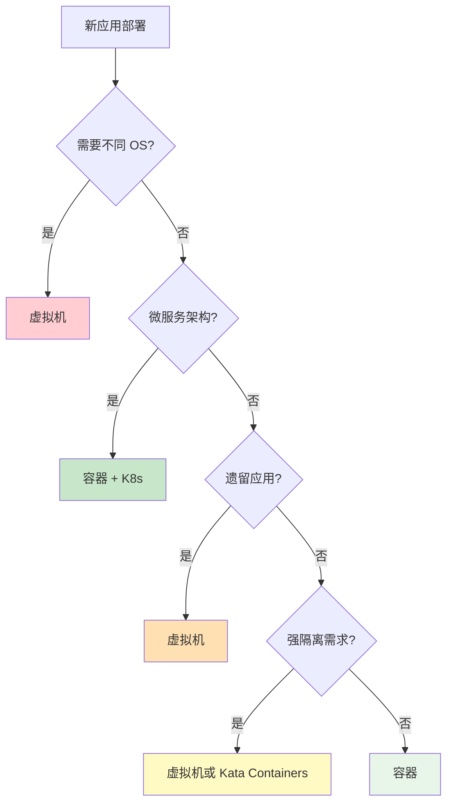

这个决策树提供了一个简化的选择逻辑,但实际情况往往更加复杂。以下是一些典型场景的具体建议:

**具体场景:**

| 场景 | 推荐方案 | 理由 |
|------|---------|------|
| **Web 应用(微服务)** | 容器 | 快速迭代、弹性伸缩 |
| **数据库** | 虚拟机或 StatefulSet | 数据持久化、性能稳定 |
| **遗留应用** | 虚拟机 | 无需改造、兼容性好 |
| **多租户 SaaS** | 容器 + Namespace | 资源隔离、成本低 |
| **开发测试** | 容器 | 快速启动、环境一致 |
| **高性能计算** | 虚拟机 + GPU 直通 | 接近原生性能 |
| **安全敏感** | 虚拟机或沙箱容器 | 强隔离 |
| **CI/CD** | 容器 | 快速构建、并行执行 |
| **大数据** | 混合 | Hadoop on VMs, Spark on K8s |
| **边缘计算** | 轻量 VM 或容器 | 资源受限 |

**Web 应用(微服务):** 如果你的应用采用微服务架构,由数十个甚至上百个小型服务组成,那么容器是毫无疑问的选择。容器可以快速启动和停止,支持水平扩展和自动伸缩,与 Kubernetes 的服务发现、负载均衡、滚动更新等功能完美结合。相比之下,为每个微服务部署一个虚拟机会导致资源浪费和管理复杂度激增。

**数据库:** 数据库是有状态应用,对性能、持久化和一致性要求极高。传统上,数据库通常运行在虚拟机上,以获得稳定的性能和简化的备份恢复。然而,随着 Kubernetes StatefulSet、Operator 模式和云原生数据库(如 CockroachDB、TiDB)的发展,越来越多的数据库开始支持容器化部署。选择的关键在于:如果团队具备 Kubernetes 运维能力,并且数据库支持云原生架构,可以选择容器;否则,虚拟机仍然是稳妥的选择。

**遗留应用:** 对于运行在传统架构上的遗留应用(如 monolithic Java EE 应用、.NET Framework 应用),将其迁移到容器可能需要大量的代码重构和测试工作。在这种情况下,使用虚拟机进行"lift and shift"(直接迁移)是更经济的选择。虚拟机可以提供与原物理服务器相同的环境,无需修改应用代码,降低了迁移风险和成本。

**多租户 SaaS:** 在 SaaS 应用中,多个租户共享同一套基础设施,隔离性和成本控制是关键考量。容器通过 Namespace 和 Resource Quota 提供了足够的隔离性,同时保持了高密度部署的优势。结合 Kubernetes 的 Multi-tenancy 特性(如 Namespace、NetworkPolicy、RBAC),可以为每个租户创建独立的逻辑环境,实现资源隔离、权限控制和计费统计。

**开发测试:** 在开发和测试环境中,快速搭建和销毁环境是核心需求。容器镜像可以精确捕获应用的依赖关系,确保开发、测试和生产环境的一致性。通过 Docker Compose 或 Kubernetes Helm Chart,开发者可以用一条命令启动完整的应用栈,包括数据库、缓存、消息队列等组件。相比之下,虚拟机的启动速度慢、资源占用大,不适合频繁的环境创建和销毁。

**高性能计算:** 对于科学计算、AI 训练、金融建模等高性能计算场景,性能是首要考虑因素。虚拟机通过 GPU 直通、SR-IOV、NUMA 绑定等技术,可以提供接近原生的性能,同时保持隔离性和可管理性。容器虽然性能开销更小,但在 GPU 虚拟化、RDMA 网络等高级功能的支持上还不够成熟。因此,在极致性能要求的场景中,虚拟机仍然是首选。

**安全敏感:** 在处理敏感数据或运行不可信代码的场景中(如公有云、多租户平台、代码执行沙箱),安全性是最高优先级。虚拟机提供了最强的隔离边界,即使 Guest OS 被攻破,攻击者也难以突破 Hypervisor 访问其他虚拟机或宿主机。容器的隔离性相对较弱,共享内核的设计使得内核漏洞可能危及整个系统。近年来出现的沙箱容器技术(如 Kata Containers、gVisor、Firecracker)试图在容器的便利性和虚拟机的安全性之间找到平衡,值得关注和评估。

**CI/CD:** 持续集成和持续部署(CI/CD)管道需要快速构建、测试和部署应用。容器的轻量级和快速启动特性使其成为 CI/CD 的理想选择。Jenkins、GitLab CI、GitHub Actions 等 CI/CD 平台都原生支持容器化构建,可以在隔离的容器中编译代码、运行测试、打包镜像,然后推送到镜像仓库。容器的不可变性也确保了构建结果的一致性,避免了"在我机器上能运行"的问题。

**大数据:** 大数据平台的架构正在经历从虚拟机向容器的转变。传统的 Hadoop、Spark 集群通常部署在虚拟机上,通过 YARN 进行资源调度。然而,随着 Kubernetes 的成熟,越来越多的大数据组件(如 Spark on K8s、Flink on K8s、Kafka on K8s)开始支持容器化部署。Kubernetes 提供了更好的资源利用率、弹性伸缩和多租户隔离,特别适合云原生大数据平台。在实际应用中,可以采用混合架构:底层基础设施使用虚拟机,上层大数据组件运行在 Kubernetes 容器中。

**边缘计算:** 边缘计算场景通常面临资源受限、网络不稳定、运维困难等挑战。轻量级虚拟机(如 Firecracker、Cloud Hypervisor)和轻量级容器(如 containerd、CRI-O)都是可行的选择。选择的关键在于:如果需要运行多种操作系统或强隔离,选择轻量 VM;如果追求极简和快速启动,选择容器。Kubernetes 的边缘发行版(如 K3s、KubeEdge、OpenYurt)也为边缘容器化管理提供了完善的解决方案。

### 3.4 混合架构

在现实世界的生产环境中,虚拟机和容器往往不是非此即彼的选择,而是协同工作、优势互补。混合架构结合了虚拟机的强隔离性和容器的轻量级特性,成为现代云平台的主流部署模式。

**现实世界:VM + Container**

```
graph TB
    subgraph Physical Server
        subgraph VM1[VM 1]
            K8S1[K8s Node]
            C1[Container]
            C2[Container]
        end
        
        subgraph VM2[VM 2]
            K8S2[K8s Node]
            C3[Container]
            C4[Container]
        end
        
        subgraph VM3[VM 3]
            Legacy[Legacy App]
        end
        
        HV[Hypervisor]
    end
    
    style HV fill:#c8e6c9
    style K8S1 fill:#e8f5e9
    style K8S2 fill:#e8f5e9
```

在这种混合架构中,物理服务器上运行多个虚拟机,每个虚拟机内部部署 Kubernetes 节点,Kubernetes 节点上运行多个容器。这种分层设计带来了多重优势:虚拟机提供了硬件级的隔离边界,不同团队或租户的 Kubernetes 集群运行在独立的 VM 中,互不干扰;容器提供了应用级别的封装和快速部署能力,支持微服务架构的敏捷迭代;遗留应用可以继续运行在传统的虚拟机中,无需立即迁移到容器平台。

**优势:**

```
✓ 最佳隔离:VM 提供硬件级隔离
✓ 灵活性:不同团队独立管理
✓ 安全性:容器逃逸不影响其他 VM
✓ 兼容性:同时支持新旧应用
✓ 资源优化:VM 内高密度容器
```

首先,**隔离性**得到显著增强。在多租户环境中,如果所有容器都运行在同一台物理主机的内核上,一旦某个容器通过内核漏洞逃逸,整个主机上的所有容器都会受到威胁。而在混合架构中,即使某个容器被攻破,攻击者也只能访问所在的虚拟机,无法跨越 VM 边界影响其他租户。这为云服务商和企业 IT 部门提供了更强的安全保障。

其次,**管理灵活性**大幅提升。不同的团队或业务单元可以独立管理自己的 Kubernetes 集群,选择适合的版本、插件和配置策略,而不会相互影响。例如,开发团队可以使用最新的 Kubernetes 版本和实验性功能,而生产团队则使用经过充分测试的稳定版本。VM 级别的隔离使得这种多版本共存成为可能,避免了"升级一个集群影响所有用户"的风险。

第三,**安全性**边界更加清晰。容器逃逸是容器技术面临的主要安全威胁之一,近年来已发现多个高危漏洞(如 runC CVE-2019-5736、Docker Socket 暴露等)。在混合架构中,即使发生容器逃逸,攻击者也只能获得虚拟机内的 root 权限,无法直接访问宿主机或其他虚拟机。这相当于增加了一层防御纵深,显著降低了安全风险的影响范围。

第四,**兼容性**得到保障。企业在数字化转型过程中,往往同时存在云原生应用和传统遗留系统。混合架构允许这两种应用共存:新开发的微服务部署在 Kubernetes 容器中,享受快速迭代和弹性伸缩的优势;遗留的 monolithic 应用继续运行在虚拟机中,避免高昂的改造成本和风险。随着时间推移,可以逐步将遗留应用迁移到容器平台,实现平滑过渡。

第五,**资源优化**效果明显。虽然虚拟机本身有一定的资源开销,但在 VM 内部运行高密度容器可以摊销这一成本。例如,一台 64GB 内存的物理服务器,如果直接运行虚拟机,可能只能部署 10-15 个 VM;但如果在每个 VM 中运行 20-30 个容器,总体应用密度可以达到 200-300 个,远高于纯虚拟机方案。这种分层优化既保持了隔离性,又提高了资源利用率。

**实际应用:**

```
AWS:
- EC2(VM)运行 EKS(K8s)
- Fargate(Serverless 容器)

Azure:
- AKS on Azure Stack HCI
- Azure VMSS + Container Instances

Google Cloud:
- GKE on VMware
- Anthos

企业私有云:
- OpenStack + Kubernetes
- vSphere + Tanzu
```

主流云服务商都采用了混合架构。AWS 的 EKS(Elastic Kubernetes Service)默认在 EC2 虚拟机上运行 Kubernetes 节点,用户可以选择不同的 EC2 实例类型(通用型、计算优化型、内存优化型)来匹配工作负载需求。Fargate 则提供了 Serverless 容器服务,底层使用 Firecracker 轻量级 VM 技术,实现了容器般的体验和 VM 级别的安全隔离。

Azure 提供了多种混合选项:AKS(Azure Kubernetes Service)可以在 Azure Stack HCI(本地虚拟化平台)上部署,实现混合云架构;Azure VMSS(Virtual Machine Scale Sets)结合 Container Instances,支持在虚拟机和 Serverless 容器之间灵活调度工作负载。Google Cloud 的 GKE on VMware 允许企业在本地 vSphere 环境中运行与公有云一致的 GKE 服务,Anthos 则提供了跨多云和混合云的统一管理平面。

在企业私有云中,OpenStack + Kubernetes 和 vSphere + Tanzu 是两种主流的混合架构。OpenStack 提供 IaaS 层的基础设施管理,Nova 创建虚拟机,Neutron 配置网络,Cinder 管理存储;Kubernetes 运行在这些虚拟机之上,提供 PaaS 层的应用编排能力。VMware Tanzu 则将 Kubernetes 深度集成到 vSphere 中,管理员可以通过熟悉的 vCenter 界面管理 Kubernetes 集群,实现了虚拟化平台和容器平台的无缝融合。

### 3.5 新技术:沙箱容器

尽管混合架构在一定程度上解决了容器的安全问题,但它也引入了额外的复杂度:需要管理两层基础设施(VM 和容器),运维成本较高。近年来,一种新的技术方向——沙箱容器(Sandboxed Containers)应运而生,它试图在保持容器便利性的同时,提供虚拟机级别的安全隔离。

**问题:容器的安全性不足**

传统容器的安全性依赖于 Linux 内核的 Namespace 和 Cgroups 机制,但这些机制并非为安全隔离而设计。Namespace 主要目的是提供资源视图的隔离,而非防止恶意攻击;Cgroups 用于资源限制,无法阻止内核级别的漏洞利用。近年来曝光的多个容器逃逸漏洞(如 Dirty COW、runc CVE-2019-5736、ebpf 漏洞)表明,共享内核的设计存在固有的安全风险。在多租户公有云、Serverless 平台和安全敏感场景中,传统容器的隔离强度往往不足以应对高级威胁。

**解决方案:轻量级 VM + 容器接口**

沙箱容器的核心理念是:为每个容器(或一组容器)创建一个轻量级虚拟机,在 VM 内部运行容器运行时(containerd、CRI-O)和应用进程。这样,容器仍然使用标准的 OCI(Open Container Initiative)镜像和接口,开发者无需修改应用代码或构建流程,但底层获得了虚拟机级别的硬件隔离。即使容器内的应用被攻破,攻击者也只能访问轻量级 VM,无法突破到宿主机或其他租户。

目前主流的沙箱容器技术包括 Kata Containers、gVisor 和 Firecracker,它们采用了不同的技术路线,但目标一致:在安全性和性能之间找到最佳平衡点。

**Kata Containers:**

```
架构:
- 每个 Pod 一个轻量级 VM
- 使用 KVM/QEMU
- 兼容 OCI 标准
- 容器般的体验,VM 般的安全

性能:
- 启动时间:< 1 秒
- 内存开销:~50MB/VM
- CPU 开销:< 5%
```

Kata Containers 是由 Intel、华为、Red Hat 等公司联合开发的开源项目,融合了 Intel Clear Containers 和 Hyper runV 两个早期项目的技术。Kata 的核心组件包括:Kata Agent(运行在 VM 内部,负责管理容器生命周期)、Kata Shim(位于宿主机,作为容器运行时和 VM 之间的代理)、Kata Runtime(符合 OCI 规范的运行时,负责创建和管理 VM)。

Kata Containers 的工作流程如下:当 Kubernetes 或 Docker 请求创建一个 Pod 时,Kata Runtime 调用 QEMU/KVM 创建一个轻量级 VM,加载精简的 Linux 内核和 initramfs。Kata Agent 在 VM 内部启动,监听来自宿主机指令。Kata Shim 接收容器的标准输入输出,并通过 virtio-serial 通道转发给 Kata Agent。应用进程在 VM 内部的容器中运行,享有完整的内核隔离和硬件虚拟化保护。

Kata Containers 的优势在于完全兼容现有的容器生态:它实现了 CRI(Container Runtime Interface)和 OCI 标准,可以无缝集成到 Kubernetes、Docker、containerd 等平台中。开发者无需修改 Dockerfile 或 Kubernetes YAML 文件,只需将 runtime class 设置为 kata,即可启用沙箱隔离。性能方面,Kata 通过硬件虚拟化(KVM)和优化过的 QEMU,将启动时间控制在 1 秒以内,内存开销约 50MB/VM,CPU 开销低于 5%,接近传统容器的水平。

然而,Kata Containers 也有一些局限性:首先,它依赖硬件虚拟化扩展(VT-x/AMD-V),在不支持虚拟化的环境中无法使用。其次,某些需要访问宿主机的功能(如 hostPath volume、hostNetwork、privileged 模式)在 Kata 中受到限制或需要特殊配置。第三,Kata 的调试和故障排查比传统容器更复杂,因为需要同时检查宿主机和 VM 内部的状态。

**gVisor(Google):**

```
架构:
- 用户空间内核
- 拦截系统调用
- 无需 KVM
- 更强的隔离

适用:
- 多租户环境
- 不可信代码
- Serverless 平台
```

gVisor 是 Google 开发的开源沙箱容器运行时,最初用于 Google Cloud Run 和 GKE 的多租户隔离。与 Kata Containers 不同,gVisor 不使用硬件虚拟化,而是在用户空间实现了一个完整的 Linux 内核子集(称为 Sentry)。当容器进程执行系统调用时,gVisor 拦截这些调用,在用户空间模拟内核行为,然后将结果返回给应用。

gVisor 的架构分为三层:应用层运行容器进程,拦截层(Sentry)处理系统调用和信号,主机层(runsc)与宿主机内核交互。Sentry 实现了超过 300 个系统调用,包括文件操作、网络通信、进程管理、内存映射等常用功能。对于不支持的系统调用,gVisor 可以回退到宿主机内核(称为 ptrace 模式),但这会降低隔离性。

gVisor 的最大优势是**无需硬件虚拟化**,因此可以在任何 Linux 系统上运行,包括嵌套虚拟化受限的云环境。此外,gVisor 的隔离性更强,因为它完全在用户空间运行,即使 Sentry 被攻破,攻击者也无法直接访问宿主机内核或硬件资源。Google 的生产数据显示,gVisor 已成功隔离了数百万个容器实例,未发生过严重的安全事件。

然而,gVisor 的性能开销相对较大:由于每个系统调用都需要在用户空间模拟,CPU 密集型应用的性能可能下降 10%-20%,I/O 密集型应用的延迟可能增加 2-3 倍。为了缓解这一问题,gVisor 引入了 KVM 加速模式(KVM platform),利用硬件虚拟化加速系统调用拦截,但仍不如 Kata Containers 的原生 KVM 方案高效。因此,gVisor 最适合那些对安全性要求极高、但性能敏感度较低的场景,如 Serverless 平台、代码执行沙箱和多租户 SaaS。

**Firecracker(AWS):**

```
特点:
- 专为 Serverless 设计
- 极简 Hypervisor
- 毫秒级启动
- 用于 Lambda 和 Fargate

性能:
- 启动:< 125ms
- 内存:< 5MB overhead
```

Firecracker 是 AWS 开发的轻量级虚拟化技术,专门用于 Serverless 计算场景。它是 AWS Lambda 和 Fargate 的底层引擎,每天支撑着数万亿次的函数调用和容器启动。Firecracker 的设计目标是极致的启动速度和最小的资源开销,为此它做出了多项激进的设计取舍。

Firecracker 基于 KVM,但摒弃了 QEMU 的大部分复杂功能。它只虚拟化最基本的设备:vCPU、内存、时钟、串口控制台和 virtio-net/virtio-block 设备。没有 VGA、USB、PCI 总线等传统 PC 设备,也没有 BIOS/UEFI 固件。Guest OS 是一个极简的 Linux 内核(约 5MB),通过 initramfs 直接启动用户进程。这种极简设计使得 Firecracker 的代码库非常小(约 30,000 行 Rust 代码),攻击面极小,审计和维护成本低。

Firecracker 的性能指标令人印象深刻:启动时间低于 125 毫秒,内存开销不到 5MB,CPU 开销几乎可以忽略不计。相比之下,QEMU/KVM 启动一个 VM 通常需要 1-2 秒,内存开销 50-100MB。Firecracker 的极速启动使得 AWS Lambda 可以实现"按需创建、用完即毁"的执行模型,每个函数调用都在独立的 Firecracker microVM 中运行,确保了强隔离性和多租户安全。

Firecracker 的局限性在于功能简化:它不支持快照、实时迁移、热插拔设备等高级功能,也不适合运行长期驻留的服务。Firecracker 的定位非常明确:为短生命周期的 Serverless workload 提供安全、高效的执行环境。对于需要持久化、复杂网络或设备访问的应用,传统的 KVM/QEMU 或 Kata Containers 可能是更好的选择。

**技术对比:**

| 特性 | Kata Containers | gVisor | Firecracker |
|------|----------------|--------|-------------|
| **虚拟化方式** | KVM/QEMU | 用户空间内核 | KVM(极简) |
| **启动时间** | < 1s | 1-2s | < 125ms |
| **内存开销** | ~50MB | ~20MB | < 5MB |
| **CPU 开销** | < 5% | 10-20% | < 2% |
| **硬件要求** | VT-x/AMD-V | 无 | VT-x/AMD-V |
| **兼容性** | 高(OCI) | 中(部分 syscall) | 低(定制) |
| **适用场景** | 通用容器 | 多租户/Serverless | Serverless |

沙箱容器技术代表了虚拟化发展的一个重要方向:在保持容器开发体验和部署效率的同时,提供虚拟机级别的安全隔离。随着云原生技术的普及和多租户场景的增加,沙箱容器的应用将会越来越广泛。未来,我们可能会看到更多创新的技术,如基于 WebAssembly 的沙箱、硬件增强的隔离机制(TEE、SGX),以及 AI 驱动的安全策略,进一步提升容器平台的安全性和可靠性。

## 第四部分:虚拟化最佳实践

掌握了虚拟化的基本原理和技术选型之后,如何在实际生产中发挥虚拟化平台的最大价值?本节将从性能优化、高可用设计、安全管理和监控告警四个维度,分享经过生产验证的最佳实践。这些建议基于大规模数据中心和云平台的运维经验,可以帮助你避免常见陷阱,构建稳定、高效、安全的虚拟化基础设施。

### 4.1 性能优化

虚拟化环境的性能优化是一个系统工程,需要从 CPU、内存、存储和网络多个层面协同考虑。优化的核心原则是:**减少虚拟化开销、提高资源利用率、避免资源争用**。以下是一些经过验证的优化策略。

**CPU 优化:**

```
1. CPU Pinning(绑定)
   - 将 vCPU 绑定到物理 CPU
   - 减少上下文切换
   - 提高缓存命中率

2. NUMA 感知
   - VM 内存分配到同一 NUMA 节点
   - 减少跨节点访问

3. Huge Pages
   - 使用大页内存
   - 减少 TLB miss
   - 提高内存访问性能
```

CPU Pinning(也称为 CPU Affinity)是将虚拟机的 vCPU 固定绑定到特定的物理 CPU 核心的技术。在没有 Pinning 的情况下,Hypervisor 的调度器会根据负载情况动态地将 vCPU 调度到不同的物理核心上执行。这种灵活性虽然有利于负载均衡,但也带来了代价:每次 vCPU 迁移都会导致 L1/L2 缓存失效,新的物理核心需要重新加载指令和数据,造成性能损失。对于延迟敏感的应用(如高频交易、实时音视频、数据库查询),CPU Pinning 可以显著降低尾延迟(tail latency),提高性能的可预测性。

NUMA(Non-Uniform Memory Access)是现代多路服务器架构的关键特性。在 NUMA 系统中,CPU 和内存被划分为多个节点(Node),每个节点内的 CPU 访问本地内存的速度远快于访问远程节点内存。如果虚拟机的 vCPU 和内存分布在不同的 NUMA 节点上,内存访问延迟可能增加 2-3 倍。因此,在创建虚拟机时,应该启用 NUMA 感知策略,确保 vCPU 和分配的内存位于同一个 NUMA 节点内。KVM、VMware 和 Hyper-V 都提供了 NUMA 拓扑展示和自动优化功能,管理员可以通过这些工具检查和调整虚拟机的 NUMA 布局。

Huge Pages(大页内存)是另一种有效的性能优化技术。传统的 x86 页面大小是 4KB,对于一个拥有 64GB 内存的虚拟机,需要 1600 万个页表项。这么大的页表会占用大量的 TLB(Translation Lookaside Buffer)缓存,导致频繁的 TLB miss 和页表遍历,降低内存访问性能。Huge Pages 使用更大的页面尺寸(通常是 2MB 或 1GB),可以将页表项数量减少到原来的 1/512 或 1/262144,大幅提高 TLB 命中率。在数据库、大数据分析和科学计算等内存密集型应用中,启用 Huge Pages 可以提升 10%-30% 的性能。需要注意的是,Huge Pages 需要在 Guest OS 和 Hypervisor 两端同时配置,并且应该在虚拟机启动前预分配,避免运行时的内存碎片化问题。

**内存优化:**

```
1. 内存超分(Overcommitment)
   - 分配超过物理内存
   - 依赖 Ballooning 和 Swap
   - 风险:可能导致 OOM

2. KSM(内存去重)
   - 合并相同页
   - 节省 30-50% 内存
   - 代价:CPU 开销

3. 透明大页(THP)
   - 自动使用大页
   - 减少页表项
   - 注意:可能增加延迟
```

内存超分(Memory Overcommitment)是指分配的虚拟机内存总和超过物理内存总量的技术。例如,在一台 128GB 物理内存的服务器上,可以创建 10 个各分配 16GB 内存的虚拟机,总分配量达到 160GB,超分率为 125%。这种做法的理论依据是:大多数虚拟机不会同时达到峰值内存使用率,通过统计复用可以提高整体资源利用率。内存超分依赖于 Ballooning、Swap 和内存压缩等技术,当物理内存紧张时,Hypervisor 会回收空闲页面的内存,或者将不活跃的页面交换到磁盘。

然而,内存超分是一把双刃剑。适度的超分(110%-130%)可以在不影响性能的前提下提高资源利用率,但过度超分(>150%)会导致严重的内存争用,触发频繁的 Ballooning 和 Swap 操作,大幅降低性能,甚至引发 OOM(Out of Memory)错误,导致虚拟机崩溃。因此,实施内存超分时,必须密切监控内存使用率和 Swap 活动,设置合理的告警阈值,并根据工作负载的特点动态调整超分比例。对于关键业务应用,建议禁用内存超分,保证专属的物理内存资源。

KSM(Kernel Same-page Merging)和透明大页(THP)已在前面详细介绍,这里不再赘述。需要强调的是,这两项技术都有明显的权衡:KSM 节省内存但消耗 CPU,THP 提高吞吐量但可能增加延迟。在实际应用中,应该根据具体的工作负载特征进行测试和调优,而不是盲目启用所有优化选项。

**存储优化:**

```
1. 使用 SSD
   - IOPS 提升 10-100x
   - 延迟降低 90%

2. 直通或 SR-IOV
   - 绕过虚拟化层
   - 接近原生性能

3. 缓存策略
   - Write-back:性能好,风险高
   - Write-through:安全,性能一般
   - None:直接访问
```

存储性能往往是虚拟化环境的瓶颈,特别是对于数据库、日志系统和大数据分析等 I/O 密集型应用。最有效的存储优化措施是使用 SSD(固态硬盘)替代传统 HDD(机械硬盘)。SSD 的随机读写 IOPS 可以达到数万甚至数十万,是 HDD 的 10-100 倍;访问延迟从毫秒级降至微秒级,降低了 90% 以上。在现代数据中心中,NVMe SSD 已成为主流选择,其 PCIe 接口避免了 SATA/SAS 控制器的带宽限制,提供更高的吞吐量和更低的延迟。

除了介质升级,I/O 虚拟化方案的选择也至关重要。对于性能要求极高的场景,应该优先考虑直通(Passthrough)或 SR-IOV,让虚拟机直接访问物理存储设备,绕过 Hypervisor 的模拟层。虽然这会牺牲一些灵活性和可迁移性,但可以获得接近原生的存储性能。如果必须使用虚拟化存储,virtio-blk 或 virtio-scsi 半虚拟化驱动是更好的选择,它们的性能远优于 IDE 或 SATA 模拟。

缓存策略是影响存储性能和数据安全的另一个关键因素。Write-back 缓存将写入操作先保存到缓存(内存或 SSD),然后异步刷写到后端存储,提供了最佳的写入性能,但在断电或系统崩溃时可能丢失数据。Write-through 缓存同步执行写入操作,确保数据立即持久化,安全性更高但性能较差。None 模式禁用缓存,所有 I/O 直接访问后端存储,适用于对一致性要求极高的场景(如数据库 WAL 日志)。在选择缓存策略时,需要权衡性能、安全性和一致性需求,并结合 UPS(不间断电源)、RAID 卡电池等硬件保护措施,降低数据丢失风险。

**网络优化:**

```
1. SR-IOV
   - 硬件虚拟化
   - 低延迟,高吞吐

2. DPDK
   - 用户空间数据包处理
   - 绕过内核网络栈
   - 百万级 PPS

3. VLAN/VXLAN
   - 网络隔离
   - 大规模部署
```

网络性能优化对于分布式系统、微服务架构和高频交易应用至关重要。SR-IOV 是最有效的网络虚拟化优化技术,它通过硬件级别的虚拟化,为每个虚拟机提供独立的虚拟功能(VF),数据包直接在 VF 和物理网卡之间传输,无需经过 Hypervisor 的网络栈。SR-IOV 可以实现线速(10G/25G/100G)的网络吞吐,延迟低至微秒级,是高性能网络的首选方案。

DPDK(Data Plane Development Kit)是另一种革命性的网络技术,它将数据包处理从内核空间转移到用户空间,绕过了传统的内核网络栈(包括 socket 层、协议栈和设备驱动)。DPDK 使用轮询模式驱动(PMD)代替中断驱动,避免了中断处理的开销;使用巨帧(Jumbo Frame)和大缓冲区,减少了数据包分割和重组的次数;使用 CPU 亲和性和 NUMA 感知,提高了缓存局部性。通过这些优化,DPDK 可以实现数百万 PPS(Packets Per Second)的转发能力,是 NFV(网络功能虚拟化)、负载均衡器和防火墙等高性能网络应用的理想选择。

在大规模虚拟化环境中,网络隔离和管理同样重要。VLAN(Virtual LAN)通过在以太网帧中添加 12-bit 的 VLAN ID,将物理网络划分为多个逻辑广播域,实现了基本的网络隔离。然而,VLAN 最多只支持 4096 个隔离域,在大型云平台中远远不够。VXLAN(Virtual Extensible LAN)通过使用 UDP 封装和 24-bit 的 VNI(VXLAN Network Identifier),将隔离域扩展到 1600 万个,满足了大规模多租户场景的需求。VXLAN 还可以跨越三层网络边界,支持虚拟机在不同子网甚至不同数据中心之间迁移,为云平台的灵活性和可扩展性提供了有力支撑。

### 4.2 高可用设计

**vMotion / Live Migration：**

```
原理：
1. 预拷贝内存页
2. 跟踪脏页
3. 暂停 VM（毫秒级）
4. 传输剩余状态
5. 在目标主机恢复

要求：
- 共享存储
- 兼容的 CPU
- 足够的网络带宽

 downtime：< 1 秒
```

vMotion(VMware)或 Live Migration(KVM/Xen)是一种零停机迁移技术,允许虚拟机在运行状态下从一台物理主机迁移到另一台,而不会中断服务或丢失连接。这项技术广泛应用于负载均衡、硬件维护、能耗管理和灾难恢复等场景。

Live Migration 的核心算法是"预拷贝"(Pre-copy):首先,将虚拟机的所有内存页复制到目标主机,同时继续在原主机上运行虚拟机。在复制过程中,某些内存页可能被修改(称为"脏页"),Hypervisor 会跟踪这些脏页,并在下一轮迭代中重新复制。经过几轮迭代后,剩余的脏页数量很少,此时 Hypervisor 会短暂暂停虚拟机(通常小于 1 秒),复制最后的脏页和 CPU 状态,然后在目标主机恢复执行。整个过程对应用程序透明,用户几乎感知不到迁移的发生。

要实现成功的 Live Migration,需要满足几个前提条件:首先,源主机和目标主机必须访问共享存储(如 SAN、NAS 或分布式存储),确保虚拟磁盘文件在迁移前后保持一致。其次,CPU 必须兼容,最好是同一厂商和相近型号,否则可能因指令集差异导致迁移失败或性能问题。第三,必须有足够的网络带宽(通常建议 10Gbps 以上),以快速传输内存状态,减少停机时间。最后,虚拟机的网络配置必须在两个主机上都可用,包括 VLAN、端口组和安全策略。

**HA（High Availability）：**

```
机制：
- 监控 VM 健康
- 检测到故障
- 自动在其他主机重启

RTO：2-5 分钟
RPO：最后一次快照
```

HA 是一种自动故障恢复机制,当物理主机发生故障(如硬件损坏、电源中断、网络断开)时,HA 控制器会自动检测到故障,并在集群中的其他健康主机上重启受影响的虚拟机。HA 的目标是最小化服务中断时间(RTO,Recovery Time Objective),通常在 2-5 分钟内完成虚拟机的重启和网络恢复。

HA 的工作原理是基于心跳检测:集群中的每个主机定期向其他主机发送心跳信号,如果某个主机在预定时间内(如 30 秒)没有发送心跳,其他主机会认为它已故障,并触发故障转移流程。HA 控制器会选择最合适的主机(考虑资源可用性、负载均衡和亲和性规则),重新启动虚拟机。虚拟机重启后,会从最后一次保存的状态(如关机状态或快照)恢复,这意味着自上次保存以来的数据更改可能会丢失(RPO,Recovery Point Objective)。

为了提高 HA 的效果,可以采取以下措施:首先,配置 N+1 或 N+2 冗余,确保集群中有足够的备用资源来容纳故障主机上的所有虚拟机。其次,启用 VM Monitoring,不仅监控主机健康,还监控虚拟机内部的应用状态(如通过 VMware Tools 或 guest heartbeat),及时发现应用级故障。第三,结合 DRS(Distributed Resource Scheduler),在故障转移后自动平衡集群负载,避免某些主机过载。第四,定期测试 HA 功能,模拟主机故障,验证故障转移流程是否正常运作。

**FT（Fault Tolerance）：**

```
机制：
- 主备双机
- 指令级同步
- 零停机切换

代价：
- 50% 资源浪费
- 仅支持单 vCPU（某些平台）

RTO：0
RPO：0
```

FT 是最高级别的高可用技术,它通过指令级的双机热备,实现了零停机(RTO=0)和零数据丢失(RPO=0)的容错能力。FT 的工作原理是:为每个虚拟机创建一个完全相同的副本(Secondary VM),运行在另一台物理主机上。Primary VM 和 Secondary VM 以锁步(lockstep)方式同步执行:Primary VM 的每条指令执行后,都会将输入事件(如中断、I/O 数据)发送给 Secondary VM,Secondary VM 重放相同的指令序列,保持与 Primary 完全一致的状态。如果 Primary VM 所在的主机发生故障,Secondary VM 会立即接管,继续提供服务,应用程序不会察觉到任何中断。

FT 的优势是显而易见的:它提供了真正的零停机保护,适用于对可用性要求极高的关键业务应用,如金融交易系统、电信核心网和医疗信息系统。然而,FT 的代价也非常高昂:首先,它需要 100% 的资源冗余,因为 Secondary VM 需要与 Primary VM 相同的 CPU、内存和存储资源,资源利用率只有 50%。其次,FT 对网络延迟极其敏感,Primary 和 Secondary 之间的同步链路必须是低延迟(通常<1ms)和高带宽的,限制了部署距离。第三,早期的 FT 实现(如 VMware FT)仅支持单 vCPU 虚拟机,虽然新版本已经支持多 vCPU,但仍然有诸多限制(如不支持快照、克隆、某些设备类型)。

因此,FT 应该谨慎使用,仅针对那些真正需要零停机保护的关键应用。对于大多数业务场景,HA 提供的分钟级恢复时间已经足够,而且成本更低、灵活性更高。在评估高可用方案时,应该根据业务的 RTO/RPO 要求、预算限制和技术约束,选择最合适的技术组合。

### 4.3 安全管理

虚拟化环境的安全管理比传统物理环境更加复杂,因为引入了新的攻击面和威胁向量。Hypervisor 漏洞、虚拟机逃逸、侧信道攻击、虚拟网络窃听等安全风险,都可能危及整个基础设施的安全。本节从隔离措施和加固建议两个方面,介绍虚拟化安全管理的最佳实践。

**隔离措施：**

```
1. 网络隔离
   - VLAN/VXLAN
   - 防火墙规则
   - 微分段

2. 存储隔离
   - 加密虚拟磁盘
   - 访问控制
   - 审计日志

3. 资源隔离
   - CPU/Memory limits
   - I/O 优先级
   - 网络带宽限制
```

网络隔离是虚拟化安全的第一道防线。通过 VLAN 或 VXLAN 技术,可以将不同租户、不同安全级别的虚拟机划分到独立的逻辑网络中,防止未经授权的横向移动。在此基础上,应该部署分布式防火墙(如 VMware NSX、Calico、Cilium),为每个虚拟机或安全组设置精细的访问控制列表(ACL),只允许必要的通信流量。微分段(Micro-segmentation)是网络隔离的进阶实践,它为每个 workload 定义独立的安全策略,即使在同一个子网内,也可以实现细粒度的访问控制,有效遏制勒索软件、蠕虫病毒等横向传播威胁。

存储隔离关注数据的机密性和完整性。虚拟磁盘文件(如 VMDK、QCOW2)应该启用加密功能,使用 AES-256 等强加密算法,确保即使存储介质被盗或泄露,数据也无法被读取。访问控制方面,应该遵循最小权限原则,仅为管理员和用户授予完成任务所需的最小权限,避免特权滥用。审计日志则记录了所有存储操作(如创建、删除、快照、克隆),便于事后追溯和安全分析。一些先进的存储系统(如 vSAN、Ceph)还提供了数据校验和纠删码(Erasure Coding)功能,防止数据损坏和丢失。

资源隔离虽然不是直接的安全措施,但可以防止拒绝服务(DoS)攻击和资源争用。通过设置 CPU 和内存上限(limits),可以限制单个虚拟机的最大资源消耗,避免某个恶意或异常的虚拟机耗尽宿主机的资源,影响其他虚拟机的正常运行。I/O 优先级和网络带宽限制也有类似的作用,确保关键业务应用获得足够的 I/O 和网络资源,不受其他 workloads 的干扰。Kubernetes 的 Resource Quota 和 LimitRange、VMware 的资源池(Resource Pool)都是实现资源隔离的有效工具。

**加固建议：**

```
✓ 定期更新 Hypervisor
✓ 最小权限原则
✓ 启用审计日志
✓ 网络访问控制
✓ 加密静态数据
✓ 禁用不必要的服务
✓ 使用安全启动
✓ 定期漏洞扫描
```

除了上述隔离措施,还应该采取一系列通用的安全加固措施,提升虚拟化平台的整体安全态势:

**定期更新 Hypervisor:** Hypervisor 作为虚拟化基础设施的核心,其安全性至关重要。厂商会定期发布安全补丁,修复已知漏洞(如 CVE 漏洞)。应该建立严格的补丁管理流程,及时测试和部署安全更新,避免因漏洞被利用而导致的安全事件。

**最小权限原则:** 为管理员、操作员和普通用户分配适当的角色和权限,避免使用 root 或 administrator 账户进行日常操作。采用 RBAC(Role-Based Access Control)模型,根据职责划分权限范围,并定期审查和清理过期的权限。

**启用审计日志:** 记录所有管理操作、登录尝试、配置变更和资源访问事件,并将日志集中存储到安全的 SIEM(Security Information and Event Management)系统中。审计日志不仅可以用于安全事件调查,还可以发现异常行为和潜在的内部威胁。

**网络访问控制:** 限制对 Hypervisor 管理界面(vCenter、Libvirt、Hyper-V Manager)的网络访问,仅允许可信的管理工作站通过 VPN 或堡垒机连接。启用多因素认证(MFA),增强身份验证的安全性。

**加密静态数据:** 对虚拟磁盘、快照、模板和备份文件进行加密,防止数据泄露。使用硬件安全模块(HSM)或密钥管理系统(KMS)安全地存储和管理加密密钥,避免密钥泄露导致加密失效。

**禁用不必要的服务:** Hypervisor 默认可能启用了许多不必要的服务和端口(如 SSH、SNMP、HTTP),增加了攻击面。应该禁用所有非必需的服务,关闭未使用的端口,减少潜在的入侵途径。

**使用安全启动:** 启用 UEFI Secure Boot 功能,确保只有经过签名的 bootloader、内核和驱动程序才能加载,防止 rootkit 和 bootkit 恶意软件的植入。

**定期漏洞扫描:** 使用专业的漏洞扫描工具(如 Nessus、Qualys、OpenVAS)定期对 Hypervisor、虚拟机和网络设备进行扫描,发现并及时修复安全漏洞。将漏洞扫描纳入定期的安全审计流程,确保持续合规。

### 4.4 监控指标

"无法度量,就无法管理。"监控是虚拟化运维的基础,通过持续收集和分析性能指标,可以及时发现瓶颈、预测故障、优化资源分配。本节介绍虚拟化环境中需要重点监控的关键指标,以及推荐的告警阈值。

**关键指标:**

```
CPU:
- CPU Ready Time(等待调度的时间)
- CPU Usage(使用率)
- Co-stop(多 vCPU 同步等待)

内存:
- Memory Ballooning
- Swap Usage
- Memory Contention

存储:
- Disk Latency
- IOPS
- Throughput

网络:
- Packet Drop Rate
- Bandwidth Usage
- Error Rate
```

**CPU 指标:**

CPU Ready Time 是衡量 CPU 调度延迟的关键指标,表示虚拟机准备好执行但等待 Hypervisor 分配物理 CPU 的时间百分比。正常情况下,CPU Ready Time 应该低于 5%;如果持续高于 10%,说明 CPU 资源不足或存在调度瓶颈,需要考虑增加物理 CPU、减少 vCPU 数量或启用 CPU Pinning。

CPU Usage 反映虚拟机的 CPU 利用率,应该结合业务负载进行评估。长期高利用率(>80%)可能意味着资源不足,需要扩容;长期低利用率(<10%)则说明资源浪费,可以考虑整合或降配。需要注意的是,CPU Usage 是平均值,可能掩盖短期的峰值,因此还应该关注 CPU Ready Time 和 Co-stop 等延迟指标。

Co-stop 是多 vCPU 虚拟机特有的现象,表示由于 vCPU 之间的同步等待导致的停滞时间。如果虚拟机的多个 vCPU 不能同时调度到物理 CPU 上执行,就会出现 Co-stop,严重影响并行应用的性能。Co-stop 时间应该接近于 0,如果持续较高,应该减少 vCPU 数量或启用 CPU Affinity。

**内存指标:**

Memory Ballooning 反映了 Hypervisor 通过 balloon 驱动回收内存的程度。适度的 ballooning(占分配内存的 10%-20%)是正常的,但如果 ballooning 持续增长,说明物理内存紧张,可能需要添加内存或减少虚拟机密度。

Swap Usage 表示虚拟机内存被交换到磁盘的数量。任何程度的 swap 都应该引起警惕,因为磁盘 I/O 比内存访问慢几个数量级,swap 会导致严重的性能下降。如果 swap usage > 0,应该立即调查原因,可能是内存超分过高、内存泄漏或 workload 突然增长。

Memory Contention 衡量内存资源争用的程度,表现为内存分配延迟或失败。高 contention 会导致虚拟机性能波动,甚至触发 OOM killer。应该监控 memory contention 指标,确保其保持在较低水平。

**存储指标:**

Disk Latency 是存储性能的核心指标,表示 I/O 请求从发出到完成的总时间,包括队列等待、设备处理和传输时间。对于 SSD,Disk Latency 应该低于 5ms;对于 HDD,应该低于 20ms。如果 latency 持续偏高,可能是存储过载、网络拥塞或设备故障,需要进一步排查。

IOPS(Input/Output Operations Per Second)和 Throughput(吞吐量)反映了存储系统的处理能力。应该根据应用的需求设定基线,监控实际值与基线的偏差。突然的 IOPS 下降或 throughput 波动可能预示着存储瓶颈或设备故障。

**网络指标:**

Packet Drop Rate(丢包率)是网络健康的直接指标。正常情况下,丢包率应该为 0;如果持续大于 0.1%,说明网络存在拥塞、错误或配置问题,需要检查交换机、网卡和虚拟化网络配置。

Bandwidth Usage(带宽使用率)应该结合网络容量进行评估。长期高使用率(>80%)可能导致拥塞和延迟,需要升级网络或优化流量。Error Rate(错误率)反映了网络传输的质量,包括 CRC 错误、碰撞、帧错误等,应该保持在极低水平。

**告警阈值:**

```
CPU Ready > 5%:调度瓶颈
Memory Swap > 0:内存不足
Disk Latency > 20ms:存储瓶颈
Network Drop > 0.1%:网络问题
```

以上是通用的告警阈值建议,但实际应用中应该根据具体的业务需求和 SLA(Service Level Agreement)进行调整。重要的是建立基线(baseline),了解正常情况下的指标范围,然后设置动态阈值,及时发现异常趋势。现代监控平台(如 Prometheus、Grafana、Zabbix、vRealize Operations)提供了丰富的可视化、告警和自动化功能,可以帮助运维团队构建智能化的监控体系,实现 proactive(主动式)而非 reactive(被动式)的运维管理。

## 结语:虚拟化的未来

虚拟化技术仍在演进。

回顾虚拟化技术的发展历程,从早期的大型机时间共享,到 x86 平台的二进制翻译,再到硬件虚拟化扩展的普及,直至今日的云原生和 Serverless 时代,虚拟化始终是计算基础设施的核心支柱。它不仅改变了我们部署和管理应用的方式,也深刻影响了软件架构、开发流程和商业模式。

展望未来,虚拟化技术将继续朝着以下几个方向演进:

**趋势展望:**

```
1. 轻量化
   - Firecracker、Kata Containers
   - 毫秒级启动
   - 更低开销

2. 智能化
   - AI 驱动的资源调度
   - 预测性扩缩容
   - 自动化运维

3. 边缘化
   - 边缘计算虚拟化
   - 轻量级 Hypervisor
   - 5G 融合

4. 安全增强
   - 机密计算
   - 硬件级隔离
   - 零信任架构

5. 绿色计算
   - 能效优化
   - 智能功耗管理
   - 碳足迹追踪
```

**轻量化**是虚拟化技术的重要趋势之一。传统的虚拟机和容器虽然在各自领域取得了成功,但在启动速度、资源开销和隔离强度方面仍存在权衡。新一代的轻量化虚拟化技术(如 Firecracker、Kata Containers、Cloud Hypervisor)试图打破这一权衡,通过极简的 Hypervisor 设计、硬件加速和优化的内核,实现毫秒级启动、MB 级内存开销和 VM 级别的安全隔离。这些技术特别适用于 Serverless 计算、边缘场景和安全敏感的多租户环境,将成为未来云平台的基础设施基石。

**智能化**将为虚拟化带来革命性的变化。随着 AI 和机器学习技术的成熟,虚拟化平台将具备更强的自主决策能力:AI 驱动的资源调度算法可以根据历史数据和实时负载,预测未来的资源需求,提前进行虚拟机放置和迁移,避免热点和瓶颈;预测性扩缩容可以自动调整虚拟机和容器的数量,应对流量的周期性波动和突发事件;自动化运维可以通过异常检测、根因分析和自愈机制,减少人工干预,提高系统的可靠性和稳定性。未来的虚拟化平台将不再是被动执行指令的工具,而是主动优化资源的智能系统。

**边缘化**是云计算的自然延伸。随着 IoT、5G 和边缘计算的兴起,越来越多的计算任务需要从 centralized cloud 转移到 edge location,以满足低延迟、带宽节省和数据主权的需求。边缘环境通常面临资源受限、网络不稳定、运维困难等挑战,传统的虚拟化技术难以适应。轻量级 Hypervisor、unikernel 和 WebAssembly 等新技术将为边缘虚拟化提供更合适的解决方案,实现资源高效、安全隔离和远程管理。5G 网络切片(network slicing)也将与虚拟化技术深度融合,为不同应用场景提供定制化的网络和计算资源。

**安全增强**是虚拟化技术永恒的主题。随着云原生技术的普及和多租户场景的增加,虚拟化平台面临的安全威胁日益复杂。机密计算(Confidential Computing)通过硬件可信执行环境(TEE,如 Intel SGX、AMD SEV),保护数据在计算过程中的机密性,即使 Hypervisor 或云提供商也无法访问。零信任架构(Zero Trust)假设网络内外都存在威胁,要求对所有访问请求进行严格的身份验证和授权,无论请求来源是内部还是外部。未来的虚拟化平台将内置更强的安全机制,包括形式化验证的 Hypervisor、硬件隔离的 secure enclave、AI 驱动的威胁检测,为数字世界提供坚不可摧的信任基础。

**绿色计算**是虚拟化技术承担的社会责任。数据中心是全球能源消耗和碳排放的重要来源,约占全球用电量的 1%-2%。虚拟化技术通过提高资源利用率、整合服务器、优化能耗,已经在节能减排方面做出了巨大贡献。未来,虚拟化平台将进一步强化绿色计算能力:智能功耗管理可以根据负载动态调整 CPU 频率、关闭空闲核心、优化冷却系统,降低 PUE(Power Usage Effectiveness);碳足迹追踪可以实时监控和报告数据中心的碳排放,帮助企业实现碳中和目标;可再生能源集成可以将虚拟化 workload 调度到有充足太阳能或风能的区域,最大化清洁能源的使用比例。虚拟化技术不仅是技术创新的引擎,也是可持续发展的推动者。

**核心认知:**

虚拟机和容器不是对立关系,而是互补关系。

理解它们的原理和适用场景,才能做出正确的技术选型。

---

- 虚拟化技术原理:Hypervisor类型、硬件扩展、内存和I/O虚拟化
- 主流虚拟化技术:KVM、Xen、VMware、Hyper-V对比
- 虚拟机与容器的全面对比分析
- 混合架构和沙箱容器新技术
- 性能优化、高可用设计和安全最佳实践