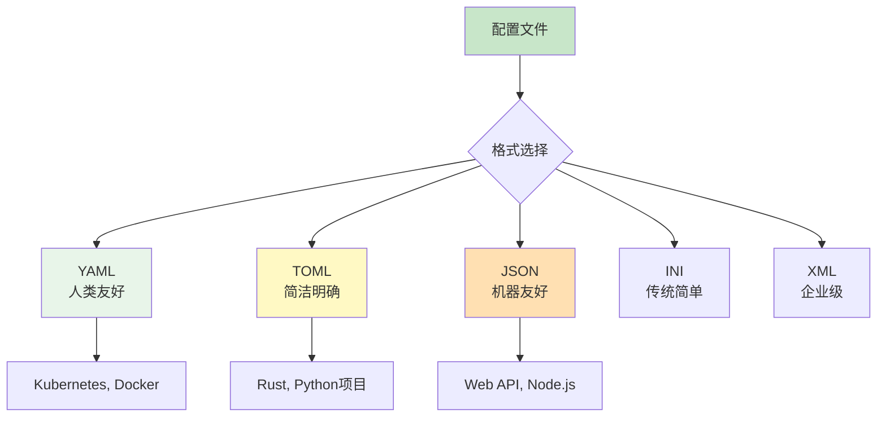
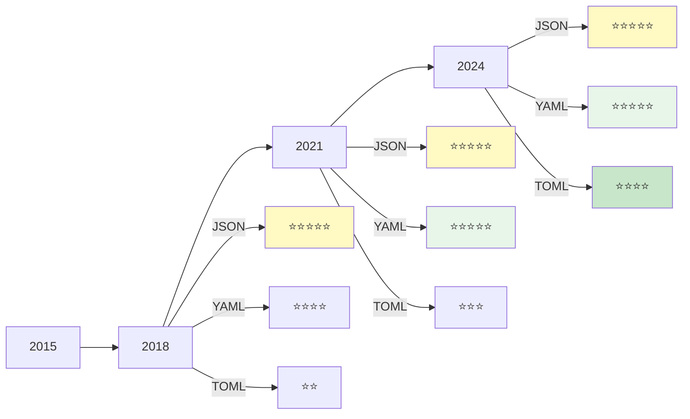
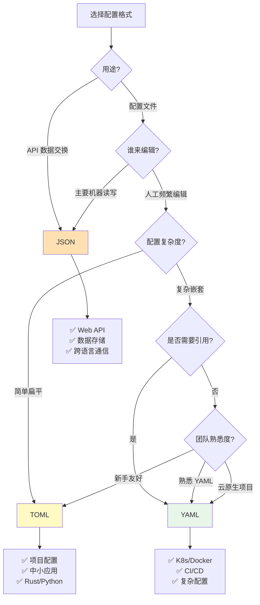
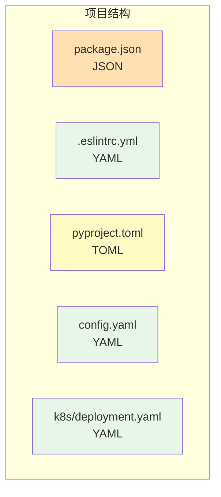

## 引言：为什么需要配置文件？

每个应用程序都需要配置：

```
数据库连接信息
API 密钥
功能开关
环境变量
部署参数
```

**问题：如何存储这些配置？**

早期方案：硬编码在代码中

```python
# 糟糕的做法
DB_HOST = "localhost"
DB_PORT = 5432
DB_USER = "admin"
```

**痛点：**

```
✗ 修改配置需要重新编译
✗ 不同环境无法灵活切换
✗ 敏感信息泄露风险
✗ 团队协作困难
```

**解决方案：外部配置文件**



本文将深入对比 YAML、TOML、JSON 三种主流格式，帮助你理解它们的设计哲学、优缺点和适用场景。

## 第一部分：三种格式的核心特性

### 1.1 JSON：数据交换的通用语言

**诞生背景：**

```
2001年，Douglas Crockford 提出 JSON
初衷：JavaScript 对象表示法的子集
目标：轻量级的数据交换格式

现状：
- Web API 的事实标准
- 几乎所有编程语言都支持
- RFC 8259 标准化
```

**基本语法：**

```json
{
  "name": "MyApp",
  "version": "1.0.0",
  "debug": true,
  "port": 8080,
  "database": {
    "host": "localhost",
    "port": 5432,
    "username": "admin",
    "password": "secret"
  },
  "features": ["auth", "logging", "cache"],
  "metadata": null
}
```

**语法规则：**

| 特性 | 规则 | 示例 |
|------|------|------|
| **数据结构** | 对象 `{}`、数组 `[]` | `{"key": "value"}` |
| **键名** | 必须双引号 | `"name"` ✓, `'name'` ✗ |
| **字符串** | 必须双引号 | `"hello"` ✓, `'hello'` ✗ |
| **注释** | ❌ 不支持 | 无 |
| **尾逗号** | ❌ 不允许 | `[1,2,]` ✗ |
| **数据类型** | string, number, boolean, null, object, array | 6种 |

**优点：**

```
✓ 标准化程度高（RFC）
✓ 所有语言原生支持
✓ 解析速度快
✓ 无歧义，易于机器处理
✓ Web 生态事实标准
```

**缺点：**

```
✗ 不支持注释（配置文件的致命伤）
✗ 冗长（大量引号和括号）
✗ 人类可读性差
✗ 不能表示某些类型（日期、二进制等）
✗ 严格语法，容易出错
```

**典型应用场景：**

```
✓ RESTful API 请求/响应
✓ NoSQL 文档存储（MongoDB）
✓ 前端项目配置（package.json）
✓ 微服务间通信
✗ 人工编辑的配置文件
✗ 复杂嵌套配置
```

### 1.2 YAML：人类友好的配置格式

**诞生背景：**

```
2001年，Clark Evans 等人创建 YAML
全称：YAML Ain't Markup Language（递归缩写）
设计理念：以数据为中心，而非文档

口号："YAML is for humans"
```

**基本语法：**

```yaml
# 这是注释
name: MyApp
version: 1.0.0
debug: true
port: 8080

# 嵌套对象（缩进表示层级）
database:
  host: localhost
  port: 5432
  credentials:
    username: admin
    password: secret

# 数组（两种写法）
features:
  - auth
  - logging
  - cache

# 行内数组
tags: [web, api, production]

# 多行字符串
description: |
  This is a multi-line
  string that preserves
  line breaks.

# 引用和锚点
defaults: &defaults
  timeout: 30
  retries: 3

production:
  <<: *defaults
  timeout: 60
```

**核心特性：**

| 特性 | 说明 | 示例 |
|------|------|------|
| **缩进** | 使用空格（禁止 Tab）表示层级 | 2空格或4空格 |
| **注释** | ✅ 支持 `#` | `# 这是注释` |
| **字符串** | 可省略引号 | `name: John` |
| **多行字符串** | `\|` 保留换行，`>` 折叠换行 | 见上例 |
| **锚点和引用** | `&` 定义，`*` 引用 | 避免重复 |
| **数据类型** | 自动推断 | 字符串、数字、布尔、null |
| **特殊值** | `true/false`, `null/~` | `enabled: true` |

**数据类型推断：**

```yaml
# 字符串（默认）
name: John Doe
city: "New York"  # 显式引号

# 整数
age: 30
population: 1_000_000  # 下划线分隔

# 浮点数
pi: 3.14
scientific: 6.02e23

# 布尔值
enabled: true
disabled: false
yes: true   # 注意：yes/no 也被识别为布尔
no: false

# Null
empty: null
also_empty: ~

# 日期（ISO 8601）
birthday: 1990-01-01
timestamp: 2026-04-12T10:30:00Z
```

**优点：**

```
✓ 人类可读性极佳
✓ 支持注释
✓ 简洁（无需引号和括号）
✓ 强大的表达式（锚点、引用）
✓ 多行字符串处理优雅
✓ Kubernetes、Docker 等云原生标配
```

**缺点：**

```
✗ 缩进敏感（容易出错）
✗ 解析速度慢于 JSON
✗ 实现不一致（不同库行为差异）
✗ 类型推断可能导致意外
✗ 安全漏洞（反序列化攻击）
✗ 学习曲线较陡（高级特性）
```

**典型陷阱：**

```yaml
# 陷阱1：缩进错误
database:
  host: localhost
    port: 5432  # 错误！不一致的缩进

# 陷阱2：布尔值误判
country: NO  # 被解析为 false！应该用引号："NO"

# 陷阱3：数字前导零
version: 010  # 可能被解析为八进制

# 陷阱4：Tab 字符
key:	value  # 绝对禁止！只能用空格
```

**典型应用场景：**

```
✓ Kubernetes  manifests
✓ Docker Compose
✓ CI/CD 配置（GitHub Actions, GitLab CI）
✓ Ansible Playbooks
✓ 复杂的层级配置
✓ 需要人工频繁编辑的配置
```

### 1.3 TOML：明确的配置语言

**诞生背景：**

```
2013年，Tom Preston-Werner（GitHub 联合创始人）创建
全称：Tom's Obvious, Minimal Language
动机：对 YAML 的复杂性感到沮丧

设计理念：
- 语义明确，无歧义
- 易于解析
- 人类可读
```

**基本语法：**

```toml
# 这是注释
title = "MyApp"
version = "1.0.0"
debug = true
port = 8080

# 嵌套表（使用点号）
[database]
host = "localhost"
port = 5432

[database.credentials]
username = "admin"
password = "secret"

# 数组
features = ["auth", "logging", "cache"]

# 多行数组
dependencies = [
  "requests",
  "flask",
  "sqlalchemy"
]

# 多行字符串
description = """
This is a multi-line
string in TOML.
"""

# 日期时间
created = 2026-04-12T10:30:00Z
birthday = 1990-01-01

# 内联表
server = { host = "0.0.0.0", port = 8080 }
```

**核心特性：**

| 特性 | 说明 | 示例 |
|------|------|------|
| **键值对** | `key = value` | `name = "John"` |
| **注释** | ✅ 支持 `#` | `# 注释` |
| **字符串** | 必须引号（单/双） | `"hello"` 或 `'hello'` |
| **表（Table）** | `[section]` 表示区块 | `[database]` |
| **数组** | 方括号 | `[1, 2, 3]` |
| **数据类型** | 显式声明 | 无类型推断歧义 |
| **多行字符串** | `"""..."""` 或 `'''...'''` | 三引号 |

**数据类型：**

```toml
# 字符串
str1 = "双引号字符串"
str2 = '单引号字符串（不转义）'
str3 = """
多行字符串
可以换行
"""

# 整数
int1 = 42
int2 = 0xDEADBEEF  # 十六进制
int3 = 0o755       # 八进制
int4 = 0b11010110  # 二进制
int5 = 1_000_000   # 下划线分隔

# 浮点数
float1 = 3.14
float2 = 6.02e23
float3 = inf   # 无穷大
float4 = nan   # NaN

# 布尔值
bool1 = true
bool2 = false

# 日期时间
datetime1 = 2026-04-12T10:30:00Z
datetime2 = 2026-04-12 10:30:00+08:00
date-only = 2026-04-12
time-only = 10:30:00

# 数组
array1 = [1, 2, 3]
array2 = ["red", "yellow", "green"]
array3 = [
  "item1",
  "item2",
  "item3"
]
```

**表的层次结构：**

```toml
# 方式1：点号分隔
[server.production]
host = "prod.example.com"
port = 443

# 等价于
[server]
[server.production]
host = "prod.example.com"
port = 443

# 方式2：双括号（数组表）
[[products]]
name = "Hammer"
sku = 738594937

[[products]]
name = "Nail"
sku = 284758393
```

**优点：**

```
✓ 语法简单，易于学习
✓ 无歧义（显式类型）
✓ 支持注释
✓ 解析速度快
✓ 错误提示清晰
✓ Rust 生态系统首选（Cargo.toml）
```

**缺点：**

```
✗ 深层嵌套不够优雅
✗ 社区生态相对较小
✗ 不支持引用/变量
✗ 数组表语法略显奇怪
✗ 不如 YAML 流行
```

**典型应用场景：**

```
✓ Rust 项目（Cargo.toml）
✓ Python 项目（pyproject.toml）
✓ Hugo 博客配置
✓ 中小型项目配置
✓ 需要明确性的配置
```

## 第二部分：详细对比分析

### 2.1 语法对比

**同一配置的三种写法：**

```json
{
  "app": {
    "name": "MyApp",
    "version": "1.0.0"
  },
  "database": {
    "host": "localhost",
    "port": 5432,
    "credentials": {
      "username": "admin",
      "password": "secret"
    }
  },
  "features": ["auth", "logging"],
  "enabled": true
}
```

```yaml
app:
  name: MyApp
  version: 1.0.0

database:
  host: localhost
  port: 5432
  credentials:
    username: admin
    password: secret

features:
  - auth
  - logging

enabled: true
```

```toml
[app]
name = "MyApp"
version = "1.0.0"

[database]
host = "localhost"
port = 5432

[database.credentials]
username = "admin"
password = "secret"

features = ["auth", "logging"]
enabled = true
```

**对比表：**

| 维度 | JSON | YAML | TOML |
|------|------|------|------|
| **文件扩展名** | `.json` | `.yaml` / `.yml` | `.toml` |
| **注释** | ❌ | ✅ `#` | ✅ `#` |
| **引号要求** | 必须 | 可选 | 字符串必须 |
| **缩进敏感** | 否 | 是（空格） | 否 |
| **尾逗号** | ❌ | ✅ | ✅ |
| **数据类型** | 6种 | 自动推断 | 显式 |
| **多行字符串** | ❌（需转义） | ✅ `\|` 或 `>` | ✅ `"""` |
| **引用机制** | ❌ | ✅ 锚点 | ❌ |
| **复杂度** | 低 | 高 | 中 |
| **学习成本** | 低 | 中-高 | 低 |

### 2.2 性能对比

**解析速度基准测试：**

```
测试条件：
- 文件大小：10KB 配置文件
- 迭代次数：10,000 次
- 语言：Python 3.10

结果（平均解析时间）：
JSON:  0.05ms  ⚡⚡⚡⚡⚡
TOML:  0.08ms  ⚡⚡⚡⚡
YAML:  0.25ms  ⚡⚡

内存占用：
JSON:  1x（基准）
TOML:  1.2x
YAML:  1.8x
```

**影响因素：**

```
JSON：
✓ 简单语法，快速解析
✓ 流式解析支持
✓ 硬件加速（SIMD）

YAML：
✗ 复杂语法分析
✗ 类型推断开销
✗ 锚点解析

TOML：
✓ 介于两者之间
✓ 确定性解析
```

### 2.3 安全性对比

**安全风险：**

| 风险类型 | JSON | YAML | TOML |
|---------|------|------|------|
| **注入攻击** | 低 | 高 | 低 |
| **反序列化漏洞** | 中 | 高 | 低 |
| **DoS（炸弹）** | 低 | 中 | 低 |
| **任意代码执行** | 低 | 高* | 低 |

***YAML 的历史安全问题：**

```python
# 危险的 YAML 反序列化
import yaml

# ❌ 绝对禁止！
data = yaml.load(malicious_yaml)

# 攻击载荷：
!!python/object/apply:os.system ['rm -rf /']

# ✅ 安全做法
data = yaml.safe_load(yaml_string)
```

**最佳实践：**

```
JSON：
✓ 使用标准库解析器
✓ 验证 schema
✓ 限制嵌套深度

YAML：
✓ 始终使用 safe_load
✓ 禁用自定义标签
✓ 限制文件大小
✓ 白名单允许的类

TOML：
✓ 天然较安全
✓ 仍应验证输入
```

### 2.4 生态系统对比

**语言支持：**

| 语言 | JSON | YAML | TOML |
|------|------|------|------|
| **JavaScript** | 原生 | js-yaml | @iarna/toml |
| **Python** | 原生 | PyYAML | toml / tomli |
| **Java** | Jackson | SnakeYAML | tomlj |
| **Go** | encoding/json | gopkg.in/yaml | BurntSushi/toml |
| **Rust** | serde_json | serde_yaml | toml-rs |
| **Ruby** | 原生 | psych | toml-rb |

**工具链：**

```
JSON：
✓ jq（命令行处理）
✓ JSON Schema（验证）
✓ jsonlint（格式化）
✓ 浏览器原生支持

YAML：
✓ yq（类似 jq）
✓ kubeval（K8s 验证）
✓ yamllint（语法检查）
✓ prettier（格式化）

TOML：
✓ taplo（格式化工具）
✓ toml-cli（命令行）
✓ 编辑器插件较少
```

**流行度趋势：**



```
趋势分析：
- JSON：稳定领先（Web API 刚需）
- YAML：快速增长（云原生推动）
- TOML：稳步上升（Rust/Python 生态）
```

## 第三部分：选型指南

### 3.1 决策树



### 3.2 具体场景推荐

**场景1：Web API**

```
推荐：JSON

理由：
✓ HTTP 标准（Content-Type: application/json）
✓ 浏览器原生支持
✓ 所有框架内置支持
✓ 性能最优

示例：
// Express.js
app.get('/api/users', (req, res) => {
  res.json({ users: [...] });
});
```

**场景2：Kubernetes 配置**

```
推荐：YAML

理由：
✓ K8s 官方格式
✓ 支持注释和文档
✓ 模板化（Helm）
✓ 社区生态完善

示例：
apiVersion: apps/v1
kind: Deployment
metadata:
  name: my-app
spec:
  replicas: 3
```

**场景3：Rust 项目**

```
推荐：TOML

理由：
✓ Cargo 标准格式
✓ 生态系统约定
✓ 解析库成熟
✓ 语法简洁

示例：
[package]
name = "my-crate"
version = "0.1.0"

[dependencies]
serde = "1.0"
```

**场景4：Python 项目配置**

```
推荐：TOML（现代）或 YAML（传统）

趋势：
- pyproject.toml 成为标准（PEP 518）
- Poetry、Flit 等现代工具采用 TOML
- 遗留项目可能使用 setup.cfg 或 YAML

示例：
[tool.poetry]
name = "my-package"
version = "0.1.0"
```

**场景5：CI/CD 配置**

```
推荐：YAML

理由：
✓ GitHub Actions、GitLab CI 标准
✓ 支持复杂工作流
✓ 矩阵构建
✓ 条件判断

示例：
jobs:
  build:
    runs-on: ubuntu-latest
    steps:
      - uses: actions/checkout@v3
```

**场景6：微服务配置中心**

```
推荐：JSON 或 YAML

考虑因素：
- 如果使用 Consul/Etcd：JSON（KV 存储友好）
- 如果需要人工编辑：YAML
- 如果程序自动生成：JSON

混合方案：
- 开发环境：YAML（易读）
- 生产环境：JSON（高效）
- 自动转换工具
```

### 3.3 混用策略

**现实世界：多种格式共存**



**最佳实践：**

```
1. 遵循生态约定
   - JavaScript: package.json (JSON)
   - Python: pyproject.toml (TOML)
   - Rust: Cargo.toml (TOML)
   - K8s: *.yaml (YAML)

2. 保持一致性
   - 同类配置使用相同格式
   - 团队内部统一规范

3. 提供转换工具
   - YAML ↔ JSON 转换器
   - 自动化验证

4. 文档说明
   - README 中说明格式选择原因
   - 提供示例文件
```

## 第四部分：最佳实践

### 4.1 JSON 最佳实践

**格式化：**

```json
{
  "compact": false,
  "indent": 2,
  "sortKeys": true
}
```

**工具推荐：**

```bash
# 格式化
jq '.' input.json > output.json

# 验证
jsonlint config.json

# 查询
jq '.database.host' config.json

# 合并
jq -s '.[0] * .[1]' base.json override.json
```

**Schema 验证：**

```json
{
  "$schema": "http://json-schema.org/draft-07/schema#",
  "type": "object",
  "properties": {
    "name": { "type": "string" },
    "port": { "type": "integer", "minimum": 1, "maximum": 65535 }
  },
  "required": ["name", "port"]
}
```

**注意事项：**

```
✓ 始终使用 UTF-8 编码
✓ 避免深层嵌套（> 5 层）
✓ 使用有意义的键名
✓ 保持键的顺序一致
✗ 不要存储二进制数据（用 Base64）
✗ 避免循环引用
```

### 4.2 YAML 最佳实践

**缩进规范：**

```yaml
# ✅ 推荐：2 空格
database:
  host: localhost
  port: 5432

# ❌ 禁止：Tab
database:
	host: localhost  # 错误！

# ⚠️ 谨慎：4 空格（也可以，但要保持一致）
database:
    host: localhost
```

**字符串处理：**

```yaml
# 简单字符串（无需引号）
name: John Doe

# 包含特殊字符（需要引号）
url: "https://example.com"
regex: "\\d+"

# 多行字符串（保留换行）
description: |
  Line 1
  Line 2
  Line 3

# 多行字符串（折叠换行）
summary: >
  This is a long
  summary that will
  be folded into one line.
```

**锚点和引用：**

```yaml
# 定义默认值
defaults: &defaults
  adapter: postgres
  host: localhost

development:
  database: dev_db
  <<: *defaults

test:
  database: test_db
  <<: *defaults

production:
  database: prod_db
  <<: *defaults
  host: prod.example.com
```

**安全实践：**

```python
# Python
import yaml

# ❌ 危险
data = yaml.load(user_input)

# ✅ 安全
data = yaml.safe_load(user_input)

# ✅ 更严格
from yaml import SafeLoader
data = yaml.load(user_input, Loader=SafeLoader)
```

**工具推荐：**

```bash
# 语法检查
yamllint config.yaml

# 格式化
prettier --write config.yaml

# 查询
yq '.database.host' config.yaml

# 验证（K8s）
kubeval deployment.yaml
```

**常见错误：**

```yaml
# 错误1：布尔值误判
country: NO  # ❌ 解析为 false
country: "NO"  # ✅ 正确

# 错误2：数字前导零
version: 010  # ❌ 可能解析为八进制
version: "010"  # ✅ 正确

# 错误3：空值混淆
empty: null  # ✅ 明确
empty: ~     # ✅ 也可以
empty: ""    # ⚠️ 空字符串，不是 null

# 错误4：缩进不一致
list:
  - item1
   - item2  # ❌ 缩进错误
  - item3
```

### 4.3 TOML 最佳实践

**组织表结构：**

```toml
# ✅ 推荐：逻辑分组
[app]
name = "MyApp"
version = "1.0.0"

[database]
host = "localhost"
port = 5432

[database.pool]
min_size = 5
max_size = 20

[logging]
level = "info"
format = "json"

# ❌ 避免：过深嵌套
[a.b.c.d.e]
key = "value"
```

**数组格式化：**

```toml
# 短数组：单行
features = ["auth", "logging"]

# 长数组：多行
dependencies = [
  "requests>=2.28.0",
  "flask>=2.2.0",
  "sqlalchemy>=1.4.0",
  "redis>=4.3.0",
]

# 注意：尾逗号允许且推荐
```

**字符串选择：**

```toml
# 双引号：支持转义
path = "C:\\Users\\admin"
quote = "He said \"hello\""

# 单引号：字面量（不转义）
regex = '\d+\.\d+'
windows_path = 'C:\Users\admin'

# 多行字符串
long_text = """
This is a
multi-line string.
"""
```

**日期时间：**

```toml
# 完整日期时间（推荐 UTC）
created = 2026-04-12T10:30:00Z

# 本地日期时间
local_dt = 2026-04-12T10:30:00

# 仅日期
birthday = 1990-01-01

# 仅时间
alarm = 07:30:00
```

**工具推荐：**

```bash
# 格式化
taplo format Cargo.toml

# 验证
taplo lint Cargo.toml

# 查询
taplo get key Cargo.toml

# VS Code 插件：Even Better TOML
```

**常见错误：**

```toml
# 错误1：忘记引号
name = MyApp  # ❌ 必须是字符串
name = "MyApp"  # ✅

# 错误2：混合类型数组
values = [1, "two", 3.0]  # ⚠️ 允许但不推荐

# 错误3：重复键
[database]
host = "localhost"

[database]  # ❌ 重复定义
port = 5432

# 正确做法
[database]
host = "localhost"
port = 5432
```

### 4.4 通用原则

**无论选择哪种格式：**

```
1. 版本控制
   ✓ 提交配置文件到 Git
   ✗ 不要提交敏感信息（用 .env 或密钥管理）

2. 环境分离
   config.dev.yaml
   config.staging.yaml
   config.prod.yaml

3. 文档化
   ✓ 添加注释说明配置项
   ✓ 提供示例配置
   ✓ 记录默认值

4. 验证
   ✓ Schema 验证
   ✓ 启动时检查必填项
   ✓ 提供清晰的错误提示

5. 备份
   ✓ 修改前备份
   ✓ 使用配置管理工具
   ✓ 审计变更历史
```

**敏感信息管理：**

```yaml
# ❌ 不要这样做
database:
  password: "super_secret"

# ✅ 推荐：环境变量引用
database:
  password: ${DB_PASSWORD}

# ✅ 或使用密钥管理服务
# AWS Secrets Manager
# HashiCorp Vault
# Azure Key Vault
```

## 结语：没有银弹

YAML、TOML、JSON 各有优劣，没有绝对的最佳选择。

**核心认知：**

**理解设计哲学：**
- JSON：机器优先，数据交换
- YAML：人类优先，复杂配置
- TOML：平衡之道，明确简洁

**考虑实际场景：**
- 谁在编辑？（人 vs 机器）
- 配置复杂度？（扁平 vs 嵌套）
- 生态约定？（语言/框架惯例）
- 团队熟悉度？（学习成本）

**保持灵活性：**
- 不要教条主义
- 可以混用（不同场景不同格式）
- 提供转换工具
- 文档化选择原因

**记住：**

配置文件的目标是降低维护成本，而非展示技术。

选择让你的团队最高效的格式。

愿你在配置的海洋中，找到简洁与表达的平衡。

---

### 【前情描述】
在此之前,各位专家讨论了以下内容:
- 三种配置格式的核心语法和特性对比
- JSON/YAML/TOML的优缺点和适用场景分析
- 性能、安全性、生态系统的详细对比
- 基于具体场景的选型决策树
- 各格式的最佳实践和常见陷阱