## 引言

当你在浏览器地址栏输入URL并按下回车键的那一刻,一场精密而复杂的渲染之旅就开始了。

从服务器返回的HTML文本,到你眼前看到的精美页面,这中间经历了什么?为什么有些页面加载飞快,有些却卡顿缓慢?为什么修改一个CSS属性可能触发整个页面的重新布局?

理解浏览器的渲染机制,是成为高级前端工程师的必经之路。它不仅帮助你写出更高效的代码,更能让你在遇到性能问题时,能够快速定位根因并给出解决方案。

本文将带你深入浏览器渲染引擎的内部,从HTML解析到像素绘制,一步步揭开渲染的神秘面纱。我们将探讨浏览器如何通过多进程架构保障稳定性,如何通过关键渲染路径将抽象的代码转化为可视的界面,以及开发者如何利用这些知识优化页面性能。

## 浏览器架构概览

### 多进程架构

现代浏览器采用多进程架构,以提升稳定性和安全性。这种设计的核心理念是将不同的功能模块隔离在独立的进程中,即使某个进程崩溃,也不会影响其他进程的正常运行。

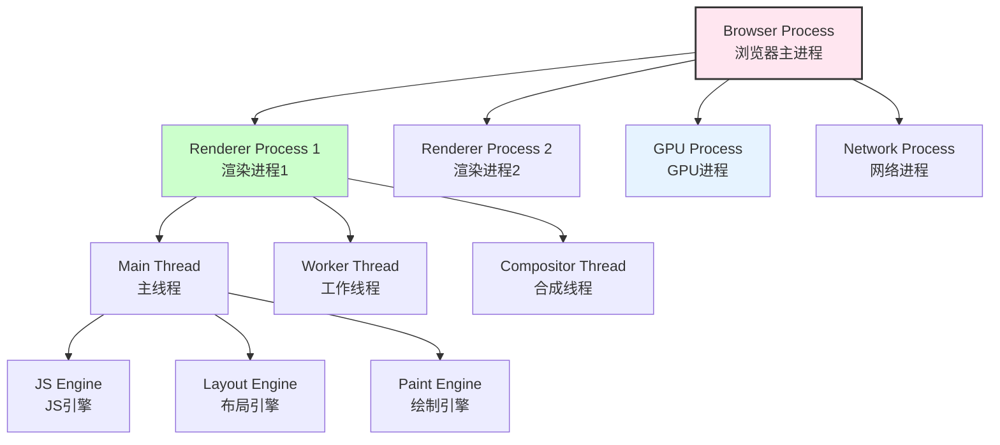

**各进程职责详解**：

| 进程 | 职责 | 说明 |
|------|------|------|
| Browser Process | 协调其他进程、管理书签、地址栏等 | 只有一个,负责整体协调和用户界面管理 |
| Renderer Process | 解析HTML、CSS、执行JS、渲染页面 | 每个Tab一个,沙箱隔离,确保安全 |
| GPU Process | GPU加速、3D CSS、Canvas | 独立于渲染进程,处理图形计算密集型任务 |
| Network Process | 处理网络请求、缓存管理 | 资源共享,统一管理网络连接 |

这种多进程架构带来了显著的优势。首先,安全性得到提升,每个渲染进程运行在沙箱环境中,即使恶意代码也无法突破进程边界访问系统资源。其次,稳定性大幅改善,单个标签页的崩溃不会导致整个浏览器退出。最后,性能也得到优化,GPU进程可以独立处理图形计算,释放CPU资源用于其他任务。

**关键洞察**：渲染工作主要在Renderer Process中进行,其中又分为多个线程协同工作。理解这种架构对于后续理解渲染流程至关重要。

### 渲染进程内部架构

渲染进程内部采用多线程设计,不同线程各司其职,共同完成页面渲染任务。

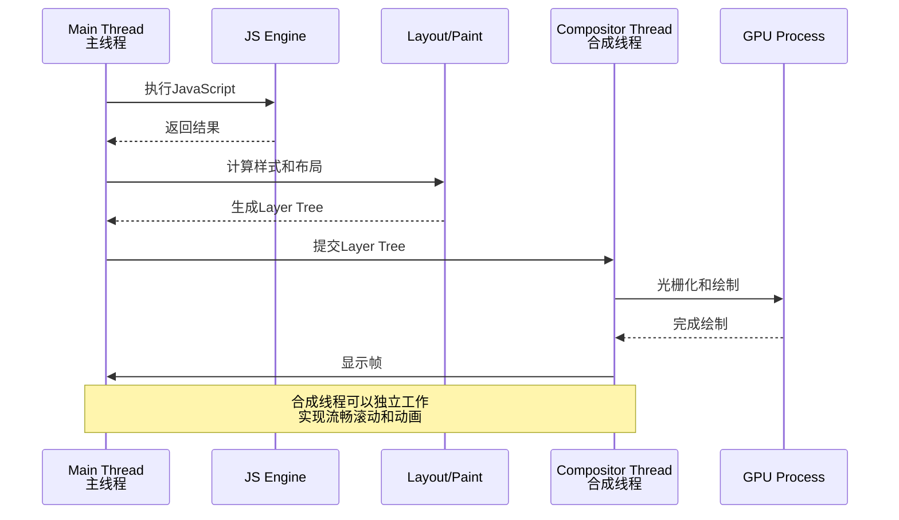

**线程分工详解**：

| 线程 | 职责 | 特点 |
|------|------|------|
| Main Thread | HTML解析、CSS解析、JS执行、布局、绘制 | 单线程,任务繁重,容易成为瓶颈 |
| Worker Thread | Web Workers、Service Workers | 后台任务,不阻塞UI,适合耗时操作 |
| Compositor Thread | 图层合成、滚动、动画 | 独立于主线程,保证交互流畅性 |
| Raster Thread | 光栅化(将矢量转为位图) | 多线程并行处理,提升绘制效率 |

主线程承担了最繁重的任务,从解析HTML和CSS,到执行JavaScript,再到计算布局和生成绘制指令,几乎所有渲染相关的核心工作都在主线程中完成。这也是为什么不当的JavaScript代码会导致页面卡顿的根本原因——它们阻塞了主线程,使得渲染任务无法及时执行。

合成线程的出现是为了解决主线程繁忙导致的交互卡顿问题。通过将图层合成、滚动和动画等操作转移到独立的合成线程,即使用户正在执行复杂的JavaScript计算,页面滚动和简单动画依然能够保持流畅。这种设计体现了现代浏览器对用户体验的极致追求。

## 关键渲染路径(Critical Rendering Path)

### 渲染流程总览

关键渲染路径是指浏览器从接收HTML、CSS和JavaScript字节流开始,到将这些资源转换为屏幕上实际像素的整个过程。这个过程可以分为六个主要步骤,每一步都不可或缺,且前后依赖。

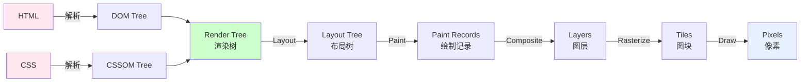

**详细流程解析**：

1. **构建DOM树**：浏览器接收HTML字节流,经过字符编码转换后,将其解析为标记(tokens),再根据这些标记构建出文档对象模型(DOM)树。DOM树是页面结构的抽象表示,包含了所有HTML元素及其层级关系。

2. **构建CSSOM树**：与此同时,浏览器也在解析CSS规则,构建CSS对象模型(CSSOM)树。与DOM不同,CSSOM的构建是阻塞性的,浏览器必须等待所有CSS文件加载并解析完成后,才能继续后续的渲染步骤。这是因为CSS会直接影响元素的布局和外观,没有完整的样式信息,浏览器无法正确渲染页面。

3. **生成渲染树**：有了DOM和CSSOM之后,浏览器会将两者结合,生成渲染树(Render Tree)。渲染树只包含需要在屏幕上显示的节点,像`display: none`的元素、`script`标签、`meta`标签等都不会出现在渲染树中。这一步的本质是筛选和合并,确定哪些元素需要被渲染,以及它们的最终样式是什么。

4. **布局(Layout)**：布局阶段也称为重排(Reflow),浏览器会计算渲染树中每个节点的精确位置和大小。这是一个递归的过程,从根节点开始,逐层向下计算,考虑盒模型、定位方式、弹性布局等各种CSS属性的影响。布局的结果是一个包含几何信息的布局树,记录了每个元素在视口中的坐标、宽高、边距等信息。

5. **绘制(Paint)**：绘制阶段会将布局树转换为实际的绘制指令。浏览器遍历布局树中的每个节点,生成一系列绘制记录(Paint Records),这些记录描述了如何在屏幕上绘制背景、边框、文本、图片、阴影等视觉元素。需要注意的是,这个阶段并不直接操作像素,而是生成抽象的绘制指令,为后续的光栅化做准备。

6. **合成(Composite)**：最后一个阶段是合成。浏览器将绘制记录分层,形成多个图层(Layers),然后将这些图层上传到GPU进行光栅化(Rasterization),即将矢量图形转换为位图像素。光栅化后的图块(Tiles)会被合成为最终的屏幕画面。合成的优势在于可以利用GPU的并行计算能力,并且某些操作(如transform和opacity变化)可以直接在合成线程中完成,无需回到主线程,从而实现高性能的动画效果。

这六个步骤构成了完整的渲染流水线,理解每个环节的工作原理,是进行性能优化的基础。接下来,我们将深入探讨每个步骤的细节。

### 第一步：构建DOM树

DOM(Document Object Model)树是HTML文档的结构化表示,它将线性的HTML文本转换为树形的对象模型,便于浏览器处理和JavaScript操作。

**HTML解析过程详解**：

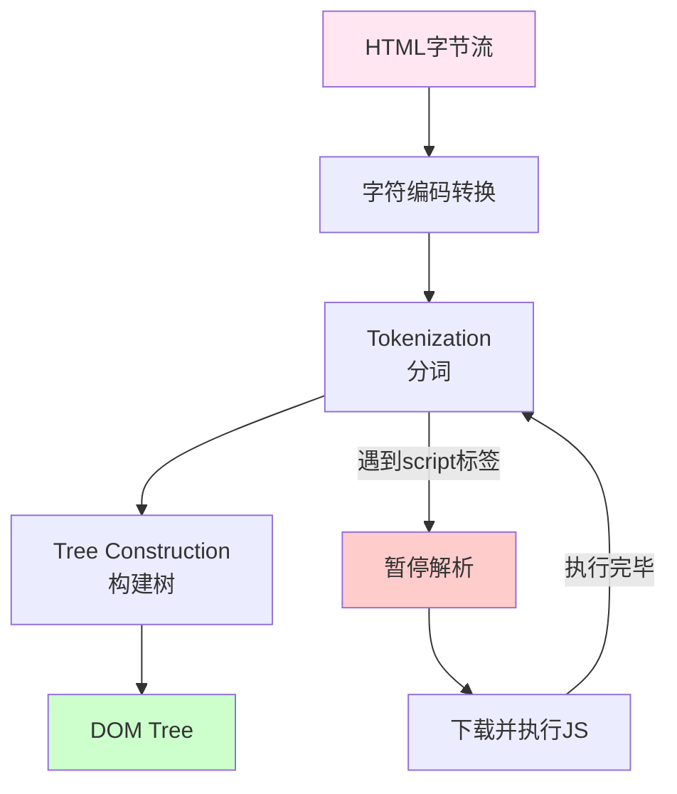

HTML解析是一个渐进式的过程,浏览器不需要等待整个HTML文档下载完成就开始解析。这种流式解析的设计使得用户可以更快地看到页面内容,提升了感知性能。

**Tokenization(分词)阶段**：

分词器将HTML字节流转换为有意义的标记(tokens)。这个过程类似于自然语言处理中的词法分析,将连续的字符序列切分为一个个独立的语义单元。

以一段简单的HTML为例：

```html
<html>
  <body>
    <div>Hello World</div>
  </body>
</html>
```

分词器会依次产生以下tokens：
```
- StartTag: html
- StartTag: body  
- StartTag: div
- Character: "Hello World"
- EndTag: div
- EndTag: body
- EndTag: html
```
每个token都包含了类型信息和具体内容,为后续的树构建提供基础数据。

**Tree Construction(构建树)阶段**：

树构建器接收tokens,按照HTML规范定义的规则,将它们组织成树形结构。这个过程中,浏览器会根据tag的类型决定节点的层级关系,处理嵌套、闭合等语法细节。

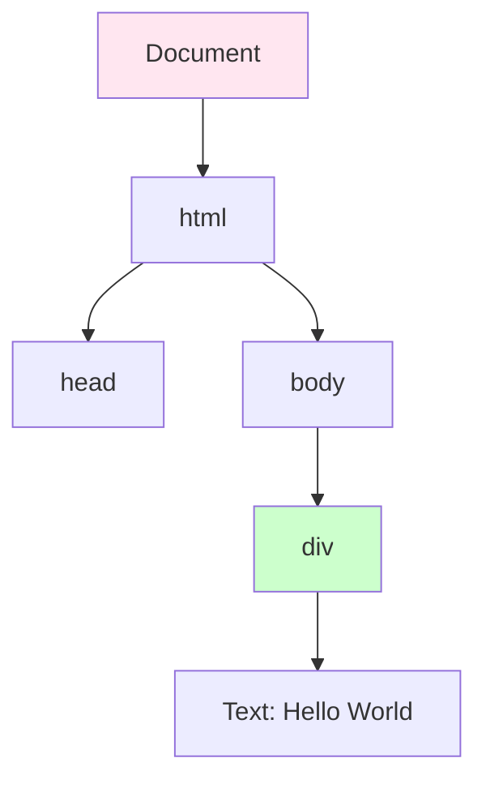

最终生成的DOM树以Document节点为根,html元素为其子节点,head和body作为html的子节点,依此类推,形成完整的树形结构。

**解析规则与特性**：

| 规则 | 说明 | 影响 |
|------|------|------|
| 容错性 | 自动修复错误HTML | 即使HTML不规范,浏览器也能正确解析,如未闭合的p标签会自动补全 |
| 脚本阻塞 | script标签阻塞解析 | 遇到外部script时,解析暂停,直到脚本下载并执行完毕,除非使用async或defer属性 |
| 预加载扫描器 | 提前发现资源 | 在主解析器忙于执行脚本时,预加载扫描器会继续扫描HTML,提前发现并下载CSS、图片等资源 |

脚本阻塞是HTML解析中的一个重要性能瓶颈。当解析器遇到没有async或defer属性的script标签时,它会暂停HTML解析,等待脚本下载和执行完成。这是因为脚本可能会通过document.write等方式修改DOM结构,浏览器必须确保脚本执行完毕后才能继续解析,以保证DOM的正确性。

为了缓解这个问题,现代浏览器引入了预加载扫描器(Preload Scanner)。当主解析器因为执行脚本而暂停时,预加载扫描器会继续向前扫描HTML,发现CSS、图片、字体等资源后,立即发起下载请求。这样可以在脚本执行的同时并行下载资源,减少总体加载时间。

**优化策略**：

针对脚本阻塞问题,可以采取以下几种优化策略：

首先,对于不依赖DOM的非关键脚本,可以使用async属性。async脚本会在下载完成后立即执行,不保证执行顺序,但不会阻塞HTML解析。这种方式适合独立的第三方脚本,如统计分析代码。

其次,对于需要访问DOM但不紧急的脚本,可以使用defer属性。defer脚本会延迟到HTML解析完成后、DOMContentLoaded事件触发前执行,并且保证按照出现的顺序执行。这种方式既不会阻塞解析,又能确保DOM已经就绪。

最后,对于首屏必需的关键脚本,可以考虑内联到HTML中。内联脚本虽然没有异步加载的优势,但避免了额外的网络请求,对于小段关键代码来说,总体耗时可能更低。

### 第二步：构建CSSOM树

CSSOM(CSS Object Model)树是CSS规则的结构化表示,它描述了如何应用样式到DOM元素上。与DOM不同,CSSOM的构建过程是阻塞性的,这对页面渲染性能有着深远的影响。

**CSS解析过程**：

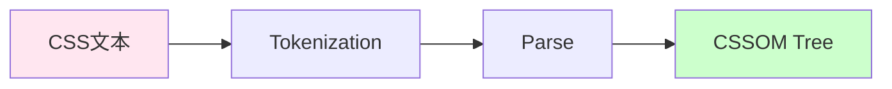

CSS解析同样经历分词和解析两个阶段。分词器将CSS文本转换为tokens,解析器则根据CSS语法规则将tokens组织成树形结构。

**CSSOM的特点与阻塞性**：

与DOM相比,CSSOM有一个显著的不同点：它是阻塞渲染的。这意味着浏览器必须等待所有CSS文件加载和解析完成后,才能继续构建渲染树。这种设计的根本原因在于,CSS会直接影响元素的布局和外观,如果CSSOM不完整,浏览器就无法正确计算元素的位置和大小,也就无法进行后续的布局和绘制。

具体来说,CSSOM的阻塞性体现在以下几个方面：

第一,浏览器在解析HTML时,如果遇到link标签引用的外部CSS文件,会立即下载该文件,但在CSS文件下载和解析完成之前,不会继续构建渲染树。这是为了确保渲染时拥有完整的样式信息。

第二,即使CSS文件中只有一条规则会影响页面上的某个元素,浏览器也必须等待整个CSS文件解析完成。这是因为CSS的选择器可能存在复杂的层叠关系,浏览器需要完整的CSSOM才能正确计算样式的优先级和继承关系。

第三,CSSOM的阻塞是累积的。如果页面引用了多个CSS文件,浏览器必须等待所有文件都加载并解析完成后,才能继续。这意味着任何一个慢速的CSS文件都会拖慢整个页面的渲染速度。

**CSSOM树结构示例**：

假设有如下CSS规则：

```css
body { font-size: 16px; }
div { color: blue; }
.hidden { display: none; }
```

生成的CSSOM树大致如下：

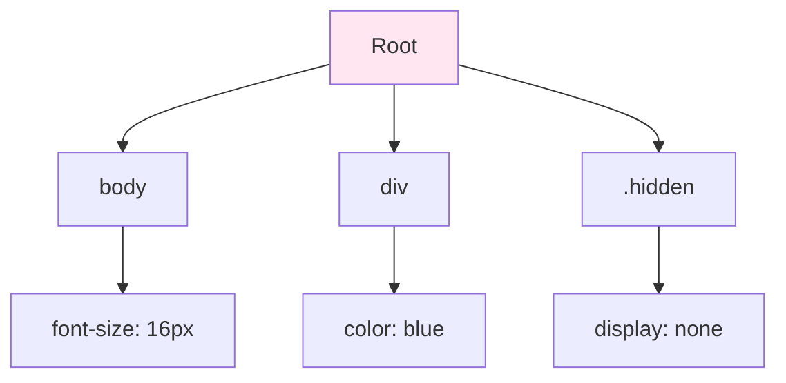

CSSOM树以Root为根节点,每条CSS规则对应一个分支,分支中包含选择器和对应的声明块。浏览器在应用样式时,会从CSSOM树中查找匹配的规则,并根据层叠规则计算最终样式。

**CSS阻塞问题的应对策略**：

既然CSSOM的阻塞性不可避免,那么如何最小化其对性能的影响呢?以下是几种有效的优化策略：

**策略一：利用媒体查询减少阻塞**

CSS的media属性可以用来指定样式适用的媒体类型。当媒体查询条件不匹配时,浏览器仍然会下载CSS文件,但不会阻塞渲染。例如：

```html
<link rel="stylesheet" href="print.css" media="print">
```

这条规则指定了打印样式,在屏幕显示时不会阻塞渲染,因为media="print"与当前媒体类型不匹配。虽然这种方式不能用于主要的屏幕样式,但对于条件性加载的资源非常有用。

**策略二：异步加载非关键CSS**

对于非首屏必需的CSS,可以采用异步加载的方式,避免阻塞关键渲染路径。一种常见的做法是使用preload预加载,然后在加载完成后动态切换rel属性：

```html
<link rel="preload" href="styles.css" as="style" onload="this.rel='stylesheet'">
```

这种方式告诉浏览器预先下载CSS文件,但不立即应用,等到下载完成后再通过onload回调将其设置为stylesheet,从而触发样式应用。这样既保证了资源的提前加载,又避免了阻塞渲染。

**策略三：内联关键CSS**

最关键的首屏样式可以直接内联到HTML的head部分,这样可以立即应用,无需等待网络请求。同时,将非关键的CSS异步加载。这种"关键CSS内联+非关键CSS异步"的组合策略,是当前业界推荐的最佳实践。

```html
<head>
  <!-- 内联关键CSS -->
  <style>
    /* 首屏必需的样式 */
    body { margin: 0; }
    .hero { height: 100vh; }
  </style>
  
  <!-- 异步加载非关键CSS -->
  <link rel="preload" href="non-critical.css" as="style" onload="this.rel='stylesheet'">
</head>
```

通过这种方式,首屏内容可以立即渲染,用户不会感受到明显的白屏等待时间,而非关键样式则在后台异步加载,在适当的时候应用。

### 第三步：生成渲染树(Render Tree)

渲染树是DOM和CSSOM的结合体,它代表了最终要在屏幕上显示的内容及其样式。渲染树的构建过程本质上是一个筛选和合并的过程,只有可见的元素才会被纳入渲染树。

**渲染树的构建逻辑**：

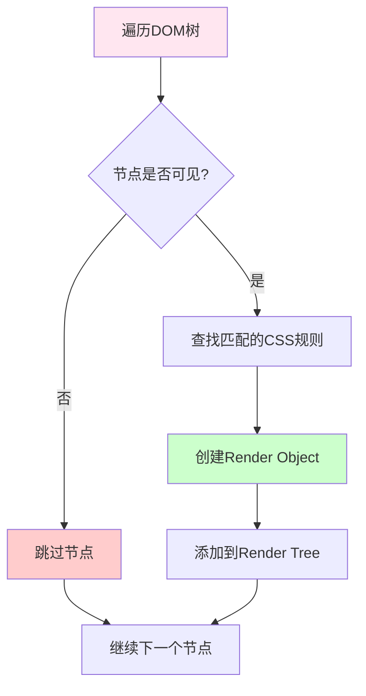

浏览器从DOM树的根节点开始,递归遍历每个节点。对于每个节点,首先判断其是否可见。如果不可见,则直接跳过,不加入渲染树。如果可见,则从CSSOM中查找匹配的样式规则,计算出最终样式,然后创建一个渲染对象(Render Object),并将其添加到渲染树中。

**可见性判断标准**：

| 情况 | 是否包含在渲染树 | 说明 |
|------|----------------|------|
| `display: none` | ❌ 不包含 | 元素完全不参与渲染,不占据空间 |
| `visibility: hidden` | ✅ 包含 | 元素不可见但仍占据空间,需要参与布局计算 |
| `opacity: 0` | ✅ 包含 | 元素完全透明但仍需渲染,可能影响鼠标事件 |
| `<script>`、`<meta>` | ❌ 不包含 | 非可视化元素,不需要渲染 |
| `::before`、`::after` | ✅ 包含 | 伪元素也会生成渲染对象,参与布局和绘制 |

这里需要特别注意`display: none`和`visibility: hidden`的区别。前者会让元素完全从渲染树中消失,不参与任何布局和绘制,也不占据空间。后者则会让元素保持在渲染树中,参与布局计算并占据空间,只是在绘制阶段不显示出来。这种差异在实际开发中非常重要,比如在实现隐藏/显示切换时,如果使用`display: none`,会导致布局重新计算,而如果使用`visibility: hidden`,则只会触发重绘,性能开销更小。

**渲染树示例**：

考虑以下HTML结构：

```html
<body>
  <div>Visible</div>
  <div style="display: none;">Hidden</div>
  <div style="visibility: hidden;">Invisible but occupies space</div>
  <script>console.log('Not in render tree')</script>
</body>
```

生成的渲染树如下：

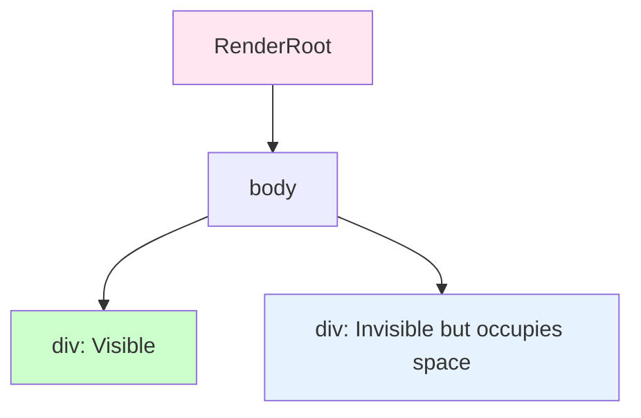

可以看到,`display: none`的div和`script`标签都不在渲染树中,而`visibility: hidden`的div虽然在视觉上不可见,但仍然存在于渲染树中,因为它需要占据空间并参与布局。

渲染树的构建是渲染流程中的一个关键转折点。在此之前,DOM和CSSOM是独立的数据结构,在此之后,它们被合并为一个统一的、面向渲染的数据结构。渲染树中的每个节点都包含了完整的几何和样式信息,为后续的布局计算奠定了基础。

### 第四步：布局(Layout)

布局阶段,也称为重排(Reflow),是渲染流程中计算成本最高的环节之一。在这个阶段,浏览器会计算渲染树中每个节点的精确位置和大小,确定它们在视口中的具体坐标。

**布局的本质**：

布局的目标是将抽象的渲染树转换为具有明确几何信息的布局树。这个过程需要考虑多种因素,包括盒模型、定位方式、浮动、弹性布局、网格布局等CSS属性,以及视口大小、父容器尺寸等环境因素。

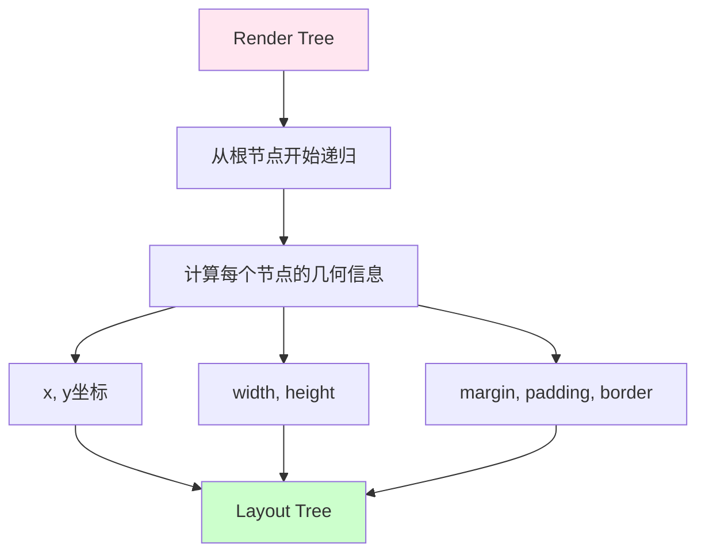

布局是一个递归的过程,从根节点开始,逐层向下计算。对于每个节点,浏览器需要根据其CSS属性和子节点的信息,计算出它的宽度、高度、位置、边距、内边距、边框等几何属性。这个过程可能非常复杂,特别是当涉及到弹性布局或网格布局时,浏览器需要进行多轮迭代计算,才能确定最终的布局结果。

**布局算法的分类**：

浏览器支持多种布局算法,每种算法适用于不同的场景：

**1. Normal Flow(标准流)**：

标准流是最基础的布局方式,遵循盒模型的基本规则。Block级别的元素垂直排列,每个元素独占一行。Inline级别的元素水平排列,在一行内依次排列,直到空间不足时换行。标准流的计算相对简单,浏览器只需要按照文档顺序依次放置元素即可。

**2. Flexbox(弹性布局)**：

弹性布局提供了一种更加灵活的布局方式,特别适合一维布局场景。Flexbox引入了主轴和交叉轴的概念,子元素可以沿着主轴排列,并通过各种属性控制对齐方式、分布方式、换行行为等。弹性布局的计算比标准流复杂,浏览器需要根据容器的大小和子元素的flex属性,动态分配空间。

**3. Grid(网格布局)**：

网格布局是CSS中最强大的布局系统,适用于二维布局场景。Grid允许开发者定义行和列,形成网格轨道,然后将子元素放置到指定的网格区域中。网格布局的计算最为复杂,浏览器需要解析网格模板,计算轨道大小,处理重叠和溢出等情况。

**布局计算示例**：

考虑一个简单的弹性布局示例：

```html
<div class="container">
  <div class="item">Item 1</div>
  <div class="item">Item 2</div>
  <div class="item">Item 3</div>
</div>

<style>
.container {
  display: flex;
  gap: 10px;
}
.item {
  width: 100px;
  height: 50px;
}
</style>
```

浏览器在布局阶段会计算出以下几何信息：

```
Container容器：
- 位置：x=0, y=0
- 宽度：320px (三个item各100px,加上两个gap各10px)
- 高度：50px

Item 1：
- 位置：x=0, y=0
- 宽度：100px, 高度：50px

Item 2：
- 位置：x=110, y=0 (第一个item的宽度100px + gap 10px)
- 宽度：100px, 高度：50px

Item 3：
- 位置：x=220, y=0 (前两个item的总宽度210px + gap 10px)
- 宽度：100px, 高度：50px
```
这些几何信息会被存储在布局树中,供后续的绘制阶段使用。

**重排(Reflow)的触发条件**：

重排是指当DOM变化影响到元素的几何属性时,浏览器需要重新计算布局的过程。重排是一个昂贵的操作,因为它可能需要重新计算大量元素的位置和大小。

**触发重排的操作**：

| 操作 | 说明 | 严重程度 |
|------|------|---------|
| 添加或删除DOM节点 | 改变文档结构,影响布局 | 🔴 高 |
| 修改宽度、高度、边距等几何属性 | 直接影响元素大小和位置 | 🔴 高 |
| 窗口resize | 视口变化导致布局重新计算 | 🔴 高 |
| 读取布局属性 | 如offsetWidth,会强制同步布局 | 🟡 中 |
| 修改字体大小 | 影响文本布局,可能导致换行变化 | 🟡 中 |
| 激活CSS伪类 | 如:hover,通常只影响样式 | 🟢 低 |

从表中可以看出,任何改变元素几何属性的操作都会触发重排,而读取布局属性的操作也会导致重排,这是因为浏览器需要确保返回的值是最新的。这种现象被称为"强制同步布局"(Forced Synchronous Layout),是性能优化中需要重点避免的反模式。

**强制同步布局的危害**：

强制同步布局发生在JavaScript代码交替读取和写入布局属性时。当代码读取一个元素的布局属性(如offsetWidth)时,浏览器必须确保布局是最新的,因此会立即执行布局计算。如果随后代码又修改了某个元素的样式,使布局失效,那么下一次读取布局属性时,浏览器又需要重新计算布局。这种读写交替的模式会导致多次不必要的重排,严重影响性能。

**优化策略**：

为了避免强制同步布局,可以采用批量读写的策略。首先集中读取所有需要的布局属性,然后集中写入所有样式修改。这样可以将多次重排合并为一次,大幅提升性能。

另一种优化方式是使用requestAnimationFrame API。这个API允许开发者将样式修改推迟到下一帧渲染之前执行,浏览器会自动批量处理这些修改,避免中间状态导致的多余重排。

布局阶段是渲染流程中的性能瓶颈之一,理解重排的触发条件和优化方法,对于打造高性能网页至关重要。

### 第五步：绘制(Paint)

绘制阶段是将布局树转换为实际像素的关键环节。在这个阶段,浏览器会遍历布局树中的每个节点,生成一系列绘制指令,描述如何在屏幕上绘制各种视觉元素。

**绘制的本质**：

需要注意的是,绘制阶段并不直接操作像素,而是生成抽象的绘制记录(Paint Records)。这些记录描述了绘制的内容、位置、颜色等信息,但并不立即执行绘制操作。真正的像素填充是在后续的光栅化阶段完成的。

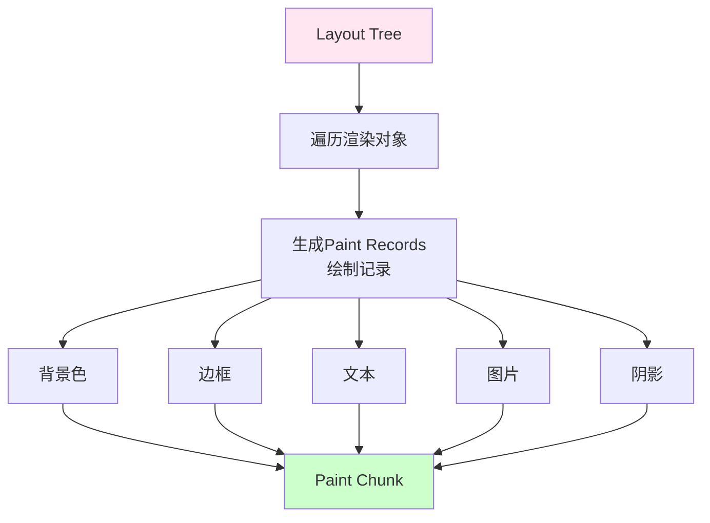

绘制记录的生成是一个细致的过程。对于每个渲染对象,浏览器需要确定它的绘制顺序,处理层叠上下文,考虑透明度混合模式等复杂因素。最终生成的绘制记录列表,实际上是一份详细的"绘画说明书",告诉浏览器应该如何一步步地将页面绘制出来。

**绘制记录的结构**：

绘制记录包含了绘制操作的所有必要信息。例如,绘制一个矩形需要记录类型(fillRect)、位置(x, y)、尺寸(width, height)和颜色(color)。绘制文本需要记录文本内容、位置、字体、颜色等。这些记录以高效的数据结构存储,便于后续的快速处理。

**重绘(Repaint)的触发条件**：

重绘是指当元素的外观发生变化,但不影响其几何属性时,浏览器只需要重新绘制该元素,而无需重新计算布局。重绘的成本比重排低得多,因为它只涉及像素填充,不涉及复杂的布局计算。

**触发重绘的操作**：

| 操作 | 是否重排 | 是否重绘 | 说明 |
|------|---------|---------|------|
| 修改颜色 | ❌ | ✅ | 只影响外观,不改变布局 |
| 修改背景图 | ❌ | ✅ | 只影响外观,不改变布局 |
| 修改visibility | ❌ | ✅ | 隐藏或显示,不影响布局 |
| 修改宽高 | ✅ | ✅ | 影响布局,必然导致重绘 |
| 修改position | ✅ | ✅ | 影响布局,必然导致重绘 |

从这个对比可以看出,重排必然导致重绘,因为布局改变后,元素的位置和大小都发生了变化,自然需要重新绘制。但重绘不一定导致重排,如果只是改变了颜色或背景,元素的几何属性保持不变,就只需要重绘。

**性能层级对比**：

从性能开销的角度来看,重排 > 重绘 > 合成。重排的代价最高,因为它需要重新计算大量元素的几何属性。重绘次之,虽然不需要重新布局,但仍然需要生成新的绘制记录并进行光栅化。合成的代价最低,因为它可以直接在GPU上完成,无需回到主线程。

理解这三种操作的差异,是进行性能优化的基础。在实际开发中,应该尽量避免重排,合理控制重绘,优先使用合成来实现动画效果。

### 第六步：合成(Composite)

合成是渲染流程的最后一步,也是现代浏览器性能优化的关键环节。在这个阶段,浏览器将绘制记录分层,形成多个独立的图层,然后将这些图层上传到GPU进行光栅化和合成,最终生成屏幕上的像素。

**为什么需要图层**：

在早期的浏览器中,所有的绘制操作都在主线程中完成,这导致了一个严重的问题：当用户进行滚动或执行动画时,如果主线程正忙于执行JavaScript代码,页面就会出现卡顿。为了解决这个问题,现代浏览器引入了图层和合成线程的概念。

通过将某些元素提升到独立的图层,浏览器可以将这些图层的绘制和合成工作转移到合成线程中执行。合成线程独立于主线程,即使用户正在执行复杂的JavaScript计算,合成线程仍然可以流畅地处理滚动和动画,保证用户体验的连贯性。

**图层提升的条件**：

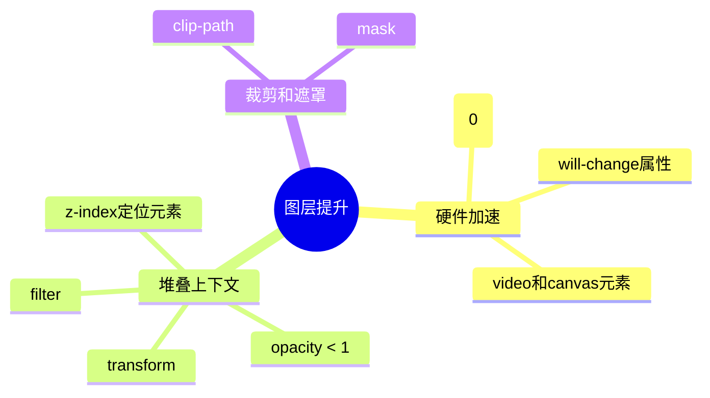

浏览器会根据一定的规则自动将某些元素提升到独立的图层。这些规则主要包括三个方面：

首先是硬件加速相关的属性。当元素使用了3D变换(如transform: translateZ(0))、will-change属性,或者是video和canvas等特殊元素时,浏览器会自动将其提升到独立图层,以便利用GPU进行加速。

其次是创建堆叠上下文的属性。当元素设置了z-index且为定位元素、透明度小于1、使用了transform或filter等属性时,会创建一个新的堆叠上下文,浏览器通常会将其提升为独立图层。

最后是裁剪和遮罩相关的属性。当元素使用了clip-path或mask等属性时,也需要独立图层来正确处理裁剪效果。

**合成过程详解**：

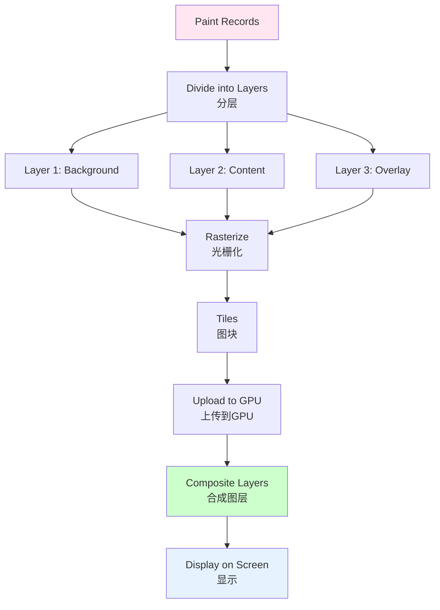

合成过程可以分为以下几个步骤：

第一步是分层。浏览器根据绘制记录和图层提升规则,将绘制内容分配到不同的图层中。通常,背景、主要内容、悬浮层等会被分到不同的图层。

第二步是光栅化(Rasterization)。光栅化是将矢量图形转换为位图像素的过程。浏览器会将每个图层分割成多个图块(Tiles),通常是256x256像素的大小,然后在主线程或专门的光栅线程中将每个图块转换为位图。

第三步是上传到GPU。光栅化后的图块会被上传到GPU内存中,以便快速访问和处理。

第四步是合成图层。合成线程会将所有图层按照正确的顺序合成为最终的画面。如果某些图层发生了变换(如平移、旋转、缩放),合成线程可以直接在GPU上应用这些变换,无需重新光栅化。

最后是显示。合成后的画面会被发送到显示器,呈现给用户。

**光栅化的细节**：

光栅化是合成过程中的关键步骤,它将抽象的矢量图形转换为具体的像素数据。这个过程可以在CPU上进行,也可以利用GPU的并行计算能力加速。现代浏览器通常会将光栅化工作分配到多个光栅线程中并行执行,以提高效率。

图块的划分策略也很重要。浏览器会根据视口范围和滚动方向,智能地决定哪些图块需要优先光栅化。例如,当用户向下滚动时,浏览器会优先光栅化下方的图块,确保新进入视口的内容能够快速显示。

**合成的优势**：

合成机制带来了两大核心优势：

**1. 并行处理能力**：

多个图层可以并行光栅化,充分利用多核CPU的计算能力。同时,合成线程独立于主线程,可以在主线程繁忙时仍然保持流畅的滚动和动画。这种并行化设计是现代浏览器能够实现60fps流畅体验的关键。

**2. 高效的动画实现**：

当元素的transform或opacity属性发生变化时,如果该元素位于独立图层中,浏览器可以直接在合成线程中应用这些变化,无需回到主线程重新布局和绘制。这种方式被称为"合成器动画"(Compositor Animation),它的性能远高于传统的基于left、top等属性的动画。

**合成器动画与传统动画的对比**：

传统动画通过修改元素的left、top、width、height等属性实现,这些属性的变化会触发布局计算,进而导致重排和重绘,性能开销巨大。而合成器动画只修改transform或opacity属性,这些变化可以直接在GPU上完成,不触发重排和重绘,性能极佳。

因此,在现代Web开发中,应该优先使用transform和opacity来实现动画效果,避免使用会触发布局的属性。这是提升动画性能的最有效手段之一。

**查看和分析图层**：

Chrome DevTools提供了Layers面板,可以帮助开发者查看和分析页面的图层结构。通过这个面板,可以看到所有图层的边界、大小、内存占用等信息,还可以检查某个元素被提升到图层的原因。这些信息对于诊断性能问题和优化图层策略非常有价值。

## 渲染性能优化

### 性能指标体系

要优化渲染性能,首先需要建立科学的度量体系。Google提出的Core Web Vitals(核心Web指标)是目前业界公认的性能评估标准,它从用户体验的角度定义了关键的性能指标。

**核心Web指标详解**：

| 指标 | 全称 | 目标值 | 说明 |
|------|------|--------|------|
| LCP | Largest Contentful Paint | <2.5s | 最大内容绘制时间,衡量加载速度 |
| FID | First Input Delay | <100ms | 首次输入延迟,衡量交互响应性 |
| CLS | Cumulative Layout Shift | <0.1 | 累积布局偏移,衡量视觉稳定性 |
| FCP | First Contentful Paint | <1.8s | 首次内容绘制,衡量初始加载体验 |
| TTI | Time to Interactive | <3.8s | 可交互时间,衡量页面可用性 |

这些指标涵盖了加载性能、交互性能和视觉稳定性三个维度,全面反映了用户的真实体验。LCP关注的是用户看到主要内容的时间,FCP关注的是用户看到任何内容的时间,FID关注的是用户首次交互时的响应速度,CLS关注的是页面布局的稳定性,TTI关注的是页面完全可用的时间。

**测量工具与方法**：

除了使用Chrome DevTools的Performance面板进行本地测试外,还可以使用Performance API在代码中监控这些指标。例如,可以通过performance.getEntriesByType('paint')获取绘制时间点,通过PerformanceObserver监听LCP等指标的变化。这些数据可以帮助开发者实时了解页面性能状况,及时发现和解决问题。

### 优化策略与实践

基于对渲染机制的理解,我们可以采取多种策略来优化页面性能。

**策略一：减少重排和重绘**

重排和重绘是性能优化的主要对象。减少重排的核心思路是避免修改会影响布局的属性,转而使用只触发合成的属性。

transform和opacity是两个特殊的CSS属性,它们的变化不会触发布局和绘制,只会触发合成。因此,在实现动画效果时,应该优先使用这两个属性。例如,要实现元素的移动效果,应该使用transform: translate()而不是修改left和top属性。要实现淡入淡出效果,应该使用opacity而不是visibility。

批量DOM操作是另一种减少重排的有效方法。当需要向页面中添加多个元素时,应该先将它们添加到一个DocumentFragment中,然后一次性将Fragment添加到DOM中。这样可以将多次重排合并为一次,大幅提升性能。

**策略二：合理使用will-change提示**

will-change属性可以向浏览器提示某个元素即将发生变化,让浏览器提前做好准备。例如,如果一个元素即将进行transform动画,可以设置will-change: transform,浏览器会提前将该元素提升到独立图层,以便后续的合成操作。

但需要注意的是,will-change不应该滥用。每个独立图层都会占用额外的内存,过多的图层会导致内存浪费甚至性能下降。正确的做法是在动画开始前添加will-change,动画结束后移除它,或者只在确实需要优化的元素上使用。

**策略三：避免布局抖动**

布局抖动(Layout Thrashing)是指JavaScript代码交替读取和写入布局属性,导致浏览器反复执行布局计算的现象。避免布局抖动的关键是批量读写,即先集中读取所有需要的布局属性,再集中写入所有样式修改。

另一种方法是使用requestAnimationFrame API。这个API会将回调函数推迟到下一帧渲染之前执行,浏览器可以自动优化这些回调的执行顺序,避免中间状态导致的多余重排。

**策略四：优化图片和资源加载**

图片通常是页面中最大的资源,优化图片加载对性能提升至关重要。懒加载(Lazy Loading)是一种有效的优化策略,它只在图片进入视口才加载,减少了初始加载的资源量。现代浏览器原生支持loading="lazy"属性,可以方便地实现懒加载。

响应式图片是另一种优化策略。通过使用picture元素和srcset属性,可以根据设备的屏幕尺寸和分辨率加载合适大小的图片,避免在小屏幕上加载过大的图片,浪费带宽和处理时间。

**策略五：代码分割和懒加载**

对于大型应用,代码分割(Code Splitting)可以显著减少初始加载的JavaScript体积。通过将代码拆分为多个chunk,只在需要时加载相应的chunk,可以减少首屏加载时间,提升FCP和LCP指标。

路由级别的代码分割是最常见的做法,每个路由对应的组件被打包为独立的chunk,只有在用户导航到该路由时才加载。组件级别的懒加载也日益普及,对于不立即显示的组件,可以延迟加载,进一步减少初始负担。

### Chrome DevTools性能分析

Chrome DevTools提供了强大的性能分析工具,帮助开发者诊断和优化性能问题。

**Performance面板的使用**：

Performance面板可以录制页面运行时的性能数据,生成详细的火焰图。使用步骤如下：

1. 打开DevTools,切换到Performance面板
2. 点击录制按钮开始录制
3. 执行需要分析的操作
4. 停止录制
5. 分析火焰图中的各个阶段

火焰图用不同颜色表示不同类型的任务：紫色代表JavaScript执行,黄色代表样式计算,绿色代表布局,蓝色代表绘制,灰色代表其他系统开销。通过观察这些颜色的分布和时长,可以快速定位性能瓶颈。

**Layers面板的分析**：

Layers面板可以展示页面的图层结构,包括每个图层的大小、内存占用、合成原因等信息。通过这个面板,可以检查是否有不必要的图层提升,或者是否有应该提升但未提升的元素。

**Rendering面板的调试**：

Rendering面板提供了一些实用的调试选项：

- Paint flashing：当页面发生重绘时,会用彩色闪烁标示重绘区域,帮助识别不必要的重绘
- Layer borders：显示所有图层的边界,便于检查图层划分是否合理
- FPS meter：实时显示帧率,监控动画流畅度

这些工具的熟练使用,可以大幅提升性能优化的效率和准确性。

## 实战案例分析

### 案例一：长列表渲染优化

**问题描述**：

一个包含10000条数据的列表页面,在滚动时出现严重卡顿,帧率降至15fps左右,用户体验极差。

**问题分析**：

通过Performance面板分析,发现主要问题在于：
- DOM节点数量过多,达到10000个,导致布局计算耗时巨大
- 滚动时频繁触发重排和重绘,主线程负载过高
- 内存占用居高不下,影响了整体性能

**解决方案：虚拟滚动**：

虚拟滚动(Virtual Scrolling)是一种优化长列表性能的技术。其核心思想是只渲染视口中可见的少量元素,而不是渲染全部数据。当用户滚动时,动态更新可见区域的元素,复用DOM节点,避免创建和销毁大量节点。

虚拟滚动的实现原理如下：

首先,计算视口中可以显示的元素数量。假设每个元素高度固定为50px,视口高度为600px,那么可见元素数量为12个(600/50)。

然后,只创建这12个元素的DOM节点,并将它们绝对定位到正确的位置。容器的总高度设置为所有数据的总高度(10000 * 50 = 500000px),以维持滚动条的正确表现。

当用户滚动时,监听scroll事件,计算当前应该显示的数据索引范围。如果索引范围发生变化,更新这12个元素的内容和位置,而不是创建新元素。

通过这种方式,无论数据量有多大,DOM节点数量始终保持在12个左右,布局计算的复杂度大大降低。同时,由于复用了DOM节点,避免了频繁的节点创建和销毁,内存占用也大幅减少。

**优化效果**：

实施虚拟滚动后,效果显著：
- DOM节点从10000个降到约12-20个,减少了99%以上
- 滚动流畅度从15fps提升到稳定的60fps
- 内存占用减少90%,页面响应速度明显提升

这个案例充分说明了理解渲染机制的重要性。只有通过减少DOM节点数量,避免不必要的重排重绘,才能真正解决性能问题。

### 案例二：复杂动画优化

**问题描述**：

一个包含多个运动元素的动画页面,在播放时掉帧严重,帧率只有30fps左右,动画不够流畅。

**问题分析**：

通过Layers面板检查,发现以下问题：
- 动画使用了left和top属性,每次变化都触发布局计算
- 主线程繁忙,既要执行JavaScript,又要处理布局和绘制
- 没有足够的独立图层,无法利用合成线程的优势

**解决方案**：

优化的核心思路是将动画从主线程转移到合成线程,利用GPU加速。具体措施包括：

首先,将动画属性从left和top改为transform: translate()。transform属性的变化不会触发布局,只会在合成线程中处理,性能大幅提升。

其次,为动画元素添加will-change: transform提示,让浏览器提前将该元素提升到独立图层。这样在动画开始时,浏览器可以直接在GPU上应用变换,无需额外的准备工作。

最后,考虑使用Web Animations API替代CSS动画。Web Animations API提供了更精细的控制能力,可以更好地与JavaScript逻辑集成,同时也更容易实现复杂的动画序列。

**优化效果**：

经过优化后,效果显著改善：
- 帧率从30fps提升到稳定的60fps
- CPU占用降低50%,主线程负载大幅减轻
- 动画更加流畅,用户体验显著提升

这个案例展示了合成机制的威力。通过将动画转移到合成线程,可以释放大量的主线程资源,实现真正的高性能动画。

## 结语

浏览器渲染是一个复杂而精密的过程,涉及多个进程、多个线程的协同工作。从HTML解析到像素绘制,每一个环节都可能成为性能瓶颈,也可能成为优化的突破口。

**理解渲染机制的价值**：

深入理解浏览器渲染机制,能帮助我们在三个层面提升能力：

**写出更高效的代码**：

当我们知道什么样的操作会触发重排,什么样的操作只会触发合成,就能在编写代码时有意识地选择最优方案。我们会避免不必要的DOM操作,合理使用CSS属性,充分利用浏览器的优化机制。

**快速定位性能问题**：

当页面出现性能问题时,理解渲染机制能帮助我们快速定位根因。通过分析Performance面板的火焰图,我们可以判断问题是出在JavaScript执行、样式计算、布局还是绘制阶段,从而有针对性地优化。

**提供更好的用户体验**：

性能的最终目标是提升用户体验。更快的首屏加载意味着用户能更快看到内容,更流畅的交互意味着用户操作更顺心,更低的电量消耗意味着移动设备续航更长。这些都是直接影响用户满意度的关键因素。

**核心要点回顾**：

**1. 掌握关键渲染路径**

从DOM到CSSOM,从渲染树到布局树,从绘制记录到图层合成,每个环节都有其特定的作用和优化空间。理解这个完整的流程,是进行性能优化的基础。

**2. 理解重排、重绘和合成**

这三种操作的代价依次递减：重排最昂贵,因为它需要重新计算布局；重绘次之,因为它只需要重新生成绘制指令；合成最便宜,因为它可以直接在GPU上完成。在实际开发中,应该尽量避免重排,合理控制重绘,优先使用合成。

**3. 善用浏览器特性**

现代浏览器提供了许多优化机制,如图层提升、合成器动画、预加载扫描器等。了解并善用这些特性,可以让我们的代码事半功倍。transform和opacity是实现高性能动画的关键,requestAnimationFrame是避免布局抖动的利器,will-change是提示浏览器优化的信号。

**4. 持续监控和优化**

性能优化不是一次性的工作,而是持续的工程实践。应该建立完善的监控体系,定期审查性能指标,及时发现和解决问题。Core Web Vitals提供了科学的评估标准,Chrome DevTools提供了强大的分析工具,合理利用这些资源,可以持续提升页面性能。

最后,记住这句话：

> **"性能不是一次性的优化,而是持续的工程实践。"**

在这个用户体验至上的时代,渲染性能直接影响着产品的成败。深入理解浏览器渲染机制,掌握优化技巧,不断实践和迭代,才能够打造出丝滑流畅的用户体验,为用户提供真正有价值的产品和服务。

