## 引言：当目标本身是模糊的

想象以下场景：

- 你正在写一篇历史论文，但不确定什么样的论证结构最有说服力
- 你在设计一个产品功能，但用户需求模糊且相互冲突
- 你在制定职业规划，但未来充满变数，无法预测哪条路径最优
- 你在进行文学创作，但"好作品"的标准主观且多元

在这些情境中，**不存在明确的损失函数、可量化的目标值或确定的成功标准**。这与理工科问题形成鲜明对比——在算法优化中，我们可以用梯度下降找到最小值；在强化学习中，我们有清晰的奖励函数指导行动。

这类**非确定性任务（Non-deterministic Tasks）** 的核心困境在于：

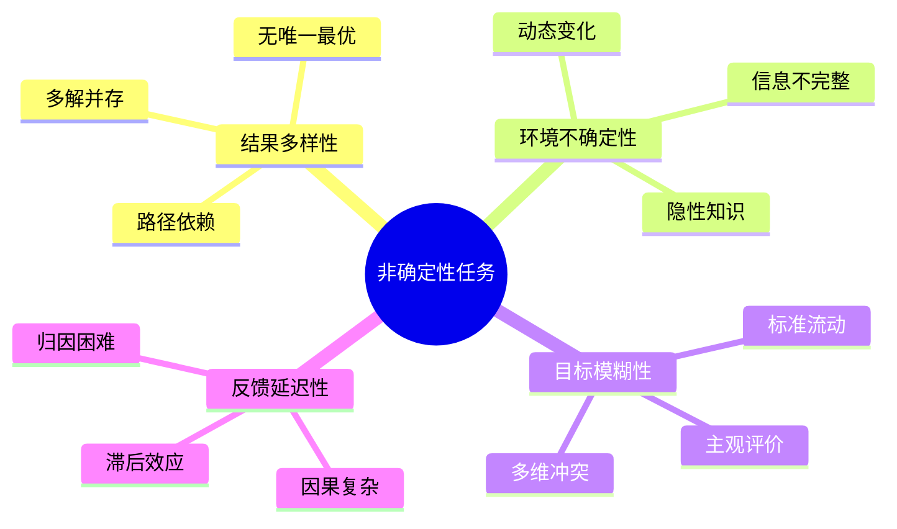

那么，面对这种复杂性，我们该如何进行动态优化？

本文将系统性拆解这个问题，**融合技术系统的置信度评估机制与系统论的复杂适应思想**，从四个层面展开：

1. **理解本质**：非确定性任务的核心特征与挑战
2. **技术架构**：四层动态优化系统的工程设计
3. **系统思维**：从控制论到复杂适应系统的范式升级
4. **人文应用**：六步法在社科研究与创意工作中的实践

核心观点是：**动态优化的本质不是数学意义上的收敛，而是认知层面的持续校准——学会与不确定性共处，并将其转化为系统进化的动力而非障碍。**

## 第一部分：重新定义问题——从单一优化到多目标权衡

### 帕累托前沿思维

在传统工程问题中，我们习惯寻找明确的数学极值点——最小化成本、最大化效率、优化某个刚性约束函数。但现实中的许多任务并非如此清晰。

从系统工程的角度看，非确定性任务不再被视为单一优化问题，而是一个**多目标权衡系统**。由于缺乏单一的考核指标，我们必须引入**帕累托前沿（Pareto Front）** 概念来描述目标间的相互制约。

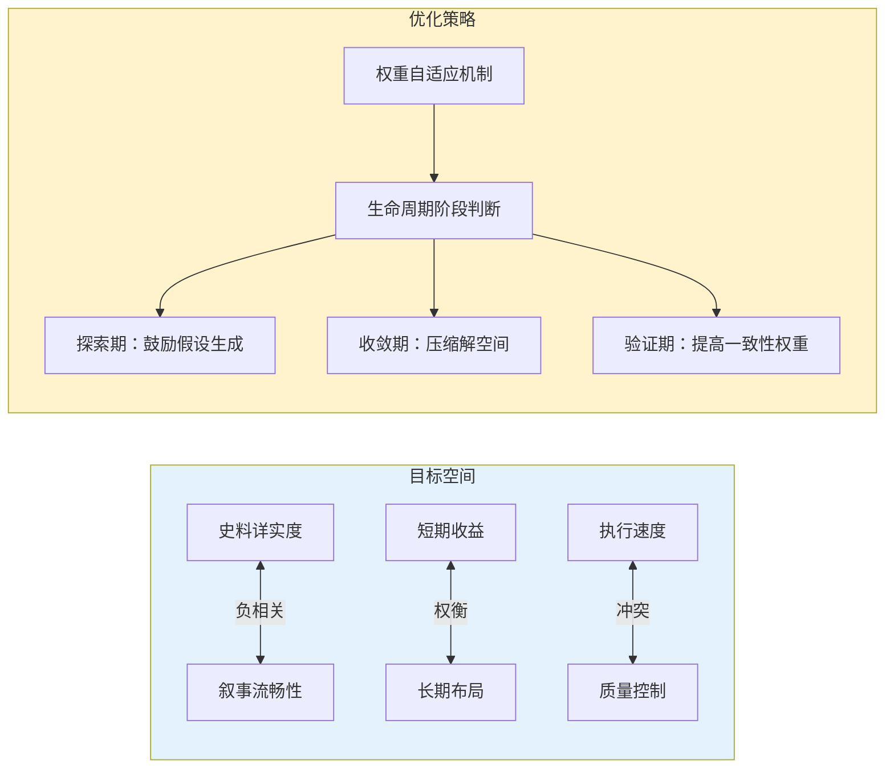

**以历史研究为例：**

| 维度 | 探索期策略 | 收敛期策略 | 验证期策略 |
|------|-----------|-----------|-----------|
| **史料详实度权重** | 低（广泛收集） | 中（筛选关键证据） | 高（严格考证） |
| **叙事流畅性权重** | 中（初步框架） | 高（优化结构） | 高（精修表达） |
| **逻辑一致性权重** | 低（容忍矛盾） | 中（识别冲突） | 高（消除漏洞） |
| **搜索广度** | 最大化 | 适度收缩 | 聚焦核心 |

这种**权重的动态漂移**是系统应对目标模糊性的核心策略。它避免了过早锁定局部最优解，确保系统在多维评价空间内保持足够的搜索广度。

### 为什么不能一开始就追求完美？

想象你在绘制一幅地图：
- **初期**：你需要快速勾勒大陆轮廓，容忍细节错误，目的是确认整体方向
- **中期**：你开始填充主要城市与交通线，修正明显的地理偏差
- **后期**：你精细化标注街道名称，确保每个坐标点的准确性

如果在第一阶段就纠结于某条小巷的名字是否正确，你会永远无法完成这幅地图。**动态优化的本质，便是根据任务所处的生命周期阶段，实时调整各维目标的优先级。**

## 第二部分：技术系统的动态优化架构

对于具有部分可量化指标的非确定性任务（如强化学习、贝叶斯优化），我们可以构建一个包含四个关键组件的动态优化系统。

### 架构概览

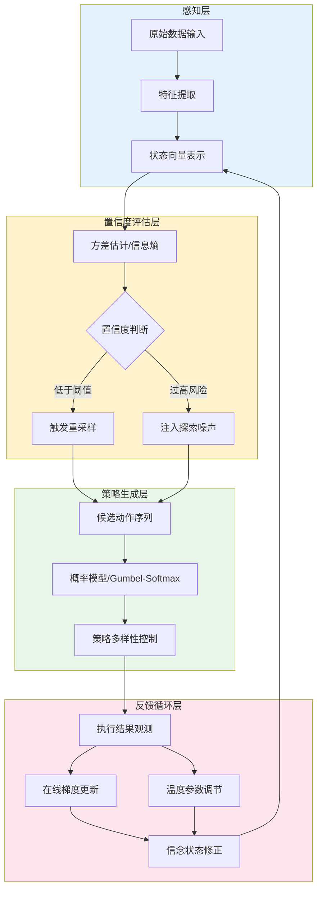

这个闭环控制系统通过**事件驱动的状态转换**而非固定时间步长来运作，根据不确定性阈值动态调整优化强度。

### 第一层：感知层——从混沌中提取信号

**核心任务：** 将原始、高维、嘈杂的环境观测转化为低维、连续、可微的状态表示。

**关键技术：**

1. **特征工程**：识别对任务结果有预测力的关键变量
2. **降维处理**：使用PCA、t-SNE或自编码器压缩信息
3. **不确定性编码**：不仅输出状态值，还输出置信区间

**案例：机器人导航中的感知融合**

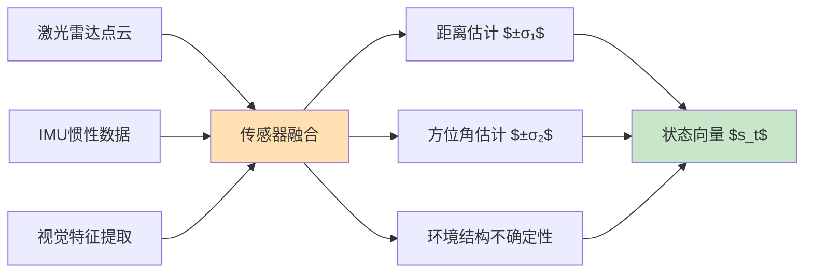

**详细说明：**

在机器人导航任务中，单一传感器往往无法提供完整、可靠的环境信息：
- **激光雷达（LiDAR）**：提供精确的距离测量，但无法识别物体类型，且在透明或反光表面失效
- **惯性测量单元（IMU）**：提供加速度和角速度，但存在漂移误差，长时间累积会导致位置估计偏差
- **视觉传感器**：提供丰富的语义信息（如障碍物类型、道路标志），但受光照条件影响大

**传感器融合（Sensor Fusion）** 通过卡尔曼滤波（Kalman Filter）或粒子滤波（Particle Filter）将多源信息整合，输出更准确的状态估计。每个估计值都附带不确定性度量（标准差 $\sigma$），形成完整的状态向量 $s_t$：

$$s_t = [\text{distance}, \sigma_{\text{dist}}, \text{bearing}, \sigma_{\text{bearing}}, \text{complexity}]^\top$$

这种表示方式的优势在于：
1. **显式建模不确定性**：下游模块可根据置信度调整决策策略
2. **支持贝叶斯更新**：新观测到来时，可基于不确定性加权融合
3. **便于故障检测**：当 $\sigma$ 突然增大时，可能表明传感器失效或环境异常

**设计原则：**
- **可微性**：保持信息的**可微性**，以便后续梯度传播
- **不确定性编码**：显式编码**不确定性**，而非仅输出点估计
- **信息平衡**：平衡**信息完整性**与**计算效率**

### 第二层：置信度评估层——量化可信程度

**核心问题：** 当前结果有多可靠？我们应该保守利用还是激进探索？

**评估方法：**

| 方法 | 适用场景 | 计算方式 |
|------|---------|---------|
| **方差估计** | 多次采样结果 | $\text{Var}(x) = \frac{1}{n-1}\sum_{i=1}^{n}(x_i - \bar{x})^2$ |
| **信息熵** | 概率分布 | $H(p) = -\sum_{i} p_i \log(p_i)$ |
| **贝叶斯后验** | 有先验知识 | $P(\theta\|D) \propto P(D\|\theta)P(\theta)$ |
| **Bootstrap** | 小样本 | 有放回重采样估计置信区间 |

**动态阈值机制：**

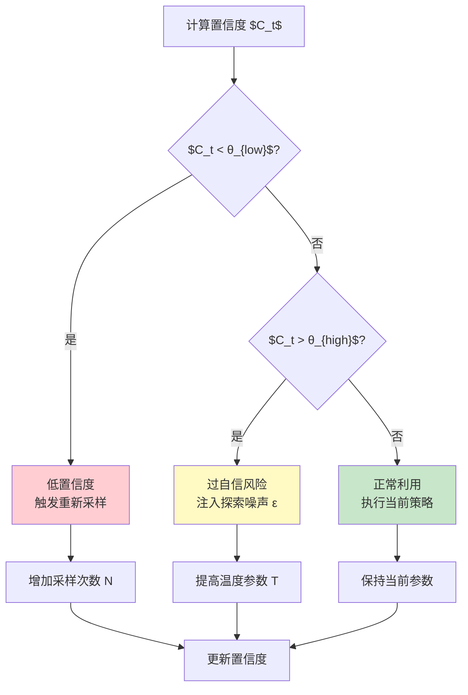

**阈值设定策略：**

- **$\theta_{\text{low}}$（下界）**：低于此值说明信息不足，必须探索。通常设为历史置信度的25%分位数
- **$\theta_{\text{high}}$（上界）**：高于此值可能陷入局部最优，需主动扰动。通常设为历史置信度的75%分位数
- **动态调整**：根据优化进度自动收缩或扩张阈值区间

**数学表达：**

置信度评估后的自适应调整规则可形式化为：

$$
N_{t+1} = \begin{cases}
N_t \times \alpha & \text{if } C_t < \theta_{\text{low}} \\
N_t & \text{otherwise}
\end{cases}
$$

$$
T_{t+1} = \begin{cases}
T_t \times \beta & \text{if } C_t > \theta_{\text{high}} \\
T_t & \text{otherwise}
\end{cases}
$$

这套规则实现了"低置信度时增加采样以提高估计精度，高置信度时提高温度以避免早熟收敛"的自适应机制。

### 第三层：策略生成层——在探索与利用间平衡

**核心挑战：** 如何生成多样化的候选方案，同时避免盲目搜索？

**技术选型：**

**1. 软最大算子（Softmax）**

Softmax 将动作价值函数 $Q(s,a)$ 转换为概率分布，实现平滑的策略表示：

$$\pi(a|s) = \frac{\exp(Q(s,a)/T)}{\sum_{a'} \exp(Q(s,a')/T)}$$

其中温度参数 $T$ 控制探索强度：
- **高温（$T \to \infty$）**：完全探索模式，所有动作概率趋近均匀
- **低温（$T \to 0$）**：完全利用模式，最大 $Q$ 值动作概率趋近1
- **适中温度（$T \approx 1$）**：在探索与利用之间取得平衡

**2. Gumbel-Softmax 采样**

标准的多项式采样是不可微操作，阻碍了梯度流动。Gumbel-Softmax 通过引入 Gumbel 噪声实现可微近似，允许梯度反向传播到策略网络参数。

**3. 蒙特卡洛树搜索（MCTS）**

MCTS 通过构建搜索树并在高分支因子空间中高效探索，是 AlphaGo 的核心算法。其四个阶段为：

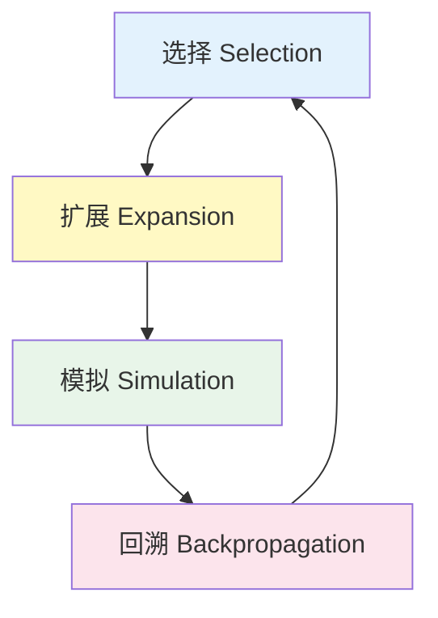

使用 UCT（Upper Confidence Bound for Trees）公式实现探索-利用权衡：

$$\text{UCT}(v_i) = \frac{Q(v_i)}{N(v_i)} + c \sqrt{\frac{\ln N(v_{\text{parent}})}{N(v_i)}}$$

**温度调度策略：**

为实现从探索到利用的平滑过渡，采用指数衰减策略：

$$T(t) = T_{\text{initial}} \times \exp(-\lambda \times t)$$

| 场景 | $T_{\text{initial}}$ | $\lambda$ | 说明 |
|------|---------------------|-----------|------|
| **高不确定性环境** | 1.0 - 2.0 | 0.001 - 0.01 | 缓慢降温，充分探索 |
| **中等不确定性** | 0.5 - 1.0 | 0.01 - 0.05 | 平衡探索与利用 |
| **低不确定性环境** | 0.1 - 0.5 | 0.05 - 0.1 | 快速收敛到最优 |

### 第四层：反馈循环层——从结果中学习

**双重更新路径：**

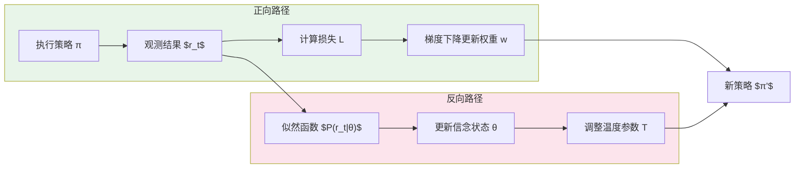

**1. 正向路径：策略参数更新**

这是传统的监督学习或强化学习更新流程：
- 执行策略 $\pi_\theta$ 并观测奖励 $r_t$
- 计算损失函数（交叉熵、REINFORCE或Actor-Critic）
- 通过梯度下降更新策略参数 $\theta$

**2. 反向路径：元参数调节**

这条路径不直接更新策略参数，而是调整控制探索-利用平衡的超参数：
- 计算预测误差 $\delta_t = |r_t - \hat{r}_t|$
- 根据误差调整温度参数：$T \leftarrow T \times (1 + \kappa \cdot \text{sign}(\delta_t - \bar{\delta}))$
- 若预测误差高于平均水平，提高温度增加探索；反之降低温度加强利用

**关键设计要点：**

- **反馈延迟管理**：使用资格迹（Eligibility Traces）分配信用
- **元学习机制**：同时更新学习率和温度系数
- **灾难性遗忘防护**：经验回放、弹性权重巩固（EWC）
- **收敛监控**：设置早停机制防止过拟合

## 第三部分：系统论视角的重构——从控制论到复杂适应系统

上述四层架构适用于有部分量化指标的场景。但当我们将目光转向**人文社科研究、创意写作、战略决策** 等领域时，面临根本性挑战：

**核心困境：**
- ❌ 缺乏明确的数学约束函数
- ❌ 没有可量化的目标值
- ❌ 评价标准主观、多维且相互冲突
- ❌ 反馈稀疏、延迟且定性

因此，我们需要**从控制论升级到系统论**，将动态优化视为一个**复杂适应系统（Complex Adaptive System, CAS）** 的设计问题。

### 闭环反馈控制：从定性信号到结构化偏差

从控制论的角度看，这类系统是一个典型的**闭环反馈控制系统**，但其传感器和控制器均为**模拟性质**而非数字性质。

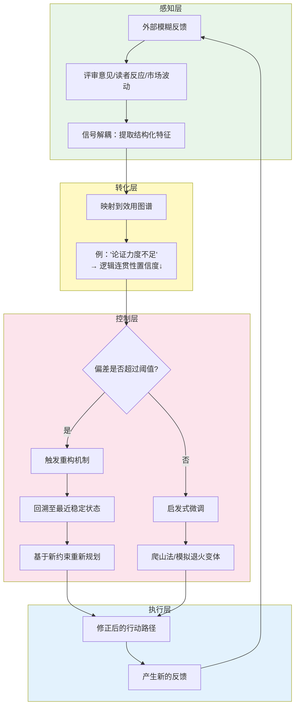

**关键机制解析：**

1. **信号解耦（Signal Decoupling）**
   - 从自然语言或感官体验中提取结构化特征
   - 将"感觉不对"转化为具体维度的偏差向量
   - 例如：将"论证力度不足"量化为逻辑连贯性维度的置信度下降

2. **启发式搜索策略**
   - 由于没有梯度的精确计算，控制器必须采用近似方法
   - **爬山法**：局部改进，逐步逼近
   - **模拟退火**：允许暂时接受次优解，避免陷入局部最优
   - **禁忌搜索**：记录已尝试路径，防止循环往复

3. **重构机制**
   - 当偏差超过容忍阈值时，不继续线性补偿
   - 而是触发**回溯操作**，返回最近的稳定状态点（Checkpoint）
   - 基于新的约束条件重新规划路径

**实务案例：产品迭代中的反馈循环**

假设你正在开发一款知识管理工具：

- **第1轮反馈**："界面太复杂，找不到功能"
  - 信号解耦 → 信息架构清晰度置信度下降30%
  - 控制策略 → 简化导航层级，增加搜索入口
  
- **第2轮反馈**："功能太少，无法满足专业需求"
  - 信号解耦 → 功能完备性置信度下降40%
  - 偏差超过阈值 → 触发重构
  - 回溯至原型阶段，重新设计分层权限系统

这种调整不是**一次性的线性补偿**，而是基于多步推演后的**策略切换**。

### 模块化与解耦：增强系统的鲁棒性

#### 为什么需要隔离机制？

在缺乏刚性约束的情况下，系统的脆弱点极易因微小扰动而崩溃。因此，我们需要引入**冗余设计**和**隔离机制**。

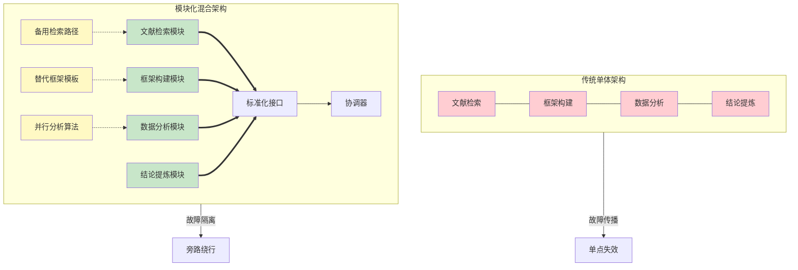

**模块化设计的核心优势：**

| 特性 | 说明 | 实际价值 |
|------|------|---------|
| **相对独立性** | 各子单元通过标准化接口交互 | 降低耦合度，便于替换升级 |
| **故障隔离** | 某环节失败不会导致整体瘫痪 | 提高系统可用性 |
| **冗余资源** | 多条路径并行演进 | 分散风险，避免单点依赖 |
| **旁路绕行** | 利用替代方案继续推进 | 维持基本运转能力 |

#### 并行轨迹：模拟生物进化的多样性

**多条路径的并行演进（Parallel Trajectories）** 是应对不确定性的关键策略。它模拟了生物进化中的种群多样性，防止整个系统陷入单一思维定式。

**操作方法：**

1. **假设分叉**：在关键决策点，同时保留2-3个备选方案
2. **资源分配**：70%资源投入主路径，30%资源探索备选路径
3. **定期评估**：每经过一个时间窗口，比较各路径的进展
4. **动态切换**：若备选路径表现更优，则调整资源分配比例

**案例：学术研究中的多假设验证**

一位研究经济史的学者在探讨"工业革命起因"时，可能同时追踪三条假设路径：

- **路径A**：技术革新驱动论（蒸汽机、纺织机械）
- **路径B**：制度变迁驱动论（产权保护、金融市场）
- **路径C**：资源禀赋驱动论（煤炭储量、殖民地贸易）

每条路径独立收集证据、构建论证。随着研究深入，某条路径可能因证据不足而被放弃，也可能意外发现三条路径之间存在协同效应，最终形成更全面的解释框架。

这种**并行处理**的成本虽然更高，但它显著降低了"押错宝"的风险，并在长期来看提高了研究的稳健性。

### 时间维度上的优化：节奏控制与相位切换

#### 为什么需要"停顿-反思"机制？

非确定性任务具有显著的**长尾效应**和**延迟反馈特征**，因此不能采用高频快反的激进控制策略。系统必须引入**时间窗口（Time Window）**或**节拍器机制**。

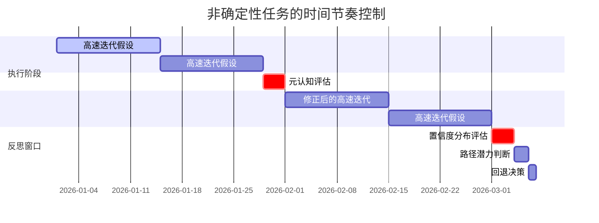

**"停顿-反思"机制的关键作用：**

1. **防止资源耗散**
   - 在快速执行阶段，系统容易陷入"盲目忙碌"
   - 强制暂停可以避免在错误方向上投入过多资源

2. **元认知评估（Meta-cognitive Evaluation）**
   - 评估当前各路径的置信度分布
   - 判断未来潜力与核心价值对齐程度
   - 识别隐藏的技术债务或路径依赖

3. **触发回退操作**
   - 如果评估显示主要方向偏离了核心价值
   - 或资源耗尽但进展有限
   - 系统则触发**回退（Rollback）**，重新初始化部分状态变量

#### 周期性重置：不是失败，而是自我纠错

这种周期性的重置并非失败，而是系统**自我纠错的必要手段**。它确保了优化过程始终沿着大致的正确轨道缓慢收敛。

**实务建议：**

| 任务类型 | 执行周期 | 反思窗口长度 | 评估重点 |
|---------|---------|------------|---------|
| **学术研究** | 2-4周 | 2-3天 | 证据充分性、逻辑连贯性 |
| **产品开发** | 1-2周（Sprint） | 1天 | 用户反馈、技术指标 |
| **战略规划** | 1-3个月 | 3-5天 | 市场变化、竞争态势 |
| **个人成长** | 1个月 | 半天 | 技能进展、兴趣匹配度 |

**警惕信号（需要立即触发反思窗口）：**

- 连续多次迭代未见明显改善
- 团队内部出现严重分歧且无法调和
- 外部环境发生剧烈变化（政策调整、技术突破）
- 资源消耗速度远超预期但成果有限

### 分布式决策：权力结构的动态调整

#### 集中式规划的局限性

在高度不确定环境下，**集中式规划往往失效**，因为信息分布是碎片化且滞后的。中央指挥者难以掌握一线的所有细节，导致决策延迟或误判。

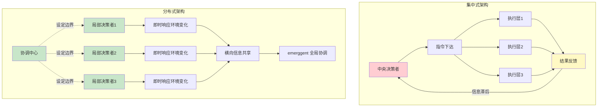

#### 张力的动态平衡

此时，系统应转向**分布式决策架构（Distributed Decision Making）**，将局部适应权下放给各子模块，允许一线执行者根据即时环境变化进行微调。

然而，这也带来了**协调成本上升**的风险。因此，系统必须建立动态的协调机制：

**动态集权-分权模型：**

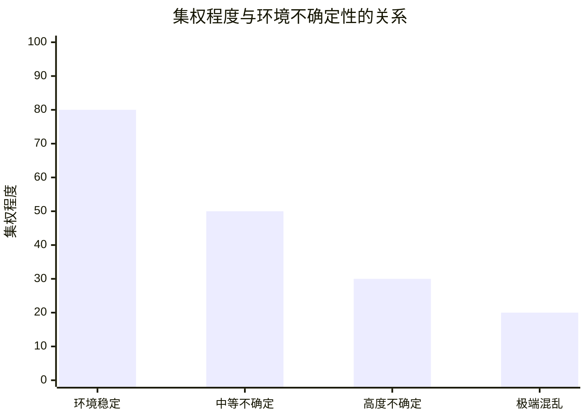

| 情境 | 集权程度 | 决策模式 | 适用场景 |
|------|---------|---------|---------|
| **共识度高 + 环境稳定** | 高（70-90%） | 强化中央指挥，统一行动步调 | 成熟业务的标准操作流程 |
| **分歧大 + 环境剧变** | 低（20-40%） | 允许多元实验并行，快速试错 | 创新业务、危机应对 |
| **中等不确定** | 中（40-60%） | 中央设定边界，局部自主决策 | 战略转型期、市场扩张 |

这种张力的动态平衡，实质上是**信息熵与决策延迟的博弈**：
- **集权**降低信息熵（统一标准），但增加决策延迟
- **分权**减少决策延迟，但增加信息熵（协调难度）

**最佳实践：**

1. **明确决策权限边界**：哪些事项必须上报，哪些可以自行决定
2. **建立信息共享机制**：确保局部决策者的经验能够横向流动
3. **设置协调触发点**：当局部决策影响其他模块时，自动触发协调会议
4. **定期校准**：每季度回顾集权-分权比例是否合理

### 学习曲线与技术债务：版本控制与知识固化

#### 路径依赖的隐性成本

每一次基于反馈的调整都意味着对历史状态的修改，这会产生"**路径依赖**"的技术债务。频繁的回退和重构可能导致系统状态碎片化，使得后续评估更加困难。

**技术债务的表现形式：**

- **文档债务**：多次调整后，初始设计文档与实际实现脱节
- **认知债务**：团队成员对系统演进历史理解不一致
- **工具债务**：临时采用的工具链未得到系统性整合
- **数据债务**：历史数据格式不统一，难以进行纵向对比

#### 版本控制与知识固化机制

因此，动态优化必须包含**版本控制**与**知识固化**机制。

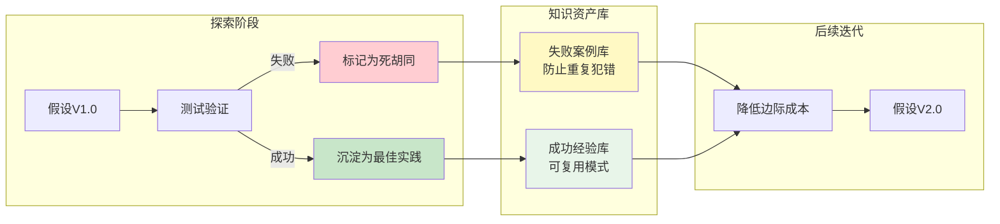

**知识固化的具体做法：**

1. **版本快照（Snapshot）**
   - 在每个反思窗口结束时，保存当前系统状态的完整快照
   - 包括：决策依据、关键假设、资源配置、风险评估

2. **变更日志（Change Log）**
   - 记录每次重大调整的触发原因、预期效果、实际结果
   - 形成可追溯的决策链条

3. **死胡同标记**
   - 明确记录那些因探索而产生的无效路径
   - 附上失败原因分析，防止后人重复踩坑

4. **模式提取**
   - 从成功案例中抽象出通用模式
   - 例如："当X条件满足时，Y策略通常有效"

**知识固化实际上是对不确定性的一种对冲**：它将流动的、易变的洞察转化为相对稳定的资产，降低未来迭代的边际成本。

### 系统演化：从混沌态到结构态的相变

#### 渐进式的相变过程

从系统演化角度看，非确定性任务的优化是一个**渐进式的相变过程**。

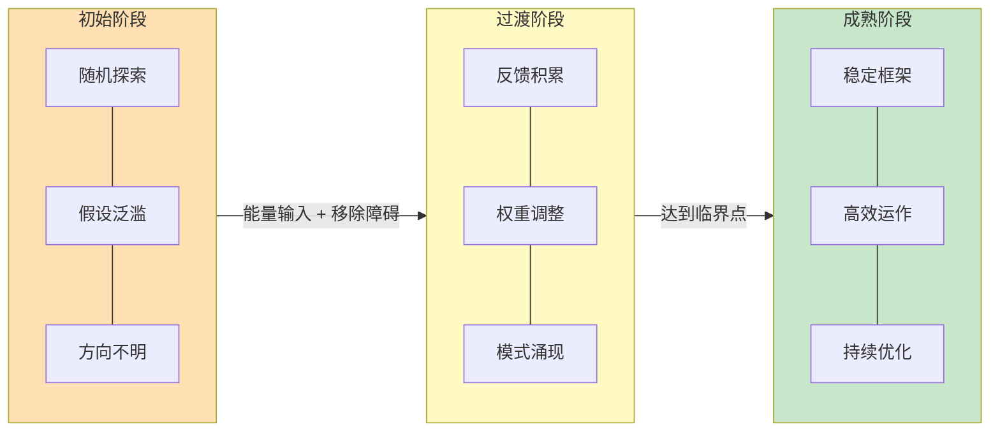

**相变的三个阶段：**

| 阶段 | 特征 | 熵值 | 密度 | 管理者角色 |
|------|------|------|------|-----------|
| **初始阶段** | 高熵、低密度的混沌态，充满随机探索 | 高 | 低 | 提供能量（资源投入） |
| **过渡阶段** | 反馈积累，权重调整，自发组织 | 中 | 中 | 移除障碍物（消除硬约束） |
| **成熟阶段** | 低、高密度的结构态，形成稳定框架 | 低 | 高 | 设定相变临界点（触发重规划阈值） |

这一相变并非人为强加的，而是系统内部各组件交互**涌现（Emergence）**的结果。

#### 管理者的新角色

在这种范式下，管理者的角色发生了根本转变：

**从"操控者"到"园丁"：**

- ❌ **旧角色**：直接操控结果，制定详细计划，监控每一步执行
- ✅ **新角色**：维持相变发生的必要条件，创造有利于自组织的环境

**具体职责：**

1. **提供足够的能量**
   - 确保资源投入充足且持续
   - 避免因短期压力而中断探索过程

2. **移除障碍物**
   - 识别并消除硬约束障碍（如官僚流程、资源瓶颈）
   - 为系统自我调整留出空间

3. **设定相变临界点**
   - 定义触发重规划的阈值（如：连续3次迭代无进展）
   - 在关键时刻介入，引导系统跨越相变门槛

## 第四部分：人文社科的动态优化框架——六步法

基于上述系统论思想，我们可以为纯定性任务构建一个更具操作性的六步框架。

### 第一步：重构评价函数——从标量到图谱

**传统做法（错误）：**
```
单一目标：写出"最好"的历史论文
```

**改进做法：**

在人文社科任务中，我们无法用单一的标量值衡量质量，而需要构建**多维效用向量**：

$$\mathbf{U}(t) = [U_1(t), U_2(t), ..., U_d(t)]^\top$$

其中 $d$ 为维度数量，每个 $U_i(t)$ 表示第 $i$ 个维度的效用得分（通常归一化到 $[0,1]$ 区间）。

**加权总效用**通过线性组合计算：

$$U_{\text{total}}(t) = \sum_{i=1}^{d} w_i(t) \cdot U_i(t)$$

对于历史论文的例子：
- 解释力权重 $w_1(t)$
- 叙事性权重 $w_2(t)$
- 史料扎实度权重 $w_3(t)$
- 理论深度权重 $w_4(t)$

总效用 $U_{\text{total}} = w_1 \cdot S_1 + w_2 \cdot S_2 + w_3 \cdot S_3 + w_4 \cdot S_4$

**权重的动态调整：**

| 阶段 | 权重配置 | 理由 |
|------|---------|------|
| **初稿期** | $w_1=0.3, w_2=0.4, w_3=0.2, w_4=0.1$ | 优先保证可读性和基本逻辑 |
| **修改期** | $w_1=0.4, w_2=0.2, w_3=0.3, w_4=0.1$ | 加强论证和证据支撑 |
| **评审期** | $w_1=0.3, w_2=0.2, w_3=0.2, w_4=0.3$ | 提升理论贡献度 |

**设计原则：**
- **权重之和不一定为1**：允许**目标冲突**的存在
- **权重随时间动态变化**：反映**阶段性优先级**
- **定期重新评估权重**：避免**路径依赖锁定**

### 第二步：建立感知机制——将定性反馈转化为偏差指示器

**挑战：** 在没有自动化反馈的情况下，如何获取"误差信号"？

**信号源分类：**

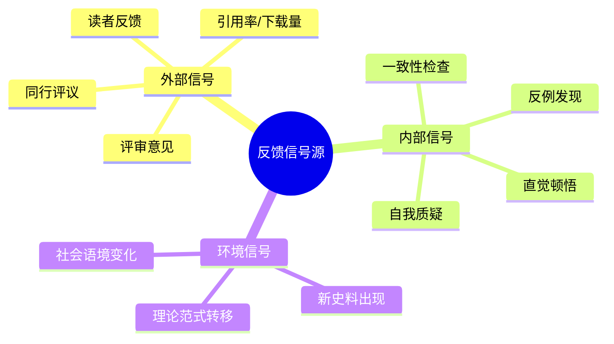

**反馈解析流程：**

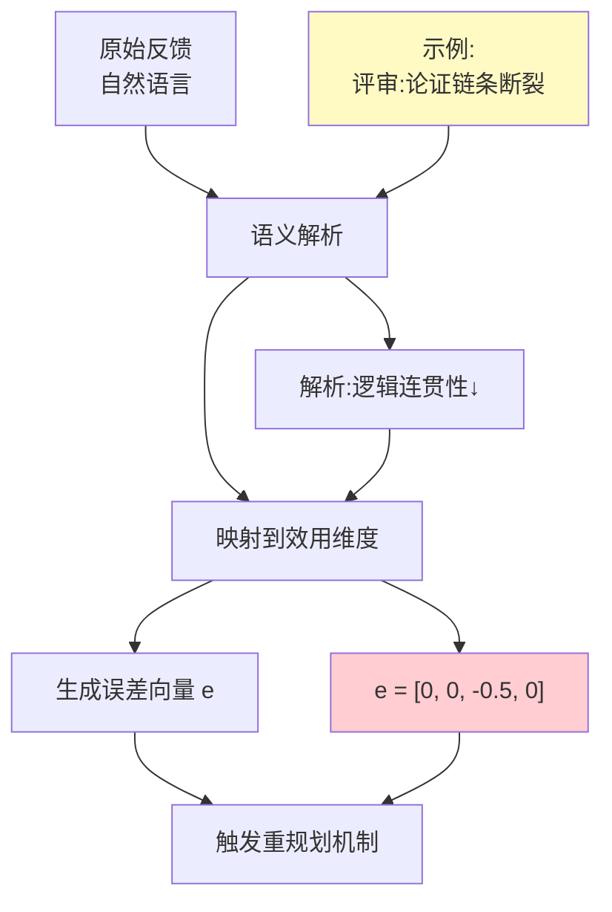

**关键洞察：**
> 反馈解析本身就是第一次动态调整——将模糊的自然语言批评映射到结构化的评价指标空间。

### 第三步：控制策略——基于采样的启发式搜索

由于无法计算精确梯度，我们必须采用**近似优化方法**。

**策略模式1：并行假设法**

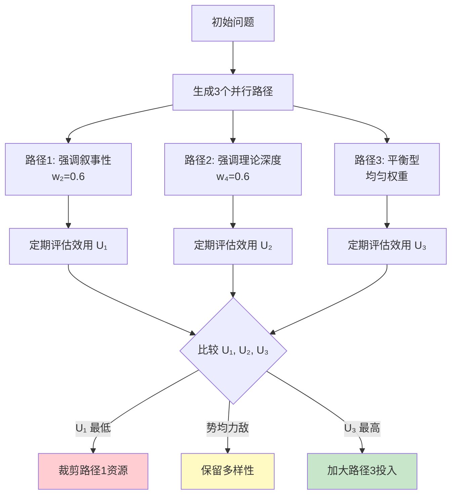

**策略模式2：停顿-反思-修正循环**

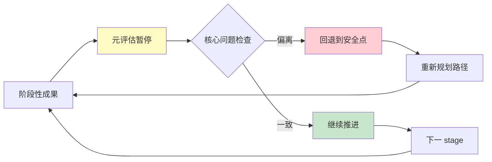

### 第四步：一致性约束——维护全局状态模型

**问题：** 人文社科任务具有长周期特性，早期决策会锁定后续可能性空间。

**案例：**
- 选择特定史料范围 → 排除其他关键事件的分析路径
- 设定某种理论框架 → 对异质证据产生排斥
- 采用特定叙事风格 → 限制后续章节的表达方式

**解决方案：全局一致性检查器**

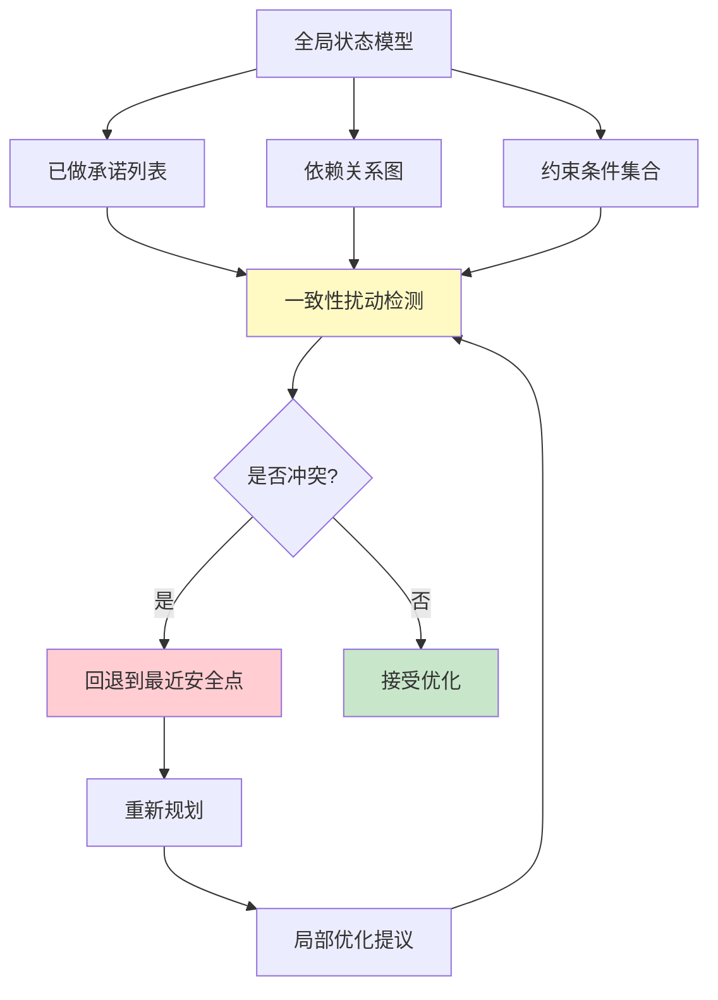

**状态模型内容：**

| 类型 | 示例 | 检查方法 |
|------|------|---------|
| **理论承诺** | 采用福柯的权力话语分析 | 新证据是否与框架兼容？ |
| **史料选择** | 仅使用1949年前档案 | 是否有关键后被遗漏？ |
| **方法论约定** | 定量为主、定性为辅 | 新分析是否符合混合方法？ |
| **叙事风格** | 第三人称客观叙述 | 新段落是否保持一致语调？ |

### 第五步：鲁棒性设计——在多种可能世界中表现良好

**核心思想：** 不追求单次最优解，而寻求在多数情境下都能达到可接受结果的策略。

**操作方法：多世界模拟**

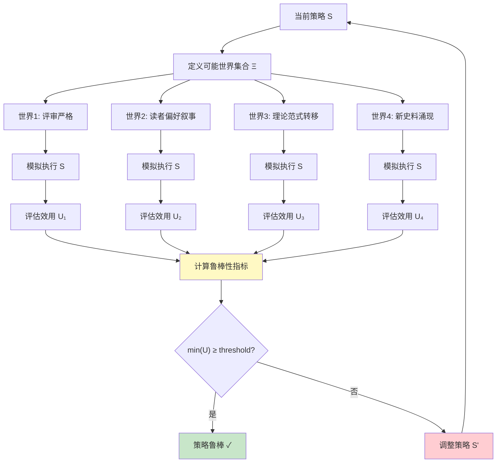

**可能世界构建方法：**

1. **极端情景法**：设想最有利和最不利情况
2. **历史类比法**：参考类似任务的成败案例
3. **专家德尔菲法**：收集多位专家的预判
4. **敏感性分析**：识别关键不确定性因素

### 第六步：自我监督机制——在反馈稀缺时的替代方案

**问题：** 外部反馈（评审、读者）往往稀缺或滞后，如何持续优化？

**方案1：内部一致性校验（Internal Consistency Check）**

```mermaid
graph TD
    A[生成内容片段] --> B[自洽性检查]
    
    B --> C[语义连贯性]
    B --> D[逻辑无矛盾]
    B --> E[论据相互支持]
    B --> F[风格统一]
    
    C --> G{全部通过?}
    D --> G
    E --> G
    F --> G
    
    G -->|是| H[接受内容]
    G -->|否| I[标记问题区域]
    
    I --> J[人工审查或自动修正]
    J --> A
    
    style B fill:#fff9c4
    style I fill:#ffcdd2
    style H fill:#c8e6c9
```

**注意：** 自洽性是**必要但不充分**条件——逻辑严密的文章仍可能是错误的。

**方案2：对比学习与偏好建模**

```mermaid
flowchart TD
    A[同一内容的两个版本] --> B[版本A: 强化版]
    A --> C[版本B: 削弱版]
    
    B --> D[人类标注者比较]
    C --> D
    
    D --> E[偏好标签: A > B]
    E --> F[训练判别器 $D_φ$]
    
    F --> G[判别器评分]
    G --> H[指导后续生成]
    
    H --> I[新版本 A']
    H --> J[新版本 B']
    
    I --> D
    J --> D
    
    style D fill:#fff9c4
    style F fill:#e1f5fe
    style H fill:#c8e6c9
```

## 第五部分：人机协同与权衡评估

### 人机分工协作模型

完全自动化的动态优化在人文社科中几乎不可行，因为最终的价值判断、伦理权衡和审美直觉仍须由人来把握。

**理想模型：人机分工协作**

```mermaid
graph TB
    subgraph 机器负责
        A[快速迭代生成]
        B[多路径并行搜索]
        C[一致性自动维护]
        D[大规模数据分析]
    end
    
    subgraph 人类负责
        E[关键方向指引]
        F[裁决价值冲突]
        G[注入创造性洞见]
        H[伦理与审美判断]
    end
    
    A --> I[候选方案池]
    B --> I
    C --> I
    D --> I
    
    I --> J[人类评估与选择]
    E --> J
    F --> J
    G --> J
    H --> J
    
    J --> K[选定方案]
    K --> L[反馈给机器]
    L --> A
    L --> B
    L --> C
    
    style 机器负责 fill:#e3f2fd
    style 人类负责 fill:#fce4ec
    style J fill:#fff9c4
```

**动态自动化程度调节：**

| 阶段 | 自动化程度 | 人类角色 | 机器角色 |
|------|-----------|---------|---------|
| **模糊探索期** | 低（20%） | 主导方向、提供灵感 | 辅助检索、生成备选 |
| **中期收敛期** | 中（50%） | 审核关键节点、裁决冲突 | 批量生成、一致性检查 |
| **后期精修期** | 高（80%） | 最终把关、微调细节 | 自动润色、格式优化 |

### 权衡评估：动态优化的代价与收益

#### 成本分析

```mermaid
mindmap
  root((动态优化成本))
    计算开销
      置信度重估
      多路径并行
      温度参数调节
    收敛稳定性
      破坏已有轨迹
      震荡风险
      延迟收敛
    认知负担
      元认知监控
      多维度权衡
      决策疲劳
    实施复杂度
      系统搭建
      参数调优
      维护成本
```

**具体代价：**

| 成本类型 | 说明 | 缓解策略 |
|---------|------|---------|
| **计算资源** | 每次置信度重估需额外前向传播 | 异步计算、缓存中间结果 |
| **时间延迟** | 反思和重规划占用执行时间 | 设置反思频率上限 |
| **认知负荷** | 维持多维效用图谱消耗心智资源 | 模板化、工具化支持 |
| **过度适应** | 频繁调整导致方向摇摆 | 设置调整幅度限制 |

#### 收益分析

**若不引入动态机制的后果：**

```mermaid
graph TD
    A[固定策略在非结构化环境中] --> B[无法响应环境变化]
    A --> C[陷入局部最优]
    A --> D[方向性错误累积]
    
    B --> E[任务失败率高]
    C --> E
    D --> E
    
    E --> F[如同雾中行船无罗盘]
    
    style A fill:#ffcdd2
    style E fill:#ffccbc
    style F fill:#fff9c4
```

**动态优化的核心价值：**

1. **提升鲁棒性**：在复杂、多变环境中保持适应性
2. **降低方向性错误概率**：通过持续校准避免越走越偏
3. **保留灵活性**：应对突发洞见和环境突变
4. **最大化质量下限**：虽不保证最优，但拒绝"糟糕"

**性能 vs 可靠性博弈：**

```
最佳策略 = 混合架构
- 主路径：保守的梯度优化（高效、稳定）
- 备用模块：动态重规划（灵活、适应性强）
- 触发条件：置信度低或环境剧变时激活
```

## 结语：在不确定中前行的智慧

回到最初的问题：**当没有标准答案时，我们如何优化？**

答案不是找到一个万能的公式，而是建立一套**认知导航系统**，融合技术系统的精确性与系统论的适应性：

```mermaid
mindmap
  root((复杂适应系统))
    感知偏差
      信号解耦
      结构化特征提取
      置信度评估
    解耦模块
      相对独立性
      标准化接口
      故障隔离
    节奏控制
      时间窗口
      元认知评估
      周期性重置
    弹性重构
      启发式搜索
      回溯机制
      多路径并行
```

这套系统的核心原则是：

1. **绘制多条可能路径**，而非孤注一掷
2. **持续比较、反思与修正**，淘汰明显低效选项
3. **强化有潜力的路线**，但保留足够的探索空间
4. **接受"相对理想结果"**，而非执着于"完美答案"

动态优化的真正价值，不在于消除不确定性——那既不可能也不可取——而在于**学会与之共处并驾驭它**。
